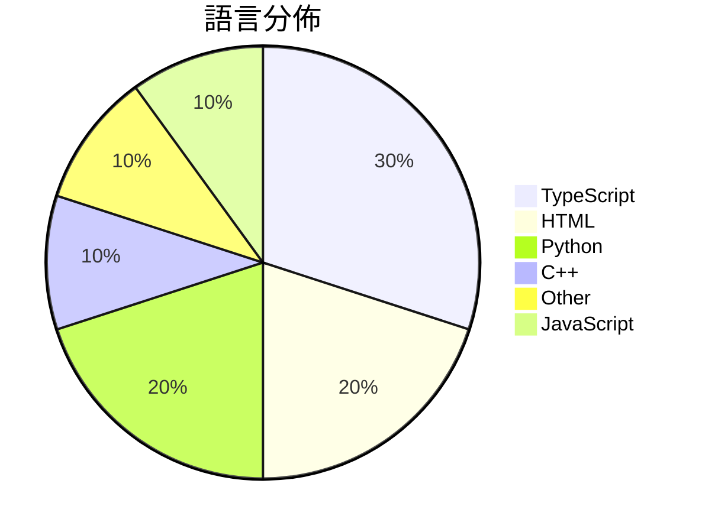

# GitHub Trending - 2026-04-18

> [!summary] 本日摘要
> 收錄 **10** 個新專案，合計 **12.2k** stars
> 語言分佈：TypeScript (3) · HTML (2) · Python (2) · C++ (1) · Other (1) · JavaScript (1)

> [!tip] 本週焦點
> **[[AgentSeal--codeburn|AgentSeal/codeburn]]** — 4 天內累積 2.6k stars（644 stars/天）
> 幫助開發者追蹤 AI 編碼工具的使用成本，提供互動式 TUI 儀表板。



---

## 收錄列表

| # | 專案 | 分類 | Stars | 速度 | 安裝 | 語言 | 用途 |
| :--: | --- | --- | ---: | ---: | --- | --- | --- |
| 1 | [[AgentSeal--codeburn\|AgentSeal/codeburn]] | 開發工具 | 2.6k | 644/天 | `easy` | TypeScript | 幫助開發者追蹤 AI 編碼工具的使用成本，提供互動式 TUI 儀表板。 |
| 2 | [[Nightmare-Eclipse--RedSun\|Nightmare-Eclipse/RedSun]] | 安全 | 1.4k | 677/天 | `medium` | C++ | 利用 Windows Defender 的漏洞來獲取系統管理權限。 |
| 3 | [[vercel-labs--wterm\|vercel-labs/wterm]] | CLI 工具 | 1.3k | 446/天 | `medium` | TypeScript | 提供一個高效能的網頁終端模擬器，讓開發者能夠在瀏覽器中運行命令行應用。 |
| 4 | [[Mouseww--anything-analyzer\|Mouseww/anything-analyzer]] | 開發工具 | 1.3k | 255/天 | `medium` | TypeScript | 全能协议分析工具，支持多种流量来源的自动逆向分析。 |
| 5 | [[alchaincyf--darwin-skill\|alchaincyf/darwin-skill]] | 開發工具 | 1.1k | 275/天 | `easy` | HTML | 讓你的技能透過自動化評估和優化不斷進化。 |
| 6 | [[browser-use--video-use\|browser-use/video-use]] | 開發工具 | 950 | 158/天 | `medium` | Python | 讓你透過 Claude Code 自動編輯影片，省去繁瑣的手動操作。 |
| 7 | [[Robbyant--lingbot-map\|Robbyant/lingbot-map]] | AI/ML | 914 | 457/天 | `medium` | Python | 從串流數據重建場景的前饋式 3D 基礎模型。 |
| 8 | [[lewislulu--html-ppt-skill\|lewislulu/html-ppt-skill]] | 其他 | 909 | 455/天 | `easy` | HTML | 提供專業 HTML 簡報製作的工具，擁有多主題和佈局選擇。 |
| 9 | [[BuilderPulse--BuilderPulse\|BuilderPulse/BuilderPulse]] | AI/ML | 883 | 294/天 | `easy` | N/A | 為獨立開發者和創業者提供 AI 驅動的每日情報，幫助他們決定今天該做什麼。 |
| 10 | [[Manavarya09--design-extract\|Manavarya09/design-extract]] | 開發工具 | 882 | 441/天 | `easy` | JavaScript | 從任何網站提取完整的設計語言，包括顏色、字體、間距、陰影等。 |

---

## 重點摘要

### 1. [[AgentSeal--codeburn|AgentSeal/codeburn]] `開發工具`

> 幫助開發者追蹤 AI 編碼工具的使用成本，提供互動式 TUI 儀表板。

**2.6k** stars · **644** stars/天 · TypeScript · `easy`

_建立 4 天就累積 2575 stars（644/天），forks 176（6.8%），這顯示出其在開發者社群中的快速接受度。作者 AgentSeal 以其在 AI 工具開發上的經驗，針對開發者在使用 AI 編碼工具時的成本問題，提供了一個實用的解決方案。這個工具的出現正好填補了市場上缺乏有效成本追蹤工具的空白，特別是在多種 AI 工具並行使用的情況下。社群中的熱門討論和需求，如對 KiloCode 和 OpenCode 的支援，進一步推動了其受歡迎程度。_

---

### 2. [[Nightmare-Eclipse--RedSun|Nightmare-Eclipse/RedSun]] `安全`

> 利用 Windows Defender 的漏洞來獲取系統管理權限。

**1.4k** stars · **677** stars/天 · C++ · `medium`

_建立 2 天內累積 1354 stars（677/天），forks 291（21.5%），這顯示出強烈的興趣。作者 Nightmare-Eclipse 在安全領域有一定的知名度，這個專案解決了防毒軟體對於特定文件處理的漏洞，這在過去並沒有好的解決方案。該專案的爆紅可能與其獨特的漏洞利用方式有關，並且在社群中引起了廣泛的討論和反應。這種針對防毒軟體的攻擊方式在安全研究中是相對少見的，吸引了許多安全研究者的注意。forks/stars 比率為 21.5%，顯示出許多人對這個專案進行了實際的修改和使用。_

---

### 3. [[vercel-labs--wterm|vercel-labs/wterm]] `CLI 工具`

> 提供一個高效能的網頁終端模擬器，讓開發者能夠在瀏覽器中運行命令行應用。

**1.3k** stars · **446** stars/天 · TypeScript · `medium`

_建立 3 天就累積 1337 stars（446/天），forks 39（2.9%），這顯示出相對穩定的興趣增長。作者 ctate 之前在 Vercel 的開發經驗使得這個專案具備良好的技術基礎。wterm 解決了傳統終端模擬器在性能和可用性上的不足，特別是針對網頁應用的需求。這個專案的出現正好填補了市場上對高效能終端模擬器的需求。社群的反應也表明，許多開發者對於在網頁中集成終端功能有著迫切的需求，這使得 wterm 的受歡迎程度迅速上升。_

---

### 4. [[Mouseww--anything-analyzer|Mouseww/anything-analyzer]] `開發工具`

> 全能协议分析工具，支持多种流量来源的自动逆向分析。

**1.3k** stars · **255** stars/天 · TypeScript · `medium`

_建立 5 天就累積 1276 stars（255/天），forks 294（23.0%），這顯示出強烈的社群需求。作者 Mouseww 及其團隊在開源社群中有一定的知名度，之前也有其他成功的專案。這個工具解決了傳統抓包工具各自為政的痛點，通過集成多種功能，讓開發者能夠在一個平台上完成所有的流量分析工作。社群的反饋和活躍度也顯示出使用者對此工具的需求和期待。隨著對 API 安全性和逆向工程需求的增加，這個工具的出現恰逢其時。_

---

### 5. [[alchaincyf--darwin-skill|alchaincyf/darwin-skill]] `開發工具`

> 讓你的技能透過自動化評估和優化不斷進化。

**1.1k** stars · **275** stars/天 · HTML · `easy`

_建立 4 天內累積 1099 stars（274.75/天），forks 132（12.0%），顯示出強勁的增長潛力。作者 alchaincyf 之前有開發其他相關技能工具，這次的專案解決了在技能數量增多時，如何高效管理和優化技能的痛點。之前的解決方案往往無法同時考慮結構和效果，而達爾文.skill 則提供了一個全面的解決方案。近期的社群討論和建議（如 #1）也顯示出使用者對於擴展功能的需求，進一步推動了專案的關注度。這個工具的設計理念符合當前技能優化的需求，並且在技術生態中具備良好的整合性。_

---

### 6. [[browser-use--video-use|browser-use/video-use]] `開發工具`

> 讓你透過 Claude Code 自動編輯影片，省去繁瑣的手動操作。

**950** stars · **158** stars/天 · Python · `medium`

_建立 6 天就累積 950 stars（158/天），forks 86（9.1%），這顯示出使用者對於這個工具的高度興趣。主要貢獻者 gregpr07 之前在開源社群中活躍，這次專案解決了傳統影片編輯工具繁瑣的操作流程，讓使用者能夠透過簡單的對話完成影片編輯。這個工具的出現正好符合了現今對於自動化和智能化編輯的需求，特別是在內容創作日益增長的背景下。forks/stars 比率為 9.1%，顯示出不少使用者在實際修改和使用這個工具。_

---

### 7. [[Robbyant--lingbot-map|Robbyant/lingbot-map]] `AI/ML`

> 從串流數據重建場景的前饋式 3D 基礎模型。

**914** stars · **457** stars/天 · Python · `medium`

_建立 2 天內累積 914 stars（457/天），forks 62（6.8%），顯示出強勁的增長潛力。作者 LinZhuoChen 和 justimyhxu 具備豐富的開源背景，這個專案解決了串流 3D 重建中效率和準確性不足的痛點，之前的方案如 VGGT 和 DINOv2 雖然功能強大，但在長序列處理上表現不佳。近期的社群討論和需求促進了該專案的曝光，技術上，FlashInfer 的引入使得高效推斷成為可能，這是其他工具所不具備的優勢。forks/stars 比率適中，顯示出使用者對此專案的實際修改和使用意圖。_

---

### 8. [[lewislulu--html-ppt-skill|lewislulu/html-ppt-skill]] `其他`

> 提供專業 HTML 簡報製作的工具，擁有多主題和佈局選擇。

**909** stars · **455** stars/天 · HTML · `easy`

_建立 2 天就累積 909 stars（454.5/天），forks 100（11.0%），顯示出強勁的增長潛力。作者 lewislulu 在開源社群中有一定的知名度，這個專案解決了傳統簡報工具在靈活性和視覺效果上的不足，特別是針對開發者和設計師的需求。最近的推廣活動和社群的討論也為其帶來了關注。技術上，隨著靜態網站生成的流行，這個工具的無需構建特性使其更具吸引力。高達 11% 的 forks/stars 比率顯示出許多人對這個工具的實際修改和使用，反映了其在社群中的實用性。_

---

### 9. [[BuilderPulse--BuilderPulse|BuilderPulse/BuilderPulse]] `AI/ML`

> 為獨立開發者和創業者提供 AI 驅動的每日情報，幫助他們決定今天該做什麼。

**883** stars · **294** stars/天 · N/A · `easy`

_建立 3 天就累積 883 stars（294/天），forks 65（7.4%），顯示出強勁的增長勢頭。作者 Liu Xiaopai 之前在 AI 領域有一定的經驗，這個專案解決了獨立開發者在快速變化的市場中獲取信息的痛點。之前，開發者往往需要花費大量時間在多個平台上尋找靈感，而 BuilderPulse 將這些信息整合到一個報告中，顯著提高了效率。社群的反饋也顯示出對於這種信息聚合的需求，特別是在創業者中間。forks/stars 比率 7.4% 表示有相當一部分用戶在實際修改和使用這個工具，顯示出其實用性。_

---

### 10. [[Manavarya09--design-extract|Manavarya09/design-extract]] `開發工具`

> 從任何網站提取完整的設計語言，包括顏色、字體、間距、陰影等。

**882** stars · **441** stars/天 · JavaScript · `easy`

_建立 2 天內累積 882 stars（441/天），forks 71（8.0%），顯示出強勁的增長潛力。作者 Manavarya09 在設計和開發領域有豐富經驗，此工具解決了市場上設計提取工具僅提供顏色和字體的痛點，提供了更全面的設計系統提取功能。社群對於其功能的需求和反饋也促進了其快速成長，特別是在多品牌比較和響應設計的需求上。這個工具的出現，正好填補了設計開發過程中的多個空白。_

---

## 今日到期複習

> [!tip] 根據間隔複習排程，今天該回顧的專案

```dataview
TABLE
  stars_per_day AS "Stars/天",
  category AS "分類",
  engagement AS "參與度"
FROM "Repos"
WHERE next_review AND date(next_review) <= date("2026-04-18") AND status != "archived"
SORT priority DESC
```

## 待處理

```dataviewjs
const pending = dv.pages('"Repos"').where(p => p.status === "to-review").length;
const unrated = dv.pages('"Repos"').where(p => p.status !== "archived" && p.status !== "to-review" && (p.my_rating || 0) === 0).length;
const noVerdict = dv.pages('"Repos"').where(p => p.status !== "archived" && (p.my_rating || 0) > 0 && (!p.verdict || p.verdict === "")).length;
const items = [];
if (pending > 0) items.push(`**${pending}** 個待分流`);
if (unrated > 0) items.push(`**${unrated}** 個已讀但未評分`);
if (noVerdict > 0) items.push(`**${noVerdict}** 個已評分但無結論`);
if (items.length > 0) dv.paragraph(items.join(" / "));
else dv.paragraph("所有專案都已處理完畢！");
```
