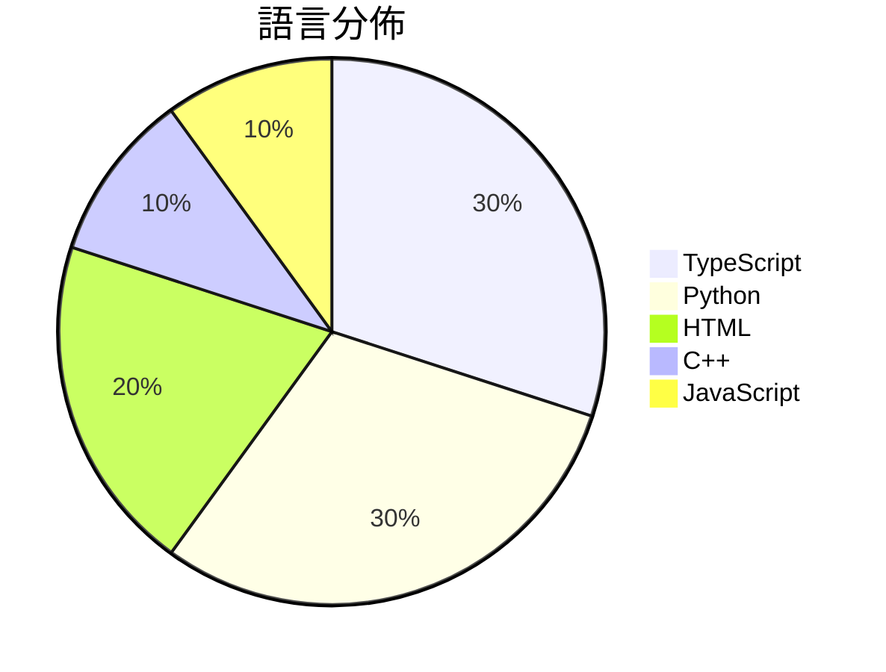

# GitHub Trending - 2026-04-19

> [!summary] 本日摘要
> 收錄 **10** 個新專案，合計 **14.6k** stars
> 語言分佈：TypeScript (3) · Python (3) · HTML (2) · C++ (1) · JavaScript (1)

> [!tip] 本週焦點
> **[[getagentseal--codeburn|getagentseal/codeburn]]** — 5 天內累積 2.7k stars（543 stars/天）
> 讓開發者追蹤 AI 編碼工具的使用成本，提供互動式的 TUI 儀表板。



---

## 收錄列表

| # | 專案 | 分類 | Stars | 速度 | 安裝 | 語言 | 用途 |
| :--: | --- | --- | ---: | ---: | --- | --- | --- |
| 1 | [[getagentseal--codeburn\|getagentseal/codeburn]] | 開發工具 | 2.7k | 543/天 | `easy` | TypeScript | 讓開發者追蹤 AI 編碼工具的使用成本，提供互動式的 TUI 儀表板。 |
| 2 | [[Robbyant--lingbot-map\|Robbyant/lingbot-map]] | AI/ML | 1.9k | 634/天 | `medium` | Python | 從串流數據重建場景的前饋式 3D 基礎模型。 |
| 3 | [[vercel-labs--wterm\|vercel-labs/wterm]] | 開發工具 | 1.6k | 391/天 | `medium` | TypeScript | 提供一個高效能的網頁終端模擬器，支持多種功能和擴展。 |
| 4 | [[Nightmare-Eclipse--RedSun\|Nightmare-Eclipse/RedSun]] | 安全 | 1.5k | 500/天 | `medium` | C++ | 利用 Windows Defender 的漏洞來覆寫系統檔案以獲取管理權限。 |
| 5 | [[Mouseww--anything-analyzer\|Mouseww/anything-analyzer]] | 開發工具 | 1.4k | 225/天 | `medium` | TypeScript | 全能协议分析工具，支持浏览器抓包、MITM 代理、指纹伪装和 AI 分析。 |
| 6 | [[browser-use--video-use\|browser-use/video-use]] | 其他 | 1.3k | 179/天 | `medium` | Python | 透過 Claude Code 進行自動化影片編輯，省去繁瑣的手動操作。 |
| 7 | [[alchaincyf--darwin-skill\|alchaincyf/darwin-skill]] | 開發工具 | 1.2k | 239/天 | `easy` | HTML | 讓你的技能系統自動評估、改進和測試，實現持續優化。 |
| 8 | [[lewislulu--html-ppt-skill\|lewislulu/html-ppt-skill]] | 開發工具 | 1.1k | 381/天 | `easy` | HTML | 提供多主題、多佈局和動畫的 HTML 簡報製作工具，讓使用者輕鬆創建專業簡報。 |
| 9 | [[Manavarya09--design-extract\|Manavarya09/design-extract]] | 開發工具 | 1.0k | 336/天 | `easy` | JavaScript | 一條命令提取任何網站的完整設計系統，生成多種格式的設計資源。 |
| 10 | [[patterniha--SNI-Spoofing\|patterniha/SNI-Spoofing]] | 安全 | 977 | 163/天 | `easy` | Python | 透過 IP/TCP 標頭操作繞過深度封包檢測（DPI）。 |

---

## 重點摘要

### 1. [[getagentseal--codeburn|getagentseal/codeburn]] `開發工具`

> 讓開發者追蹤 AI 編碼工具的使用成本，提供互動式的 TUI 儀表板。

**2.7k** stars · **543** stars/天 · TypeScript · `easy`

_建立 5 天內累積 2717 stars（543/天），forks 190（7.0%），顯示出強烈的需求。作者 AgentSeal 之前有開發過其他 AI 工具，這次專案解決了開發者在使用 AI 編碼工具時無法有效追蹤成本的痛點。這個工具讓開發者能夠清楚了解每次請求的 token 使用情況，並且在社群中引起了關注，特別是對於那些依賴多種 AI 工具的開發者。技術上，這個工具的出現正好符合了開發者對於成本透明化的需求，尤其是在 AI 工具日益普及的背景下。_

---

### 2. [[Robbyant--lingbot-map|Robbyant/lingbot-map]] `AI/ML`

> 從串流數據重建場景的前饋式 3D 基礎模型。

**1.9k** stars · **634** stars/天 · Python · `medium`

_建立 3 天內累積 1903 stars（634/天），forks 137（7.2%），顯示出強勁的增長潛力。這個專案由 Robbyant 團隊開發，團隊成員在 3D 重建和計算機視覺領域有豐富經驗。LingBot-Map 解決了以往串流數據重建中存在的性能瓶頸，特別是在長序列的推論上，這在過去的工具中往往難以實現。最近的推廣活動和社群討論也促進了其曝光率。技術上，隨著計算能力的提升，這種高效的推論架構變得可行，並且在實際應用中展現出優越的性能。forks/stars 比率為 7.2%，顯示出有相當比例的用戶對此專案進行了實際修改和使用。_

---

### 3. [[vercel-labs--wterm|vercel-labs/wterm]] `開發工具`

> 提供一個高效能的網頁終端模擬器，支持多種功能和擴展。

**1.6k** stars · **391** stars/天 · TypeScript · `medium`

_建立 4 天內累積 1565 stars（391/天），forks 48（3.1%），顯示出一定的關注度。作者 ctate 之前在 Vercel 的開發經驗使其具備良好的技術背景。這個專案解決了傳統終端模擬器在網頁環境中的性能和功能限制，特別是對於需要即時交互的應用場景。近期的推廣和社群討論可能也促進了其快速增長。_

---

### 4. [[Nightmare-Eclipse--RedSun|Nightmare-Eclipse/RedSun]] `安全`

> 利用 Windows Defender 的漏洞來覆寫系統檔案以獲取管理權限。

**1.5k** stars · **500** stars/天 · C++ · `medium`

_建立 3 天內累積 1500 stars（500/天），forks 323（21.5%），這顯示出強烈的社群興趣。作者 Nightmare-Eclipse 是一位活躍的安全研究者，過去有多個相關專案。這個專案解決了反病毒軟體在處理特定標籤文件時的行為問題，之前的解決方案通常未能針對這種情況。社群對此反應熱烈，特別是針對其幽默的設計理念。技術生態的變化使得這種針對性漏洞利用變得可行，尤其是在 C++ 環境中。forks/stars 比率高達 21.5%，顯示出許多人在實際修改和使用這個工具。_

---

### 5. [[Mouseww--anything-analyzer|Mouseww/anything-analyzer]] `開發工具`

> 全能协议分析工具，支持浏览器抓包、MITM 代理、指纹伪装和 AI 分析。

**1.4k** stars · **225** stars/天 · TypeScript · `medium`

_建立 6 天內累積 1350 stars（225/天），forks 311（23.0%），顯示出強烈的社群參與。作者 Mouseww 在開源社群中活躍，過去有多個成功的專案。這個工具解決了傳統抓包工具各自為政的問題，將不同來源的流量整合並自動分析，填補了市場需求。近期的推廣活動和社群討論也提升了曝光率，吸引了更多用戶的注意。高比例的 forks 表示許多人在實際修改和使用這個工具，顯示出其實用性。_

---

### 6. [[browser-use--video-use|browser-use/video-use]] `其他`

> 透過 Claude Code 進行自動化影片編輯，省去繁瑣的手動操作。

**1.3k** stars · **179** stars/天 · Python · `medium`

_建立 7 天內累積 1252 stars（179/天），forks 115（9.2%），顯示出強勁的增長潛力。這個專案的主要貢獻者 gregpr07 之前有過開源經驗，並且這個工具解決了傳統影片編輯過程中的繁瑣操作，提供了一個更直觀的解決方案。社群對於自動化編輯的需求日益增加，這使得 video-use 的出現恰逢其時。高達 9.2% 的 forks/stars 比率顯示出許多開發者對於這個專案的實際修改和使用，反映了其潛在的實用性。_

---

### 7. [[alchaincyf--darwin-skill|alchaincyf/darwin-skill]] `開發工具`

> 讓你的技能系統自動評估、改進和測試，實現持續優化。

**1.2k** stars · **239** stars/天 · HTML · `easy`

_建立 5 天內累積 1194 stars（239/天），forks 143（12.0%），顯示出強烈的社群關注。作者 alchaincyf 之前在 AI 領域有多個相關專案，這次的專案解決了技能優化過程中的自動化需求，特別是在技能數量增多的情況下，傳統的手動維護方式已經無法滿足需求。此專案的推出正好填補了這一空白，並且其設計理念受到知名研究的啟發，進一步提升了其可信度和吸引力。社群的反應也表明，使用者對於技能優化的需求日益增加，這可能是促使專案快速增長的原因之一。_

---

### 8. [[lewislulu--html-ppt-skill|lewislulu/html-ppt-skill]] `開發工具`

> 提供多主題、多佈局和動畫的 HTML 簡報製作工具，讓使用者輕鬆創建專業簡報。

**1.1k** stars · **381** stars/天 · HTML · `easy`

_建立 3 天就累積 1144 stars（381/天），forks 126（11.0%），這顯示出強烈的使用需求。作者 lewislulu 之前有開發過其他相關工具，這次針對簡報需求的專案填補了市場上缺乏靈活、可自訂的 HTML 簡報工具的空白。這個專案的推出正好符合了許多使用者對於簡報工具的需求，特別是在遠端工作和線上演示日益普及的背景下。forks/stars 比率 11.0% 表示有相當比例的使用者在積極修改和使用這個工具，顯示出其實用性和潛在的擴展性。_

---

### 9. [[Manavarya09--design-extract|Manavarya09/design-extract]] `開發工具`

> 一條命令提取任何網站的完整設計系統，生成多種格式的設計資源。

**1.0k** stars · **336** stars/天 · JavaScript · `easy`

_建立 3 天內累積 1007 stars（336/天），forks 80（7.9%），顯示出強勁的增長潛力。作者 Manavarya09 在設計和開發領域有豐富經驗，這個工具解決了市場上設計提取工具普遍存在的功能不足問題，特別是在響應式設計和互動狀態的捕捉上。近期的推廣活動和社群討論也為其帶來了關注，特別是在設計系統和前端開發的交集領域。高 forks/stars 比率顯示出許多開發者對其功能的實際修改和使用需求。_

---

### 10. [[patterniha--SNI-Spoofing|patterniha/SNI-Spoofing]] `安全`

> 透過 IP/TCP 標頭操作繞過深度封包檢測（DPI）。

**977** stars · **163** stars/天 · Python · `easy`

_建立 6 天就累積 977 stars（163/天），forks 98（10.0%），這顯示出該專案在短時間內獲得了相當的關注。作者 patterniha 在網路安全領域有一定的經驗，這個專案解決了在高監控環境中無法自由訪問網路的痛點。之前的解決方案往往依賴於較為繁瑣的 VPN 或代理服務，這些方案在某些情況下無法有效繞過 DPI。社群的反應也顯示出對這個工具的需求，尤其是在某些國家對網路流量進行嚴格監控的背景下。forks/stars 比率為 10.0%，顯示出有不少用戶在實際修改和使用這個工具。_

---

## 今日到期複習

> [!tip] 根據間隔複習排程，今天該回顧的專案

```dataview
TABLE
  stars_per_day AS "Stars/天",
  category AS "分類",
  engagement AS "參與度"
FROM "Repos"
WHERE next_review AND date(next_review) <= date("2026-04-19") AND status != "archived"
SORT priority DESC
```

## 待處理

```dataviewjs
const pending = dv.pages('"Repos"').where(p => p.status === "to-review").length;
const unrated = dv.pages('"Repos"').where(p => p.status !== "archived" && p.status !== "to-review" && (p.my_rating || 0) === 0).length;
const noVerdict = dv.pages('"Repos"').where(p => p.status !== "archived" && (p.my_rating || 0) > 0 && (!p.verdict || p.verdict === "")).length;
const items = [];
if (pending > 0) items.push(`**${pending}** 個待分流`);
if (unrated > 0) items.push(`**${unrated}** 個已讀但未評分`);
if (noVerdict > 0) items.push(`**${noVerdict}** 個已評分但無結論`);
if (items.length > 0) dv.paragraph(items.join(" / "));
else dv.paragraph("所有專案都已處理完畢！");
```
