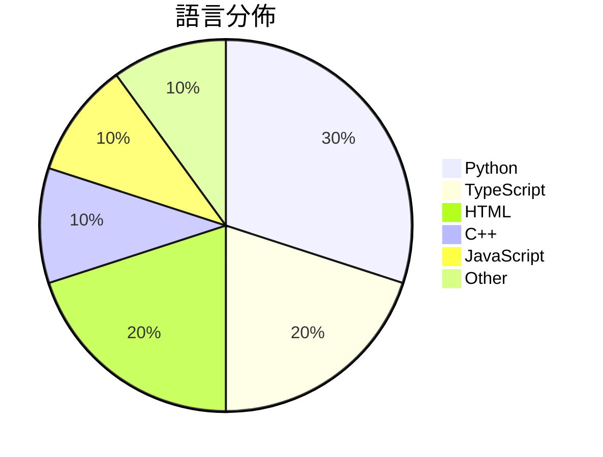

# GitHub Trending - 2026-04-20

> [!summary] 本日摘要
> 收錄 **10** 個新專案，合計 **17.7k** stars
> 語言分佈：Python (3) · TypeScript (2) · HTML (2) · C++ (1) · JavaScript (1) · Other (1)

> [!tip] 本週焦點
> **[[getagentseal--codeburn|getagentseal/codeburn]]** — 6 天內累積 2.9k stars（479 stars/天）
> 追蹤你的 AI 編碼代幣花費，提供互動式 TUI 儀表板以觀察 Claude Code、Codex 和 Cursor 的成本。



---

## 收錄列表

| # | 專案 | 分類 | Stars | 速度 | 安裝 | 語言 | 用途 |
| :--: | --- | --- | ---: | ---: | --- | --- | --- |
| 1 | [[getagentseal--codeburn\|getagentseal/codeburn]] | 開發工具 | 2.9k | 479/天 | `easy` | TypeScript | 追蹤你的 AI 編碼代幣花費，提供互動式 TUI 儀表板以觀察 Claude C |
| 2 | [[Robbyant--lingbot-map\|Robbyant/lingbot-map]] | AI/ML | 2.7k | 663/天 | `medium` | Python | 從串流數據重建場景的前饋式 3D 基礎模型。 |
| 3 | [[browser-use--browser-harness\|browser-use/browser-harness]] | 開發工具 | 2.2k | 1.1k/天 | `medium` | Python | 提供自我修復的瀏覽器環境，讓 LLM 能夠完成任何任務。 |
| 4 | [[vercel-labs--wterm\|vercel-labs/wterm]] | CLI 工具 | 2.1k | 416/天 | `medium` | TypeScript | 提供網頁端的終端模擬器，讓開發者能在瀏覽器中運行命令行應用。 |
| 5 | [[Nightmare-Eclipse--RedSun\|Nightmare-Eclipse/RedSun]] | 安全 | 1.6k | 393/天 | `medium` | C++ | 利用 Windows Defender 的漏洞來提升系統權限。 |
| 6 | [[kyegomez--OpenMythos\|kyegomez/OpenMythos]] | AI/ML | 1.5k | 1.5k/天 | `easy` | Python | 提供一個理論上的 Claude Mythos 架構重建，讓開發者能夠探索深度推理 |
| 7 | [[lewislulu--html-ppt-skill\|lewislulu/html-ppt-skill]] | 開發工具 | 1.4k | 359/天 | `easy` | HTML | 提供多主題和佈局的 HTML 簡報製作工具，讓使用者輕鬆創建專業簡報。 |
| 8 | [[alchaincyf--darwin-skill\|alchaincyf/darwin-skill]] | 開發工具 | 1.3k | 216/天 | `easy` | HTML | 一個讓你的技能系統自動進化的工具，通過評估、改進和測試來優化技能。 |
| 9 | [[Manavarya09--design-extract\|Manavarya09/design-extract]] | 開發工具 | 1.1k | 272/天 | `easy` | JavaScript | 透過一條命令提取任何網站的完整設計系統。 |
| 10 | [[BuilderPulse--BuilderPulse\|BuilderPulse/BuilderPulse]] | 其他 | 965 | 193/天 | `easy` | N/A | 提供獨立開發者每日一個高信心的建設方向，幫助他們抓住市場機會。 |

---

## 重點摘要

### 1. [[getagentseal--codeburn|getagentseal/codeburn]] `開發工具`

> 追蹤你的 AI 編碼代幣花費，提供互動式 TUI 儀表板以觀察 Claude Code、Codex 和 Cursor 的成本。

**2.9k** stars · **479** stars/天 · TypeScript · `easy`

_建立 6 天內累積 2871 stars（479/天），forks 212（7.4%），顯示出強勁的增長勢頭。這個專案的作者 AgentSeal 之前在 AI 工具開發上有豐富經驗，解決了開發者在使用多種 AI 編碼工具時難以追蹤成本的痛點。此工具的出現正好填補了市場上對於 AI 編碼成本透明度的需求，特別是在面對多種不同計費模式的情況下。社群的反饋也顯示出對於功能擴展的強烈需求，例如對 KiloCode 和 OpenCode 的支持，這進一步推動了專案的關注度。_

---

### 2. [[Robbyant--lingbot-map|Robbyant/lingbot-map]] `AI/ML`

> 從串流數據重建場景的前饋式 3D 基礎模型。

**2.7k** stars · **663** stars/天 · Python · `medium`

_建立 4 天內累積 2652 stars（663/天），forks 204（7.7%），顯示出強勁的增長勢頭。主要貢獻者 LinZhuoChen 和 justimyhxu 在 3D 重建領域有豐富的經驗，這使得專案在技術上具備優勢。LingBot-Map 解決了現有 3D 重建工具在處理長序列數據時的性能瓶頸，尤其是對於即時應用場景的需求。社群的反饋和需求也促使了這個專案的快速發展。該專案的技術架構和設計理念符合當前對於高效能計算的需求，特別是在串流數據的處理上。forks/stars 比率為 7.7%，顯示出有相當比例的用戶在實際修改和使用這個工具。_

---

### 3. [[browser-use--browser-harness|browser-use/browser-harness]] `開發工具`

> 提供自我修復的瀏覽器環境，讓 LLM 能夠完成任何任務。

**2.2k** stars · **1.1k** stars/天 · Python · `medium`

_建立 2 天就累積 2236 stars（1118/天），forks 193（8.6%），顯示出強烈的興趣和潛在的實用性。作者 MagMueller 和其他貢獻者在開源社群中有一定的影響力，過去的專案也多數集中在自動化和 LLM 的應用上。這個專案解決了傳統自動化工具難以適應快速變化需求的痛點，特別是當 LLM 需要即時編輯和調整時。最近的推文和討論也引起了社群的注意，進一步推動了其受歡迎程度。技術上，CDP 的使用讓這個工具能夠直接與瀏覽器進行高效的互動，這在過去的工具中並不常見。forks/stars 比率為 8.6%，顯示出不少使用者對於這個專案有實際的修改需求，並非僅僅是觀望。_

---

### 4. [[vercel-labs--wterm|vercel-labs/wterm]] `CLI 工具`

> 提供網頁端的終端模擬器，讓開發者能在瀏覽器中運行命令行應用。

**2.1k** stars · **416** stars/天 · TypeScript · `medium`

_建立 5 天內累積 2081 stars（416/天），forks 79（3.8%），顯示出一定的關注度。這個專案由 Vercel Labs 開發，Vercel 是知名的前端部署平台，這使得該專案的曝光率較高。它解決了在網頁中嵌入終端的需求，之前的解決方案如 xterm.js 雖然功能強大，但在集成和性能上可能不如 wterm。最近的推文和討論也引起了開發者的興趣，尤其是對於需要在瀏覽器中運行命令行工具的場景。forks/stars 比率為 3.8%，顯示出有一定比例的開發者在實際修改和使用這個工具。_

---

### 5. [[Nightmare-Eclipse--RedSun|Nightmare-Eclipse/RedSun]] `安全`

> 利用 Windows Defender 的漏洞來提升系統權限。

**1.6k** stars · **393** stars/天 · C++ · `medium`

_建立 4 天就累積 1573 stars（393/天），forks 343（21.8%），顯示出強烈的社群興趣。作者 Nightmare-Eclipse 以其在安全研究領域的貢獻而知名，這個專案解決了 Windows Defender 在特定情況下的漏洞，這在過去並沒有好的解決方案。此漏洞的發現和利用引起了社群的廣泛討論，特別是在安全論壇和社交媒體上。技術上，Windows Defender 的行為變化使得這個工具的開發成為可能，並且高比例的 forks/stars 表示許多人正在實際修改和使用這個工具。_

---

### 6. [[kyegomez--OpenMythos|kyegomez/OpenMythos]] `AI/ML`

> 提供一個理論上的 Claude Mythos 架構重建，讓開發者能夠探索深度推理的潛力。

**1.5k** stars · **1.5k** stars/天 · Python · `easy`

_建立 1 天就累積 1496 stars（1496/天），forks 265（17.7%），顯示出強烈的社群參與。這位作者 kyegomez 在 AI 領域有一定的背景，專注於探索深度學習模型的架構。OpenMythos 提供了一個理論基礎，讓開發者能夠探索 Claude Mythos 的潛力，這在現有的 AI 模型中是相對少見的。社群對於如何將此架構應用於實際案例的討論也引發了興趣，顯示出對於這一新模型的需求。_

---

### 7. [[lewislulu--html-ppt-skill|lewislulu/html-ppt-skill]] `開發工具`

> 提供多主題和佈局的 HTML 簡報製作工具，讓使用者輕鬆創建專業簡報。

**1.4k** stars · **359** stars/天 · HTML · `easy`

_建立 4 天內累積 1434 stars（359/天），forks 163（11.4%），顯示出強勁的增長潛力。作者 lewislulu 之前在開源社群中有過多個成功專案，這個工具解決了傳統簡報工具的複雜性和不靈活性，提供了一個更簡單且直觀的解決方案。最近的推廣活動和社群反饋也促進了它的快速成長。這個工具的設計使得簡報製作變得更具互動性和即時性，符合現代簡報需求。_

---

### 8. [[alchaincyf--darwin-skill|alchaincyf/darwin-skill]] `開發工具`

> 一個讓你的技能系統自動進化的工具，通過評估、改進和測試來優化技能。

**1.3k** stars · **216** stars/天 · HTML · `easy`

_建立 6 天內累積 1293 stars（216/天），forks 152（11.8%），顯示出強烈的社群興趣。作者 alchaincyf 以其在 AI 和技能優化領域的背景，針對技能管理的痛點提供了一個創新的解決方案。這個工具填補了傳統技能審查中僅依賴格式的不足，並引入了自動化的優化過程。社群的反饋和需求也促進了這個專案的快速成長，尤其是在技能數量激增的背景下。forks/stars 比率為 11.8%，顯示出許多人在實際修改和使用這個工具。_

---

### 9. [[Manavarya09--design-extract|Manavarya09/design-extract]] `開發工具`

> 透過一條命令提取任何網站的完整設計系統。

**1.1k** stars · **272** stars/天 · JavaScript · `easy`

_建立 4 天就累積 1089 stars（272/天），forks 86（7.9%），顯示出強烈的社群興趣。作者 Manavarya09 之前在設計自動化領域有豐富經驗，這個工具解決了設計提取過程中的多個痛點，例如缺乏響應式設計和互動狀態的捕捉。近期的推廣活動和社群討論也可能促進了這個工具的曝光率。技術上，Playwright 的使用使得這個工具能夠在多平台上運行，增加了其可用性。forks/stars 比率為 7.9%，顯示出有相當比例的用戶在進行實際修改和使用。_

---

### 10. [[BuilderPulse--BuilderPulse|BuilderPulse/BuilderPulse]] `其他`

> 提供獨立開發者每日一個高信心的建設方向，幫助他們抓住市場機會。

**965** stars · **193** stars/天 · N/A · `easy`

_建立 5 天就累積 965 stars（193/天），forks 70（7.3%），這顯示出相對穩定的增長。作者 Liu Xiaopai 之前有開發相關的 AI 工具，這使得他在這個領域有一定的經驗。這個專案解決了獨立開發者在資訊過載中難以找到具體建設方向的痛點，之前通常需要花費大量時間在各種平台上尋找靈感。最近的推廣活動和社交媒體的討論也可能促進了其曝光率。技術生態中，對於快速獲取市場資訊的需求日益增加，這使得 BuilderPulse 的出現恰逢其時。forks/stars 比率為 7.3%，顯示出有相當比例的用戶在進行實際修改和使用，這是健康的社群參與指標。_

---

## 今日到期複習

> [!tip] 根據間隔複習排程，今天該回顧的專案

```dataview
TABLE
  stars_per_day AS "Stars/天",
  category AS "分類",
  engagement AS "參與度"
FROM "Repos"
WHERE next_review AND date(next_review) <= date("2026-04-20") AND status != "archived"
SORT priority DESC
```

## 待處理

```dataviewjs
const pending = dv.pages('"Repos"').where(p => p.status === "to-review").length;
const unrated = dv.pages('"Repos"').where(p => p.status !== "archived" && p.status !== "to-review" && (p.my_rating || 0) === 0).length;
const noVerdict = dv.pages('"Repos"').where(p => p.status !== "archived" && (p.my_rating || 0) > 0 && (!p.verdict || p.verdict === "")).length;
const items = [];
if (pending > 0) items.push(`**${pending}** 個待分流`);
if (unrated > 0) items.push(`**${unrated}** 個已讀但未評分`);
if (noVerdict > 0) items.push(`**${noVerdict}** 個已評分但無結論`);
if (items.length > 0) dv.paragraph(items.join(" / "));
else dv.paragraph("所有專案都已處理完畢！");
```
