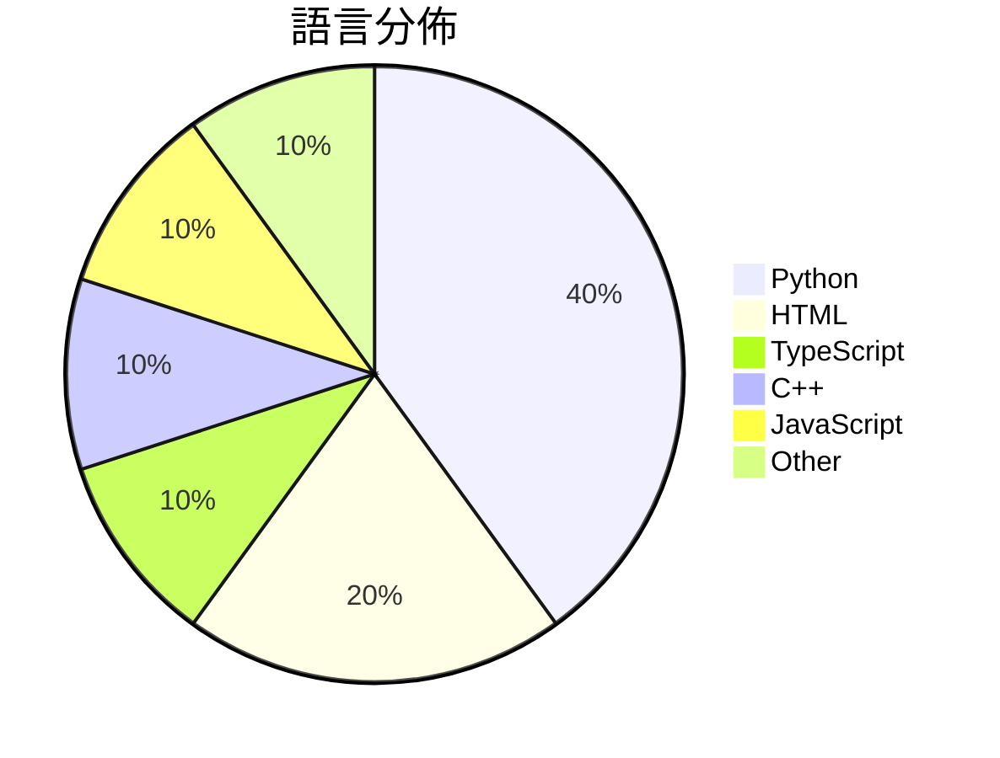

# GitHub Trending - 2026-04-21

> [!summary] 本日摘要
> 收錄 **10** 個新專案，合計 **20.8k** stars
> 語言分佈：Python (4) · HTML (2) · TypeScript (1) · C++ (1) · JavaScript (1) · Other (1)

> [!tip] 本週焦點
> **[[kyegomez--OpenMythos|kyegomez/OpenMythos]]** — 2 天內累積 4.3k stars（2.1k stars/天）
> 提供一個基於 Claude Mythos 架構的理論重建，讓開發者能探索深度推理的可能性。



---

## 收錄列表

| # | 專案 | 分類 | Stars | 速度 | 安裝 | 語言 | 用途 |
| :--: | --- | --- | ---: | ---: | --- | --- | --- |
| 1 | [[kyegomez--OpenMythos\|kyegomez/OpenMythos]] | AI/ML | 4.3k | 2.1k/天 | `easy` | Python | 提供一個基於 Claude Mythos 架構的理論重建，讓開發者能探索深度推理 |
| 2 | [[browser-use--browser-harness\|browser-use/browser-harness]] | 開發工具 | 3.6k | 1.2k/天 | `easy` | Python | 提供自我修復的瀏覽器工具，讓 LLM 能夠完成各種瀏覽器任務。 |
| 3 | [[Robbyant--lingbot-map\|Robbyant/lingbot-map]] | AI/ML | 3.3k | 654/天 | `medium` | Python | 從串流數據重建場景的 3D 基礎模型。 |
| 4 | [[vercel-labs--wterm\|vercel-labs/wterm]] | CLI 工具 | 2.2k | 368/天 | `medium` | TypeScript | 提供一個基於網頁的終端模擬器，讓使用者能夠在瀏覽器中執行命令行操作。 |
| 5 | [[lewislulu--html-ppt-skill\|lewislulu/html-ppt-skill]] | 開發工具 | 1.7k | 331/天 | `easy` | HTML | 提供專業 HTML 簡報製作的工具，擁有 36 種主題和 31 種佈局。 |
| 6 | [[Nightmare-Eclipse--RedSun\|Nightmare-Eclipse/RedSun]] | 安全 | 1.6k | 328/天 | `medium` | C++ | 利用 Windows Defender 的漏洞來獲取系統管理權限。 |
| 7 | [[Manavarya09--design-extract\|Manavarya09/design-extract]] | 開發工具 | 1.2k | 231/天 | `easy` | JavaScript | 透過一條指令提取任何網站的完整設計系統，包含顏色、字體、間距等。 |
| 8 | [[BuilderPulse--BuilderPulse\|BuilderPulse/BuilderPulse]] | 其他 | 1.0k | 169/天 | `easy` | N/A | 為獨立開發者提供 AI 驅動的每日建議，幫助他們找到值得關注的建設方向。 |
| 9 | [[wbh604--UZI-Skill\|wbh604/UZI-Skill]] | 開發工具 | 969 | 242/天 | `medium` | Python | 提供全面的股票分析，結合多位投資專家的見解和量化數據，幫助用戶做出明智的投資決策 |
| 10 | [[cathrynlavery--diagram-design\|cathrynlavery/diagram-design]] | 開發工具 | 965 | 241/天 | `easy` | HTML | 提供 13 種編輯品質的圖表類型，讓使用者快速生成符合品牌風格的圖表。 |

---

## 重點摘要

### 1. [[kyegomez--OpenMythos|kyegomez/OpenMythos]] `AI/ML`

> 提供一個基於 Claude Mythos 架構的理論重建，讓開發者能探索深度推理的可能性。

**4.3k** stars · **2.1k** stars/天 · Python · `easy`

_建立 2 天就累積 4271 stars（2136/天），forks 947（22.2%），顯示出強烈的社群參與。這個專案的作者 kyegomez 以其在 AI 領域的研究背景而聞名，並且這個專案解決了現有模型在推理深度和參數效率上的不足。過去的模型如 GPT 系列在處理深度推理時常常需要大量的參數，而 OpenMythos 則透過循環設計來降低這個需求。近期的社群討論和需求也促進了這個專案的快速成長，特別是在 Discord 社群中的活躍互動。這些因素共同推動了 OpenMythos 的快速擴散。_

---

### 2. [[browser-use--browser-harness|browser-use/browser-harness]] `開發工具`

> 提供自我修復的瀏覽器工具，讓 LLM 能夠完成各種瀏覽器任務。

**3.6k** stars · **1.2k** stars/天 · Python · `easy`

_建立 3 天內累積 3596 stars（1199/天），forks 295（8.2%），顯示出強勁的增長潛力。該專案由 MagMueller 等人開發，這些貢獻者在開源社群中有一定的影響力。Browser Harness 解決了 LLM 在瀏覽器操作中的靈活性問題，以往的工具往往需要繁瑣的配置和預設流程，而這個工具允許 LLM 自動生成所需的功能，顯著提高了效率。最近的推文和討論也讓這個專案引起了注意，尤其是在自動化和 AI 領域的開發者中。高達 8.2% 的 forks/stars 比率顯示出許多開發者正在積極修改和使用這個工具，這是其潛在實用性的強烈指標。_

---

### 3. [[Robbyant--lingbot-map|Robbyant/lingbot-map]] `AI/ML`

> 從串流數據重建場景的 3D 基礎模型。

**3.3k** stars · **654** stars/天 · Python · `medium`

_建立 5 天內累積 3272 stars（654/天），forks 273（8.3%），這顯示出強烈的社群興趣。主要貢獻者 LinZhuoChen 和 justimyhxu 之前在 3D 重建和機器學習領域有豐富經驗。LingBot-Map 解決了在串流數據中進行高效 3D 重建的痛點，這在過去的工具中往往需要較長的處理時間或較高的計算資源。近期的推廣活動和社群討論也可能促進了其快速增長。技術上，隨著 GPU 性能的提升，這種即時重建的需求變得更加可行，這使得 LingBot-Map 成為一個時機合適的解決方案。高達 8.3% 的 forks/stars 比率顯示出使用者對其進行修改和擴展的興趣。_

---

### 4. [[vercel-labs--wterm|vercel-labs/wterm]] `CLI 工具`

> 提供一個基於網頁的終端模擬器，讓使用者能夠在瀏覽器中執行命令行操作。

**2.2k** stars · **368** stars/天 · TypeScript · `medium`

_建立 6 天就累積 2210 stars（368/天），forks 83（3.8%），這顯示出不錯的興趣增長。這個專案由 Vercel Labs 開發，團隊過去在前端技術上有豐富經驗。wterm 解決了在瀏覽器中使用終端的需求，這在過去通常需要依賴本地應用或較重的解決方案。近期的社群討論和需求反饋也推動了這個專案的曝光率。隨著 WebAssembly 的普及，這個工具的可行性大幅提升，讓開發者能夠在瀏覽器中享受接近原生的終端體驗。forks/stars 比率相對較低，顯示出目前大部分使用者仍在觀望或試用階段。_

---

### 5. [[lewislulu--html-ppt-skill|lewislulu/html-ppt-skill]] `開發工具`

> 提供專業 HTML 簡報製作的工具，擁有 36 種主題和 31 種佈局。

**1.7k** stars · **331** stars/天 · HTML · `easy`

_建立 5 天就累積 1656 stars（331/天），forks 187（11.3%），顯示出強烈的使用需求。作者 lewislulu 在開源社群中有一定的影響力，這個專案解決了傳統簡報工具的靈活性不足問題，讓用戶能夠快速生成和修改簡報。近期的推廣活動和社交媒體的討論也可能促進了其曝光度。這個工具的設計理念符合當前對於輕量級、無需安裝的工具的需求，並且其高 fork 比率顯示出社群對於進一步定制的興趣。_

---

### 6. [[Nightmare-Eclipse--RedSun|Nightmare-Eclipse/RedSun]] `安全`

> 利用 Windows Defender 的漏洞來獲取系統管理權限。

**1.6k** stars · **328** stars/天 · C++ · `medium`

_建立 5 天就累積 1642 stars（328/天），forks 356（21.7%），這顯示出強烈的社群關注。作者 Nightmare-Eclipse 似乎在安全研究領域有一定的影響力，這個專案解決了 Windows Defender 在處理惡意檔案時的漏洞，這在過去的解決方案中並未被充分利用。最近的社群討論和反饋也顯示出對這一漏洞的興趣，尤其是對於安全研究者來說，這是一個有趣的實驗場。_

---

### 7. [[Manavarya09--design-extract|Manavarya09/design-extract]] `開發工具`

> 透過一條指令提取任何網站的完整設計系統，包含顏色、字體、間距等。

**1.2k** stars · **231** stars/天 · JavaScript · `easy`

_在 5 天內累積 1155 stars（231/天），forks 90（7.8%），顯示出穩定的增長趨勢。作者 Manavarya09 之前有開發過多個設計相關工具，這次的 designlang 對於設計系統的提取填補了市場上多個空白，特別是在佈局和運動語言的提取上。這個工具的出現正好符合了當前對於高效設計管理的需求，並且在社群中引發了討論，進一步推動了它的流行。forks/stars 比率為 7.8%，顯示出有相對較高的實際使用和修改需求。_

---

### 8. [[BuilderPulse--BuilderPulse|BuilderPulse/BuilderPulse]] `其他`

> 為獨立開發者提供 AI 驅動的每日建議，幫助他們找到值得關注的建設方向。

**1.0k** stars · **169** stars/天 · N/A · `easy`

_建立 6 天就累積 1016 stars（169/天），forks 73（7.2%），顯示出強勁的增長潛力。作者 Liu Xiaopai 在 AI 和開源領域有一定的背景，這個工具解決了獨立開發者在資訊過載時無法快速找到建設方向的痛點。過去，開發者通常依賴於社群討論或隨機的靈感來源，這樣的方式效率低下且容易錯過重要信號。最近的推廣活動和社群互動也促進了這個工具的曝光率，讓更多人關注到它的潛力。這個工具的成功也反映了市場對於高效資訊整合的需求，特別是在快速變化的技術環境中。forks/stars 比率為 7.2%，顯示出用戶對於這個工具的實際應用有興趣。_

---

### 9. [[wbh604--UZI-Skill|wbh604/UZI-Skill]] `開發工具`

> 提供全面的股票分析，結合多位投資專家的見解和量化數據，幫助用戶做出明智的投資決策。

**969** stars · **242** stars/天 · Python · `medium`

_建立 4 天內累積 969 stars（242/天），forks 165（17%），顯示出強勁的增長潛力。作者 wbh604 在投資分析領域有豐富經驗，這個專案解決了以往需要多個工具才能完成的股票分析流程，整合了多位專家的見解和量化數據。近期的社群反饋和 bug 修復也顯示出活躍的開發和維護。這個工具的設計充分考慮了用戶需求，提供了全免費的數據源，讓使用者能夠無障礙地進行股票分析。_

---

### 10. [[cathrynlavery--diagram-design|cathrynlavery/diagram-design]] `開發工具`

> 提供 13 種編輯品質的圖表類型，讓使用者快速生成符合品牌風格的圖表。

**965** stars · **241** stars/天 · HTML · `easy`

_建立 4 天內累積 965 stars（241/天），forks 65（6.7%），顯示出這個專案的快速增長。作者 Cathryn Lavery 是 BestSelf.co 的創辦人，專注於設計和 AI 的應用，這使得她對於圖表設計的需求有深刻的理解。這個專案解決了使用者在生成圖表時常遇到的樣式不一致和品質不佳的問題，特別是對於需要在部落格中使用的圖表。隨著內容創作者對於視覺效果的重視，這個工具的需求自然上升。技術上，這個工具的設計使得它能夠快速適應不同的品牌風格，這在市場上是相對獨特的。forks/stars 比率為 6.7%，顯示出有相當比例的使用者對此專案進行了實際修改或使用。_

---

## 今日到期複習

> [!tip] 根據間隔複習排程，今天該回顧的專案

```dataview
TABLE
  stars_per_day AS "Stars/天",
  category AS "分類",
  engagement AS "參與度"
FROM "Repos"
WHERE next_review AND date(next_review) <= date("2026-04-21") AND status != "archived"
SORT priority DESC
```

## 待處理

```dataviewjs
const pending = dv.pages('"Repos"').where(p => p.status === "to-review").length;
const unrated = dv.pages('"Repos"').where(p => p.status !== "archived" && p.status !== "to-review" && (p.my_rating || 0) === 0).length;
const noVerdict = dv.pages('"Repos"').where(p => p.status !== "archived" && (p.my_rating || 0) > 0 && (!p.verdict || p.verdict === "")).length;
const items = [];
if (pending > 0) items.push(`**${pending}** 個待分流`);
if (unrated > 0) items.push(`**${unrated}** 個已讀但未評分`);
if (noVerdict > 0) items.push(`**${noVerdict}** 個已評分但無結論`);
if (items.length > 0) dv.paragraph(items.join(" / "));
else dv.paragraph("所有專案都已處理完畢！");
```
