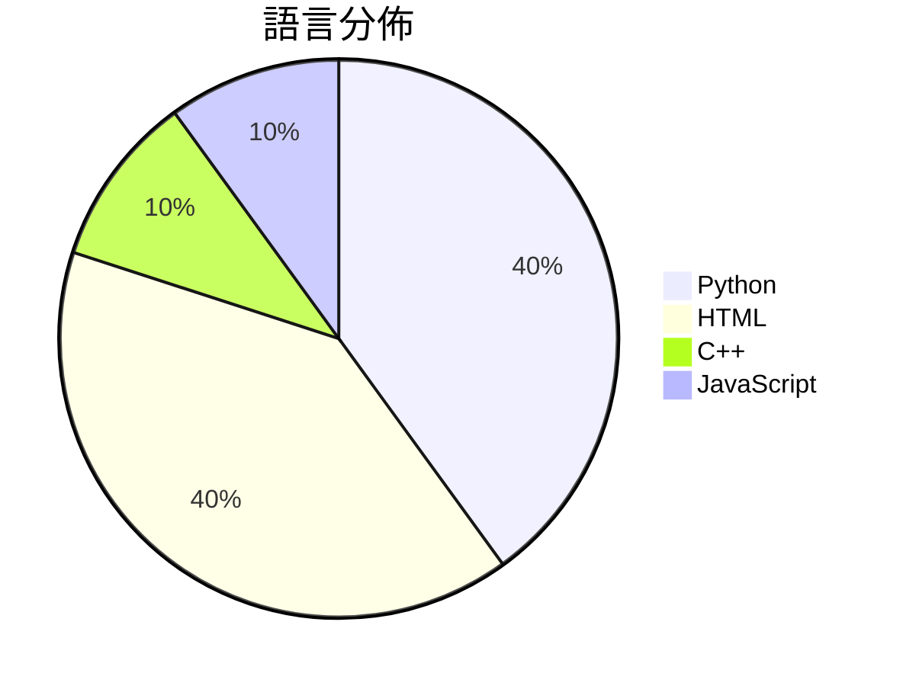

# GitHub Trending - 2026-04-22

> [!summary] 本日摘要
> 收錄 **10** 個新專案，合計 **27.4k** stars
> 語言分佈：Python (4) · HTML (4) · C++ (1) · JavaScript (1)

> [!tip] 本週焦點
> **[[kyegomez--OpenMythos|kyegomez/OpenMythos]]** — 3 天內累積 7.0k stars（2.3k stars/天）
> 提供一個基於 Claude Mythos 架構的理論重建，讓開發者探索深度可變推理的潛力。



---

## 收錄列表

| # | 專案 | 分類 | Stars | 速度 | 安裝 | 語言 | 用途 |
| :--: | --- | --- | ---: | ---: | --- | --- | --- |
| 1 | [[kyegomez--OpenMythos\|kyegomez/OpenMythos]] | AI/ML | 7.0k | 2.3k/天 | `easy` | Python | 提供一個基於 Claude Mythos 架構的理論重建，讓開發者探索深度可變推 |
| 2 | [[browser-use--browser-harness\|browser-use/browser-harness]] | 開發工具 | 4.5k | 1.1k/天 | `easy` | Python | 提供 LLM 完成任何瀏覽器任務的自我修復工具。 |
| 3 | [[Robbyant--lingbot-map\|Robbyant/lingbot-map]] | AI/ML | 3.9k | 651/天 | `medium` | Python | 一個用於從串流數據重建場景的前饋式 3D 基礎模型。 |
| 4 | [[alchaincyf--huashu-design\|alchaincyf/huashu-design]] | 開發工具 | 3.1k | 1.5k/天 | `easy` | HTML | 讓用戶透過簡單的指令生成高保真的設計原型與動畫，無需圖形介面操作。 |
| 5 | [[lewislulu--html-ppt-skill\|lewislulu/html-ppt-skill]] | 生產力 | 1.8k | 294/天 | `easy` | HTML | 提供 36 種主題、31 種佈局和 20 多種動畫的專業 HTML 簡報製作工具 |
| 6 | [[Nightmare-Eclipse--RedSun\|Nightmare-Eclipse/RedSun]] | 安全 | 1.7k | 281/天 | `medium` | C++ | 利用 Windows Defender 的漏洞來獲取系統管理權限。 |
| 7 | [[tw93--Kami\|tw93/Kami]] | 開發工具 | 1.6k | 1.6k/天 | `easy` | HTML | 提供高品質的文件設計系統，讓你的內容在印刷時展現專業美感。 |
| 8 | [[cathrynlavery--diagram-design\|cathrynlavery/diagram-design]] | 開發工具 | 1.4k | 272/天 | `easy` | HTML | 提供 13 種編輯品質的圖表類型，讓使用者快速生成符合品牌風格的圖表。 |
| 9 | [[Manavarya09--design-extract\|Manavarya09/design-extract]] | 開發工具 | 1.3k | 213/天 | `easy` | JavaScript | 透過一條指令提取任何網站的完整設計系統。 |
| 10 | [[codejunkie99--agentic-stack\|codejunkie99/agentic-stack]] |  | 1.3k | 213/天 |  | Python | One brain, many harnesses. Portable .age |

---

## 重點摘要

### 1. [[kyegomez--OpenMythos|kyegomez/OpenMythos]] `AI/ML`

> 提供一個基於 Claude Mythos 架構的理論重建，讓開發者探索深度可變推理的潛力。

**7.0k** stars · **2.3k** stars/天 · Python · `easy`

_建立 3 天就累積 6987 stars（2329/天），forks 1468（21.0%），顯示出強烈的社群興趣。作者 kyegomez 在 AI 領域有豐富的經驗，這個專案解決了傳統 transformer 模型在推理深度和參數效率上的痛點，特別是對於需要處理複雜推理的應用場景。社群的反饋和熱門問題如提供基準測試和樣本推理腳本，顯示出使用者對於模型性能的關注。這些因素共同促成了專案的快速成長。_

---

### 2. [[browser-use--browser-harness|browser-use/browser-harness]] `開發工具`

> 提供 LLM 完成任何瀏覽器任務的自我修復工具。

**4.5k** stars · **1.1k** stars/天 · Python · `easy`

_建立 4 天內累積 4459 stars（1115/天），forks 380（8.5%），顯示出強勁的增長勢頭。作者 MagMueller 和團隊的過去經驗使他們能夠針對 LLM 的需求設計出這個工具，解決了傳統自動化工具無法靈活應對動態網頁的痛點。這個工具的出現正好契合了當前對於智能自動化的需求，並且在社群中引發了廣泛的討論和關注。高達 8.5% 的 forks/stars 比率顯示出許多開發者對這個工具的實際修改和使用意圖，反映出其實用性和潛力。_

---

### 3. [[Robbyant--lingbot-map|Robbyant/lingbot-map]] `AI/ML`

> 一個用於從串流數據重建場景的前饋式 3D 基礎模型。

**3.9k** stars · **651** stars/天 · Python · `medium`

_建立 6 天內累積 3905 stars（651/天），forks 343（8.8%），顯示出強勁的增長潛力。作者 Robbyant 團隊在 3D 重建和深度學習領域有豐富的經驗，這個專案解決了以往串流數據重建的性能瓶頸，特別是在長序列的處理上。近期的推特討論和技術文章也引起了社群的關注。隨著硬體性能的提升和應用需求的增加，這種即時重建技術的可行性越來越高。高達 8.8% 的 forks/stars 比率表明許多開發者正在積極修改和使用這個專案。_

---

### 4. [[alchaincyf--huashu-design|alchaincyf/huashu-design]] `開發工具`

> 讓用戶透過簡單的指令生成高保真的設計原型與動畫，無需圖形介面操作。

**3.1k** stars · **1.5k** stars/天 · HTML · `easy`

_建立 2 天內累積 3080 stars（1540/天），forks 488（15.8%），顯示出強烈的社群興趣。作者 alchaincyf 是一位獨立開發者，曾經開發過多個受歡迎的 AI 工具，這次的 Huashu Design 解決了傳統設計工具操作繁瑣的痛點，讓用戶能夠快速生成高保真的設計。這個工具的推出正值 AI 設計工具需求上升的時期，並且其簡化的操作方式吸引了大量用戶。forks/stars 比率為 15.8%，顯示出許多用戶對此工具進行實際修改和使用，這是值得注意的社群活躍指標。_

---

### 5. [[lewislulu--html-ppt-skill|lewislulu/html-ppt-skill]] `生產力`

> 提供 36 種主題、31 種佈局和 20 多種動畫的專業 HTML 簡報製作工具。

**1.8k** stars · **294** stars/天 · HTML · `easy`

_建立 6 天就累積 1762 stars（294/天），forks 195（11.1%），這顯示出強勁的增長潛力。作者 lewislulu 在簡報工具領域有一定的經驗，這個專案解決了傳統簡報工具在靈活性和即時性上的不足。使用者可以透過簡單的命令生成簡報，這在以往的工具中並不常見。社群的反饋也顯示出對於編輯功能的需求，這可能會成為未來的發展重點。這個工具的出現正好契合了現代簡報需求的變化，特別是在遠端工作和即時分享的背景下。_

---

### 6. [[Nightmare-Eclipse--RedSun|Nightmare-Eclipse/RedSun]] `安全`

> 利用 Windows Defender 的漏洞來獲取系統管理權限。

**1.7k** stars · **281** stars/天 · C++ · `medium`

_建立 6 天內累積 1685 stars（281/天），forks 366（21.7%），這顯示出其快速增長的趨勢。作者 Nightmare-Eclipse 在安全領域有一定的背景，這個專案解決了防毒軟體在處理雲端標籤檔案時的設計缺陷，之前的解決方案往往無法有效利用這一點。社群對此的反應熱烈，特別是對於其幽默的實作方式。技術上，這一漏洞的利用在現有的安全工具中並不常見，因此引起了廣泛的關注。forks/stars 比率高達 21.7%，顯示出許多人在實際修改和使用這個工具。_

---

### 7. [[tw93--Kami|tw93/Kami]] `開發工具`

> 提供高品質的文件設計系統，讓你的內容在印刷時展現專業美感。

**1.6k** stars · **1.6k** stars/天 · HTML · `easy`

_建立 1 天就累積 1594 stars（1594/天），forks 83（5.2%），這顯示出使用者對於這個工具的高度興趣。作者 tw93 之前開發過 Kaku 和 Waza，這些工具在文檔生成和習慣養成方面都有良好的口碑。Kami 解決了傳統文檔設計的兩個失敗模式：無趣的企業灰色和過度的 SaaS 渲染，提供了一個統一的設計語言，讓文件看起來更具人性化。這個專案的快速增長可能受到社群對於高品質文檔需求的驅動，尤其是在專業領域中。其設計理念和功能的獨特性，使得它在眾多類似工具中脫穎而出。_

---

### 8. [[cathrynlavery--diagram-design|cathrynlavery/diagram-design]] `開發工具`

> 提供 13 種編輯品質的圖表類型，讓使用者快速生成符合品牌風格的圖表。

**1.4k** stars · **272** stars/天 · HTML · `easy`

_建立 5 天內累積 1358 stars（272/天），forks 94（6.9%），顯示出強烈的興趣。作者 Cathryn Lavery 過去在設計和創業方面有豐富經驗，這個專案解決了許多內容創作者在生成高品質圖表時的痛點，尤其是對於品牌一致性的需求。這個工具的推出正好滿足了對於簡單易用且美觀的圖表生成工具的需求，並且在社群中引發了討論。由於其獨特的設計理念和實用性，吸引了不少開發者和內容創作者的注意。_

---

### 9. [[Manavarya09--design-extract|Manavarya09/design-extract]] `開發工具`

> 透過一條指令提取任何網站的完整設計系統。

**1.3k** stars · **213** stars/天 · JavaScript · `easy`

_建立6天內累積1277 stars（213/天），forks 106（8.3%），顯示出強勁的增長潛力。作者Manavarya09在設計工具領域有一定的影響力，這個專案解決了設計系統提取的痛點，以前的工具只能提取基本樣式，無法涵蓋佈局和運動語言。最近的推廣和社群反饋也促進了這個專案的曝光度。技術上，Playwright的使用讓這個工具能夠高效地抓取動態內容，這是其他工具無法比擬的。高達8.3%的forks/stars比率表明許多人正在實際修改和使用這個工具。_

---

### 10. [[codejunkie99--agentic-stack|codejunkie99/agentic-stack]]

**1.3k** stars · **213** stars/天 · Python

---

## 今日到期複習

> [!tip] 根據間隔複習排程，今天該回顧的專案

```dataview
TABLE
  stars_per_day AS "Stars/天",
  category AS "分類",
  engagement AS "參與度"
FROM "Repos"
WHERE next_review AND date(next_review) <= date("2026-04-22") AND status != "archived"
SORT priority DESC
```

## 待處理

```dataviewjs
const pending = dv.pages('"Repos"').where(p => p.status === "to-review").length;
const unrated = dv.pages('"Repos"').where(p => p.status !== "archived" && p.status !== "to-review" && (p.my_rating || 0) === 0).length;
const noVerdict = dv.pages('"Repos"').where(p => p.status !== "archived" && (p.my_rating || 0) > 0 && (!p.verdict || p.verdict === "")).length;
const items = [];
if (pending > 0) items.push(`**${pending}** 個待分流`);
if (unrated > 0) items.push(`**${unrated}** 個已讀但未評分`);
if (noVerdict > 0) items.push(`**${noVerdict}** 個已評分但無結論`);
if (items.length > 0) dv.paragraph(items.join(" / "));
else dv.paragraph("所有專案都已處理完畢！");
```
