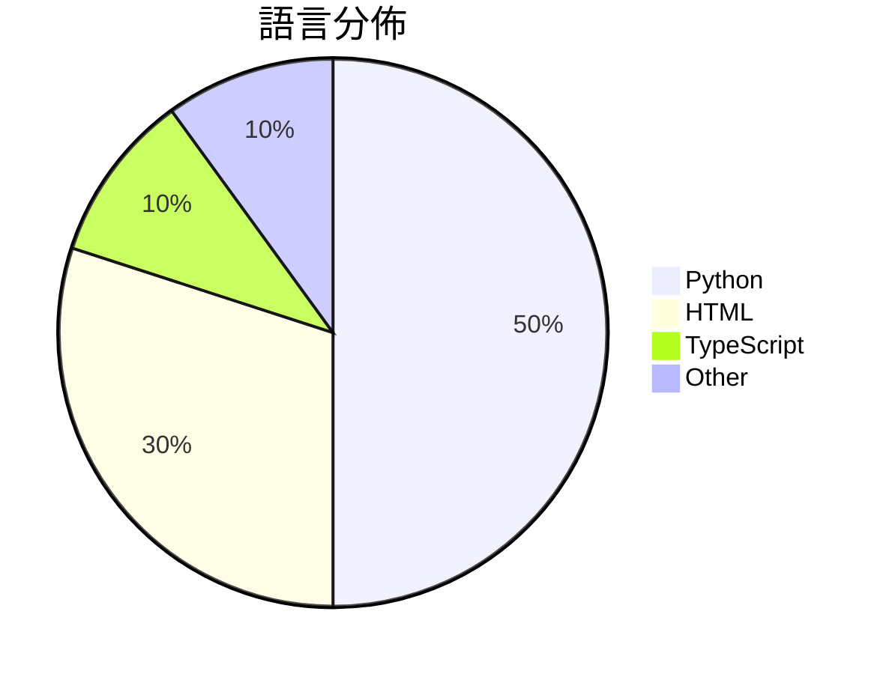

# GitHub Trending - 2026-04-23

> [!summary] 本日摘要
> 收錄 **10** 個新專案，合計 **28.9k** stars
> 語言分佈：Python (5) · HTML (3) · TypeScript (1) · Other (1)

> [!tip] 本週焦點
> **[[kyegomez--OpenMythos|kyegomez/OpenMythos]]** — 4 天內累積 8.9k stars（2.2k stars/天）
> 提供一個理論上的 Claude Mythos 架構重建，讓開發者能夠探索深度變化的推理能力。



---

## 收錄列表

| # | 專案 | 分類 | Stars | 速度 | 安裝 | 語言 | 用途 |
| :--: | --- | --- | ---: | ---: | --- | --- | --- |
| 1 | [[kyegomez--OpenMythos\|kyegomez/OpenMythos]] | AI/ML | 8.9k | 2.2k/天 | `easy` | Python | 提供一個理論上的 Claude Mythos 架構重建，讓開發者能夠探索深度變化 |
| 2 | [[browser-use--browser-harness\|browser-use/browser-harness]] | 開發工具 | 5.1k | 1.0k/天 | `easy` | Python | 提供 LLM 完成任何瀏覽器任務的自我修復框架。 |
| 3 | [[alchaincyf--huashu-design\|alchaincyf/huashu-design]] | 開發工具 | 4.5k | 1.5k/天 | `easy` | HTML | 讓設計變得簡單，透過對話生成高保真的產品原型和動畫。 |
| 4 | [[tw93--Kami\|tw93/Kami]] | 生產力 | 2.6k | 1.3k/天 | `easy` | HTML | 提供專業文件的設計系統，讓內容更具吸引力。 |
| 5 | [[EvoLinkAI--awesome-gpt-image-2-prompts\|EvoLinkAI/awesome-gpt-image-2-prompts]] | AI/ML | 1.8k | 440/天 | `medium` | Python | 收集高品質的 GPT-Image-2 提示詞和圖像範例，涵蓋肖像、海報、UI 模 |
| 6 | [[cathrynlavery--diagram-design\|cathrynlavery/diagram-design]] | 開發工具 | 1.6k | 268/天 | `easy` | HTML | 提供 14 種編輯圖表類型，讓設計師輕鬆生成符合品牌風格的圖表。 |
| 7 | [[OpenCoworkAI--open-codesign\|OpenCoworkAI/open-codesign]] | 開發工具 | 1.3k | 315/天 | `easy` | TypeScript | 提供一個開源的設計工具，讓用戶能夠將提示轉換為互動原型、簡報或行銷資產，並支持多 |
| 8 | [[VoltAgent--awesome-claude-design\|VoltAgent/awesome-claude-design]] | 開發工具 | 1.2k | 303/天 | `easy` | N/A | 提供 68 種即用設計系統靈感，快速生成完整 UI。 |
| 9 | [[wbh604--UZI-Skill\|wbh604/UZI-Skill]] | 其他 | 1.2k | 194/天 | `medium` | Python | 提供全面的股票分析，讓投資者能快速獲取多維度的市場資訊。 |
| 10 | [[the-hidden-fish--advisor-ledger\|the-hidden-fish/advisor-ledger]] | 其他 | 880 | 293/天 | `medium` | Python | 持續記錄學術黑榜的變更，保留每次編輯的歷史。 |

---

## 重點摘要

### 1. [[kyegomez--OpenMythos|kyegomez/OpenMythos]] `AI/ML`

> 提供一個理論上的 Claude Mythos 架構重建，讓開發者能夠探索深度變化的推理能力。

**8.9k** stars · **2.2k** stars/天 · Python · `easy`

_建立 4 天就累積 8886 stars（2222/天），forks 1889（21.3%），這顯示出強烈的社群參與。作者 kyegomez 在 AI 領域有一定的背景，這個專案解決了以往模型在推理深度和參數效率上的不足，特別是在多步推理的應用上。近期的推廣和討論可能也促進了這個專案的曝光度，尤其是在 Discord 社群中的活躍互動。這個工具的設計理念符合當前對於高效能推理模型的需求，特別是在處理複雜問題時的應用潛力。_

---

### 2. [[browser-use--browser-harness|browser-use/browser-harness]] `開發工具`

> 提供 LLM 完成任何瀏覽器任務的自我修復框架。

**5.1k** stars · **1.0k** stars/天 · Python · `easy`

_建立 5 天內累積 5060 stars（1012/天），forks 453（9.0%），顯示出強大的增長潛力。作者 MagMueller 和團隊在自動化和 LLM 領域有豐富經驗，這個專案解決了以往自動化工具需要大量手動配置的痛點。之前的方案如 Selenium 雖然功能強大，但往往需要繁瑣的設置和維護。這個專案的出現正好填補了這一空白，提供了一個更靈活的解決方案。社群的反饋和活躍的討論也促進了其快速成長。_

---

### 3. [[alchaincyf--huashu-design|alchaincyf/huashu-design]] `開發工具`

> 讓設計變得簡單，透過對話生成高保真的產品原型和動畫。

**4.5k** stars · **1.5k** stars/天 · HTML · `easy`

_建立 3 天就累積 4472 stars（1491/天），forks 706（15.8%），顯示出強烈的社群興趣。作者 alchaincyf 在 AI 和設計領域有豐富的經驗，這個專案解決了傳統設計工具的繁瑣操作問題，讓設計變得更高效。近期的推廣活動和社群討論也為其帶來了關注，特別是在 AI 生成設計的熱潮中，這個工具的出現正好滿足了市場需求。forks/stars 比率為 15.8%，顯示出許多開發者對其進行了實際的修改和使用。_

---

### 4. [[tw93--Kami|tw93/Kami]] `生產力`

> 提供專業文件的設計系統，讓內容更具吸引力。

**2.6k** stars · **1.3k** stars/天 · HTML · `easy`

_建立 2 天內累積 2559 stars（1279.5/天），forks 124（4.8%），這顯示出強勁的增長潛力。作者 tw93 之前也開發了 Kaku 和 Waza，這些工具在文檔生成和習慣養成上都有良好的口碑。Kami 解決了傳統文檔設計的痛點，提供了一個一致且美觀的設計系統，讓使用者能夠輕鬆生成高質量的文件。社群對於這個工具的需求明顯，尤其是在需要專業文檔的場景中。這個工具的設計理念和功能組合使其在市場上獨樹一幟，吸引了大量使用者的關注。_

---

### 5. [[EvoLinkAI--awesome-gpt-image-2-prompts|EvoLinkAI/awesome-gpt-image-2-prompts]] `AI/ML`

> 收集高品質的 GPT-Image-2 提示詞和圖像範例，涵蓋肖像、海報、UI 模擬、角色設計等。

**1.8k** stars · **440** stars/天 · Python · `medium`

_建立 4 天就累積 1761 stars（440/天），forks 154（8.7%），顯示出穩定的增長趨勢。這個專案的主要貢獻者 EvoLinkAI 之前在 AI 藝術領域有過多次成功的實驗，這使得他們能夠針對圖像生成的需求提供有效的解決方案。此專案解決了用戶在生成圖像時缺乏靈感和參考的痛點，之前的解決方案往往需要用戶自行摸索，效率低下。近期的社群討論和推廣活動也促進了這個專案的曝光率。高達 8.7% 的 forks/stars 比率顯示出許多開發者對此專案的實際修改和使用，這是活躍社群的良好指標。_

---

### 6. [[cathrynlavery--diagram-design|cathrynlavery/diagram-design]] `開發工具`

> 提供 14 種編輯圖表類型，讓設計師輕鬆生成符合品牌風格的圖表。

**1.6k** stars · **268** stars/天 · HTML · `easy`

_建立 6 天內累積 1606 stars（268/天），forks 107（6.7%），顯示出強勁的增長趨勢。專案的創建者 Cathryn Lavery 之前創辦了 BestSelf.co，並在設計和 AI 領域有豐富經驗。這個專案解決了設計師在使用通用工具時無法快速生成符合品牌的圖表的痛點，提供了一個專注於品牌一致性的解決方案。社群的積極反饋和無開放問題的狀態也顯示了其穩定性和可用性。_

---

### 7. [[OpenCoworkAI--open-codesign|OpenCoworkAI/open-codesign]] `開發工具`

> 提供一個開源的設計工具，讓用戶能夠將提示轉換為互動原型、簡報或行銷資產，並支持多種 AI 模型。

**1.3k** stars · **315** stars/天 · TypeScript · `easy`

_建立 4 天內累積 1261 stars（315/天），forks 98（7.8%），顯示出強勁的增長潛力。作者 hqhq1025 和團隊致力於提供一個開源的設計工具，解決了許多設計師在使用閉源工具時面臨的訂閱費用和數據隱私問題。這個工具的出現正好填補了市場上對於本地運行和多模型支持的需求。社群的活躍度和開放的開發模式也吸引了許多用戶的關注，特別是在設計和開發領域。_

---

### 8. [[VoltAgent--awesome-claude-design|VoltAgent/awesome-claude-design]] `開發工具`

> 提供 68 種即用設計系統靈感，快速生成完整 UI。

**1.2k** stars · **303** stars/天 · N/A · `easy`

_建立 4 天就累積 1213 stars（303/天），forks 128（10.6%），這顯示出強烈的初期興趣。作者 necatiozmen 是一位專注於設計系統的開發者，這個專案解決了設計師和開發者之間的溝通問題，讓設計可以更快地轉化為可用的 UI 元件。這種自動化的設計生成方式在市場上尚屬少見，特別是在需要快速迭代的環境中。社群的反應也顯示出對這種工具的需求，尤其是在設計和開發流程中，能夠更快速地交付產品。_

---

### 9. [[wbh604--UZI-Skill|wbh604/UZI-Skill]] `其他`

> 提供全面的股票分析，讓投資者能快速獲取多維度的市場資訊。

**1.2k** stars · **194** stars/天 · Python · `medium`

_建立 6 天內累積 1163 stars（194/天），forks 200（17.2%），顯示出強勁的增長潛力。作者 wbh604 以往專注於金融數據分析，這個專案解決了傳統股票分析工具的高成本和複雜性問題，讓更多投資者能夠輕鬆獲取所需資訊。近期的社群討論和使用者反饋也促進了其快速成長，尤其是在 A 股市場的需求上升。這個工具的成功也反映了開源金融工具的潛力，尤其是在無需付費的情況下提供高質量數據的能力。_

---

### 10. [[the-hidden-fish--advisor-ledger|the-hidden-fish/advisor-ledger]] `其他`

> 持續記錄學術黑榜的變更，保留每次編輯的歷史。

**880** stars · **293** stars/天 · Python · `medium`

_建立 3 天內累積 880 stars（293/天），forks 86（9.8%），顯示出強烈的社群關注。作者 the-hidden-fish 似乎在學術透明度方面有深入的思考，這個工具解決了以往學術黑榜缺乏持久性和可追溯性的問題。之前的解決方案往往依賴於不穩定的社群編輯，容易被刪除或修改，而這個工具則提供了一個穩定的歷史記錄。社群的反應也顯示出對這個問題的關注，尤其是在熱門 Issues 中，許多討論都圍繞著學術界的透明度和導師的信譽問題。這些因素共同推動了這個專案的快速增長。_

---

## 今日到期複習

> [!tip] 根據間隔複習排程，今天該回顧的專案

```dataview
TABLE
  stars_per_day AS "Stars/天",
  category AS "分類",
  engagement AS "參與度"
FROM "Repos"
WHERE next_review AND date(next_review) <= date("2026-04-23") AND status != "archived"
SORT priority DESC
```

## 待處理

```dataviewjs
const pending = dv.pages('"Repos"').where(p => p.status === "to-review").length;
const unrated = dv.pages('"Repos"').where(p => p.status !== "archived" && p.status !== "to-review" && (p.my_rating || 0) === 0).length;
const noVerdict = dv.pages('"Repos"').where(p => p.status !== "archived" && (p.my_rating || 0) > 0 && (!p.verdict || p.verdict === "")).length;
const items = [];
if (pending > 0) items.push(`**${pending}** 個待分流`);
if (unrated > 0) items.push(`**${unrated}** 個已讀但未評分`);
if (noVerdict > 0) items.push(`**${noVerdict}** 個已評分但無結論`);
if (items.length > 0) dv.paragraph(items.join(" / "));
else dv.paragraph("所有專案都已處理完畢！");
```
