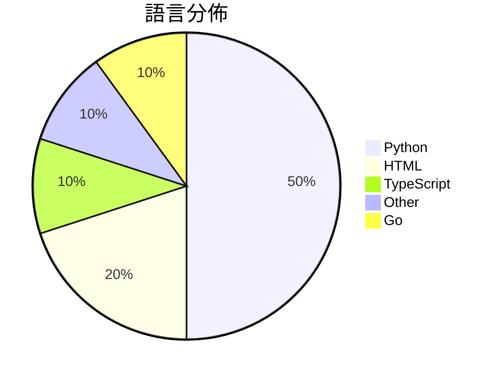

# GitHub Trending - 2026-04-24

> [!summary] 本日摘要
> 收錄 **10** 個新專案，合計 **33.0k** stars
> 語言分佈：Python (5) · HTML (2) · TypeScript (1) · Other (1) · Go (1)

> [!tip] 本週焦點
> **[[kyegomez--OpenMythos|kyegomez/OpenMythos]]** — 5 天內累積 9.7k stars（1.9k stars/天）
> 提供一個基於 Claude Mythos 架構的理論重建，讓開發者能探索深度變化推理的可能性。



---

## 收錄列表

| # | 專案 | 分類 | Stars | 速度 | 安裝 | 語言 | 用途 |
| :--: | --- | --- | ---: | ---: | --- | --- | --- |
| 1 | [[kyegomez--OpenMythos\|kyegomez/OpenMythos]] | AI/ML | 9.7k | 1.9k/天 | `easy` | Python | 提供一個基於 Claude Mythos 架構的理論重建，讓開發者能探索深度變化 |
| 2 | [[browser-use--browser-harness\|browser-use/browser-harness]] | 開發工具 | 5.9k | 987/天 | `medium` | Python | 提供 LLM 完成任何瀏覽器任務的自我修復工具。 |
| 3 | [[alchaincyf--huashu-design\|alchaincyf/huashu-design]] | 開發工具 | 5.5k | 1.4k/天 | `easy` | HTML | 讓設計變得簡單，只需一句話即可生成高保真原型和動畫。 |
| 4 | [[tw93--Kami\|tw93/Kami]] | 開發工具 | 2.9k | 966/天 | `easy` | HTML | 提供一個設計系統，讓 AI 生成的文件擁有一致且專業的排版。 |
| 5 | [[EvoLinkAI--awesome-gpt-image-2-prompts\|EvoLinkAI/awesome-gpt-image-2-prompts]] | AI/ML | 2.7k | 547/天 | `easy` | Python | 提供高品質的 GPT-Image-2 提示詞和圖像範例，幫助用戶生成各類圖像。 |
| 6 | [[OpenCoworkAI--open-codesign\|OpenCoworkAI/open-codesign]] | 開發工具 | 1.9k | 380/天 | `easy` | TypeScript | 提供一個開源的 Claude 設計替代方案，讓使用者可以快速將提示轉換為原型、簡 |
| 7 | [[VoltAgent--awesome-claude-design\|VoltAgent/awesome-claude-design]] | 開發工具 | 1.4k | 282/天 | `easy` | N/A | 提供 68 種即用型設計系統靈感，讓你快速生成完整的 UI。 |
| 8 | [[the-hidden-fish--advisor-ledger\|the-hidden-fish/advisor-ledger]] | 其他 | 1.0k | 256/天 | `medium` | Python | 持續監控並記錄學術黑榜的變更，防止重要資訊被刪除。 |
| 9 | [[openai--privacy-filter\|openai/privacy-filter]] |  | 959 | 160/天 |  | Python | OpenAI Privacy Filter |
| 10 | [[432539--gpt2api\|432539/gpt2api]] | 開發工具 | 931 | 186/天 | `medium` | Go | 提供一個兼容 OpenAI 的 SaaS 網關，支持多帳號池和高並發調度，專注於 |

---

## 重點摘要

### 1. [[kyegomez--OpenMythos|kyegomez/OpenMythos]] `AI/ML`

> 提供一個基於 Claude Mythos 架構的理論重建，讓開發者能探索深度變化推理的可能性。

**9.7k** stars · **1.9k** stars/天 · Python · `easy`

_建立 5 天就累積 9725 stars（1945/天），forks 2119（21.8%），顯示出強烈的社群參與。作者 kyegomez 在 AI 領域有著豐富的背景，這個專案解決了在推理深度和參數效率之間的平衡問題，之前的模型往往在推理深度上無法有效擴展。這個專案的成功可能受到社群對於新型推理模型的高度興趣和討論的推動，尤其是在 Discord 上的活躍交流。技術上，隨著深度學習框架的進步，這種模型的實現變得可行，特別是 PyTorch 和 JAX 的使用使得開發者能夠快速實驗和調整模型。高達 21.8% 的 forks/stars 比率表明，許多人在實際修改和使用這個專案。_

---

### 2. [[browser-use--browser-harness|browser-use/browser-harness]] `開發工具`

> 提供 LLM 完成任何瀏覽器任務的自我修復工具。

**5.9k** stars · **987** stars/天 · Python · `medium`

_建立 6 天內累積 5921 stars（987/天），forks 521（8.8%），顯示出強勁的增長潛力。這個專案的主要貢獻者來自於不同背景，顯示出多樣的開發者社群。它解決了傳統瀏覽器自動化工具在靈活性和即時性方面的不足，特別是在需要動態生成功能的情境下。這種自我修復的能力是之前工具所缺乏的，讓 LLM 能夠在執行過程中即時調整。社群的活躍度和開放的貢獻方式也吸引了許多開發者參與。這個工具的設計理念符合當前對於自動化和智能化的需求，並且在技術上具有創新性。_

---

### 3. [[alchaincyf--huashu-design|alchaincyf/huashu-design]] `開發工具`

> 讓設計變得簡單，只需一句話即可生成高保真原型和動畫。

**5.5k** stars · **1.4k** stars/天 · HTML · `easy`

_建立 4 天內累積 5466 stars（1367/天），forks 848（15.5%），顯示出強勁的增長勢頭。作者 alchaincyf 是一位獨立開發者，過去有成功的作品如小貓補光燈，這為其新專案增添了信譽。Huashu Design 解決了設計生成過程中的繁瑣步驟，讓用戶能夠快速獲得高質量的設計，這在市場上是相對缺乏的。社群的反饋也顯示出對於這種簡化設計流程的需求，尤其是在 AI 工具日益普及的背景下。forks/stars 比率為 15.5%，顯示出有相當比例的用戶在實際修改和使用這個工具。_

---

### 4. [[tw93--Kami|tw93/Kami]] `開發工具`

> 提供一個設計系統，讓 AI 生成的文件擁有一致且專業的排版。

**2.9k** stars · **966** stars/天 · HTML · `easy`

_建立 3 天內累積 2897 stars（966/天），forks 140（4.8%），顯示出強勁的增長潛力。作者 tw93 在開源社群中活躍，之前開發過 Kaku 和 Waza，這些工具都聚焦於提高工作效率。Kami 解決了 AI 生成文件排版不一致的痛點，這在當前 AI 文檔生成的潮流中非常重要。社群的反饋和支持使得這個專案快速成長，並且在短時間內獲得了大量關注。_

---

### 5. [[EvoLinkAI--awesome-gpt-image-2-prompts|EvoLinkAI/awesome-gpt-image-2-prompts]] `AI/ML`

> 提供高品質的 GPT-Image-2 提示詞和圖像範例，幫助用戶生成各類圖像。

**2.7k** stars · **547** stars/天 · Python · `easy`

_建立 5 天內累積 2734 stars（547/天），forks 237（8.7%），這顯示出相對活躍的使用者參與。作者 EvoLinkAI 之前在生成式 AI 領域有一定的經驗，這個專案解決了用戶在生成圖像時缺乏靈感和範例的痛點。這個專案的推出可能受到社群對於生成式 AI 需求增加的影響，並且提供了一個集中式的提示詞庫，讓用戶能夠更有效率地使用 GPT-Image-2。這樣的工具在設計和開發社群中有著廣泛的應用潛力，尤其是在需要快速生成視覺內容的情況下。_

---

### 6. [[OpenCoworkAI--open-codesign|OpenCoworkAI/open-codesign]] `開發工具`

> 提供一個開源的 Claude 設計替代方案，讓使用者可以快速將提示轉換為原型、簡報或 PDF。

**1.9k** stars · **380** stars/天 · TypeScript · `easy`

_建立 5 天內累積 1902 stars（380/天），forks 143（7.5%），顯示出強勁的增長勢頭。這個專案的主要貢獻者來自多個背景，顯示出強大的社群支持。它解決了設計工具的雲端依賴問題，提供了一個本地運行的解決方案，讓使用者能夠自由選擇模型。此專案的推出正好滿足了市場對開源和本地化設計工具的需求，並且在社群中引發了討論和關注。forks/stars 比率為 7.5%，顯示出許多人對此專案的實際修改和使用。這些因素共同推動了其快速增長。_

---

### 7. [[VoltAgent--awesome-claude-design|VoltAgent/awesome-claude-design]] `開發工具`

> 提供 68 種即用型設計系統靈感，讓你快速生成完整的 UI。

**1.4k** stars · **282** stars/天 · N/A · `easy`

_建立 5 天內累積 1412 stars（282/天），forks 149（10.6%），這顯示出強烈的興趣和需求。這個專案的主要貢獻者是 necatiozmen，過去在設計和 AI 領域有一定的經驗。它解決了設計過程中的繁瑣手動設定問題，讓設計師能夠專注於創意而非技術細節。近期的推廣活動可能也促進了這個專案的曝光度，吸引了許多設計師和開發者的注意。隨著設計系統和快速原型設計的需求上升，這個工具的出現正好符合市場需求。forks/stars 比率為 10.6%，顯示出不少人對這個專案有實際的修改和使用意圖。_

---

### 8. [[the-hidden-fish--advisor-ledger|the-hidden-fish/advisor-ledger]] `其他`

> 持續監控並記錄學術黑榜的變更，防止重要資訊被刪除。

**1.0k** stars · **256** stars/天 · Python · `medium`

_建立 4 天就累積 1025 stars（256/天），forks 97（9.5%），顯示出強烈的社群興趣。作者 the-hidden-fish 是一位活躍的開發者，專注於學術透明度的工具開發。這個專案解決了學術界對於導師評價透明度不足的問題，過去的解決方案往往無法保留編輯歷史，導致重要資訊的遺失。近期的社群討論和反饋也促進了這個專案的曝光和使用。隨著學術界對於透明度的需求增加，這個工具的實用性和必要性也隨之上升。_

---

### 9. [[openai--privacy-filter|openai/privacy-filter]]

**959** stars · **160** stars/天 · Python

---

### 10. [[432539--gpt2api|432539/gpt2api]] `開發工具`

> 提供一個兼容 OpenAI 的 SaaS 網關，支持多帳號池和高並發調度，專注於圖片生成服務。

**931** stars · **186** stars/天 · Go · `medium`

_建立 5 天內累積 931 stars（186/天），forks 238（25.6%），顯示出高關注度。作者 432539 在開源社群中活躍，解決了多帳號管理和高並發調度的痛點，這在現有的 AI 服務中是較為稀缺的。專案的推出正好填補了市場上對於高效、可擴展的 AI 服務網關的需求，尤其是在圖片生成方面。社群的反饋和需求也促進了專案的快速成長，顯示出其潛在的市場價值。_

---

## 今日到期複習

> [!tip] 根據間隔複習排程，今天該回顧的專案

```dataview
TABLE
  stars_per_day AS "Stars/天",
  category AS "分類",
  engagement AS "參與度"
FROM "Repos"
WHERE next_review AND date(next_review) <= date("2026-04-24") AND status != "archived"
SORT priority DESC
```

## 待處理

```dataviewjs
const pending = dv.pages('"Repos"').where(p => p.status === "to-review").length;
const unrated = dv.pages('"Repos"').where(p => p.status !== "archived" && p.status !== "to-review" && (p.my_rating || 0) === 0).length;
const noVerdict = dv.pages('"Repos"').where(p => p.status !== "archived" && (p.my_rating || 0) > 0 && (!p.verdict || p.verdict === "")).length;
const items = [];
if (pending > 0) items.push(`**${pending}** 個待分流`);
if (unrated > 0) items.push(`**${unrated}** 個已讀但未評分`);
if (noVerdict > 0) items.push(`**${noVerdict}** 個已評分但無結論`);
if (items.length > 0) dv.paragraph(items.join(" / "));
else dv.paragraph("所有專案都已處理完畢！");
```
