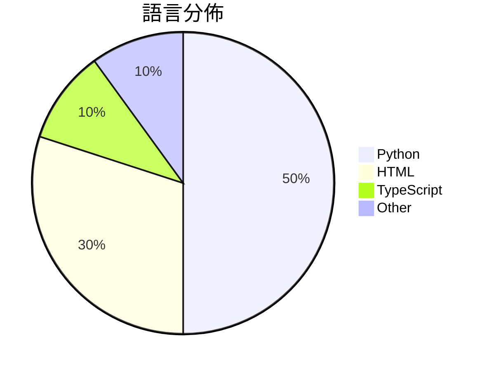

# GitHub Trending - 2026-04-25

> [!summary] 本日摘要
> 收錄 **10** 個新專案，合計 **31.3k** stars
> 語言分佈：Python (5) · HTML (3) · TypeScript (1) · Other (1)

> [!tip] 本週焦點
> **[[kyegomez--OpenMythos|kyegomez/OpenMythos]]** — 6 天內累積 10.1k stars（1.7k stars/天）
> 提供一個基於 Claude Mythos 架構的理論重建，讓開發者能夠探索深度變化推理的可能性。



---

## 收錄列表

| # | 專案 | 分類 | Stars | 速度 | 安裝 | 語言 | 用途 |
| :--: | --- | --- | ---: | ---: | --- | --- | --- |
| 1 | [[kyegomez--OpenMythos\|kyegomez/OpenMythos]] | AI/ML | 10.1k | 1.7k/天 | `easy` | Python | 提供一個基於 Claude Mythos 架構的理論重建，讓開發者能夠探索深度變 |
| 2 | [[alchaincyf--huashu-design\|alchaincyf/huashu-design]] | 開發工具 | 6.1k | 1.2k/天 | `easy` | HTML | 讓設計變得簡單，只需一句話即可生成高品質的產品原型和動畫。 |
| 3 | [[EvoLinkAI--awesome-gpt-image-2-prompts\|EvoLinkAI/awesome-gpt-image-2-prompts]] | AI/ML | 3.2k | 541/天 | `medium` | Python | 提供高品質的 GPT-Image-2 提示詞和圖像範例，幫助用戶生成各類圖像。 |
| 4 | [[tw93--Kami\|tw93/Kami]] | 開發工具 | 3.0k | 763/天 | `easy` | HTML | 提供一致且專業的文件設計系統，讓 AI 生成的文件不再平淡無奇。 |
| 5 | [[OpenCoworkAI--open-codesign\|OpenCoworkAI/open-codesign]] | 開發工具 | 2.2k | 364/天 | `easy` | TypeScript | 提供一個開源的設計工具，讓用戶能夠快速將提示轉換為原型、簡報或行銷資產。 |
| 6 | [[op7418--guizang-ppt-skill\|op7418/guizang-ppt-skill]] | 開發工具 | 1.9k | 1.9k/天 | `easy` | HTML | 將提示轉換為橫向滑動的雜誌風格 HTML 演示文稿，提供 10 種佈局和 5 種 |
| 7 | [[VoltAgent--awesome-claude-design\|VoltAgent/awesome-claude-design]] | 開發工具 | 1.5k | 253/天 | `easy` | N/A | 提供 68 種即用型設計系統靈感，讓你快速生成完整 UI。 |
| 8 | [[deepseek-ai--TileKernels\|deepseek-ai/TileKernels]] | AI/ML | 1.1k | 536/天 | `easy` | Python | 提供針對 LLM 操作的優化 GPU 核心，使用 TileLang 開發。 |
| 9 | [[the-hidden-fish--advisor-ledger\|the-hidden-fish/advisor-ledger]] | 其他 | 1.1k | 212/天 | `medium` | Python | 透過定期抓取學術黑榜文檔，保留每次編輯的歷史記錄，避免重要資訊被隱藏。 |
| 10 | [[masterking32--MasterHttpRelayVPN\|masterking32/MasterHttpRelayVPN]] | 安全 | 1.1k | 263/天 | `easy` | Python | 透過 Google Apps Script 隱藏流量，實現 HTTP/SOCKS |

---

## 重點摘要

### 1. [[kyegomez--OpenMythos|kyegomez/OpenMythos]] `AI/ML`

> 提供一個基於 Claude Mythos 架構的理論重建，讓開發者能夠探索深度變化推理的可能性。

**10.1k** stars · **1.7k** stars/天 · Python · `easy`

_建立 6 天就累積 10114 stars（1686/天），forks 2234（22.1%），這顯示出強烈的社群參與。作者 kyegomez 在 AI 和深度學習領域有豐富的經驗，這個專案解決了傳統 Transformer 在深度推理上的不足，特別是在處理複雜問題時的表現。近期的推文和討論也引發了關注，尤其是在 AI 研究社群中。隨著對更高效模型的需求增加，這個工具的出現正好填補了市場的空白。高達 22.1% 的 forks/stars 比率顯示許多人正在積極修改和使用這個專案。_

---

### 2. [[alchaincyf--huashu-design|alchaincyf/huashu-design]] `開發工具`

> 讓設計變得簡單，只需一句話即可生成高品質的產品原型和動畫。

**6.1k** stars · **1.2k** stars/天 · HTML · `easy`

_建立 5 天內累積 6096 stars（1219/天），forks 939（15.4%），顯示出強大的社群關注度。作者 alchaincyf 是一位獨立開發者，過去有多個成功的開源項目，這次的 Huashu Design 解決了設計過程中需要大量手動操作的痛點，讓設計師能夠更專注於創意而非工具操作。社群對於這種無需圖形介面的設計工具反應熱烈，特別是在快速迭代的產品開發環境中。這個工具的出現正好符合了當前對於高效設計工具的需求，並且其跨 Agent 的特性使得它在多種工作流中都能輕鬆整合。_

---

### 3. [[EvoLinkAI--awesome-gpt-image-2-prompts|EvoLinkAI/awesome-gpt-image-2-prompts]] `AI/ML`

> 提供高品質的 GPT-Image-2 提示詞和圖像範例，幫助用戶生成各類圖像。

**3.2k** stars · **541** stars/天 · Python · `medium`

_建立 6 天內累積 3244 stars（541/天），forks 292（9.0%），顯示出強勁的增長潛力。作者 EvoLinkAI 過去專注於生成式 AI 的應用，這個專案解決了用戶在使用 GPT-Image-2 時缺乏高品質提示詞的痛點，讓用戶能更輕鬆地生成所需的圖像。社群的反應可能受到社交媒體上的分享和討論影響，尤其是在創作者社群中。隨著生成式 AI 技術的進步，這個工具的實用性和需求也隨之提高。forks/stars 比率為 9.0%，顯示出許多用戶對這個專案進行了實際的修改和使用，這是一個積極的信號。_

---

### 4. [[tw93--Kami|tw93/Kami]] `開發工具`

> 提供一致且專業的文件設計系統，讓 AI 生成的文件不再平淡無奇。

**3.0k** stars · **763** stars/天 · HTML · `easy`

_建立 4 天就累積 3050 stars（763/天），forks 150（4.9%），這顯示出強勁的增長潛力。作者 tw93 之前開發了 Kaku 和 Waza，這些工具已經在社群中獲得良好反響。Kami 解決了 AI 生成文件的風格不一致問題，這在過去的工具中並未得到有效處理。最近的推廣活動和社群討論也為其增添了曝光率。技術上，Kami 的設計系統使得生成的文件更具吸引力，這在市場上是個明顯的優勢。forks/stars 比率接近 5%，顯示出許多人在實際修改和使用這個工具。_

---

### 5. [[OpenCoworkAI--open-codesign|OpenCoworkAI/open-codesign]] `開發工具`

> 提供一個開源的設計工具，讓用戶能夠快速將提示轉換為原型、簡報或行銷資產。

**2.2k** stars · **364** stars/天 · TypeScript · `easy`

_建立 6 天內累積 2186 stars（364/天），forks 175（8.0%），顯示出強勁的增長潛力。這個專案的作者來自於一個活躍的開源社群，致力於提供一個無需訂閱的設計工具，解決了許多設計師在使用傳統工具時面臨的雲端依賴和成本問題。近期的推廣和社群討論也可能促進了這個專案的曝光率。技術上，隨著本地運行和多模型支持的需求增加，這個工具的可行性和吸引力也隨之上升。高達 8.0% 的 forks/stars 比率顯示出許多開發者對這個專案的實際修改和使用。_

---

### 6. [[op7418--guizang-ppt-skill|op7418/guizang-ppt-skill]] `開發工具`

> 將提示轉換為橫向滑動的雜誌風格 HTML 演示文稿，提供 10 種佈局和 5 種主題。

**1.9k** stars · **1.9k** stars/天 · HTML · `easy`

_建立 1 天就累積 1942 stars（1942/天），forks 235（12.1%），這顯示出強烈的興趣和需求。作者 nocoo 在 AI 和技能開發領域有一定的經驗，這個專案解決了傳統 PPT 工具在美學和個性化方面的不足。沒有明確的觸發事件，但其獨特的設計理念和簡便的使用流程吸引了許多使用者。技術上，WebGL 的使用讓這個工具在視覺效果上更具吸引力，並且降低了使用門檻。高達 12.1% 的 forks/stars 比率顯示出許多開發者對此專案的實際修改和使用，這表明其在社群中的活躍度。_

---

### 7. [[VoltAgent--awesome-claude-design|VoltAgent/awesome-claude-design]] `開發工具`

> 提供 68 種即用型設計系統靈感，讓你快速生成完整 UI。

**1.5k** stars · **253** stars/天 · N/A · `easy`

_建立 6 天內累積 1519 stars（253/天），forks 165（10.9%），顯示出強勁的增長潛力。這個專案的作者 necatiozmen 之前有過其他設計相關的貢獻，這次的專案解決了設計系統生成的痛點，讓使用者能夠快速生成 UI，而不需要手動設置。沒有明顯的觸發事件，但設計自動化的需求在社群中逐漸上升，尤其是對於小型團隊和個人開發者來說。高達 10.9% 的 forks/stars 比率顯示出許多人對這個工具的實際應用感興趣，可能會進行修改或擴展。_

---

### 8. [[deepseek-ai--TileKernels|deepseek-ai/TileKernels]] `AI/ML`

> 提供針對 LLM 操作的優化 GPU 核心，使用 TileLang 開發。

**1.1k** stars · **536** stars/天 · Python · `easy`

_建立 2 天就累積 1072 stars（536/天），forks 79（7.4%），這顯示出高需求的潛力。這個專案由多位開發者共同維護，且其核心功能針對 LLM 操作進行了優化，解決了現有 GPU 核心庫在性能和開發靈活性上的不足。特別是 TileLang 的使用，使得開發者能夠更快速地進行高效能計算的開發。社群的反應也顯示出對於這個工具的興趣，尤其是在 AI 領域的應用。這些因素共同推動了專案的快速增長。_

---

### 9. [[the-hidden-fish--advisor-ledger|the-hidden-fish/advisor-ledger]] `其他`

> 透過定期抓取學術黑榜文檔，保留每次編輯的歷史記錄，避免重要資訊被隱藏。

**1.1k** stars · **212** stars/天 · Python · `medium`

_建立 5 天內累積 1059 stars（212/天），forks 100（9.4%），顯示出強烈的社群關注。作者 the-hidden-fish 以其對學術透明度的關注而聞名，這個專案解決了學術界對於不當行為缺乏透明度的痛點，過去的解決方案往往無法持續追蹤變更。近期的社群討論和推文也引發了對於學術黑榜的廣泛關注，特別是在 PhD 和 Postdoc 的評價問題上。這個工具的出現正好契合了對於學術誠信的需求，並且其自動化的特性使得這一過程變得更加高效。_

---

### 10. [[masterking32--MasterHttpRelayVPN|masterking32/MasterHttpRelayVPN]] `安全`

> 透過 Google Apps Script 隱藏流量，實現 HTTP/SOCKS5 代理，並支持 MITM TLS 攔截和 HTTP/1-2 多路復用。

**1.1k** stars · **263** stars/天 · Python · `easy`

_建立 4 天就累積 1053 stars（263/天），forks 104（9.9%），這顯示出強烈的使用需求。作者 masterking32 及其團隊在開源社群中已有一定影響力，這個專案解決了用戶在無法自由訪問網絡時的痛點，特別是在高 DPI 檢測的環境中。隨著對隱私和自由上網需求的增加，這個工具的出現正好滿足了這一需求。高 forks/stars 比率顯示出許多人在實際修改和使用這個工具，而非僅僅觀望。_

---

## 今日到期複習

> [!tip] 根據間隔複習排程，今天該回顧的專案

```dataview
TABLE
  stars_per_day AS "Stars/天",
  category AS "分類",
  engagement AS "參與度"
FROM "Repos"
WHERE next_review AND date(next_review) <= date("2026-04-25") AND status != "archived"
SORT priority DESC
```

## 待處理

```dataviewjs
const pending = dv.pages('"Repos"').where(p => p.status === "to-review").length;
const unrated = dv.pages('"Repos"').where(p => p.status !== "archived" && p.status !== "to-review" && (p.my_rating || 0) === 0).length;
const noVerdict = dv.pages('"Repos"').where(p => p.status !== "archived" && (p.my_rating || 0) > 0 && (!p.verdict || p.verdict === "")).length;
const items = [];
if (pending > 0) items.push(`**${pending}** 個待分流`);
if (unrated > 0) items.push(`**${unrated}** 個已讀但未評分`);
if (noVerdict > 0) items.push(`**${noVerdict}** 個已評分但無結論`);
if (items.length > 0) dv.paragraph(items.join(" / "));
else dv.paragraph("所有專案都已處理完畢！");
```
