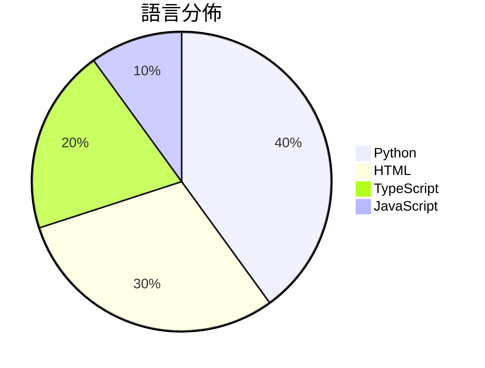

# GitHub Trending - 2026-04-26

> [!summary] 本日摘要
> 收錄 **10** 個新專案，合計 **20.5k** stars
> 語言分佈：Python (4) · HTML (3) · TypeScript (2) · JavaScript (1)

> [!tip] 本週焦點
> **[[alchaincyf--huashu-design|alchaincyf/huashu-design]]** — 6 天內累積 6.5k stars（1.1k stars/天）
> 讓 AI 自動生成高保真設計，從產品動畫到可編輯的 PPT，無需圖形介面。



---

## 收錄列表

| # | 專案 | 分類 | Stars | 速度 | 安裝 | 語言 | 用途 |
| :--: | --- | --- | ---: | ---: | --- | --- | --- |
| 1 | [[alchaincyf--huashu-design\|alchaincyf/huashu-design]] | 開發工具 | 6.5k | 1.1k/天 | `easy` | HTML | 讓 AI 自動生成高保真設計，從產品動畫到可編輯的 PPT，無需圖形介面。 |
| 2 | [[tw93--Kami\|tw93/Kami]] | 開發工具 | 3.3k | 652/天 | `easy` | HTML | 提供一致且美觀的文件設計系統，讓 AI 生成的文件不再平淡無奇。 |
| 3 | [[op7418--guizang-ppt-skill\|op7418/guizang-ppt-skill]] | 其他 | 2.7k | 1.4k/天 | `easy` | HTML | 將提示轉換為橫向翻頁的雜誌風格 HTML 簡報，提供多種佈局和主題選擇。 |
| 4 | [[masterking32--MasterHttpRelayVPN\|masterking32/MasterHttpRelayVPN]] | 安全 | 1.2k | 249/天 | `easy` | Python | 透過 Google Apps Script 隱藏流量的 HTTP/SOCKS5  |
| 5 | [[ConardLi--garden-skills\|ConardLi/garden-skills]] | 開發工具 | 1.2k | 310/天 | `medium` | JavaScript | 提供多種 AI 代理技能的開源集合，涵蓋網頁設計、知識檢索、影像生成等功能。 |
| 6 | [[deepseek-ai--TileKernels\|deepseek-ai/TileKernels]] | AI/ML | 1.2k | 387/天 | `medium` | Python | 提供針對 LLM 操作的優化 GPU 核心，使用 TileLang 實現。 |
| 7 | [[Einsia--OpenChronicle\|Einsia/OpenChronicle]] | AI/ML | 1.1k | 282/天 | `medium` | Python | 提供一個本地優先的記憶系統，讓 LLM 代理能夠捕捉和管理工作上下文。 |
| 8 | [[cosmicstack-labs--mercury-agent\|cosmicstack-labs/mercury-agent]] | AI/ML | 1.1k | 223/天 | `easy` | TypeScript | 提供一個具備持久記憶和多通道訪問的 AI 助手，能夠在 CLI 或 Telegr |
| 9 | [[leigest519--OpenGame\|leigest519/OpenGame]] | 開發工具 | 1.1k | 218/天 | `medium` | TypeScript | 提供一個開源框架，讓使用者能從提示創建完整的網頁遊戲。 |
| 10 | [[the-hidden-fish--advisor-ledger\|the-hidden-fish/advisor-ledger]] | 其他 | 1.1k | 179/天 | `medium` | Python | 持續監控並記錄學術黑榜的變更，保留所有編輯歷史。 |

---

## 重點摘要

### 1. [[alchaincyf--huashu-design|alchaincyf/huashu-design]] `開發工具`

> 讓 AI 自動生成高保真設計，從產品動畫到可編輯的 PPT，無需圖形介面。

**6.5k** stars · **1.1k** stars/天 · HTML · `easy`

_建立 6 天內累積 6518 stars（1086/天），forks 992（15.2%），顯示出極高的關注度。作者 alchaincyf 是一位獨立開發者，過去有多個成功的開源專案，這使得該專案受到信任。Huashu Design 解決了傳統設計工具操作繁瑣的痛點，讓使用者能夠在不需要圖形介面的情況下，快速生成設計，這在當前快速迭代的產品開發環境中尤為重要。社群對於這種新型設計方式的興趣也促進了其快速增長。這個工具的出現正好契合了對於高效設計需求的變化，並且提供了一種全新的工作流選擇。_

---

### 2. [[tw93--Kami|tw93/Kami]] `開發工具`

> 提供一致且美觀的文件設計系統，讓 AI 生成的文件不再平淡無奇。

**3.3k** stars · **652** stars/天 · HTML · `easy`

_建立 5 天就累積 3262 stars（652/天），forks 168（5.2%），顯示出穩定的增長潛力。該專案由 tw93 等人開發，他們在文件設計和 AI 工具整合方面有豐富經驗。Kami 解決了 AI 生成文件的格式化問題，之前的方案往往缺乏一致性和美感。最近的推廣活動和社交媒體分享可能也促進了其知名度的提升。技術上，Kami 的設計系統利用了 SVG 圖表和統一的排版規則，這在目前的文件生成工具中是相對少見的。forks/stars 比率顯示出使用者對其功能的實際需求，表明許多人在積極修改和使用這個工具。_

---

### 3. [[op7418--guizang-ppt-skill|op7418/guizang-ppt-skill]] `其他`

> 將提示轉換為橫向翻頁的雜誌風格 HTML 簡報，提供多種佈局和主題選擇。

**2.7k** stars · **1.4k** stars/天 · HTML · `easy`

_建立 2 天就累積 2704 stars（1352/天），forks 298（11.0%），顯示出強烈的使用需求。作者 OthmanAdi 和 nocoo 具有豐富的開發背景，之前參與過多個開源專案。這個專案解決了傳統簡報工具在視覺設計上的不足，提供了一個更具創意的選擇。短時間內的高關注度可能與社群對於新型簡報工具的需求增加有關，特別是在個人化和視覺美學方面。forks/stars 比率為 11.0%，顯示出使用者對此專案的實際修改和使用意願較高。_

---

### 4. [[masterking32--MasterHttpRelayVPN|masterking32/MasterHttpRelayVPN]] `安全`

> 透過 Google Apps Script 隱藏流量的 HTTP/SOCKS5 代理工具，實現 MITM TLS 攔截和 DPI 逃避。

**1.2k** stars · **249** stars/天 · Python · `easy`

_建立 5 天內累積 1246 stars（249/天），forks 121（9.7%），顯示出強勁的增長潛力。作者 masterking32 和貢獻者們在開源社群中有一定的影響力，且這個工具解決了在高過濾環境中無法自由上網的痛點。之前的解決方案往往需要 VPS 或其他伺服器，這使得許多用戶無法輕易使用。這個工具的出現，正好填補了這一需求。社群的活躍度和反饋也促進了其快速成長。_

---

### 5. [[ConardLi--garden-skills|ConardLi/garden-skills]] `開發工具`

> 提供多種 AI 代理技能的開源集合，涵蓋網頁設計、知識檢索、影像生成等功能。

**1.2k** stars · **310** stars/天 · JavaScript · `medium`

_建立 4 天就累積 1238 stars（310/天），forks 233（18.8%），這顯示出相對高的參與度。作者 ConardLi 之前在開源社群中活躍，這個專案解決了 AI 代理技能整合的痛點，讓開發者能夠快速使用和擴展技能。近期的推廣活動和社群討論也可能促進了這個專案的曝光。技術生態的發展，特別是 AI 代理的興起，使得這個工具的需求增加。高達 18.8% 的 forks/stars 比率顯示出許多人在實際使用和修改這個專案。_

---

### 6. [[deepseek-ai--TileKernels|deepseek-ai/TileKernels]] `AI/ML`

> 提供針對 LLM 操作的優化 GPU 核心，使用 TileLang 實現。

**1.2k** stars · **387** stars/天 · Python · `medium`

_建立 3 天內累積 1160 stars（387/天），forks 89（7.7%），顯示出強烈的興趣。這個專案的主要貢獻者來自 DeepSeek 團隊，專注於開發高效能的 GPU 核心，解決了在 LLM 操作中性能不足的痛點。之前的解決方案往往缺乏針對性，無法充分利用 GPU 的計算能力，TileKernels 的出現填補了這一空白。社群的反饋和活躍度也顯示出使用者對於這個專案的期待，尤其是在高效能計算領域的需求日益增加。_

---

### 7. [[Einsia--OpenChronicle|Einsia/OpenChronicle]] `AI/ML`

> 提供一個本地優先的記憶系統，讓 LLM 代理能夠捕捉和管理工作上下文。

**1.1k** stars · **282** stars/天 · Python · `medium`

_建立 4 天內累積 1126 stars（282/天），forks 57（5.1%），顯示出穩定的增長趨勢。這個專案的主要貢獻者包括 Xiao-ao-jiang-hu 和 KMing-L，他們在開源社群中有一定的影響力。OpenChronicle 解決了現有記憶系統的封閉性和不透明性，提供了一個開放且可擴展的替代方案。這一點在當前對於 AI 代理的需求日益增加的背景下尤為重要。社群對於本地記憶系統的需求也在不斷上升，尤其是在隱私和數據控制方面的考量。forks/stars 比率為 5.1%，顯示出一定的實際使用和修改需求，這對於新專案來說是個良好的指標。_

---

### 8. [[cosmicstack-labs--mercury-agent|cosmicstack-labs/mercury-agent]] `AI/ML`

> 提供一個具備持久記憶和多通道訪問的 AI 助手，能夠在 CLI 或 Telegram 上運行。

**1.1k** stars · **223** stars/天 · TypeScript · `easy`

_建立 5 天內累積 1117 stars（223/天），forks 127（11.4%），顯示出強勁的增長潛力。這個專案的主要貢獻者來自 Cosmic Stack，過去在 AI 領域有一定的經驗。Mercury 解決了許多 AI 助手在安全性和持久記憶上的痛點，傳統的助手往往無法記住用戶的偏好或在執行命令前詢問用戶。這樣的設計使得 Mercury 在市場上獨樹一幟。社群的活躍度也顯示出使用者對於這個工具的關注，尤其是在 Telegram 和 CLI 的整合方面。這些因素共同促成了 Mercury 的快速成長。_

---

### 9. [[leigest519--OpenGame|leigest519/OpenGame]] `開發工具`

> 提供一個開源框架，讓使用者能從提示創建完整的網頁遊戲。

**1.1k** stars · **218** stars/天 · TypeScript · `medium`

_建立 5 天內累積 1088 stars（218/天），forks 129（11.9%），顯示出強勁的初期增長。這個專案的主要貢獻者來自 CUHK MMLab，這是一個在 AI 和遊戲開發領域有實力的團隊。OpenGame 解決了以往遊戲開發中，從高層次設計到實際可玩遊戲的過程中存在的多種問題，特別是在邏輯一致性和多文件管理上。這個框架的推出正好迎合了對於自動化遊戲開發需求的增長，並且在社群中引起了廣泛的討論，尤其是在 Hugging Face 上的相關發布。這些因素共同促成了 OpenGame 的快速增長。_

---

### 10. [[the-hidden-fish--advisor-ledger|the-hidden-fish/advisor-ledger]] `其他`

> 持續監控並記錄學術黑榜的變更，保留所有編輯歷史。

**1.1k** stars · **179** stars/天 · Python · `medium`

_建立 6 天內累積 1075 stars（179/天），forks 100（9.3%），顯示出強烈的社群關注。作者 the-hidden-fish 透過這個專案解決了學術界對於導師評價透明度不足的問題，提供了一個持續更新的黑榜資料庫。這個工具的出現正好填補了學術界對於導師評價的需求，特別是在選擇導師時的資訊不對稱。社群的反應熱烈，尤其是針對 PhD/Postdoc 的討論，顯示出這個問題的普遍性和迫切性。這個工具的可行性也得益於現有的 Google Doc 及 GitHub 的生態系統，讓資料的抓取和版本控制變得簡單。_

---

## 今日到期複習

> [!tip] 根據間隔複習排程，今天該回顧的專案

```dataview
TABLE
  stars_per_day AS "Stars/天",
  category AS "分類",
  engagement AS "參與度"
FROM "Repos"
WHERE next_review AND date(next_review) <= date("2026-04-26") AND status != "archived"
SORT priority DESC
```

## 待處理

```dataviewjs
const pending = dv.pages('"Repos"').where(p => p.status === "to-review").length;
const unrated = dv.pages('"Repos"').where(p => p.status !== "archived" && p.status !== "to-review" && (p.my_rating || 0) === 0).length;
const noVerdict = dv.pages('"Repos"').where(p => p.status !== "archived" && (p.my_rating || 0) > 0 && (!p.verdict || p.verdict === "")).length;
const items = [];
if (pending > 0) items.push(`**${pending}** 個待分流`);
if (unrated > 0) items.push(`**${unrated}** 個已讀但未評分`);
if (noVerdict > 0) items.push(`**${noVerdict}** 個已評分但無結論`);
if (items.length > 0) dv.paragraph(items.join(" / "));
else dv.paragraph("所有專案都已處理完畢！");
```
