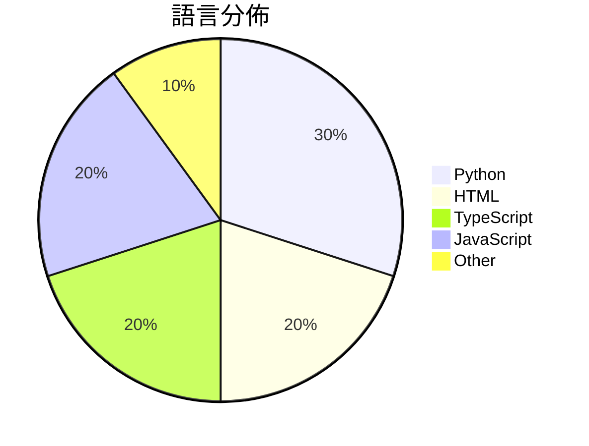

# GitHub Trending - 2026-04-27

> [!summary] 本日摘要
> 收錄 **10** 個新專案，合計 **16.6k** stars
> 語言分佈：Python (3) · HTML (2) · TypeScript (2) · JavaScript (2) · Other (1)

> [!tip] 本週焦點
> **[[tw93--Kami|tw93/Kami]]** — 6 天內累積 3.5k stars（579 stars/天）
> 提供一個設計系統，讓 AI 生成的文件不再平庸，提升排版與風格一致性。



---

## 收錄列表

| # | 專案 | 分類 | Stars | 速度 | 安裝 | 語言 | 用途 |
| :--: | --- | --- | ---: | ---: | --- | --- | --- |
| 1 | [[tw93--Kami\|tw93/Kami]] | 開發工具 | 3.5k | 579/天 | `easy` | HTML | 提供一個設計系統，讓 AI 生成的文件不再平庸，提升排版與風格一致性。 |
| 2 | [[op7418--guizang-ppt-skill\|op7418/guizang-ppt-skill]] | 開發工具 | 3.0k | 1.0k/天 | `easy` | HTML | 將提示轉換為橫向滑動的雜誌風格 HTML 簡報，提供多種佈局和主題。 |
| 3 | [[Einsia--OpenChronicle\|Einsia/OpenChronicle]] | 開發工具 | 1.4k | 284/天 | `medium` | Python | 提供本地優先的記憶體系統，讓任何 LLM 代理能夠捕捉並持久化工作上下文。 |
| 4 | [[cosmicstack-labs--mercury-agent\|cosmicstack-labs/mercury-agent]] | AI/ML | 1.4k | 236/天 | `medium` | TypeScript | 提供一個具備權限管理和記憶功能的 AI 代理，能夠在 CLI 或 Telegra |
| 5 | [[masterking32--MasterHttpRelayVPN\|masterking32/MasterHttpRelayVPN]] | 基礎設施 | 1.4k | 232/天 | `medium` | Python | 透過 Google Apps Script 隱藏流量，實現 HTTP/SOCKS |
| 6 | [[ConardLi--garden-skills\|ConardLi/garden-skills]] | 開發工具 | 1.4k | 277/天 | `medium` | JavaScript | 提供多種 AI 代理技能的開源集合，涵蓋網頁設計、知識檢索、影像生成等功能。 |
| 7 | [[leigest519--OpenGame\|leigest519/OpenGame]] | 開發工具 | 1.3k | 209/天 | `medium` | TypeScript | 提供一個開源的框架，讓用戶能夠從提示生成完整的網頁遊戲。 |
| 8 | [[deepseek-ai--TileKernels\|deepseek-ai/TileKernels]] | AI/ML | 1.2k | 305/天 | `easy` | Python | 提供針對 LLM 操作優化的 GPU 核心庫，使用 TileLang 開發。 |
| 9 | [[victorchen96--deepseek_v4_rolepaly_instruct\|victorchen96/deepseek_v4_rolepaly_instruct]] | 其他 | 1.1k | 540/天 | `easy` | N/A | 提供 DeepSeek-V4 角色扮演的特殊控制指令，讓用戶能夠靈活切換思考模式 |
| 10 | [[openclaw--clawsweeper\|openclaw/clawsweeper]] | 開發工具 | 1.0k | 336/天 | `easy` | JavaScript | 自動掃描並建議關閉不活躍的 GitHub 問題和 PR，減少維護負擔。 |

---

## 重點摘要

### 1. [[tw93--Kami|tw93/Kami]] `開發工具`

> 提供一個設計系統，讓 AI 生成的文件不再平庸，提升排版與風格一致性。

**3.5k** stars · **579** stars/天 · HTML · `easy`

_建立 6 天就累積 3474 stars（579/天），forks 180（5.2%），這顯示出其快速的增長潛力。作者 tw93 之前開發過多個相關工具，這次的 Kami 專注於解決 AI 生成文檔的排版問題，填補了市場上對於高品質文檔生成的需求。這個工具的推出恰逢 AI 文檔生成技術的普及，讓使用者能夠更輕鬆地生成專業文件。forks/stars 比率為 5.2%，顯示出有相當一部分使用者在積極修改和使用這個工具。_

---

### 2. [[op7418--guizang-ppt-skill|op7418/guizang-ppt-skill]] `開發工具`

> 將提示轉換為橫向滑動的雜誌風格 HTML 簡報，提供多種佈局和主題。

**3.0k** stars · **1.0k** stars/天 · HTML · `easy`

_建立 3 天就累積 3004 stars（1001/天），forks 327（10.9%），這顯示出強烈的使用者興趣。作者 OthmanAdi 和 nocoo 具備創新的背景，這個工具解決了傳統簡報工具在視覺呈現上的不足，特別是在需要個性化和美學的場合。這個專案的推出恰逢對於簡報工具需求的上升，尤其是在線下分享和個人品牌展示上。forks/stars 比率為 10.9%，顯示出許多人對於這個工具的實際修改和使用，反映出其實用性和潛在的擴展性。_

---

### 3. [[Einsia--OpenChronicle|Einsia/OpenChronicle]] `開發工具`

> 提供本地優先的記憶體系統，讓任何 LLM 代理能夠捕捉並持久化工作上下文。

**1.4k** stars · **284** stars/天 · Python · `medium`

_建立 5 天就累積 1422 stars（284/天），forks 93（6.5%），顯示出穩定的增長潛力。這個專案的作者團隊有著豐富的開源經驗，並且提供了一個針對 LLM 代理的本地優先記憶體解決方案，這在市場上是相對稀缺的。之前的解決方案如 OpenAI Chronicle 是封閉的，且依賴於特定的模型，無法滿足所有用戶的需求。OpenChronicle 的開源性和靈活性吸引了許多開發者的關注，並且在社群中引發了討論。技術上，這個工具的設計使得它能夠在本地環境中運行，這對於隱私和數據安全有著重要意義。forks/stars 比率為 6.5% 表示有相當一部分用戶對這個專案進行了實際修改和使用，顯示出良好的社群參與度。_

---

### 4. [[cosmicstack-labs--mercury-agent|cosmicstack-labs/mercury-agent]] `AI/ML`

> 提供一個具備權限管理和記憶功能的 AI 代理，能夠在 CLI 或 Telegram 上 24/7 運行。

**1.4k** stars · **236** stars/天 · TypeScript · `medium`

_建立 6 天內累積 1416 stars（236/天），forks 154（10.9%），顯示出強勁的增長潛力。這個專案由 Cosmic Stack 團隊開發，專注於解決現有 AI 代理在權限管理和記憶功能上的不足。之前的解決方案往往缺乏有效的用戶確認機制和記憶持久性，導致使用者在操作過程中容易出現意外。該專案的推出引起了社群的關注，尤其是在 Telegram 和 CLI 的整合上。這樣的設計使得 Mercury 能夠在多種環境中靈活運用，並且具備高安全性，這在當前的 AI 生態中是非常重要的。_

---

### 5. [[masterking32--MasterHttpRelayVPN|masterking32/MasterHttpRelayVPN]] `基礎設施`

> 透過 Google Apps Script 隱藏流量，實現 HTTP/SOCKS5 代理隧道，並支持 MITM TLS 攔截。

**1.4k** stars · **232** stars/天 · Python · `medium`

_建立 6 天內累積 1390 stars（232/天），forks 137（9.9%），顯示出強烈的用戶興趣。作者 masterking32 和其他貢獻者在網路隱私和代理工具方面有豐富經驗，這個工具解決了傳統 VPN 需要伺服器和配置的痛點，提供了一個更簡單的替代方案。近期的社群討論和 Telegram 頻道的活躍也促進了這個專案的曝光。這個工具的設計利用了 Google 的基礎設施，降低了使用門檻，吸引了大量希望突破網路限制的用戶。forks/stars 比率接近 10% 表示許多人在實際修改和使用這個工具。_

---

### 6. [[ConardLi--garden-skills|ConardLi/garden-skills]] `開發工具`

> 提供多種 AI 代理技能的開源集合，涵蓋網頁設計、知識檢索、影像生成等功能。

**1.4k** stars · **277** stars/天 · JavaScript · `medium`

_建立 5 天就累積 1383 stars（277/天），forks 255（18.4%），這顯示出不錯的增長潛力。作者 ConardLi 之前有其他開源專案，這次的技能集合解決了 AI 代理技能整合的痛點，讓開發者能更方便地使用多種技能。近期的推廣和社群討論可能也促進了這個專案的曝光。這個工具的成功也反映了對於 AI 代理技能需求的上升，尤其是在開發者社群中。高達 18.4% 的 forks/stars 比率顯示出許多人對這個專案的實際修改和使用興趣。_

---

### 7. [[leigest519--OpenGame|leigest519/OpenGame]] `開發工具`

> 提供一個開源的框架，讓用戶能夠從提示生成完整的網頁遊戲。

**1.3k** stars · **209** stars/天 · TypeScript · `medium`

_建立 6 天就累積 1254 stars（209/天），forks 157（12.5%），這顯示出其快速增長的潛力。這個專案的主要貢獻者來自 CUHK MMLab，過去在機器學習和遊戲開發領域有豐富的經驗。OpenGame 解決了現有遊戲開發工具在從高層設計到可玩遊戲的過程中常見的問題，如跨檔案不一致性和邏輯不連貫。這個專案的推出引起了社群的廣泛關注，尤其是在遊戲開發者和 AI 研究者之間。技術上，隨著 LLM 的進步，這種從提示生成遊戲的能力變得可行，進一步推動了遊戲開發的自動化。forks/stars 比率相對較高，顯示出許多用戶對此專案有實際的修改和使用需求。_

---

### 8. [[deepseek-ai--TileKernels|deepseek-ai/TileKernels]] `AI/ML`

> 提供針對 LLM 操作優化的 GPU 核心庫，使用 TileLang 開發。

**1.2k** stars · **305** stars/天 · Python · `easy`

_建立 4 天內累積 1219 stars（305/天），forks 94（7.7%），顯示出強勁的增長潛力。這個專案的主要貢獻者來自 DeepSeek 團隊，專注於高效能計算的解決方案。TileKernels 解決了在 GPU 上進行 LLM 計算時的性能瓶頸，特別是在量化和路由選擇方面，這在現有工具中並不常見。近期的推廣活動和社群的討論也可能促進了這個專案的曝光度。技術上，TileLang 的出現使得這個工具能夠在 Python 環境中實現高效能的 GPU 核心，這是之前的工具所無法達到的。forks/stars 比率為 7.7%，顯示出有相當一部分使用者在實際修改和使用這個工具。_

---

### 9. [[victorchen96--deepseek_v4_rolepaly_instruct|victorchen96/deepseek_v4_rolepaly_instruct]] `其他`

> 提供 DeepSeek-V4 角色扮演的特殊控制指令，讓用戶能夠靈活切換思考模式。

**1.1k** stars · **540** stars/天 · N/A · `easy`

_建立 2 天就累積 1079 stars（540/天），forks 54（5.0%），這顯示出用戶對於角色扮演工具的需求正在增長。作者 victorchen96 和 Menci 之前在開源社群中有過其他貢獻，這使得他們在技術上具備一定的信譽。這個專案解決了角色扮演過程中缺乏靈活性和情感表達的痛點，之前的工具往往只能提供單一的思考模式，無法滿足多樣化的需求。此專案的推出引起了社群的關注，特別是在角色扮演和互動式故事創作的領域。forks/stars 比率為 5.0%，顯示出有相當數量的用戶在實際修改和使用此工具。_

---

### 10. [[openclaw--clawsweeper|openclaw/clawsweeper]] `開發工具`

> 自動掃描並建議關閉不活躍的 GitHub 問題和 PR，減少維護負擔。

**1.0k** stars · **336** stars/天 · JavaScript · `easy`

_建立 3 天內累積 1007 stars（336/天），forks 108（10.7%），顯示出強烈的興趣。這個專案由多位貢獻者共同維護，且其設計解決了 GitHub 上問題和 PR 管理的痛點，特別是在大型專案中，手動管理開放問題的負擔往往過重。ClawSweeper 的自動化功能可以減少維護者的工作量，並且在社群中引發了關注，尤其是在開源專案中，這樣的工具能夠提升專案的整體健康度。作者的背景和過去的貢獻也為這個專案的可信度加分。_

---

## 今日到期複習

> [!tip] 根據間隔複習排程，今天該回顧的專案

```dataview
TABLE
  stars_per_day AS "Stars/天",
  category AS "分類",
  engagement AS "參與度"
FROM "Repos"
WHERE next_review AND date(next_review) <= date("2026-04-27") AND status != "archived"
SORT priority DESC
```

## 待處理

```dataviewjs
const pending = dv.pages('"Repos"').where(p => p.status === "to-review").length;
const unrated = dv.pages('"Repos"').where(p => p.status !== "archived" && p.status !== "to-review" && (p.my_rating || 0) === 0).length;
const noVerdict = dv.pages('"Repos"').where(p => p.status !== "archived" && (p.my_rating || 0) > 0 && (!p.verdict || p.verdict === "")).length;
const items = [];
if (pending > 0) items.push(`**${pending}** 個待分流`);
if (unrated > 0) items.push(`**${unrated}** 個已讀但未評分`);
if (noVerdict > 0) items.push(`**${noVerdict}** 個已評分但無結論`);
if (items.length > 0) dv.paragraph(items.join(" / "));
else dv.paragraph("所有專案都已處理完畢！");
```
