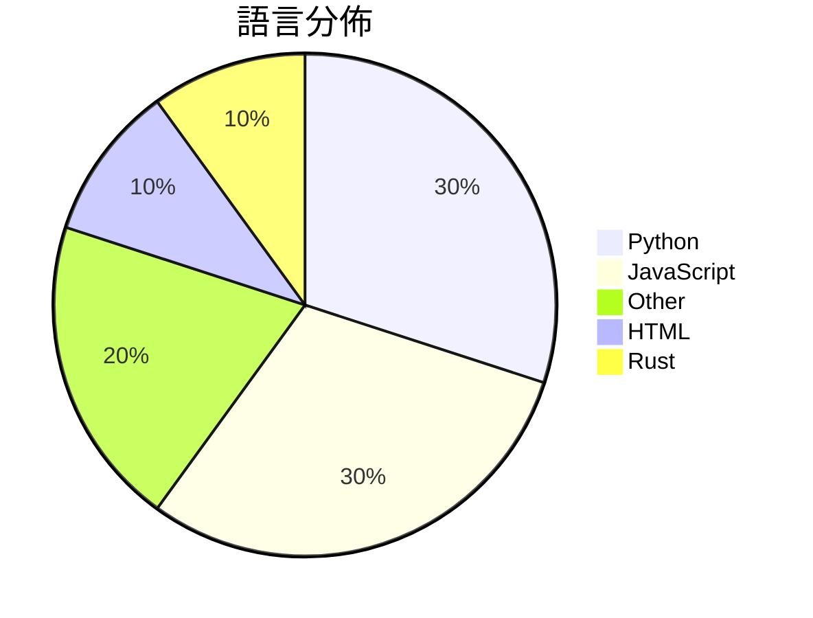

# GitHub Trending - 2026-04-28

> [!summary] 本日摘要
> 收錄 **10** 個新專案，合計 **14.3k** stars
> 語言分佈：Python (3) · JavaScript (3) · Other (2) · HTML (1) · Rust (1)

> [!tip] 本週焦點
> **[[op7418--guizang-ppt-skill|op7418/guizang-ppt-skill]]** — 4 天內累積 3.4k stars（862 stars/天）
> 將提示轉換為橫向翻頁的雜誌風格 HTML 簡報，提供多種佈局和主題。



---

## 收錄列表

| # | 專案 | 分類 | Stars | 速度 | 安裝 | 語言 | 用途 |
| :--: | --- | --- | ---: | ---: | --- | --- | --- |
| 1 | [[op7418--guizang-ppt-skill\|op7418/guizang-ppt-skill]] | 開發工具 | 3.4k | 862/天 | `easy` | HTML | 將提示轉換為橫向翻頁的雜誌風格 HTML 簡報，提供多種佈局和主題。 |
| 2 | [[Einsia--OpenChronicle\|Einsia/OpenChronicle]] | 開發工具 | 1.6k | 266/天 | `medium` | Python | 為任何 LLM 代理提供本地優先的屏幕上下文記憶，捕捉 AX 樹和截圖，並通過  |
| 3 | [[ConardLi--garden-skills\|ConardLi/garden-skills]] | 開發工具 | 1.6k | 259/天 | `easy` | JavaScript | 提供多種 AI 代理技能的開源集合，涵蓋網頁設計、知識檢索、影像生成等功能。 |
| 4 | [[victorchen96--deepseek_v4_rolepaly_instruct\|victorchen96/deepseek_v4_rolepaly_instruct]] | 其他 | 1.3k | 436/天 | `easy` | N/A | 提供 DeepSeek-V4 角色扮演的特殊控制指令，讓用戶能在對話中切換思考模 |
| 5 | [[deepseek-ai--TileKernels\|deepseek-ai/TileKernels]] | AI/ML | 1.3k | 256/天 | `easy` | Python | 提供基於 TileLang 的高效能 GPU 核心，專為 LLM 操作優化。 |
| 6 | [[freestylefly--awesome-gpt-image-2\|freestylefly/awesome-gpt-image-2]] | 其他 | 1.3k | 637/天 | `medium` | N/A | 提供工業級提示詞引擎與模板庫，幫助用戶穩定、可控地生成圖像。 |
| 7 | [[openclaw--clawsweeper\|openclaw/clawsweeper]] | 開發工具 | 1.2k | 300/天 | `easy` | JavaScript | 自動掃描 GitHub 上的問題和 PR，並建議關閉不必要的項目。 |
| 8 | [[earthtojake--text-to-cad\|earthtojake/text-to-cad]] | 開發工具 | 952 | 159/天 | `medium` | JavaScript | 一個開源的工具，讓你能夠透過編碼生成 CAD 模型。 |
| 9 | [[0x0funky--agent-sprite-forge\|0x0funky/agent-sprite-forge]] | 開發工具 | 871 | 218/天 | `medium` | Python | 將自然語言提示轉換為遊戲準備的 2D 精靈和分層 2D 地圖。 |
| 10 | [[therealaleph--MasterHttpRelayVPN-RUST\|therealaleph/MasterHttpRelayVPN-RUST]] | 安全 | 855 | 143/天 | `easy` | Rust | 透過 Google Apps Script 中繼實現免費的 DPI 迴避，無需運 |

---

## 重點摘要

### 1. [[op7418--guizang-ppt-skill|op7418/guizang-ppt-skill]] `開發工具`

> 將提示轉換為橫向翻頁的雜誌風格 HTML 簡報，提供多種佈局和主題。

**3.4k** stars · **862** stars/天 · HTML · `easy`

_建立 4 天就累積 3449 stars（862/天），forks 355（10.3%），這顯示出強烈的用戶興趣。作者 OthmanAdi 和 nocoo 在開源社群中有一定的影響力，這個專案解決了傳統簡報工具在視覺設計上的不足，提供了一種新的表達方式。近期的推廣活動和社群討論也可能促進了這個專案的曝光。技術上，WebGL 的使用讓這個工具在視覺效果上有了顯著提升，這在簡報工具中並不常見。forks/stars 比率顯示出許多人對這個工具進行了實際的修改和使用，反映出其潛在的應用價值。_

---

### 2. [[Einsia--OpenChronicle|Einsia/OpenChronicle]] `開發工具`

> 為任何 LLM 代理提供本地優先的屏幕上下文記憶，捕捉 AX 樹和截圖，並通過 MCP 暴露結果。

**1.6k** stars · **266** stars/天 · Python · `medium`

_建立 6 天就累積 1593 stars（266/天），forks 113（7.1%），這顯示出不錯的增長潛力。作者 KMing-L 和其他貢獻者在開源社群中活躍，過去有多個相關專案。這個專案解決了用戶對於本地記憶管理的需求，尤其是在隱私和數據控制方面。OpenAI Chronicle 雖然功能強大，但因為是封閉源碼，無法滿足所有用戶的需求。這個專案的開源性和靈活性吸引了許多開發者的注意，特別是在社群中引發了討論。技術上，隨著對於本地數據管理的需求上升，這個工具的可行性也隨之增強。forks/stars 比率適中，顯示出有一定的實際使用和修改需求。_

---

### 3. [[ConardLi--garden-skills|ConardLi/garden-skills]] `開發工具`

> 提供多種 AI 代理技能的開源集合，涵蓋網頁設計、知識檢索、影像生成等功能。

**1.6k** stars · **259** stars/天 · JavaScript · `easy`

_建立 6 天內累積 1554 stars（259/天），forks 278（17.9%），顯示出強勁的社群關注度。作者 ConardLi 之前有過相關的開源經驗，這次專案解決了開發者在使用 AI 代理時缺乏現成技能的痛點，讓他們能夠更快上手。近期的推廣活動和社群討論也為此專案帶來了流量。技術上，AI 代理的興起和需求增加，使得這個工具的可行性大幅提升。高達 17.9% 的 forks/stars 比率表明許多開發者正在實際使用並修改這個專案，顯示出其實用性和潛在的擴展性。_

---

### 4. [[victorchen96--deepseek_v4_rolepaly_instruct|victorchen96/deepseek_v4_rolepaly_instruct]] `其他`

> 提供 DeepSeek-V4 角色扮演的特殊控制指令，讓用戶能在對話中切換思考模式。

**1.3k** stars · **436** stars/天 · N/A · `easy`

_建立 3 天就累積 1309 stars（436/天），forks 67（5.1%），這顯示出其受到廣泛關注。作者 victorchen96 和 Menci 之前在相關領域有過貢獻，這使得他們的專案更容易獲得信任。該專案解決了角色扮演中思考模式切換的痛點，之前的工具往往無法靈活調整思考方式，限制了用戶的創造性。社群中的討論和反饋也促進了專案的快速迭代，吸引了更多用戶的參與。這種快速增長的趨勢顯示出用戶對於靈活對話工具的需求。_

---

### 5. [[deepseek-ai--TileKernels|deepseek-ai/TileKernels]] `AI/ML`

> 提供基於 TileLang 的高效能 GPU 核心，專為 LLM 操作優化。

**1.3k** stars · **256** stars/天 · Python · `easy`

_建立 5 天內累積 1281 stars（256/天），forks 104（8.1%），顯示出強烈的社群興趣。這個專案的主要貢獻者來自 DeepSeek 團隊，他們在 AI 和 GPU 計算方面有著豐富的經驗。TileKernels 解決了在 GPU 上高效運行 LLM 的需求，特別是在量化和專家路由方面，這在現有工具中並不常見。最近的推廣活動和社群討論也促進了其曝光率。由於 GPU 計算需求的上升，這個工具的出現正好符合市場需求，特別是在 AI 開發領域。_

---

### 6. [[freestylefly--awesome-gpt-image-2|freestylefly/awesome-gpt-image-2]] `其他`

> 提供工業級提示詞引擎與模板庫，幫助用戶穩定、可控地生成圖像。

**1.3k** stars · **637** stars/天 · N/A · `medium`

_建立 2 天就累積 1274 stars（637/天），forks 234（18.4%），這顯示出用戶對於這種結構化提示詞生成工具的需求。作者 freestylefly 之前在 AI 和設計領域有一定的背景，這個專案解決了傳統提示詞使用中的不穩定性和難以重用的問題，讓用戶能夠更有效地生成圖像。這個專案的推出可能受到社群對於 AI 生成內容的興趣增長的影響，尤其是在設計和創意領域。高達 18.4% 的 forks/stars 比率顯示出許多用戶對於這個工具的實際修改和使用，表明它在社群中引起了廣泛的關注。_

---

### 7. [[openclaw--clawsweeper|openclaw/clawsweeper]] `開發工具`

> 自動掃描 GitHub 上的問題和 PR，並建議關閉不必要的項目。

**1.2k** stars · **300** stars/天 · JavaScript · `easy`

_建立 4 天就累積 1198 stars（299.5/天），forks 128（10.7%），顯示出不錯的社群關注度。作者團隊由多位貢獻者組成，且有穩定的更新頻率，顯示出活躍的開發狀態。這個工具解決了 GitHub 上問題和 PR 管理的痛點，特別是針對那些長期未更新的項目，之前的解決方案往往缺乏自動化和智能化，導致維護者需要花費大量時間進行手動管理。最近的活動和社群互動也顯示出這個工具的實用性和需求，尤其是在大型專案中，能夠有效減少維護負擔。這些因素共同促進了 ClawSweeper 的快速成長。_

---

### 8. [[earthtojake--text-to-cad|earthtojake/text-to-cad]] `開發工具`

> 一個開源的工具，讓你能夠透過編碼生成 CAD 模型。

**952** stars · **159** stars/天 · JavaScript · `medium`

_建立 6 天就累積 952 stars（159/天），forks 151（15.9%），顯示出強烈的社群興趣。作者 earthtojake 在開源社群中有一定的知名度，過去的專案也多與 CAD 和 AI 相關，這使得這個專案能夠迅速吸引關注。這個專案解決了 CAD 模型生成的自動化問題，以往使用者需要手動操作 CAD 軟體，這樣的過程效率低下且容易出錯。隨著 AI 技術的進步，將文本轉化為 CAD 模型的需求逐漸增加，這個工具正好滿足了這一需求。社群的反饋和使用者的需求也促進了這個專案的快速發展。_

---

### 9. [[0x0funky--agent-sprite-forge|0x0funky/agent-sprite-forge]] `開發工具`

> 將自然語言提示轉換為遊戲準備的 2D 精靈和分層 2D 地圖。

**871** stars · **218** stars/天 · Python · `medium`

_建立 4 天內累積 871 stars（218/天），forks 84（9.6%），這顯示出強烈的興趣和使用潛力。作者 0x0funky 以開發遊戲相關工具見長，這個專案解決了遊戲開發者在資產生成上的痛點，特別是在需要快速生成 2D 精靈和地圖時。Codex 的集成使得這個工具在生成過程中更加高效，並且減少了對外部服務的依賴。這樣的設計讓開發者能夠專注於創意而非技術細節，這在遊戲開發中是非常重要的。社群的反應也相當熱烈，顯示出對於這類工具的需求。_

---

### 10. [[therealaleph--MasterHttpRelayVPN-RUST|therealaleph/MasterHttpRelayVPN-RUST]] `安全`

> 透過 Google Apps Script 中繼實現免費的 DPI 迴避，無需運行時依賴。

**855** stars · **143** stars/天 · Rust · `easy`

_建立 6 天就累積 855 stars（143/天），forks 110（12.9%），這顯示出相對穩定的增長。作者 therealaleph 是一位活躍的開發者，之前已經有相關的開源項目。這個專案解決了在高封鎖環境中，使用者難以設置 VPN 的痛點，特別是對於不熟悉技術的用戶來說，簡化了安裝過程。最近的推廣活動和社群討論也促進了這個專案的曝光率。技術上，Rust 的性能優勢和簡化的安裝流程使得這個工具在當前的環境中更具吸引力。_

---

## 今日到期複習

> [!tip] 根據間隔複習排程，今天該回顧的專案

```dataview
TABLE
  stars_per_day AS "Stars/天",
  category AS "分類",
  engagement AS "參與度"
FROM "Repos"
WHERE next_review AND date(next_review) <= date("2026-04-28") AND status != "archived"
SORT priority DESC
```

## 待處理

```dataviewjs
const pending = dv.pages('"Repos"').where(p => p.status === "to-review").length;
const unrated = dv.pages('"Repos"').where(p => p.status !== "archived" && p.status !== "to-review" && (p.my_rating || 0) === 0).length;
const noVerdict = dv.pages('"Repos"').where(p => p.status !== "archived" && (p.my_rating || 0) > 0 && (!p.verdict || p.verdict === "")).length;
const items = [];
if (pending > 0) items.push(`**${pending}** 個待分流`);
if (unrated > 0) items.push(`**${unrated}** 個已讀但未評分`);
if (noVerdict > 0) items.push(`**${noVerdict}** 個已評分但無結論`);
if (items.length > 0) dv.paragraph(items.join(" / "));
else dv.paragraph("所有專案都已處理完畢！");
```
