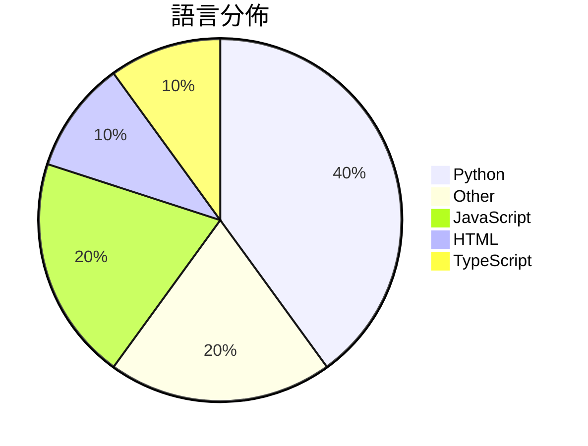

# GitHub Trending - 2026-04-29

> [!summary] 本日摘要
> 收錄 **10** 個新專案，合計 **14.8k** stars
> 語言分佈：Python (4) · Other (2) · JavaScript (2) · HTML (1) · TypeScript (1)

> [!tip] 本週焦點
> **[[op7418--guizang-ppt-skill|op7418/guizang-ppt-skill]]** — 5 天內累積 3.8k stars（766 stars/天）
> 將提示轉換為橫向翻頁的雜誌風格 HTML 簡報，提供多種佈局和主題選擇。



---

## 收錄列表

| # | 專案 | 分類 | Stars | 速度 | 安裝 | 語言 | 用途 |
| :--: | --- | --- | ---: | ---: | --- | --- | --- |
| 1 | [[op7418--guizang-ppt-skill\|op7418/guizang-ppt-skill]] | 開發工具 | 3.8k | 766/天 | `easy` | HTML | 將提示轉換為橫向翻頁的雜誌風格 HTML 簡報，提供多種佈局和主題選擇。 |
| 2 | [[freestylefly--awesome-gpt-image-2\|freestylefly/awesome-gpt-image-2]] | 其他 | 1.7k | 572/天 | `easy` | N/A | 提供結構化的提示詞引擎與模板庫，幫助穩定、可控地生成 AI 圖像。 |
| 3 | [[victorchen96--deepseek_v4_rolepaly_instruct\|victorchen96/deepseek_v4_rolepaly_instruct]] | AI/ML | 1.5k | 365/天 | `easy` | N/A | 提供 DeepSeek V4 角色扮演的特殊控制指令，讓用戶能夠在對話中切換思考 |
| 4 | [[deepseek-ai--TileKernels\|deepseek-ai/TileKernels]] | AI/ML | 1.3k | 220/天 | `medium` | Python | 提供針對 LLM 操作的優化 GPU 核心，使用 TileLang 開發。 |
| 5 | [[nexu-io--open-design\|nexu-io/open-design]] | 開發工具 | 1.3k | 1.3k/天 | `medium` | TypeScript | 提供一個本地優先的開源設計工具，讓使用者能夠利用現有的編碼代理進行設計工作。 |
| 6 | [[openclaw--clawsweeper\|openclaw/clawsweeper]] | 開發工具 | 1.3k | 255/天 | `easy` | JavaScript | 自動掃描並建議關閉不必要的問題和 PR，提升專案維護效率。 |
| 7 | [[earthtojake--text-to-cad\|earthtojake/text-to-cad]] | 開發工具 | 1.1k | 156/天 | `medium` | JavaScript | 一個開源工具，讓你用程式碼生成 CAD 模型。 |
| 8 | [[0x0funky--agent-sprite-forge\|0x0funky/agent-sprite-forge]] | 開發工具 | 1.0k | 208/天 | `medium` | Python | 透過自然語言提示生成遊戲用的2D精靈和地圖，並導出透明PNG幀和動畫GIF。 |
| 9 | [[wuyoscar--gpt_image_2_skill\|wuyoscar/gpt_image_2_skill]] | 開發工具 | 949 | 158/天 | `easy` | Python | 提供 OpenAI 圖像生成與編輯的提示庫及 CLI 工具。 |
| 10 | [[Russell-cell--PPT-Design-Prompt\|Russell-cell/PPT-Design-Prompt]] | 開發工具 | 849 | 142/天 | `easy` | Python | 將 DESIGN.md 品牌參考轉換為適合簡報的圖像格式。 |

---

## 重點摘要

### 1. [[op7418--guizang-ppt-skill|op7418/guizang-ppt-skill]] `開發工具`

> 將提示轉換為橫向翻頁的雜誌風格 HTML 簡報，提供多種佈局和主題選擇。

**3.8k** stars · **766** stars/天 · HTML · `easy`

_建立 5 天就累積 3829 stars（766/天），forks 395（10.3%），這顯示出其在開發者社群中的快速接受度。專案的作者 OthmanAdi 和 nocoo 在開源社群中有一定的影響力，且這個工具解決了傳統簡報工具在個性化和視覺效果上的不足。使用者可以透過簡單的指令快速生成具有雜誌風格的簡報，這在市場上是相對少見的。社群的活躍度也反映在開放的問題和貢獻上，儘管目前的問題解決率較低，但這也可能是因為專案剛剛啟動不久。整體來看，這個工具的快速增長主要來自於其獨特的功能和簡單的使用方式。_

---

### 2. [[freestylefly--awesome-gpt-image-2|freestylefly/awesome-gpt-image-2]] `其他`

> 提供結構化的提示詞引擎與模板庫，幫助穩定、可控地生成 AI 圖像。

**1.7k** stars · **572** stars/天 · N/A · `easy`

_建立 3 天內累積 1716 stars（572/天），forks 297（17.3%），顯示出強烈的社群興趣。作者 freestylefly 在 AI 和設計領域有一定的經驗，這個專案解決了之前提示詞不夠結構化的問題，讓用戶能夠更穩定地生成圖像。近期的社群討論和需求也促進了這個專案的快速成長，特別是在自動化和高效生成圖像的需求上。這個工具的出現正好契合了市場對於 AI 圖像生成的需求，並且其高 forks/stars 比率（17.3%）顯示出許多開發者在實際修改和使用這個庫。_

---

### 3. [[victorchen96--deepseek_v4_rolepaly_instruct|victorchen96/deepseek_v4_rolepaly_instruct]] `AI/ML`

> 提供 DeepSeek V4 角色扮演的特殊控制指令，讓用戶能夠在對話中切換思考模式。

**1.5k** stars · **365** stars/天 · N/A · `easy`

_建立 4 天就累積 1459 stars（365/天），forks 74（5.1%），這顯示出用戶對於角色扮演和互動式對話的需求。作者 victorchen96 和 Menci 之前在 AI 互動領域有過多個專案，這次專注於角色扮演的特殊控制指令，解決了以往對話模型缺乏靈活性和真實感的痛點。近期的社群討論和使用者反饋也促進了該專案的曝光。技術上，這種指令設計的靈活性使得用戶能夠在不同的場景中自如切換，這在當前對話 AI 的發展中是非常重要的。forks/stars 比率為 5.1%，顯示出有一定的用戶在實際修改和使用這個專案。_

---

### 4. [[deepseek-ai--TileKernels|deepseek-ai/TileKernels]] `AI/ML`

> 提供針對 LLM 操作的優化 GPU 核心，使用 TileLang 開發。

**1.3k** stars · **220** stars/天 · Python · `medium`

_建立 6 天內累積 1320 stars（220/天），forks 110（8.3%），顯示出不錯的增長潛力。這個專案由深具經驗的開發者團隊推出，專注於解決 LLM 訓練中的性能瓶頸，之前的解決方案往往無法充分利用 GPU 的計算能力。隨著對大型模型需求的增加，這個工具的出現正好填補了市場的空白。社群對於其性能的期待和需求也促進了其快速成長。這個專案的技術背景和開發者的專業能力使其具備了良好的發展潛力。_

---

### 5. [[nexu-io--open-design|nexu-io/open-design]] `開發工具`

> 提供一個本地優先的開源設計工具，讓使用者能夠利用現有的編碼代理進行設計工作。

**1.3k** stars · **1.3k** stars/天 · TypeScript · `medium`

_建立 1 天就累積 1292 stars（1292/天），forks 144（11.1%），這是極端爆發式增長。這個專案的作者 pftom 和 heylakatos 之前在開源設計領域有一定的經驗，這使得他們能夠針對 Claude Design 的限制提出有效的解決方案。Open Design 解決了使用者無法自我託管設計工具的痛點，並且提供了一個靈活的設計流程，這在市場上是相對少見的。最近的推廣活動和社群討論也為這個專案帶來了更多的曝光。這個工具的設計理念符合當前開源和本地優先的趨勢，讓使用者能夠在不依賴雲端服務的情況下進行設計。_

---

### 6. [[openclaw--clawsweeper|openclaw/clawsweeper]] `開發工具`

> 自動掃描並建議關閉不必要的問題和 PR，提升專案維護效率。

**1.3k** stars · **255** stars/天 · JavaScript · `easy`

_建立 5 天內累積 1276 stars（255/天），forks 137（10.7%），顯示出強勁的增長潛力。開發者來自 OpenClaw 團隊，專注於解決開放問題和 PR 管理的痛點，這在大型專案中一直是個挑戰。這個工具的出現正好填補了自動化維護的需求，特別是在開源專案中，讓維護者能夠專注於更重要的開發工作。社群的反饋和需求促進了這個專案的快速成長，並且在 GitHub 上的討論也逐漸增多，進一步推動了它的受歡迎程度。_

---

### 7. [[earthtojake--text-to-cad|earthtojake/text-to-cad]] `開發工具`

> 一個開源工具，讓你用程式碼生成 CAD 模型。

**1.1k** stars · **156** stars/天 · JavaScript · `medium`

_建立 7 天就累積 1094 stars（156/天），forks 169（15.4%），這顯示出其在開源社群中的高需求。作者 earthtojake 在 CAD 和 AI 領域有豐富的經驗，這個專案解決了傳統 CAD 工具在自動化和版本控制上的不足。之前的解決方案往往需要手動操作，效率低下，而這個工具能夠透過編碼代理自動生成模型，顯著提高了工作效率。社群的反應熱烈，可能是因為在 AI 和 CAD 結合的趨勢下，開發者們渴望這樣的工具來提升設計流程的靈活性。_

---

### 8. [[0x0funky--agent-sprite-forge|0x0funky/agent-sprite-forge]] `開發工具`

> 透過自然語言提示生成遊戲用的2D精靈和地圖，並導出透明PNG幀和動畫GIF。

**1.0k** stars · **208** stars/天 · Python · `medium`

_建立 5 天就累積 1042 stars（208/天），forks 107（10.3%），這顯示出強烈的興趣和潛在的使用者基礎。作者 0x0funky 之前有過多個開源專案，這次專注於遊戲資產生成，解決了開發者在創建2D精靈和地圖時的繁瑣流程。之前的工具往往需要多個步驟來生成資產，而這個專案則將所有步驟整合在一起，提供了一個更流暢的工作流程。社群的反應也顯示出對這種一體化解決方案的需求，特別是在快速開發遊戲的環境中。_

---

### 9. [[wuyoscar--gpt_image_2_skill|wuyoscar/gpt_image_2_skill]] `開發工具`

> 提供 OpenAI 圖像生成與編輯的提示庫及 CLI 工具。

**949** stars · **158** stars/天 · Python · `easy`

_建立 6 天內累積 949 stars（158/天），forks 93（9.8%），顯示出良好的使用者興趣。作者 wuyoscar 在開源社群中活躍，專注於 AI 和圖像生成領域，這個工具解決了使用者在生成圖像時的複雜性，提供了簡單易用的 CLI 和豐富的提示庫。近期的社群討論和需求也促進了這個專案的快速成長。這個工具的出現正好迎合了對於圖像生成需求日益增長的市場，特別是在教育和娛樂領域。_

---

### 10. [[Russell-cell--PPT-Design-Prompt|Russell-cell/PPT-Design-Prompt]] `開發工具`

> 將 DESIGN.md 品牌參考轉換為適合簡報的圖像格式。

**849** stars · **142** stars/天 · Python · `easy`

_建立 6 天內累積 849 stars（142/天），forks 64（7.5%），顯示出穩定的增長潛力。專案的作者 Russell-cell 以開源貢獻為主，這個工具解決了將品牌指導資料轉換為簡報圖像的需求，之前的解決方案往往無法直接滿足這一需求。這個專案的推出可能受到社群對於簡報設計工具需求增加的影響，並且其簡單的 CLI 操作使得使用者能快速上手。forks/stars 比率為 7.5%，顯示出有相當比例的使用者在進行實際修改或使用。_

---

## 今日到期複習

> [!tip] 根據間隔複習排程，今天該回顧的專案

```dataview
TABLE
  stars_per_day AS "Stars/天",
  category AS "分類",
  engagement AS "參與度"
FROM "Repos"
WHERE next_review AND date(next_review) <= date("2026-04-29") AND status != "archived"
SORT priority DESC
```

## 待處理

```dataviewjs
const pending = dv.pages('"Repos"').where(p => p.status === "to-review").length;
const unrated = dv.pages('"Repos"').where(p => p.status !== "archived" && p.status !== "to-review" && (p.my_rating || 0) === 0).length;
const noVerdict = dv.pages('"Repos"').where(p => p.status !== "archived" && (p.my_rating || 0) > 0 && (!p.verdict || p.verdict === "")).length;
const items = [];
if (pending > 0) items.push(`**${pending}** 個待分流`);
if (unrated > 0) items.push(`**${unrated}** 個已讀但未評分`);
if (noVerdict > 0) items.push(`**${noVerdict}** 個已評分但無結論`);
if (items.length > 0) dv.paragraph(items.join(" / "));
else dv.paragraph("所有專案都已處理完畢！");
```
