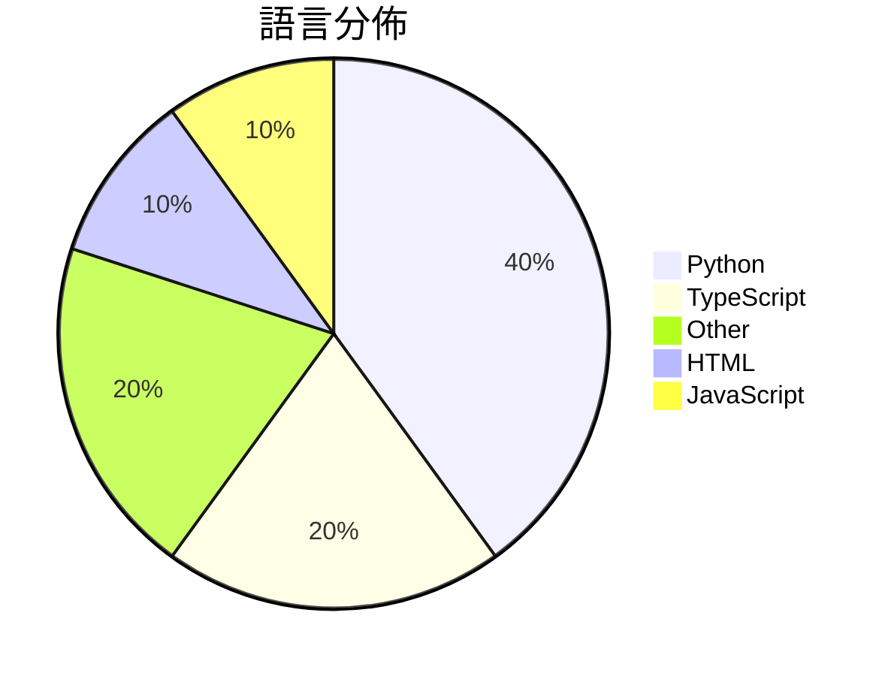

# GitHub Trending - 2026-04-30

> [!summary] 本日摘要
> 收錄 **10** 個新專案，合計 **18.6k** stars
> 語言分佈：Python (4) · TypeScript (2) · Other (2) · HTML (1) · JavaScript (1)

> [!tip] 本週焦點
> **[[nexu-io--open-design|nexu-io/open-design]]** — 1 天內累積 4.4k stars（4.4k stars/天）
> 提供本地優先的開源設計工具，替代 Anthropic 的 Claude Design。



---

## 收錄列表

| # | 專案 | 分類 | Stars | 速度 | 安裝 | 語言 | 用途 |
| :--: | --- | --- | ---: | ---: | --- | --- | --- |
| 1 | [[nexu-io--open-design\|nexu-io/open-design]] | 開發工具 | 4.4k | 4.4k/天 | `medium` | TypeScript | 提供本地優先的開源設計工具，替代 Anthropic 的 Claude Desi |
| 2 | [[op7418--guizang-ppt-skill\|op7418/guizang-ppt-skill]] | 開發工具 | 4.2k | 697/天 | `easy` | HTML | 將提示轉換為橫向翻頁的電子雜誌風格 HTML 簡報，提供多種佈局和主題。 |
| 3 | [[freestylefly--awesome-gpt-image-2\|freestylefly/awesome-gpt-image-2]] | 開發工具 | 2.1k | 537/天 | `easy` | N/A | 提供工業級的提示詞引擎與模板庫，幫助用戶高效生成穩定的 AI 圖像。 |
| 4 | [[victorchen96--deepseek_v4_rolepaly_instruct\|victorchen96/deepseek_v4_rolepaly_instruct]] | 其他 | 1.5k | 304/天 | `easy` | N/A | 提供 DeepSeek-V4 角色扮演的特殊控制指令，幫助用戶在思考模式下進行角 |
| 5 | [[cursor--cookbook\|cursor/cookbook]] | 開發工具 | 1.4k | 714/天 | `easy` | TypeScript | 提供 Cursor SDK 的小範例，幫助開發者快速上手。 |
| 6 | [[openclaw--clawsweeper\|openclaw/clawsweeper]] | 開發工具 | 1.3k | 224/天 | `medium` | JavaScript | 自動掃描所有問題和 PR，建議可以關閉的項目及其原因。 |
| 7 | [[0x0funky--agent-sprite-forge\|0x0funky/agent-sprite-forge]] | 開發工具 | 1.2k | 208/天 | `medium` | Python | 從自然語言提示生成遊戲準備的 2D 精靈和地圖。 |
| 8 | [[GammaLabTechnologies--harmonist\|GammaLabTechnologies/harmonist]] | 開發工具 | 897 | 150/天 | `easy` | Python | 提供可攜式 AI 代理協調，並強制執行機械協議，確保 AI 輔助開發的安全性與合 |
| 9 | [[future-agi--future-agi\|future-agi/future-agi]] | AI/ML | 748 | 125/天 | `medium` | Python | 提供一個開源平台，幫助評估、觀察和改善 LLM 和 AI agent 應用。 |
| 10 | [[epoko77-ai--im-not-ai\|epoko77-ai/im-not-ai]] | 開發工具 | 642 | 128/天 | `medium` | Python | 將 AI 生成的韓文文本轉換為自然流暢的韓文，保持內容不變。 |

---

## 重點摘要

### 1. [[nexu-io--open-design|nexu-io/open-design]] `開發工具`

> 提供本地優先的開源設計工具，替代 Anthropic 的 Claude Design。

**4.4k** stars · **4.4k** stars/天 · TypeScript · `medium`

_建立 1 天就累積 4442 stars（4442/天），forks 536（12.1%），這顯示出強烈的社群興趣。這個專案的作者來自多個開源背景，過去有開發類似工具的經驗。Open Design 解決了 Claude Design 的封閉性問題，提供了一個可自定義的設計流程，這在市場上是相對缺乏的。最近的推廣活動和社群討論也可能促進了它的快速增長。這個工具的開源性和靈活性使其在當前的設計工具生態中脫穎而出。_

---

### 2. [[op7418--guizang-ppt-skill|op7418/guizang-ppt-skill]] `開發工具`

> 將提示轉換為橫向翻頁的電子雜誌風格 HTML 簡報，提供多種佈局和主題。

**4.2k** stars · **697** stars/天 · HTML · `easy`

_建立 6 天內累積 4180 stars（697/天），forks 417（10.0%），顯示出強烈的用戶興趣。這個專案由 OthmanAdi 和 nocoo 共同開發，解決了傳統簡報工具在個性化和視覺效果上的不足。之前的工具往往無法提供這種獨特的電子雜誌風格，且缺乏簡單的安裝和使用流程。社群對於這種創新的簡報生成方式反應熱烈，可能受到線下分享活動的推動。這個工具的成功也反映了對於簡報工具需求的變化，特別是在需要快速生成高質感內容的場景中。_

---

### 3. [[freestylefly--awesome-gpt-image-2|freestylefly/awesome-gpt-image-2]] `開發工具`

> 提供工業級的提示詞引擎與模板庫，幫助用戶高效生成穩定的 AI 圖像。

**2.1k** stars · **537** stars/天 · N/A · `easy`

_建立 4 天就累積 2149 stars（537/天），forks 348（16.2%），這顯示出強勁的增長潛力。專案的作者 freestylefly 在 AI 圖像生成領域有著豐富的經驗，之前的作品也受到廣泛好評。這個專案解決了用戶在生成圖像時面臨的穩定性和可控性問題，以往的工具往往只能生成隨機的圖像，缺乏結構化的提示詞支持。社群的反饋和需求促使這個專案迅速成長，並且在短時間內吸引了大量的使用者關注。這種需求的增加也反映了 AI 圖像生成技術的成熟和應用的擴展。_

---

### 4. [[victorchen96--deepseek_v4_rolepaly_instruct|victorchen96/deepseek_v4_rolepaly_instruct]] `其他`

> 提供 DeepSeek-V4 角色扮演的特殊控制指令，幫助用戶在思考模式下進行角色沉浸或純分析。

**1.5k** stars · **304** stars/天 · N/A · `easy`

_建立 5 天就累積 1521 stars（304/天），forks 75（4.9%），這顯示出穩定的增長。作者 victorchen96 之前有其他相關專案，這使得他在這個領域有一定的影響力。這個專案解決了角色扮演中思考模式切換的需求，之前的工具往往無法提供這樣的靈活性。社群的反饋和問題討論也顯示出用戶對於這些功能的需求，特別是在中文環境下的應用。這樣的需求隨著角色扮演遊戲和互動劇本的流行而增長，讓這個專案的出現正好填補了市場的空白。_

---

### 5. [[cursor--cookbook|cursor/cookbook]] `開發工具`

> 提供 Cursor SDK 的小範例，幫助開發者快速上手。

**1.4k** stars · **714** stars/天 · TypeScript · `easy`

_建立 2 天就累積 1427 stars（714/天），forks 158（11.1%），這顯示出強勁的增長潛力。作者是 Cursor 團隊，專注於開發高效的編碼代理解決方案，這個專案解決了開發者在使用 Cursor SDK 時缺乏範例的痛點。之前開發者需要自行摸索如何整合 SDK，這常常導致學習曲線陡峭。近期的推廣活動和社群討論也提升了這個專案的曝光率，促進了使用者的參與。高 forks/stars 比率顯示出許多開發者正在實際修改和使用這個工具，反映出其實用性和需求。_

---

### 6. [[openclaw--clawsweeper|openclaw/clawsweeper]] `開發工具`

> 自動掃描所有問題和 PR，建議可以關閉的項目及其原因。

**1.3k** stars · **224** stars/天 · JavaScript · `medium`

_建立 6 天內累積 1341 stars（224/天），forks 144（10.7%），顯示出強勁的增長潛力。作者團隊由多位貢獻者組成，過去在 GitHub 上有豐富的開發經驗。這個工具解決了開源項目中管理問題和 PR 的痛點，特別是在需要自動化和保守性管理的情況下。最近的推廣和社群討論也促進了它的曝光度，並且 GitHub App 的使用使得它在安全性上有了更好的保障。forks/stars 比率在 10% 以上，顯示出使用者對這個工具的實際修改和使用意圖。_

---

### 7. [[0x0funky--agent-sprite-forge|0x0funky/agent-sprite-forge]] `開發工具`

> 從自然語言提示生成遊戲準備的 2D 精靈和地圖。

**1.2k** stars · **208** stars/天 · Python · `medium`

_建立 6 天就累積 1245 stars（208/天），forks 123（9.9%），這顯示出強勁的增長潛力。作者 0x0funky 在遊戲資產生成方面有豐富的經驗，這個專案解決了開發者在創建 2D 精靈和地圖時的繁瑣流程，之前的工具往往需要多個步驟和外部 API 的整合。近期的 GitHub 活動和社群反饋也表明，開發者對於這種簡化流程的需求非常高。這個工具的設計理念與 Codex 的整合使得它在當前技術生態中具有獨特的優勢，能夠快速響應開發者的需求。_

---

### 8. [[GammaLabTechnologies--harmonist|GammaLabTechnologies/harmonist]] `開發工具`

> 提供可攜式 AI 代理協調，並強制執行機械協議，確保 AI 輔助開發的安全性與合規性。

**897** stars · **150** stars/天 · Python · `easy`

_建立 6 天內累積 897 stars（149.5/天），forks 303（33.8%），顯示出高活躍度。GammaLabTechnologies 是專注於機器人技術與人工智慧的公司，Harmonist 解決了 AI 輔助開發中缺乏強制執行規範的痛點，這在現有的輕量級框架中並不常見。這個專案的推出吸引了開發者的注意，尤其是在 GitHub 上的討論與分享。技術生態的變化使得這種強制執行的需求愈發明顯，尤其是在開發流程中需要更高的安全性與合規性。高達 33.8% 的 forks/stars 比率顯示出許多開發者正在實際修改與使用這個工具。_

---

### 9. [[future-agi--future-agi|future-agi/future-agi]] `AI/ML`

> 提供一個開源平台，幫助評估、觀察和改善 LLM 和 AI agent 應用。

**748** stars · **125** stars/天 · Python · `medium`

_建立 6 天內累積 748 stars（124.7/天），forks 130（17.4%），顯示出強勁的增長潛力。作者團隊由多位開發者組成，這些人過去在 AI 和開源領域有豐富的經驗。這個專案解決了以往 AI agent 在生產環境中難以有效監控和優化的痛點，通過整合多種功能，讓開發者能夠在一個平台上完成所有工作。近期的社群討論和需求也促進了這個工具的快速成長。隨著對 AI agent 需求的增加，這個工具的出現恰逢其時。_

---

### 10. [[epoko77-ai--im-not-ai|epoko77-ai/im-not-ai]] `開發工具`

> 將 AI 生成的韓文文本轉換為自然流暢的韓文，保持內容不變。

**642** stars · **128** stars/天 · Python · `medium`

_建立 5 天內累積 642 stars（128/天），forks 67（10.4%），顯示出不錯的增長潛力。這個專案的主要貢獻者包括 epoko77-ai、Squirbie 和 shoveller，他們在 AI 和自然語言處理領域有豐富的經驗。這個工具解決了韓文潤飾的需求，特別是針對 AI 生成文本的自然性問題，這在韓文處理工具中尚屬罕見。最近的版本更新顯示出對性能的重視，這吸引了不少使用者的注意。社群的活躍度也表現在開放的 Issues 和 PR 中，顯示出對功能改進的持續關注。_

---

## 今日到期複習

> [!tip] 根據間隔複習排程，今天該回顧的專案

```dataview
TABLE
  stars_per_day AS "Stars/天",
  category AS "分類",
  engagement AS "參與度"
FROM "Repos"
WHERE next_review AND date(next_review) <= date("2026-04-30") AND status != "archived"
SORT priority DESC
```

## 待處理

```dataviewjs
const pending = dv.pages('"Repos"').where(p => p.status === "to-review").length;
const unrated = dv.pages('"Repos"').where(p => p.status !== "archived" && p.status !== "to-review" && (p.my_rating || 0) === 0).length;
const noVerdict = dv.pages('"Repos"').where(p => p.status !== "archived" && (p.my_rating || 0) > 0 && (!p.verdict || p.verdict === "")).length;
const items = [];
if (pending > 0) items.push(`**${pending}** 個待分流`);
if (unrated > 0) items.push(`**${unrated}** 個已讀但未評分`);
if (noVerdict > 0) items.push(`**${noVerdict}** 個已評分但無結論`);
if (items.length > 0) dv.paragraph(items.join(" / "));
else dv.paragraph("所有專案都已處理完畢！");
```
