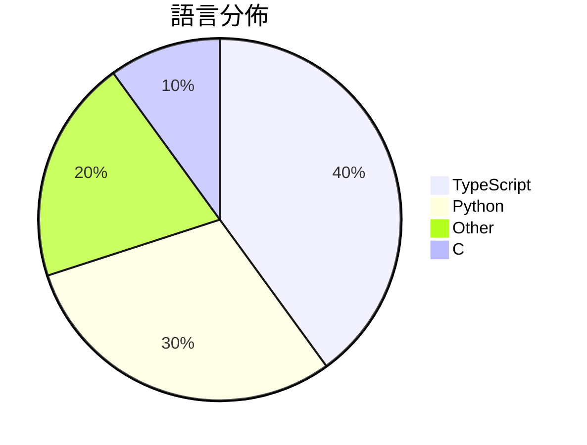

# GitHub Trending - 2026-05-01

> [!summary] 本日摘要
> 收錄 **10** 個新專案，合計 **20.5k** stars
> 語言分佈：TypeScript (4) · Python (3) · Other (2) · C (1)

> [!tip] 本週焦點
> **[[nexu-io--open-design|nexu-io/open-design]]** — 2 天內累積 8.4k stars（4.2k stars/天）
> 提供本地優先的開源設計工具，讓使用者能夠自由創建設計作品，無需依賴雲端服務。



---

## 收錄列表

| # | 專案 | 分類 | Stars | 速度 | 安裝 | 語言 | 用途 |
| :--: | --- | --- | ---: | ---: | --- | --- | --- |
| 1 | [[nexu-io--open-design\|nexu-io/open-design]] | 開發工具 | 8.4k | 4.2k/天 | `medium` | TypeScript | 提供本地優先的開源設計工具，讓使用者能夠自由創建設計作品，無需依賴雲端服務。 |
| 2 | [[cursor--cookbook\|cursor/cookbook]] | 開發工具 | 2.6k | 877/天 | `easy` | TypeScript | 提供小範例來幫助開發者使用 Cursor SDK 建立應用。 |
| 3 | [[freestylefly--awesome-gpt-image-2\|freestylefly/awesome-gpt-image-2]] | 開發工具 | 2.6k | 512/天 | `medium` | N/A | 提供工業級提示詞引擎與模板庫，幫助用戶穩定且可控地生成高品質圖像。 |
| 4 | [[theori-io--copy-fail-CVE-2026-31431\|theori-io/copy-fail-CVE-2026-31431]] | 安全 | 1.7k | 1.7k/天 | `easy` | Python | 提供 CVE-2026-31431 的漏洞利用工具，幫助用戶測試和修補相關系統。 |
| 5 | [[victorchen96--deepseek_v4_rolepaly_instruct\|victorchen96/deepseek_v4_rolepaly_instruct]] | 其他 | 1.6k | 261/天 | `easy` | N/A | 提供 DeepSeek V4 角色扮演的特殊控制指令，幫助用戶在思考模式中切換思 |
| 6 | [[ps5-linux--ps5-linux-loader\|ps5-linux/ps5-linux-loader]] | 基礎設施 | 808 | 135/天 | `medium` | C | 將 PS5 轉換為高效能 Linux PC，解鎖其硬體潛力。 |
| 7 | [[willchen96--mike\|willchen96/mike]] | 開發工具 | 785 | 785/天 | `medium` | TypeScript | 提供開源的法律 AI 平台，簡化法律文件處理與管理。 |
| 8 | [[DanOps-1--Gpt-Agreement-Payment\|DanOps-1/Gpt-Agreement-Payment]] | 安全 | 779 | 260/天 | `medium` | Python | 提供 ChatGPT Plus/Team/Pro 订阅协议的端到端重放工具及反欺 |
| 9 | [[GENEXIS-AI--chromex\|GENEXIS-AI/chromex]] | 開發工具 | 687 | 344/天 | `medium` | TypeScript | 一個基於 Codex 的 Chrome 側邊助手，提供頁面上下文、標籤、語音和圖 |
| 10 | [[epoko77-ai--im-not-ai\|epoko77-ai/im-not-ai]] | 開發工具 | 670 | 112/天 | `medium` | Python | 將 AI 寫的韓文文章轉換為自然流暢的語言，而不改變內容。 |

---

## 重點摘要

### 1. [[nexu-io--open-design|nexu-io/open-design]] `開發工具`

> 提供本地優先的開源設計工具，讓使用者能夠自由創建設計作品，無需依賴雲端服務。

**8.4k** stars · **4.2k** stars/天 · TypeScript · `medium`

_建立 2 天內累積 8359 stars（4180/天），forks 931（11.1%），顯示出強烈的社群興趣。主要貢獻者包括 pftom 和 nettee，他們在開源社群中有著良好的聲譽。這個專案解決了使用者對於封閉式設計工具的需求，提供了一個開源且本地運行的替代方案。隨著設計工具需求的增加，Open Design 以其靈活性和開放性吸引了大量使用者。社群的反饋和需求推動了這個專案的快速增長。_

---

### 2. [[cursor--cookbook|cursor/cookbook]] `開發工具`

> 提供小範例來幫助開發者使用 Cursor SDK 建立應用。

**2.6k** stars · **877** stars/天 · TypeScript · `easy`

_建立 3 天就累積 2631 stars（877/天），forks 289（11.0%），顯示出強烈的社群興趣。這個專案的主要貢獻者包括 cursoragent 和 leerob，他們在開源社群中有著良好的聲譽。Cursor Cookbook 解決了開發者在使用 Cursor SDK 時缺乏範例的痛點，之前的解決方案往往缺乏實際的應用示例。這個專案的快速增長可能也受到社交媒體和開發者論壇的推廣影響。技術上，這個工具的出現是因為對於雲端代理的需求日益增加，特別是在開發和測試階段。forks/stars 比率為 11.0%，顯示出許多開發者對於這個專案的實際應用有興趣。_

---

### 3. [[freestylefly--awesome-gpt-image-2|freestylefly/awesome-gpt-image-2]] `開發工具`

> 提供工業級提示詞引擎與模板庫，幫助用戶穩定且可控地生成高品質圖像。

**2.6k** stars · **512** stars/天 · N/A · `medium`

_建立 5 天就累積 2562 stars（512/天），forks 392（15.3%），這顯示出強烈的用戶興趣。作者 freestylefly 之前在 AI 領域有過多個貢獻，這次專案解決了生成圖像時提示詞不夠結構化的痛點，讓用戶能夠更有效地控制生成過程。最近的推廣活動和社群反饋也促進了這個專案的快速增長。整體來看，這個專案的成功與其提供的實用性和用戶需求的匹配度密切相關。_

---

### 4. [[theori-io--copy-fail-CVE-2026-31431|theori-io/copy-fail-CVE-2026-31431]] `安全`

> 提供 CVE-2026-31431 的漏洞利用工具，幫助用戶測試和修補相關系統。

**1.7k** stars · **1.7k** stars/天 · Python · `easy`

_建立 1 天就累積 1694 stars（1694/天），forks 374（22.1%），這顯示出強烈的社群興趣。作者 junomonster 和 tylerni7 在安全領域有一定的經驗，這使得他們的專案受到關注。這個工具解決了針對 CVE-2026-31431 漏洞的測試需求，之前的工具往往無法針對這類特定漏洞進行有效測試。社群的反饋和需求促使了這個專案的快速發展，尤其是在安全領域，對於特定漏洞的研究和修補需求持續上升。_

---

### 5. [[victorchen96--deepseek_v4_rolepaly_instruct|victorchen96/deepseek_v4_rolepaly_instruct]] `其他`

> 提供 DeepSeek V4 角色扮演的特殊控制指令，幫助用戶在思考模式中切換思維風格。

**1.6k** stars · **261** stars/天 · N/A · `easy`

_建立 6 天就累積 1563 stars（261/天），forks 77（4.9%），這顯示出用戶對於角色扮演功能的需求。作者 victorchen96 和 Menci 在開源社群中有一定的影響力，這個專案解決了用戶在角色扮演時缺乏靈活控制的痛點，之前的工具往往只能提供單一的思考模式。該專案的推出引起了社群的廣泛討論，特別是在角色扮演和互動劇情生成的領域。技術上，這個工具的設計使得用戶能夠更精確地控制模型的輸出，這在以往的工具中並不常見。_

---

### 6. [[ps5-linux--ps5-linux-loader|ps5-linux/ps5-linux-loader]] `基礎設施`

> 將 PS5 轉換為高效能 Linux PC，解鎖其硬體潛力。

**808** stars · **135** stars/天 · C · `medium`

_建立 6 天內累積 808 stars（135/天），forks 46（5.7%），顯示出強烈的社群興趣。主要貢獻者 c0w-ar 和 TheOfficialFloW 在 PS5 破解社群中有著良好的聲譽，之前的專案如 fail0verflow 的 Prosperous 也引起了廣泛關注。這個專案解決了 PS5 用戶無法充分利用硬體潛力的痛點，提供了一個可行的 Linux 解決方案。社群的活躍度和快速的問題解決率（100%）也顯示出其穩定性和可靠性。_

---

### 7. [[willchen96--mike|willchen96/mike]] `開發工具`

> 提供開源的法律 AI 平台，簡化法律文件處理與管理。

**785** stars · **785** stars/天 · TypeScript · `medium`

_建立 1 天就累積 785 stars（785/天），forks 185（23.6%），這顯示出使用者對於這個開源法律平台的高度興趣。開發者 willchen96 擁有開源專案的背景，這使得他能夠針對法律文件處理的痛點提供解決方案。這個專案的出現正好填補了市場上對於靈活且開源的法律 AI 平台的需求，尤其是在許多商業解決方案無法提供完全控制權的情況下。社群的反應也表明，許多人對於簡化法律文件處理的需求迫切，這可能是促使其快速增長的原因之一。_

---

### 8. [[DanOps-1--Gpt-Agreement-Payment|DanOps-1/Gpt-Agreement-Payment]] `安全`

> 提供 ChatGPT Plus/Team/Pro 订阅协议的端到端重放工具及反欺诈机制研究。

**779** stars · **260** stars/天 · Python · `medium`

_建立 3 天就累積 779 stars（260/天），forks 高達 357（45.8%），顯示出強烈的社群參與。作者 DanOps-1 似乎專注於安全研究和反欺诈技術，這個專案解決了在現有支付系統中進行自動化測試和研究的需求，特別是在 hCaptcha 和 Stripe 的使用場景中。最近的社群討論和實證數據的分享也可能促進了這個專案的曝光度。高 forks/stars 比率顯示出許多開發者正在積極修改和使用這個工具，而不僅僅是觀望。_

---

### 9. [[GENEXIS-AI--chromex|GENEXIS-AI/chromex]] `開發工具`

> 一個基於 Codex 的 Chrome 側邊助手，提供頁面上下文、標籤、語音和圖像工作流程的整合。

**687** stars · **344** stars/天 · TypeScript · `medium`

_建立 2 天內累積 687 stars（344/天），forks 56（8.2%），這顯示出強烈的用戶興趣。作者 GenexisAI 是一個專注於 AI 工具的團隊，這個專案解決了 Chrome 瀏覽器中缺乏高效 AI 助手的痛點，特別是在多模態交互方面。近期的社群討論和推廣活動也為其增添了曝光度。技術上，Chromex 的設計利用了 Chrome MV3 的新特性，使其在現有的生態系統中更具競爭力。forks/stars 比率在 8.2% 代表著用戶不僅在觀望，還有實際的修改和使用需求。_

---

### 10. [[epoko77-ai--im-not-ai|epoko77-ai/im-not-ai]] `開發工具`

> 將 AI 寫的韓文文章轉換為自然流暢的語言，而不改變內容。

**670** stars · **112** stars/天 · Python · `medium`

_建立 6 天就累積 670 stars（112/天），forks 71（10.6%），顯示出強烈的社群興趣。專案的主要貢獻者包括 epoko77-ai、Squirbie 和 shoveller，他們在 AI 和文本處理領域有豐富的經驗。這個工具解決了韓文文本潤色的需求，因為現有的英文工具無法有效處理韓文的特有語法和表達方式。專案的快速增長可能受到社交媒體的推廣和相關討論的影響，尤其是在韓國的開發者社群中。高達 10.6% 的 forks/stars 比率顯示許多使用者對這個工具進行了實際的修改和使用，顯示出其實用性和需求。_

---

## 今日到期複習

> [!tip] 根據間隔複習排程，今天該回顧的專案

```dataview
TABLE
  stars_per_day AS "Stars/天",
  category AS "分類",
  engagement AS "參與度"
FROM "Repos"
WHERE next_review AND date(next_review) <= date("2026-05-01") AND status != "archived"
SORT priority DESC
```

## 待處理

```dataviewjs
const pending = dv.pages('"Repos"').where(p => p.status === "to-review").length;
const unrated = dv.pages('"Repos"').where(p => p.status !== "archived" && p.status !== "to-review" && (p.my_rating || 0) === 0).length;
const noVerdict = dv.pages('"Repos"').where(p => p.status !== "archived" && (p.my_rating || 0) > 0 && (!p.verdict || p.verdict === "")).length;
const items = [];
if (pending > 0) items.push(`**${pending}** 個待分流`);
if (unrated > 0) items.push(`**${unrated}** 個已讀但未評分`);
if (noVerdict > 0) items.push(`**${noVerdict}** 個已評分但無結論`);
if (items.length > 0) dv.paragraph(items.join(" / "));
else dv.paragraph("所有專案都已處理完畢！");
```
