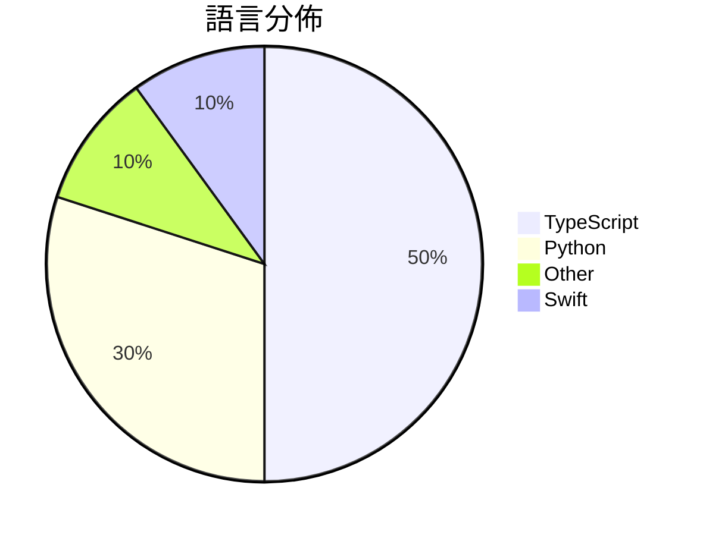

# GitHub Trending - 2026-05-02

> [!summary] 本日摘要
> 收錄 **10** 個新專案，合計 **25.8k** stars
> 語言分佈：TypeScript (5) · Python (3) · Other (1) · Swift (1)

> [!tip] 本週焦點
> **[[nexu-io--open-design|nexu-io/open-design]]** — 3 天內累積 11.9k stars（4.0k stars/天）
> 提供一個本地優先的開源設計工具，作為 Anthropic 的 Claude Design 的替代方案。



---

## 收錄列表

| # | 專案 | 分類 | Stars | 速度 | 安裝 | 語言 | 用途 |
| :--: | --- | --- | ---: | ---: | --- | --- | --- |
| 1 | [[nexu-io--open-design\|nexu-io/open-design]] | 開發工具 | 11.9k | 4.0k/天 | `medium` | TypeScript | 提供一個本地優先的開源設計工具，作為 Anthropic 的 Claude De |
| 2 | [[freestylefly--awesome-gpt-image-2\|freestylefly/awesome-gpt-image-2]] | 開發工具 | 3.0k | 498/天 | `medium` | N/A | 提供370+个案例和20+套工业级模板的GPT-Image2提示词引擎，助你高效 |
| 3 | [[cursor--cookbook\|cursor/cookbook]] | 開發工具 | 3.0k | 741/天 | `easy` | TypeScript | 提供小範例以便於使用 Cursor SDK 進行開發。 |
| 4 | [[theori-io--copy-fail-CVE-2026-31431\|theori-io/copy-fail-CVE-2026-31431]] | 安全 | 2.5k | 1.2k/天 | `easy` | Python | 提供 CVE-2026-31431 漏洞的利用工具，幫助用戶測試和修補系統漏洞。 |
| 5 | [[denuitt1--mhr-cfw\|denuitt1/mhr-cfw]] | 安全 | 1.3k | 329/天 | `medium` | Python | 透過 Google Apps Script 和 Cloudflare Worke |
| 6 | [[willchen96--mike\|willchen96/mike]] | 開發工具 | 1.1k | 542/天 | `medium` | TypeScript | 提供開源的 AI 法律平台，簡化法律文件處理和管理。 |
| 7 | [[DanOps-1--Gpt-Agreement-Payment\|DanOps-1/Gpt-Agreement-Payment]] | 開發工具 | 877 | 219/天 | `medium` | Python | 提供 ChatGPT Plus/Team/Pro 订阅协议的端到端重放工具，並包 |
| 8 | [[b-nnett--codex-plusplus\|b-nnett/codex-plusplus]] | 開發工具 | 752 | 251/天 | `medium` | TypeScript | 為 Codex 桌面應用程式提供的調整系統，能夠注入自定義功能和修復 UI 錯誤 |
| 9 | [[GENEXIS-AI--chromex\|GENEXIS-AI/chromex]] | 開發工具 | 738 | 246/天 | `medium` | TypeScript | 提供一個 Codex 驅動的 Chrome 側邊面板助手，幫助用戶管理頁面上下文 |
| 10 | [[darrylmorley--whatcable\|darrylmorley/whatcable]] | 開發工具 | 694 | 694/天 | `easy` | Swift | 讓你清楚了解每條 USB-C 線纜的功能，避免充電慢的困擾。 |

---

## 重點摘要

### 1. [[nexu-io--open-design|nexu-io/open-design]] `開發工具`

> 提供一個本地優先的開源設計工具，作為 Anthropic 的 Claude Design 的替代方案。

**11.9k** stars · **4.0k** stars/天 · TypeScript · `medium`

_建立 3 天內累積 11910 stars（3970/天），forks 1339（11.2%），顯示出強勁的增長潛力。這個專案的作者團隊由多位開源貢獻者組成，他們在 AI 和設計工具領域有豐富的經驗。Open Design 解決了市場上缺乏靈活且開源的設計工具的痛點，特別是針對那些不想依賴封閉系統的用戶。近期的推廣和社群討論也促進了其知名度的提升。技術上，隨著本地開發和無伺服器架構的興起，這個工具的實用性和需求也隨之增加。高達 11.2% 的 forks/stars 比率顯示出許多開發者對這個工具的實際修改和使用興趣。_

---

### 2. [[freestylefly--awesome-gpt-image-2|freestylefly/awesome-gpt-image-2]] `開發工具`

> 提供370+个案例和20+套工业级模板的GPT-Image2提示词引擎，助你高效生成图像。

**3.0k** stars · **498** stars/天 · N/A · `medium`

_建立 6 天就累積 2989 stars（498/天），forks 450（15.1%），這顯示出強烈的社群興趣。作者 freestylefly 在 AI 和圖像生成領域有著豐富的經驗，這個專案解決了之前提示詞生成工具中缺乏結構化和可重用性的痛點。隨著 AI 圖像生成技術的普及，越來越多的用戶需要高效的工具來生成圖像，這個專案正好滿足了這一需求。社群的活躍度和不斷更新的案例也促進了其快速增長。_

---

### 3. [[cursor--cookbook|cursor/cookbook]] `開發工具`

> 提供小範例以便於使用 Cursor SDK 進行開發。

**3.0k** stars · **741** stars/天 · TypeScript · `easy`

_建立 4 天內累積 2965 stars（741/天），forks 340（11.5%），顯示出強烈的興趣。主要貢獻者包括 cursoragent 和 leerob，他們在開源社群中有一定的影響力。這個專案解決了開發者在使用 Cursor SDK 時缺乏範例的痛點，讓使用者能夠更快上手。近期的 commit 活動顯示出開發者對於功能擴展的重視，可能會吸引更多開發者參與。這個工具的出現正好符合了開發者對於簡化 API 使用的需求，特別是在 TypeScript 和 JavaScript 生態系中。_

---

### 4. [[theori-io--copy-fail-CVE-2026-31431|theori-io/copy-fail-CVE-2026-31431]] `安全`

> 提供 CVE-2026-31431 漏洞的利用工具，幫助用戶測試和修補系統漏洞。

**2.5k** stars · **1.2k** stars/天 · Python · `easy`

_建立 2 天就累積 2466 stars（1233/天），forks 512（20.8%），這顯示出強烈的社群關注。作者 junomonster 和 tylerni7 在安全領域有一定的背景，這使得他們能夠針對 CVE-2026-31431 提供有效的解決方案。這個工具解決了許多現有安全工具無法針對特定漏洞進行有效檢測的痛點，特別是在 Linux 環境中。社群的反應熱烈，尤其是對於如何處理漏洞的討論，顯示出使用者對這個工具的需求。這個工具的出現正好填補了市場上對於針對性漏洞檢測工具的需求，並且在技術生態中提供了一個新的選擇。_

---

### 5. [[denuitt1--mhr-cfw|denuitt1/mhr-cfw]] `安全`

> 透過 Google Apps Script 和 Cloudflare Workers 繞過 DPI 的域名前置中繼。

**1.3k** stars · **329** stars/天 · Python · `medium`

_建立 4 天就累積 1316 stars（329/天），forks 152（11.6%），顯示出強烈的社群興趣。主要貢獻者包括 cpog72031 和 denuitt1，他們在相關領域有豐富的經驗。這個工具解決了在某些地區無法訪問特定網站的問題，之前的解決方案往往依賴於 VPN 或其他代理服務，這些方法在某些情況下不夠穩定或安全。近期的推廣活動和社群討論也促進了這個專案的曝光度。隨著對隱私和安全的需求增加，這個工具的實用性變得更加明顯。_

---

### 6. [[willchen96--mike|willchen96/mike]] `開發工具`

> 提供開源的 AI 法律平台，簡化法律文件處理和管理。

**1.1k** stars · **542** stars/天 · TypeScript · `medium`

_建立 2 天就累積 1084 stars（542/天），forks 271（25.0%），這顯示出強烈的社群興趣。作者 willchen96 之前有開發過其他開源項目，這使得他在社群中有一定的信譽。這個專案解決了法律文件處理的痛點，特別是在開源生態中，許多現有工具缺乏靈活性和可擴展性。最近的推廣活動和社群討論也可能促進了它的曝光率。高達 25% 的 forks/stars 比率顯示出許多開發者對這個專案進行了實際的修改和使用，這是一個良好的信號。_

---

### 7. [[DanOps-1--Gpt-Agreement-Payment|DanOps-1/Gpt-Agreement-Payment]] `開發工具`

> 提供 ChatGPT Plus/Team/Pro 订阅协议的端到端重放工具，並包含 hCaptcha 视觉求解器和反欺诈机制实证研究。

**877** stars · **219** stars/天 · Python · `medium`

_建立 4 天就累積 877 stars（219/天），forks 394（44.9%），顯示出極高的使用興趣。這個專案的作者 DanOps-1 之前在反欺詐和自動化領域有過多個貢獻，這使得他能夠針對 ChatGPT 的訂閱流程提供一個具體的解決方案。之前的工具往往無法有效處理 hCaptcha 的挑戰，而這個專案提供了從頭到尾的解決方案，填補了市場的空白。最近的推廣活動和社群討論也促進了這個專案的曝光率，尤其是在安全研究和 CTF 相關社群中。forks/stars 比率達到 44.9%，顯示出許多人在實際修改和使用這個工具，而不僅僅是觀望。_

---

### 8. [[b-nnett--codex-plusplus|b-nnett/codex-plusplus]] `開發工具`

> 為 Codex 桌面應用程式提供的調整系統，能夠注入自定義功能和修復 UI 錯誤。

**752** stars · **251** stars/天 · TypeScript · `medium`

_建立 3 天內累積 752 stars（251/天），forks 33（4.4%），顯示出不錯的增長潛力。作者 b-nnett 之前在開源社區有其他貢獻，這次專案解決了 Codex 桌面應用的自定義需求，之前用戶只能依賴官方更新，無法靈活調整功能。近期的推廣活動和社群互動也可能促進了這個專案的曝光度。forks/stars 比率相對較低，顯示出使用者對這個工具的興趣尚在觀望階段。_

---

### 9. [[GENEXIS-AI--chromex|GENEXIS-AI/chromex]] `開發工具`

> 提供一個 Codex 驅動的 Chrome 側邊面板助手，幫助用戶管理頁面上下文、標籤、語音和圖像工作流程。

**738** stars · **246** stars/天 · TypeScript · `medium`

_建立 3 天內累積 738 stars（246/天），forks 59（8.0%），顯示出良好的增長潛力。作者 GenexisAI CHOI 之前在開源社群活躍，這個工具解決了用戶在 Chrome 中進行多任務處理的痛點，特別是對於需要即時處理文本和圖像的工作流。最近的推廣活動和社群討論也促進了其曝光率。技術上，Codex 的進步使得這種集成變得可行，並且高 forks/stars 比率顯示出社群對其實際應用的興趣。_

---

### 10. [[darrylmorley--whatcable|darrylmorley/whatcable]] `開發工具`

> 讓你清楚了解每條 USB-C 線纜的功能，避免充電慢的困擾。

**694** stars · **694** stars/天 · Swift · `easy`

_建立 1 天就累積 694 stars（694/天），forks 11（1.6%），這顯示出使用者對於 USB-C 線纜功能的關注。作者 Darryl Morley 之前有開發其他 macOS 應用，這次的 WhatCable 解決了使用者在選擇 USB-C 線纜時的困惑，因為市面上有太多相似的線纜，且功能差異不明。這個工具的出現正好填補了這個市場空白，讓使用者能夠清楚知道每條線纜的實際能力。社群的反應也很熱烈，尤其是對於未來可能增加的功能如桌面小工具的需求。_

---

## 今日到期複習

> [!tip] 根據間隔複習排程，今天該回顧的專案

```dataview
TABLE
  stars_per_day AS "Stars/天",
  category AS "分類",
  engagement AS "參與度"
FROM "Repos"
WHERE next_review AND date(next_review) <= date("2026-05-02") AND status != "archived"
SORT priority DESC
```

## 待處理

```dataviewjs
const pending = dv.pages('"Repos"').where(p => p.status === "to-review").length;
const unrated = dv.pages('"Repos"').where(p => p.status !== "archived" && p.status !== "to-review" && (p.my_rating || 0) === 0).length;
const noVerdict = dv.pages('"Repos"').where(p => p.status !== "archived" && (p.my_rating || 0) > 0 && (!p.verdict || p.verdict === "")).length;
const items = [];
if (pending > 0) items.push(`**${pending}** 個待分流`);
if (unrated > 0) items.push(`**${unrated}** 個已讀但未評分`);
if (noVerdict > 0) items.push(`**${noVerdict}** 個已評分但無結論`);
if (items.length > 0) dv.paragraph(items.join(" / "));
else dv.paragraph("所有專案都已處理完畢！");
```
