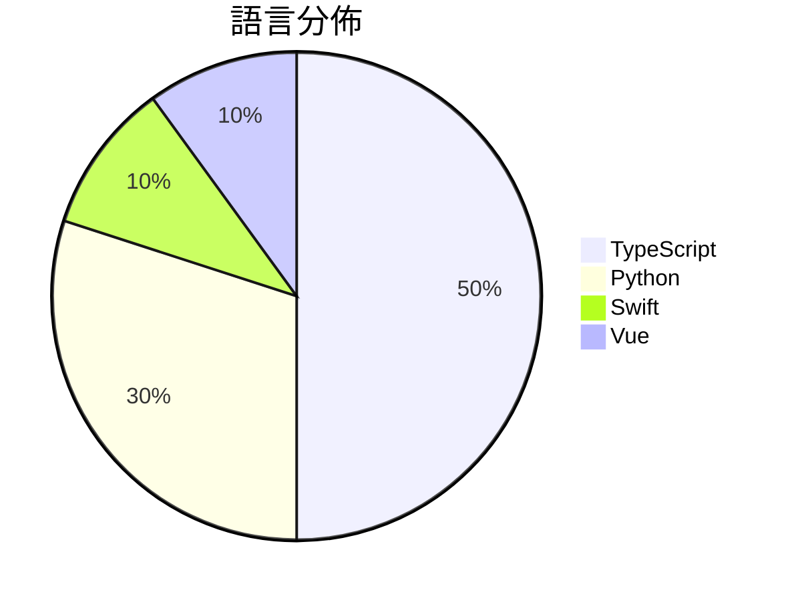

# GitHub Trending - 2026-05-03

> [!summary] 本日摘要
> 收錄 **10** 個新專案，合計 **29.8k** stars
> 語言分佈：TypeScript (5) · Python (3) · Swift (1) · Vue (1)

> [!tip] 本週焦點
> **[[nexu-io--open-design|nexu-io/open-design]]** — 4 天內累積 16.1k stars（4.0k stars/天）
> 提供一個本地優先的開源設計工具，作為 Anthropic 的 Claude Design 的替代方案。



---

## 收錄列表

| # | 專案 | 分類 | Stars | 速度 | 安裝 | 語言 | 用途 |
| :--: | --- | --- | ---: | ---: | --- | --- | --- |
| 1 | [[nexu-io--open-design\|nexu-io/open-design]] | 開發工具 | 16.1k | 4.0k/天 | `medium` | TypeScript | 提供一個本地優先的開源設計工具，作為 Anthropic 的 Claude De |
| 2 | [[cursor--cookbook\|cursor/cookbook]] | 開發工具 | 3.1k | 627/天 | `medium` | TypeScript | 提供 Cursor SDK 的範例，幫助開發者快速上手和整合 Cursor 的編 |
| 3 | [[theori-io--copy-fail-CVE-2026-31431\|theori-io/copy-fail-CVE-2026-31431]] | 安全 | 2.9k | 967/天 | `medium` | Python | 提供 CVE-2026-31431 漏洞的利用工具，幫助安全研究人員進行測試。 |
| 4 | [[denuitt1--mhr-cfw\|denuitt1/mhr-cfw]] | 安全 | 1.7k | 340/天 | `medium` | Python | 透過 GAS 和 Cloudflare Workers 繞過 DPI 的域名前置 |
| 5 | [[willchen96--mike\|willchen96/mike]] | 其他 | 1.4k | 472/天 | `medium` | TypeScript | 提供開源的法律 AI 平台，簡化法律文件處理與管理。 |
| 6 | [[darrylmorley--whatcable\|darrylmorley/whatcable]] | 其他 | 1.3k | 1.3k/天 | `easy` | Swift | 告訴你每根 USB-C 線纜的實際功能，幫助解決充電速度慢的問題。 |
| 7 | [[DanOps-1--Gpt-Agreement-Payment\|DanOps-1/Gpt-Agreement-Payment]] | 其他 | 917 | 183/天 | `medium` | Python | 提供 ChatGPT Plus/Team/Pro 订阅协议的端到端重放工具，並附 |
| 8 | [[b-nnett--codex-plusplus\|b-nnett/codex-plusplus]] | 開發工具 | 836 | 209/天 | `medium` | TypeScript | 為 Codex 桌面應用提供擴展和修補功能的系統。 |
| 9 | [[GENEXIS-AI--chromex\|GENEXIS-AI/chromex]] | 開發工具 | 755 | 189/天 | `medium` | TypeScript | 提供 Codex 驅動的 Chrome 側邊助手，協助用戶處理頁面內容、標籤、語 |
| 10 | [[t8y2--dbx\|t8y2/dbx]] | 開發工具 | 713 | 238/天 | `easy` | Vue | 一個輕量級的跨平台數據庫管理工具，支持多種數據庫。 |

---

## 重點摘要

### 1. [[nexu-io--open-design|nexu-io/open-design]] `開發工具`

> 提供一個本地優先的開源設計工具，作為 Anthropic 的 Claude Design 的替代方案。

**16.1k** stars · **4.0k** stars/天 · TypeScript · `medium`

_建立 4 天內累積 16135 stars（4034/天），forks 1820（11.3%），這顯示出極高的興趣和活躍度。這個專案的主要貢獻者來自於活躍的開源社群，並且在短時間內推出了多個版本，解決了設計工具在開源生態中的缺口。之前，類似的設計工具大多數是封閉的，使用者無法自定義或本地運行，而 Open Design 提供了這樣的可能性。社群的快速反應和功能的持續增長使得這個工具在設計領域中迅速獲得了關注。_

---

### 2. [[cursor--cookbook|cursor/cookbook]] `開發工具`

> 提供 Cursor SDK 的範例，幫助開發者快速上手和整合 Cursor 的編碼代理。

**3.1k** stars · **627** stars/天 · TypeScript · `medium`

_建立 5 天就累積 3137 stars（627/天），forks 363（11.6%），顯示出強勁的增長勢頭。作者 Cursor 團隊專注於開發高效的編碼代理，解決了開發者在整合 AI 代理時的複雜性問題。之前的解決方案往往缺乏直觀的 API 和範例，這使得開發者難以快速上手。近期的社群討論和提問也顯示出對於 Python SDK 的需求，這可能進一步推動專案的發展。這個工具的成功也反映了對於雲端和本地開發環境整合的需求日益增加。_

---

### 3. [[theori-io--copy-fail-CVE-2026-31431|theori-io/copy-fail-CVE-2026-31431]] `安全`

> 提供 CVE-2026-31431 漏洞的利用工具，幫助安全研究人員進行測試。

**2.9k** stars · **967** stars/天 · Python · `medium`

_建立 3 天就累積 2901 stars（967/天），forks 601（20.7%），這顯示出強烈的社群關注。專案的主要貢獻者 junomonster 和 tylerni7 在安全領域有過往的經驗，這使得專案更具可信度。這個工具解決了安全研究人員在測試 CVE-2026-31431 漏洞時缺乏專業工具的痛點，之前的解決方案往往需要手動配置或使用通用的漏洞利用框架。社群的熱烈反應也反映了對於這類專門工具的需求。最近的討論和反饋進一步推動了專案的曝光率，特別是在安全論壇和社交媒體上。_

---

### 4. [[denuitt1--mhr-cfw|denuitt1/mhr-cfw]] `安全`

> 透過 GAS 和 Cloudflare Workers 繞過 DPI 的域名前置代理。

**1.7k** stars · **340** stars/天 · Python · `medium`

_建立 5 天內累積 1701 stars（340/天），forks 191（11.2%），顯示出強烈的社群興趣。主要貢獻者包括 cpog72031 和 denuitt1，他們在網路隱私和安全領域有過往的貢獻。這個專案解決了在受限環境中安全訪問網路的需求，之前的解決方案往往需要複雜的設置或無法有效隱藏流量。最近的推廣活動和社群討論也提升了它的曝光率。隨著對網路隱私的重視增加，這個工具的需求也隨之上升。_

---

### 5. [[willchen96--mike|willchen96/mike]] `其他`

> 提供開源的法律 AI 平台，簡化法律文件處理與管理。

**1.4k** stars · **472** stars/天 · TypeScript · `medium`

_建立 3 天內累積 1417 stars（472/天），forks 377（26.6%），顯示出強烈的社群興趣。作者 willchen96 在開源社群中活躍，之前可能有相關的開發經驗。這個專案解決了法律文件處理中的高成本和低效率問題，傳統上，法律事務所通常依賴昂貴的商業軟體。隨著開源文化的普及，越來越多的開發者開始尋求可自訂的解決方案。這個專案的推出正好滿足了這個需求，並且在社群中引發了討論和關注。_

---

### 6. [[darrylmorley--whatcable|darrylmorley/whatcable]] `其他`

> 告訴你每根 USB-C 線纜的實際功能，幫助解決充電速度慢的問題。

**1.3k** stars · **1.3k** stars/天 · Swift · `easy`

_建立 1 天就累積 1261 stars（1261/天），forks 27（2.1%），這顯示出用戶對於 USB-C 線纜性能的關注。作者 Darryl Morley 過去在硬體資訊和 macOS 應用開發方面有豐富經驗，這款工具解決了用戶對於 USB-C 線纜性能不明的痛點，讓使用者能夠清楚了解每根線纜的功能。此工具的推出正好符合了對 USB-C 設備性能透明化的需求，並且在社群中引發了討論。由於 USB-C 線纜的多樣性和複雜性，WhatCable 的出現填補了市場上缺乏類似工具的空白。forks/stars 比率較低，顯示出大部分用戶對此工具的使用意圖，而不是僅僅觀望。_

---

### 7. [[DanOps-1--Gpt-Agreement-Payment|DanOps-1/Gpt-Agreement-Payment]] `其他`

> 提供 ChatGPT Plus/Team/Pro 订阅协议的端到端重放工具，並附帶 hCaptcha 视觉求解器和反欺诈机制实证研究。

**917** stars · **183** stars/天 · Python · `medium`

_建立 5 天內累積 917 stars（183/天），forks 409（44.6%），顯示出強烈的社群興趣。這個專案由 DanOps-1 開發，該開發者在相關領域有過去的經驗。它解決了在自動化支付過程中，特別是針對 ChatGPT 的訂閱，缺乏有效工具的問題。之前的解決方案往往缺乏完整性或無法應對 hCaptcha 的挑戰。近期的社交媒體討論和技術論壇的曝光也促進了其流行。這個工具的高 forks/stars 比率（44.6%）顯示出許多人在實際修改和使用它，這是社群活躍度的良好指標。_

---

### 8. [[b-nnett--codex-plusplus|b-nnett/codex-plusplus]] `開發工具`

> 為 Codex 桌面應用提供擴展和修補功能的系統。

**836** stars · **209** stars/天 · TypeScript · `medium`

_建立 4 天就累積 836 stars（209 stars/天），forks 40（4.8%），這顯示出相對穩定的增長。作者 b-nnett 在開源社群中活躍，之前有多個相關專案，這使得他對 Codex 的擴展需求有深刻理解。Codex++ 解決了 Codex 更新後補丁失效的問題，這在之前的工具中並未得到良好解決。近期的推廣活動和 Discord 社群的建立也吸引了更多用戶參與。技術上，Codex++ 利用 Electron 的特性，讓這種補丁系統變得可行，這在之前的工具中並不常見。forks/stars 比率在 4.8% 屬於中等，顯示出有一定的用戶在進行實際修改和使用。_

---

### 9. [[GENEXIS-AI--chromex|GENEXIS-AI/chromex]] `開發工具`

> 提供 Codex 驅動的 Chrome 側邊助手，協助用戶處理頁面內容、標籤、語音和影像工作流程。

**755** stars · **189** stars/天 · TypeScript · `medium`

_建立 4 天內累積 755 stars（189/天），forks 63（8.3%），這顯示出不錯的增長潛力。作者 GenexisAI 是一個活躍的開發者，專注於 AI 工具的開發，之前的項目也有良好的反響。這個工具解決了用戶在使用 Codex 時的多樣化需求，特別是在瀏覽器環境中進行高效的工作流程。近期的推廣和社群反饋也促進了其曝光率。技術上，Chromex 利用 Chrome 的 MV3 架構，這使得它能夠在現代瀏覽器中運行，並提供更好的性能和安全性。forks/stars 比率為 8.3%，顯示出有相當一部分用戶在積極修改和使用這個工具。_

---

### 10. [[t8y2--dbx|t8y2/dbx]] `開發工具`

> 一個輕量級的跨平台數據庫管理工具，支持多種數據庫。

**713** stars · **238** stars/天 · Vue · `easy`

_建立 3 天內累積 713 stars（238/天），forks 38（5.3%），這顯示出不錯的增長潛力。該專案由一群活躍的開發者維護，包括 t8y2 和 SuLea-IT，他們在開源社群中有一定的影響力。DBX 解決了許多數據庫管理工具在資源消耗和功能豐富性上的痛點，特別是對於需要多數據庫支持的開發者。最近的推廣活動和社群討論也提升了其可見度。這個工具的設計考慮到了現代開發者的需求，特別是在輕量級和跨平台的使用場景中，這使得它在當前技術生態中具備了良好的競爭力。_

---

## 今日到期複習

> [!tip] 根據間隔複習排程，今天該回顧的專案

```dataview
TABLE
  stars_per_day AS "Stars/天",
  category AS "分類",
  engagement AS "參與度"
FROM "Repos"
WHERE next_review AND date(next_review) <= date("2026-05-03") AND status != "archived"
SORT priority DESC
```

## 待處理

```dataviewjs
const pending = dv.pages('"Repos"').where(p => p.status === "to-review").length;
const unrated = dv.pages('"Repos"').where(p => p.status !== "archived" && p.status !== "to-review" && (p.my_rating || 0) === 0).length;
const noVerdict = dv.pages('"Repos"').where(p => p.status !== "archived" && (p.my_rating || 0) > 0 && (!p.verdict || p.verdict === "")).length;
const items = [];
if (pending > 0) items.push(`**${pending}** 個待分流`);
if (unrated > 0) items.push(`**${unrated}** 個已讀但未評分`);
if (noVerdict > 0) items.push(`**${noVerdict}** 個已評分但無結論`);
if (items.length > 0) dv.paragraph(items.join(" / "));
else dv.paragraph("所有專案都已處理完畢！");
```
