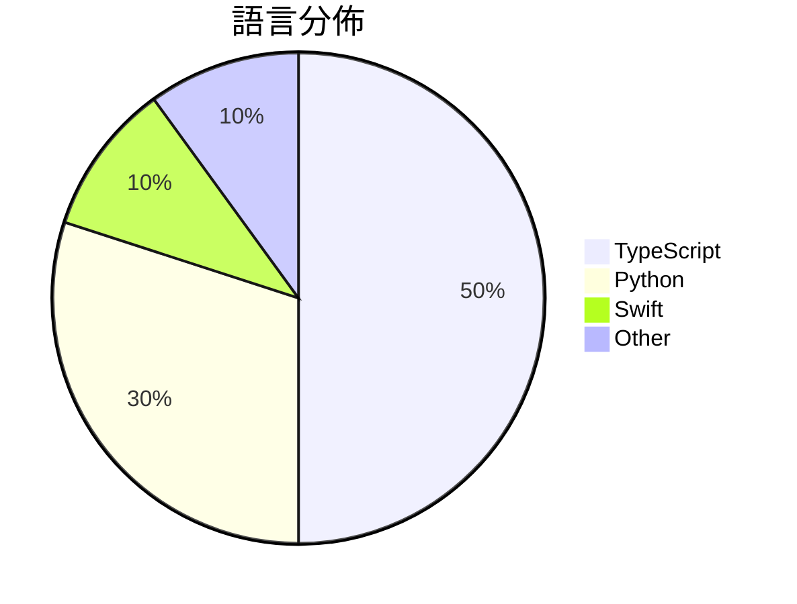

# GitHub Trending - 2026-05-04

> [!summary] 本日摘要
> 收錄 **10** 個新專案，合計 **34.4k** stars
> 語言分佈：TypeScript (5) · Python (3) · Swift (1) · Other (1)

> [!tip] 本週焦點
> **[[nexu-io--open-design|nexu-io/open-design]]** — 5 天內累積 19.6k stars（3.9k stars/天）
> 提供本地優先的開源設計工具，替代 Anthropic 的 Claude Design。



---

## 收錄列表

| # | 專案 | 分類 | Stars | 速度 | 安裝 | 語言 | 用途 |
| :--: | --- | --- | ---: | ---: | --- | --- | --- |
| 1 | [[nexu-io--open-design\|nexu-io/open-design]] | 開發工具 | 19.6k | 3.9k/天 | `medium` | TypeScript | 提供本地優先的開源設計工具，替代 Anthropic 的 Claude Desi |
| 2 | [[cursor--cookbook\|cursor/cookbook]] | 開發工具 | 3.3k | 547/天 | `easy` | TypeScript | 提供小範例以協助開發者使用 Cursor SDK 建立應用程式。 |
| 3 | [[theori-io--copy-fail-CVE-2026-31431\|theori-io/copy-fail-CVE-2026-31431]] | 安全 | 3.0k | 755/天 | `easy` | Python | 提供 CVE-2026-31431 的漏洞利用和修補方案，幫助用戶保護系統安全。 |
| 4 | [[denuitt1--mhr-cfw\|denuitt1/mhr-cfw]] | 安全 | 2.0k | 327/天 | `medium` | Python | 透過 Google Apps Script 和 Cloudflare Worke |
| 5 | [[willchen96--mike\|willchen96/mike]] | 開發工具 | 1.7k | 422/天 | `medium` | TypeScript | 提供開源的法律AI平台，簡化法律文件處理和管理。 |
| 6 | [[darrylmorley--whatcable\|darrylmorley/whatcable]] | 其他 | 1.4k | 724/天 | `easy` | Swift | 告訴你每條 USB-C 線纜在 Mac 上實際能做什麼的 macOS 菜單欄應用 |
| 7 | [[DanOps-1--Gpt-Agreement-Payment\|DanOps-1/Gpt-Agreement-Payment]] | 開發工具 | 964 | 161/天 | `medium` | Python | 提供 ChatGPT 订阅协议的端到端重放工具，包含 hCaptcha 求解器和 |
| 8 | [[b-nnett--codex-plusplus\|b-nnett/codex-plusplus]] | 開發工具 | 855 | 171/天 | `medium` | TypeScript | 為 Codex 桌面應用程式提供調整系統，讓用戶能夠注入自定義功能和修復 UI  |
| 9 | [[mattpocock--dictionary-of-ai-coding\|mattpocock/dictionary-of-ai-coding]] | 其他 | 849 | 425/天 | `easy` | TypeScript | 將 AI 編程術語翻譯成淺顯易懂的語言，幫助開發者理解和使用。 |
| 10 | [[wrongly-cuddly-obsession--NTSB_FOIA_MU5735\|wrongly-cuddly-obsession/NTSB_FOIA_MU5735]] | 其他 | 811 | 270/天 | `easy` | N/A | 提供 MU5735 調查的 FOIA 請求資料，並包含中文翻譯。 |

---

## 重點摘要

### 1. [[nexu-io--open-design|nexu-io/open-design]] `開發工具`

> 提供本地優先的開源設計工具，替代 Anthropic 的 Claude Design。

**19.6k** stars · **3.9k** stars/天 · TypeScript · `medium`

_建立 5 天內累積 19565 stars（3913/天），forks 2168（11.1%），顯示出強烈的社群關注。開發者 pftom 和其他貢獻者在開源社群中有良好的聲譽，過去參與過多個成功的開源專案。Open Design 解決了 Claude Design 的鎖定問題，提供了本地運行的靈活性，這在設計工具中是相對少見的。近期的推廣和社群討論可能進一步提升了其曝光率。高 forks/stars 比率顯示許多人對這個專案進行實際修改和使用，反映出其實用性和需求。_

---

### 2. [[cursor--cookbook|cursor/cookbook]] `開發工具`

> 提供小範例以協助開發者使用 Cursor SDK 建立應用程式。

**3.3k** stars · **547** stars/天 · TypeScript · `easy`

_建立 6 天內累積 3279 stars（547/天），forks 378（11.5%），顯示出強勁的增長潛力。這個專案的主要貢獻者來自 Cursor 團隊，過去有豐富的開發經驗。Cursor SDK 解決了開發者在雲端環境中整合編碼代理的需求，之前的方案往往缺乏即時狀態更新和多樣化範例。近期的推廣活動和社群討論也提升了關注度。技術上，隨著 TypeScript 和 Node.js 的流行，這樣的 SDK 變得更加可行，讓開發者能夠快速構建和測試應用。forks/stars 比率為 11.5%，顯示出許多人在積極修改和使用這個專案。_

---

### 3. [[theori-io--copy-fail-CVE-2026-31431|theori-io/copy-fail-CVE-2026-31431]] `安全`

> 提供 CVE-2026-31431 的漏洞利用和修補方案，幫助用戶保護系統安全。

**3.0k** stars · **755** stars/天 · Python · `easy`

_建立 4 天內累積 3020 stars（755/天），forks 630（20.9%），顯示出極高的關注度。作者 junomonster 和 tylerni7 在安全領域有一定的經驗，這個專案解決了針對 CVE-2026-31431 的漏洞利用和修補的需求，之前的工具往往無法針對特定 CVE 提供直接的解決方案。社群的反應熱烈，熱門問題如如何去混淆 Python 代碼和漏洞披露的討論，顯示出使用者對於這個工具的實用性和安全性的關注。技術上，這個專案的出現正好契合了當前對於 Linux 安全性檢查的需求，尤其是在多發行版的支持上，這在過去是相對稀缺的。_

---

### 4. [[denuitt1--mhr-cfw|denuitt1/mhr-cfw]] `安全`

> 透過 Google Apps Script 和 Cloudflare Workers 繞過 DPI 的流量轉發工具。

**2.0k** stars · **327** stars/天 · Python · `medium`

_建立 6 天內累積 1961 stars（327/天），forks 207（10.6%），顯示出強勁的增長勢頭。主要貢獻者包括多位活躍的開發者，顯示出社群的活躍度。這個工具解決了以往需要專用伺服器的流量隱藏問題，通過利用 Google 和 Cloudflare 的基礎設施，提供了一個更簡單的解決方案。社群的討論和問題反映了用戶對於隱私和安全的需求，這也促進了該專案的關注。最近的 commit 活動顯示出開發者對於問題的快速響應和改進。_

---

### 5. [[willchen96--mike|willchen96/mike]] `開發工具`

> 提供開源的法律AI平台，簡化法律文件處理和管理。

**1.7k** stars · **422** stars/天 · TypeScript · `medium`

_建立 4 天就累積 1688 stars（422/天），forks 441（26.1%），顯示出強烈的社群興趣。作者 willchen96 在開源社群中活躍，過去有多個開源專案的經驗。這個專案解決了法律文件處理的痛點，特別是對於小型律所和個人律師來說，傳統工具如 DocuSign 的高昂費用和限制性功能使得市場上有需求。近期的推廣活動和社群討論可能也促進了這一增長。技術上，隨著 Supabase 和 S3 服務的普及，這樣的解決方案變得越來越可行。高達 26.1% 的 forks/stars 比率顯示出許多人正在積極修改和使用這個專案，這對於未來的發展是個好兆頭。_

---

### 6. [[darrylmorley--whatcable|darrylmorley/whatcable]] `其他`

> 告訴你每條 USB-C 線纜在 Mac 上實際能做什麼的 macOS 菜單欄應用。

**1.4k** stars · **724** stars/天 · Swift · `easy`

_建立 2 天就累積 1448 stars（724/天），forks 33（2.3%），這顯示出用戶對於 USB-C 線纜功能的需求。作者 Darryl Morley 之前的開發經驗讓他能夠有效解決這一需求，因為許多用戶在使用 USB-C 線纜時常常無法確定其實際能力。這個工具的出現正好填補了市場上對於 USB-C 線纜功能透明度的空白。社群的反應也顯示出對於這個工具的高度興趣，尤其是對於其提供的詳細診斷信息。_

---

### 7. [[DanOps-1--Gpt-Agreement-Payment|DanOps-1/Gpt-Agreement-Payment]] `開發工具`

> 提供 ChatGPT 订阅协议的端到端重放工具，包含 hCaptcha 求解器和反欺诈机制研究。

**964** stars · **161** stars/天 · Python · `medium`

_建立 6 天就累積 964 stars（161/天），forks 431（44.7%），這顯示出相對高的實際使用和修改需求。作者 DanOps-1 在開源社群中有一定的影響力，這個專案解決了在使用 ChatGPT 訂閱服務時的自動化需求，特別是針對 hCaptcha 的解決方案。近期的社交媒體討論和技術論壇的反饋也促進了這個專案的曝光。由於反欺詐機制的實證數據提供了實用的洞見，這使得專案在安全研究和自動化測試領域引起了關注。forks/stars 比率高達 44.7%，顯示出許多開發者在積極修改和使用這個工具。_

---

### 8. [[b-nnett--codex-plusplus|b-nnett/codex-plusplus]] `開發工具`

> 為 Codex 桌面應用程式提供調整系統，讓用戶能夠注入自定義功能和修復 UI 錯誤。

**855** stars · **171** stars/天 · TypeScript · `medium`

_建立 5 天就累積 855 stars（171/天），forks 41（4.8%），這顯示出穩定的增長潛力。作者 b-nnett 之前在開源社群中活躍，這個專案解決了 Codex 用戶在功能擴展上的痛點，特別是對於需要自定義功能的用戶。近期的推廣活動和社群討論也可能促進了這個專案的曝光。技術上，Codex++ 的設計使得它能夠在不影響原始應用的情況下進行功能擴展，這在過去的工具中並不常見。forks/stars 比率顯示出用戶對這個工具的實際修改和使用需求。_

---

### 9. [[mattpocock--dictionary-of-ai-coding|mattpocock/dictionary-of-ai-coding]] `其他`

> 將 AI 編程術語翻譯成淺顯易懂的語言，幫助開發者理解和使用。

**849** stars · **425** stars/天 · TypeScript · `easy`

_建立 2 天就累積 849 stars（424.5/天），forks 114（13.4%），顯示出不錯的社群關注度。作者 Matt Pocock 之前在 AI 和開發工具領域有一定的經驗，這個專案解決了許多開發者在使用 AI 編程時面對的術語困惑，這在過去的資源中並未得到充分解決。社群對於這個專案的反應熱烈，可能是因為它填補了教育資源的空白，並且提供了實用的參考。這個專案的出現正好符合了當前開發者對於 AI 技術理解的需求，尤其是在快速變化的技術環境中。_

---

### 10. [[wrongly-cuddly-obsession--NTSB_FOIA_MU5735|wrongly-cuddly-obsession/NTSB_FOIA_MU5735]] `其他`

> 提供 MU5735 調查的 FOIA 請求資料，並包含中文翻譯。

**811** stars · **270** stars/天 · N/A · `easy`

_建立 3 天內累積 811 stars（270/天），forks 298（36.7%），這顯示出極高的使用者關注度。專案的主要貢獻者是 wrongly-cuddly-obsession，這位使用者過去在資料存檔方面有一定的經驗。這個專案解決了資料存取的問題，因為之前的資料已經被刪除，使用者無法獲取。NTSB 的資料發布也促進了這個專案的興起，因為它提供了更方便的資料獲取方式。社群的反應和討論也顯示出使用者對於該事件的關注，特別是在熱門問題中有許多討論。這個專案的 forks/stars 比率高達 36.7%，代表著許多人在實際修改和使用這個專案，顯示出其實用性和需求。_

---

## 今日到期複習

> [!tip] 根據間隔複習排程，今天該回顧的專案

```dataview
TABLE
  stars_per_day AS "Stars/天",
  category AS "分類",
  engagement AS "參與度"
FROM "Repos"
WHERE next_review AND date(next_review) <= date("2026-05-04") AND status != "archived"
SORT priority DESC
```

## 待處理

```dataviewjs
const pending = dv.pages('"Repos"').where(p => p.status === "to-review").length;
const unrated = dv.pages('"Repos"').where(p => p.status !== "archived" && p.status !== "to-review" && (p.my_rating || 0) === 0).length;
const noVerdict = dv.pages('"Repos"').where(p => p.status !== "archived" && (p.my_rating || 0) > 0 && (!p.verdict || p.verdict === "")).length;
const items = [];
if (pending > 0) items.push(`**${pending}** 個待分流`);
if (unrated > 0) items.push(`**${unrated}** 個已讀但未評分`);
if (noVerdict > 0) items.push(`**${noVerdict}** 個已評分但無結論`);
if (items.length > 0) dv.paragraph(items.join(" / "));
else dv.paragraph("所有專案都已處理完畢！");
```
