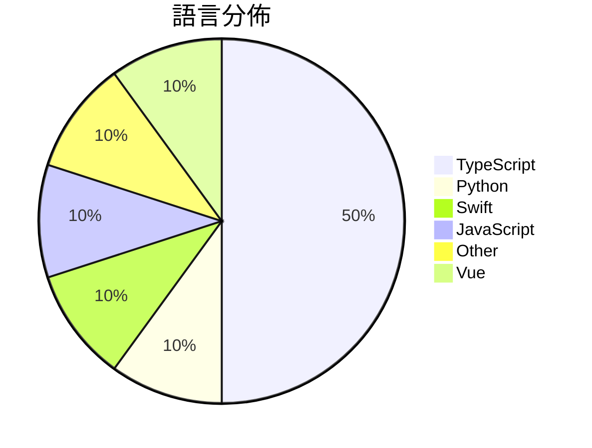

# GitHub Trending - 2026-05-05

> [!summary] 本日摘要
> 收錄 **10** 個新專案，合計 **36.5k** stars
> 語言分佈：TypeScript (5) · Python (1) · Swift (1) · JavaScript (1) · Other (1) · Vue (1)

> [!tip] 本週焦點
> **[[nexu-io--open-design|nexu-io/open-design]]** — 6 天內累積 24.1k stars（4.0k stars/天）
> 提供一個本地優先的開源設計工具，作為 Anthropic Claude Design 的替代方案。



---

## 收錄列表

| # | 專案 | 分類 | Stars | 速度 | 安裝 | 語言 | 用途 |
| :--: | --- | --- | ---: | ---: | --- | --- | --- |
| 1 | [[nexu-io--open-design\|nexu-io/open-design]] | 開發工具 | 24.1k | 4.0k/天 | `medium` | TypeScript | 提供一個本地優先的開源設計工具，作為 Anthropic Claude Desi |
| 2 | [[theori-io--copy-fail-CVE-2026-31431\|theori-io/copy-fail-CVE-2026-31431]] | 安全 | 3.2k | 634/天 | `easy` | Python | 揭露一個存在 9 年的 Linux 核心特權提升漏洞。 |
| 3 | [[willchen96--mike\|willchen96/mike]] | 開發工具 | 2.0k | 406/天 | `medium` | TypeScript | 提供開源的 AI 法律平台，讓用戶能夠輕鬆處理法律文件和相關數據。 |
| 4 | [[darrylmorley--whatcable\|darrylmorley/whatcable]] | 開發工具 | 1.7k | 575/天 | `easy` | Swift | 讓你清楚每條 USB-C 線的功能，避免充電慢的困擾。 |
| 5 | [[aattaran--deepclaude\|aattaran/deepclaude]] | 開發工具 | 1.0k | 1.0k/天 | `easy` | JavaScript | 以 17 倍更低的成本使用 Claude Code 的自主代理循環。 |
| 6 | [[mattpocock--dictionary-of-ai-coding\|mattpocock/dictionary-of-ai-coding]] | 其他 | 972 | 324/天 | `easy` | TypeScript | 將 AI 編程術語翻譯成通俗易懂的語言，幫助開發者理解。 |
| 7 | [[b-nnett--codex-plusplus\|b-nnett/codex-plusplus]] | 開發工具 | 896 | 149/天 | `medium` | TypeScript | 為 Codex 桌面應用提供的調整系統，讓用戶能夠注入自定義功能和修復 UI 錯 |
| 8 | [[wrongly-cuddly-obsession--NTSB_FOIA_MU5735\|wrongly-cuddly-obsession/NTSB_FOIA_MU5735]] | 其他 | 886 | 222/天 | `easy` | N/A | 提供 MU5735 事故調查的 FOIA 請求資料，作為資料存檔。 |
| 9 | [[t8y2--dbx\|t8y2/dbx]] | 開發工具 | 846 | 169/天 | `easy` | Vue | 輕量級跨平台資料庫管理工具，支援多種資料庫。 |
| 10 | [[GENEXIS-AI--chromex\|GENEXIS-AI/chromex]] | 開發工具 | 819 | 137/天 | `medium` | TypeScript | 提供 Codex 驅動的 Chrome 側邊助手，支援頁面上下文、標籤、語音和影 |

---

## 重點摘要

### 1. [[nexu-io--open-design|nexu-io/open-design]] `開發工具`

> 提供一個本地優先的開源設計工具，作為 Anthropic Claude Design 的替代方案。

**24.1k** stars · **4.0k** stars/天 · TypeScript · `medium`

_建立 6 天內累積 24088 stars（4015/天），forks 2611（10.8%），顯示出極高的使用興趣。開發者 pftom 和其他貢獻者在開源社群中有著良好的聲譽，這使得專案更具吸引力。Open Design 解決了 Claude Design 的封閉性問題，提供了一個靈活的本地設計解決方案，讓用戶能夠自由選擇代理和設計系統。最近的社交媒體討論和技術論壇的關注也促進了這個專案的曝光度。這個工具的出現正好符合了當前對開源設計工具需求的增長，特別是在設計自動化和生成藝術品方面。forks/stars 比率為 10.8%，顯示出許多用戶正在積極修改和使用這個工具。_

---

### 2. [[theori-io--copy-fail-CVE-2026-31431|theori-io/copy-fail-CVE-2026-31431]] `安全`

> 揭露一個存在 9 年的 Linux 核心特權提升漏洞。

**3.2k** stars · **634** stars/天 · Python · `easy`

_建立 5 天內累積 3171 stars（634/天），forks 673（21.2%），顯示出強烈的社群關注。這個專案由 Theori 的 Xint Code 團隊開發，該團隊在安全研究領域有良好的聲譽。這個漏洞的發現解決了過去在 Linux 系統中缺乏有效特權提升漏洞利用工具的痛點，之前的工具往往需要複雜的設置或不夠直觀。最近的安全討論和報導也使得這個工具受到更多關注，特別是在安全研究社群中。這個工具的出現正好符合了當前對於 Linux 系統安全性檢測的需求，並且其簡單的使用方式降低了進入門檻。_

---

### 3. [[willchen96--mike|willchen96/mike]] `開發工具`

> 提供開源的 AI 法律平台，讓用戶能夠輕鬆處理法律文件和相關數據。

**2.0k** stars · **406** stars/天 · TypeScript · `medium`

_建立 5 天就累積 2030 stars（406/天），forks 534（26.3%），這顯示出強烈的社群參與。作者 willchen96 先前在開源領域有豐富經驗，這次專案解決了法律文件處理中缺乏靈活性和自定義的痛點。由於法律行業對於自動化和數位化的需求逐漸增加，這個工具的出現正好填補了市場空白。社群的反饋和需求驅動了這個專案的快速成長，並且其開源性使得更多開發者願意參與進來。forks/stars 比率達到 26.3%，代表許多人在實際修改和使用這個專案。_

---

### 4. [[darrylmorley--whatcable|darrylmorley/whatcable]] `開發工具`

> 讓你清楚每條 USB-C 線的功能，避免充電慢的困擾。

**1.7k** stars · **575** stars/天 · Swift · `easy`

_建立 3 天內累積 1726 stars（575/天），forks 35（2.0%），顯示出強勁的增長潛力。這款工具的作者 Darryl Morley 之前有開發過其他實用工具，這次專注於 USB-C 電纜的功能診斷，解決了許多用戶在選擇電纜時的困惑，尤其是在 USB-C 標準混亂的情況下。社群對於這個工具的需求明顯，尤其是對於充電速度的診斷功能。這個工具的出現正好填補了市場上對於 USB-C 電纜性能透明度的需求，並且在技術上也符合現代 macOS 的開發標準，這使得它的實用性和吸引力大幅提升。_

---

### 5. [[aattaran--deepclaude|aattaran/deepclaude]] `開發工具`

> 以 17 倍更低的成本使用 Claude Code 的自主代理循環。

**1.0k** stars · **1.0k** stars/天 · JavaScript · `easy`

_建立 1 天就累積 1036 stars（1036/天），forks 47（4.5%），這是極端爆發式增長。作者 aliyarattaran-debug 之前有開發過其他 AI 相關工具，這個專案解決了高成本使用 AI 代理的痛點，讓用戶能以更低的價格獲得類似的功能。社群對於成本效益的關注促進了這個專案的快速增長。技術上，DeepSeek 的自動上下文緩存是其主要創新，這使得在多次請求中能夠顯著降低成本。forks/stars 比率在 4.5% 屬於中等，顯示出一定的實際修改需求。_

---

### 6. [[mattpocock--dictionary-of-ai-coding|mattpocock/dictionary-of-ai-coding]] `其他`

> 將 AI 編程術語翻譯成通俗易懂的語言，幫助開發者理解。

**972** stars · **324** stars/天 · TypeScript · `easy`

_建立 3 天就累積 972 stars（324/天），forks 122（12.6%），顯示出良好的社群反響。專案的作者 Matt Pocock 之前在 AI 領域有過豐富的經驗，這使得他能夠針對開發者的需求提供實用的資源。這個字典解決了許多開發者在學習 AI 編程時遇到的術語理解問題，之前的資源往往缺乏清晰的解釋。隨著 AI 技術的普及，對於簡單易懂的學習資源的需求也在增加，這讓這個專案得以迅速獲得關注。社群的活躍度也顯示出使用者對這個工具的需求，且目前無開放的 Issues，顯示出良好的維護狀態。_

---

### 7. [[b-nnett--codex-plusplus|b-nnett/codex-plusplus]] `開發工具`

> 為 Codex 桌面應用提供的調整系統，讓用戶能夠注入自定義功能和修復 UI 錯誤。

**896** stars · **149** stars/天 · TypeScript · `medium`

_建立 6 天就累積 896 stars（149/天），forks 43（4.8%），顯示出穩定的增長潛力。作者 b-nnett 是一位活躍的開發者，專注於 Codex 生態系統的擴展。Codex++ 解決了 Codex 桌面應用的自定義需求，之前用戶只能依賴官方功能，這限制了靈活性。近期的更新和社群反饋也促進了其使用率的提升。這個工具的出現，正好填補了用戶對於更高自定義需求的空白，並且在技術上利用了 Electron 框架的優勢，使得應用修改變得可行。_

---

### 8. [[wrongly-cuddly-obsession--NTSB_FOIA_MU5735|wrongly-cuddly-obsession/NTSB_FOIA_MU5735]] `其他`

> 提供 MU5735 事故調查的 FOIA 請求資料，作為資料存檔。

**886** stars · **222** stars/天 · N/A · `easy`

_建立 4 天就累積 886 stars（222/天），forks 329（37.1%），顯示出強烈的社群關注。這位貢獻者是 wrongly-cuddly-obsession，專注於資料存檔和翻譯工作。這個專案解決了之前缺乏集中存取 MU5735 事故調查資料的問題，尤其是在原始資料被刪除的情況下。社群對於這些資料的需求促使了這個專案的快速增長，尤其是在中文使用者中。NTSB 的數據發布也為這個專案提供了背景，讓使用者能夠更方便地獲取資料。forks/stars 比率高達 37.1%，顯示出許多人在實際修改和使用這個專案。_

---

### 9. [[t8y2--dbx|t8y2/dbx]] `開發工具`

> 輕量級跨平台資料庫管理工具，支援多種資料庫。

**846** stars · **169** stars/天 · Vue · `easy`

_建立 5 天內累積 846 stars（169/天），forks 46（5.4%），顯示出穩定的增長潛力。主要貢獻者包括 t8y2 和其他幾位開發者，他們在開源社群中有一定的影響力。DBX 解決了多資料庫管理的痛點，之前的工具如 DBeaver 雖然功能強大，但往往過於複雜，DBX 提供了更輕量的替代方案。最近的推廣活動和社群討論也可能促進了其曝光率。技術上，DBX 的輕量設計和多平台支持使其在當前市場中具備競爭力，特別是在開發者對資源使用效率日益重視的背景下。_

---

### 10. [[GENEXIS-AI--chromex|GENEXIS-AI/chromex]] `開發工具`

> 提供 Codex 驅動的 Chrome 側邊助手，支援頁面上下文、標籤、語音和影像工作流程。

**819** stars · **137** stars/天 · TypeScript · `medium`

_建立 6 天就累積 819 stars（137/天），forks 73（8.9%），顯示出穩定的增長潛力。作者 GenexisAI CHOI 先前在開源社區有過多項貢獻，這次專案解決了用戶在瀏覽器中整合多媒體處理的需求，之前的工具往往無法同時支持語音和影像的流暢操作。這個專案的推出正好填補了這一空白，並且在社交媒體上引起了一定的討論，進一步推動了其曝光率。隨著使用者對多媒體處理需求的增加，這個工具的可行性和實用性也隨之提升。_

---

## 今日到期複習

> [!tip] 根據間隔複習排程，今天該回顧的專案

```dataview
TABLE
  stars_per_day AS "Stars/天",
  category AS "分類",
  engagement AS "參與度"
FROM "Repos"
WHERE next_review AND date(next_review) <= date("2026-05-05") AND status != "archived"
SORT priority DESC
```

## 待處理

```dataviewjs
const pending = dv.pages('"Repos"').where(p => p.status === "to-review").length;
const unrated = dv.pages('"Repos"').where(p => p.status !== "archived" && p.status !== "to-review" && (p.my_rating || 0) === 0).length;
const noVerdict = dv.pages('"Repos"').where(p => p.status !== "archived" && (p.my_rating || 0) > 0 && (!p.verdict || p.verdict === "")).length;
const items = [];
if (pending > 0) items.push(`**${pending}** 個待分流`);
if (unrated > 0) items.push(`**${unrated}** 個已讀但未評分`);
if (noVerdict > 0) items.push(`**${noVerdict}** 個已評分但無結論`);
if (items.length > 0) dv.paragraph(items.join(" / "));
else dv.paragraph("所有專案都已處理完畢！");
```
