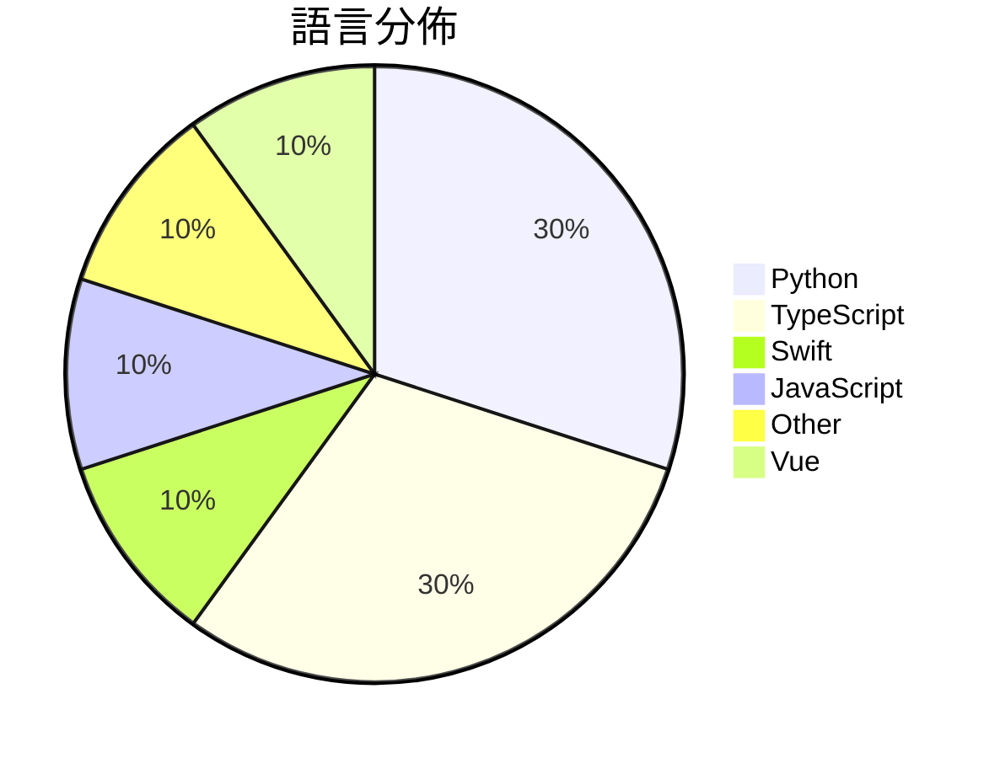

# GitHub Trending - 2026-05-06

> [!summary] 本日摘要
> 收錄 **10** 個新專案，合計 **14.3k** stars
> 語言分佈：Python (3) · TypeScript (3) · Swift (1) · JavaScript (1) · Other (1) · Vue (1)

> [!tip] 本週焦點
> **[[theori-io--copy-fail-CVE-2026-31431|theori-io/copy-fail-CVE-2026-31431]]** — 6 天內累積 3.3k stars（554 stars/天）
> 揭露 Linux 核心中的一個 9 年漏洞，協助安全研究人員進行特權提升測試。



---

## 收錄列表

| # | 專案 | 分類 | Stars | 速度 | 安裝 | 語言 | 用途 |
| :--: | --- | --- | ---: | ---: | --- | --- | --- |
| 1 | [[theori-io--copy-fail-CVE-2026-31431\|theori-io/copy-fail-CVE-2026-31431]] | 安全 | 3.3k | 554/天 | `easy` | Python | 揭露 Linux 核心中的一個 9 年漏洞，協助安全研究人員進行特權提升測試。 |
| 2 | [[willchen96--mike\|willchen96/mike]] | 其他 | 2.2k | 366/天 | `medium` | TypeScript | 提供開源的 AI 法律平台，簡化法律文件的處理與管理。 |
| 3 | [[darrylmorley--whatcable\|darrylmorley/whatcable]] | 開發工具 | 1.9k | 487/天 | `easy` | Swift | 告訴你每條 USB-C 線纜的實際功能，幫助解決充電速度慢的問題。 |
| 4 | [[aattaran--deepclaude\|aattaran/deepclaude]] |  | 1.3k | 665/天 |  | JavaScript | Use Claude Code's autonomous agent loop  |
| 5 | [[mattpocock--dictionary-of-ai-coding\|mattpocock/dictionary-of-ai-coding]] | 其他 | 1.1k | 268/天 | `easy` | TypeScript | 將 AI 編碼術語翻譯成淺顯易懂的語言，讓開發者不再困惑。 |
| 6 | [[vercel-labs--deepsec\|vercel-labs/deepsec]] | 安全 | 1.1k | 214/天 | `medium` | TypeScript | 一個用於發現代碼庫漏洞的安全工具，利用編碼代理進行自動化掃描。 |
| 7 | [[wrongly-cuddly-obsession--NTSB_FOIA_MU5735\|wrongly-cuddly-obsession/NTSB_FOIA_MU5735]] | 其他 | 940 | 188/天 | `easy` | N/A | 提供 MU5735 調查的 FOIA 請求相關資料的存檔。 |
| 8 | [[t8y2--dbx\|t8y2/dbx]] | 開發工具 | 918 | 153/天 | `medium` | Vue | 一個輕量級的跨平台資料庫客戶端，支援多種資料庫的管理與操作。 |
| 9 | [[vibeforge1111--keep-codex-fast\|vibeforge1111/keep-codex-fast]] | 開發工具 | 751 | 250/天 | `easy` | Python | 提供一種安全的方式來維護和清理 Codex 的本地狀態，避免性能下降。 |
| 10 | [[Fokkyp--SoftwareCopyright-Skill\|Fokkyp/SoftwareCopyright-Skill]] | 其他 | 713 | 119/天 | `medium` | Python | 自動生成中國軟件著作權申請材料，省去付費代辦的麻煩。 |

---

## 重點摘要

### 1. [[theori-io--copy-fail-CVE-2026-31431|theori-io/copy-fail-CVE-2026-31431]] `安全`

> 揭露 Linux 核心中的一個 9 年漏洞，協助安全研究人員進行特權提升測試。

**3.3k** stars · **554** stars/天 · Python · `easy`

_建立 6 天內累積 3321 stars（554/天），forks 714（21.5%），顯示出強烈的社群關注。作者 Theori 是知名的安全研究團隊，專注於漏洞發現和利用，這個專案解決了 Linux 核心中長期存在的特權提升問題，之前的工具無法針對這一特定漏洞提供有效的利用方式。這一漏洞的曝光引發了廣泛的討論和關注，尤其是在安全社群中。技術上，Linux 核心的安全性隨著版本更新而變化，這使得針對特定版本的漏洞利用工具變得更加重要。高 forks/stars 比率（21.5%）顯示出許多開發者正在實際修改和使用這個工具，這是其受歡迎的原因之一。_

---

### 2. [[willchen96--mike|willchen96/mike]] `其他`

> 提供開源的 AI 法律平台，簡化法律文件的處理與管理。

**2.2k** stars · **366** stars/天 · TypeScript · `medium`

_建立 6 天就累積 2194 stars（366/天），forks 606（27.6%），顯示出強烈的社群興趣。作者 willchen96 在開源領域有一定的背景，這個專案解決了法律文件處理的高成本和低效率問題，之前的解決方案多數是商業化的，缺乏靈活性。最近的推廣活動和社群討論可能也促進了這個專案的曝光率。高 forks/stars 比率顯示出許多人在實際修改和使用這個專案，這是值得注意的趨勢。_

---

### 3. [[darrylmorley--whatcable|darrylmorley/whatcable]] `開發工具`

> 告訴你每條 USB-C 線纜的實際功能，幫助解決充電速度慢的問題。

**1.9k** stars · **487** stars/天 · Swift · `easy`

_建立 4 天內累積 1949 stars（487/天），forks 39（2.0%），顯示出穩定的增長趨勢。作者 Darryl Morley 之前在硬體資訊和 macOS 應用開發方面有豐富經驗，解決了 USB-C 線纜功能不明的痛點，這在市場上是個獨特的需求。此專案的推出引起了社群的廣泛關注，尤其是在 Apple 生態系統中，USB-C 的普及使得這個工具變得更加重要。forks/stars 比率為 2.0%，顯示出使用者對這個工具的興趣較低，可能是因為它的功能相對專一。_

---

### 4. [[aattaran--deepclaude|aattaran/deepclaude]]

**1.3k** stars · **665** stars/天 · JavaScript

---

### 5. [[mattpocock--dictionary-of-ai-coding|mattpocock/dictionary-of-ai-coding]] `其他`

> 將 AI 編碼術語翻譯成淺顯易懂的語言，讓開發者不再困惑。

**1.1k** stars · **268** stars/天 · TypeScript · `easy`

_建立 4 天內累積 1070 stars（267.5/天），forks 131（12.2%），這顯示出相對較高的社群參與度。這個專案的作者 Matt Pocock 以其在 AI 領域的專業知識而聞名，並且致力於降低 AI 編碼的學習門檻。該專案填補了開發者在理解 AI 相關術語上的空白，特別是在許多開發者面對的術語混淆問題上。最近的推廣活動和社群的熱烈反應也促進了其快速增長。這個字典的出現正好符合當前對簡化 AI 編碼學習的需求，讓更多開發者能夠輕鬆進入這個領域。_

---

### 6. [[vercel-labs--deepsec|vercel-labs/deepsec]] `安全`

> 一個用於發現代碼庫漏洞的安全工具，利用編碼代理進行自動化掃描。

**1.1k** stars · **214** stars/天 · TypeScript · `medium`

_建立 5 天內累積 1069 stars（214/天），forks 69（6.5%），這顯示出其在開發者社群中的快速增長。作者 Vercel 是知名的前端平台，過去在開發工具和雲端服務方面有豐富的經驗。Deepsec 解決了傳統靜態分析工具在大型代碼庫中效率低下的痛點，這些工具往往無法快速適應代碼變化。近期的推廣活動和社群討論也促進了其曝光度。隨著 AI 技術的進步，Deepsec 能夠利用強大的模型進行深度分析，這在現有的安全工具中是相對少見的。forks/stars 比率顯示出開發者對於這個工具的實際修改和使用意願，6.5% 的比率屬於中等偏高，表明有不少人正在積極探索其功能。_

---

### 7. [[wrongly-cuddly-obsession--NTSB_FOIA_MU5735|wrongly-cuddly-obsession/NTSB_FOIA_MU5735]] `其他`

> 提供 MU5735 調查的 FOIA 請求相關資料的存檔。

**940** stars · **188** stars/天 · N/A · `easy`

_建立 5 天就累積 940 stars（188/天），forks 345（36.7%），顯示出強烈的社群參與。該專案由一位名為 wrongly-cuddly-obsession 的貢獻者主導，他們的過去貢獻不詳，但這個專案解決了對 MU5735 事故的資料存取需求，特別是在原始資料被刪除的情況下。社群中對於事故的討論和資料的需求促進了這個專案的快速增長，尤其是對於中文翻譯的需求。最近的 commit 活動顯示出維護者對於專案的持續關注，並且有社群成員積極參與討論和提供反饋。這些因素共同促成了專案的快速成長。_

---

### 8. [[t8y2--dbx|t8y2/dbx]] `開發工具`

> 一個輕量級的跨平台資料庫客戶端，支援多種資料庫的管理與操作。

**918** stars · **153** stars/天 · Vue · `medium`

_建立 6 天內累積 918 stars（153/天），forks 54（5.9%），顯示出不錯的增長潛力。開發者 t8y2 和其團隊在資料庫管理工具領域有一定的經驗，這個專案解決了多資料庫管理的痛點，特別是對於需要跨平台使用的開發者。近期的推廣活動和社群的積極反饋也可能促進了其快速增長。_

---

### 9. [[vibeforge1111--keep-codex-fast|vibeforge1111/keep-codex-fast]] `開發工具`

> 提供一種安全的方式來維護和清理 Codex 的本地狀態，避免性能下降。

**751** stars · **250** stars/天 · Python · `easy`

_建立 3 天就累積 751 stars（250/天），forks 42（5.6%），顯示出穩定的增長。作者 vibeforge1111 之前的專案經驗使其對 Codex 的使用有深入了解，這個工具解決了 Codex 使用者在長期使用後性能下降的問題，特別是當用戶需要管理大量的聊天記錄和專案歷史時。近期的推廣活動和社群討論也可能促進了這個專案的曝光率。這個工具的設計符合當前對於資料安全和性能優化的需求，特別是在開發者社群中，對於如何有效管理本地狀態的需求日益增加。_

---

### 10. [[Fokkyp--SoftwareCopyright-Skill|Fokkyp/SoftwareCopyright-Skill]] `其他`

> 自動生成中國軟件著作權申請材料，省去付費代辦的麻煩。

**713** stars · **119** stars/天 · Python · `medium`

_建立 6 天內累積 713 stars（119/天），forks 149（20.9%），顯示出強烈的社群興趣。Fokkyp 是這個專案的主要貢獻者，過去的經驗可能讓他對開發者的需求有深刻理解。這個工具解決了開發者在申請軟著過程中面臨的繁瑣文檔整理問題，之前的解決方案往往需要付費代辦，這使得許多開發者不得不依賴外部服務。隨著開源文化的推廣，這個工具的出現正好滿足了開發者對於成本和資料控制的需求。社群的反應也表明，這個工具的需求是持續增長的。_

---

## 今日到期複習

> [!tip] 根據間隔複習排程，今天該回顧的專案

```dataview
TABLE
  stars_per_day AS "Stars/天",
  category AS "分類",
  engagement AS "參與度"
FROM "Repos"
WHERE next_review AND date(next_review) <= date("2026-05-06") AND status != "archived"
SORT priority DESC
```

## 待處理

```dataviewjs
const pending = dv.pages('"Repos"').where(p => p.status === "to-review").length;
const unrated = dv.pages('"Repos"').where(p => p.status !== "archived" && p.status !== "to-review" && (p.my_rating || 0) === 0).length;
const noVerdict = dv.pages('"Repos"').where(p => p.status !== "archived" && (p.my_rating || 0) > 0 && (!p.verdict || p.verdict === "")).length;
const items = [];
if (pending > 0) items.push(`**${pending}** 個待分流`);
if (unrated > 0) items.push(`**${unrated}** 個已讀但未評分`);
if (noVerdict > 0) items.push(`**${noVerdict}** 個已評分但無結論`);
if (items.length > 0) dv.paragraph(items.join(" / "));
else dv.paragraph("所有專案都已處理完畢！");
```
