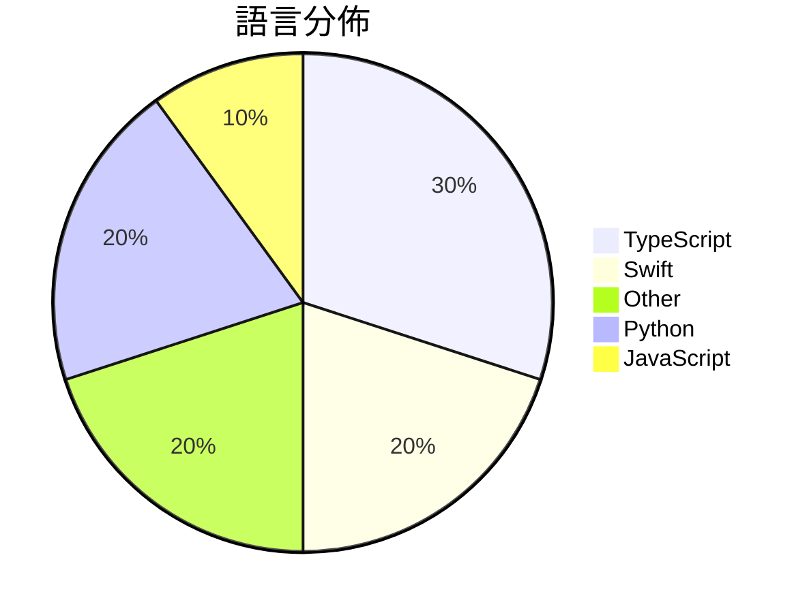

# GitHub Trending - 2026-05-07

> [!summary] 本日摘要
> 收錄 **10** 個新專案，合計 **10.8k** stars
> 語言分佈：TypeScript (3) · Swift (2) · Other (2) · Python (2) · JavaScript (1)

> [!tip] 本週焦點
> **[[darrylmorley--whatcable|darrylmorley/whatcable]]** — 5 天內累積 2.1k stars（410 stars/天）
> 幫你了解每根 USB-C 線的實際功能，避免充電慢的困擾。



---

## 收錄列表

| # | 專案 | 分類 | Stars | 速度 | 安裝 | 語言 | 用途 |
| :--: | --- | --- | ---: | ---: | --- | --- | --- |
| 1 | [[darrylmorley--whatcable\|darrylmorley/whatcable]] | 其他 | 2.1k | 410/天 | `easy` | Swift | 幫你了解每根 USB-C 線的實際功能，避免充電慢的困擾。 |
| 2 | [[aattaran--deepclaude\|aattaran/deepclaude]] |  | 1.5k | 497/天 |  | JavaScript | Use Claude Code's autonomous agent loop  |
| 3 | [[vercel-labs--deepsec\|vercel-labs/deepsec]] | 安全 | 1.4k | 231/天 | `medium` | TypeScript | 提供 AI 驅動的漏洞掃描，幫助開發者快速發現和修復代碼中的安全漏洞。 |
| 4 | [[mattpocock--dictionary-of-ai-coding\|mattpocock/dictionary-of-ai-coding]] | 開發工具 | 1.2k | 231/天 | `easy` | TypeScript | 將 AI 編程術語翻譯成簡單易懂的英文，幫助開發者打破行業術語的壁壘。 |
| 5 | [[wrongly-cuddly-obsession--NTSB_FOIA_MU5735\|wrongly-cuddly-obsession/NTSB_FOIA_MU5735]] | 其他 | 976 | 163/天 | `easy` | N/A | 提供 MU5735 調查的 FOIA 請求資料，並包含中文翻譯。 |
| 6 | [[vibeforge1111--keep-codex-fast\|vibeforge1111/keep-codex-fast]] | 開發工具 | 816 | 204/天 | `easy` | Python | 提供一個備份優先的 Codex 技能，幫助保持本地 Codex 狀態快速、乾淨和 |
| 7 | [[XBuilderLAB--cheat-on-content\|XBuilderLAB/cheat-on-content]] | 其他 | 778 | 778/天 | `easy` | Python | 幫助內容創作者透過數據分析優化發文策略，提升流量和粉絲數。 |
| 8 | [[jherrodthomas--automotive-skills-suite\|jherrodthomas/automotive-skills-suite]] | 開發工具 | 730 | 146/天 | `medium` | N/A | 提供 152 種可安裝的汽車工程技能，涵蓋安全、網路安全、質量等領域，並配有確認 |
| 9 | [[crafter-station--petdex\|crafter-station/petdex]] | 開發工具 | 724 | 181/天 | `easy` | TypeScript | 提供 Codex 兼容的動畫寵物公共畫廊，讓用戶可以輕鬆瀏覽和下載寵物資源。 |
| 10 | [[tddworks--baguette\|tddworks/baguette]] | 開發工具 | 691 | 138/天 | `easy` | Swift | 提供無頭 iOS 模擬器管理和主機端輸入注入功能，支持 iOS 26 的多點觸控 |

---

## 重點摘要

### 1. [[darrylmorley--whatcable|darrylmorley/whatcable]] `其他`

> 幫你了解每根 USB-C 線的實際功能，避免充電慢的困擾。

**2.1k** stars · **410** stars/天 · Swift · `easy`

_建立 5 天內累積 2052 stars（410/天），forks 42（2.0%），顯示出穩定的增長潛力。作者 Darryl Morley 之前曾有其他開源專案，這次專案解決了 USB-C 線功能不明的痛點，讓用戶能夠快速識別電纜的能力，尤其是在多種 USB-C 線混雜的情況下。這個工具的推出引起了社群的廣泛關注，並且在技術論壇上獲得了不少討論。隨著 USB-C 設備的普及，這個工具的需求也隨之增加，讓它成為一個實用的解決方案。forks/stars 比率為 2.0%，顯示出用戶對於這個工具的實際修改和使用意願。_

---

### 2. [[aattaran--deepclaude|aattaran/deepclaude]]

**1.5k** stars · **497** stars/天 · JavaScript

---

### 3. [[vercel-labs--deepsec|vercel-labs/deepsec]] `安全`

> 提供 AI 驅動的漏洞掃描，幫助開發者快速發現和修復代碼中的安全漏洞。

**1.4k** stars · **231** stars/天 · TypeScript · `medium`

_建立 6 天就累積 1384 stars（231/天），forks 83（6.0%），這顯示出該專案的快速增長。主要貢獻者 Vercel 是知名的雲端平台，過去在開發工具方面有豐富的經驗。Deepsec 解決了傳統靜態分析工具無法有效識別深層漏洞的痛點，特別是在大型代碼庫中，這使得開發者能夠更快地修復安全問題。社群的反應熱烈，尤其是在 GitHub Issues 中，對於如何處理速率限制的討論引起了關注，顯示出使用者對於性能的期待。這個工具的成功也反映了 AI 在安全領域的應用潛力，尤其是在代碼審查和漏洞發現方面。_

---

### 4. [[mattpocock--dictionary-of-ai-coding|mattpocock/dictionary-of-ai-coding]] `開發工具`

> 將 AI 編程術語翻譯成簡單易懂的英文，幫助開發者打破行業術語的壁壘。

**1.2k** stars · **231** stars/天 · TypeScript · `easy`

_建立 5 天內累積 1154 stars（231/天），forks 139（12.0%），顯示出穩定的增長潛力。作者 Matt Pocock 是一位活躍的開發者，專注於簡化 AI 編程的學習曲線。這個專案填補了市場上對於 AI 編程術語的需求，讓開發者能夠更快上手。近期的社群討論和對於 AI 技術的興趣也促進了這個專案的曝光度。高達 12% 的 forks/stars 比率顯示出許多開發者對這個字典有實際的修改和使用需求，這是個良好的信號。_

---

### 5. [[wrongly-cuddly-obsession--NTSB_FOIA_MU5735|wrongly-cuddly-obsession/NTSB_FOIA_MU5735]] `其他`

> 提供 MU5735 調查的 FOIA 請求資料，並包含中文翻譯。

**976** stars · **163** stars/天 · N/A · `easy`

_建立 6 天內累積 976 stars（163/天），forks 357（36.6%），顯示出強烈的社群互動。這位作者是 wrongly-cuddly-obsession，過去在 GitHub 上的貢獻不明，但此專案針對 MU5735 事故的 FOIA 資料提供了一個集中化的存取點，解決了許多使用者在尋找這類資料時的困難。這個專案的興起可能與 MU5735 事故的持續關注有關，並且社群對於透明化調查過程的需求也促進了其流行。資料的翻譯和整理使得這個專案對於非英語使用者尤其有吸引力，進一步擴大了其影響力。_

---

### 6. [[vibeforge1111--keep-codex-fast|vibeforge1111/keep-codex-fast]] `開發工具`

> 提供一個備份優先的 Codex 技能，幫助保持本地 Codex 狀態快速、乾淨和可恢復。

**816** stars · **204** stars/天 · Python · `easy`

_建立 4 天內累積 816 stars（204/天），forks 45（5.5%），這顯示出穩定的增長。作者 vibeforge1111 是該專案的主要貢獻者，過去可能有相關的開發經驗。這個工具解決了 Codex 使用過程中出現的性能下降問題，特別是在長時間使用後，許多用戶會發現 Codex 變得緩慢，這個工具提供了一種安全的維護方式。最近的推廣活動或社群討論可能促進了這個專案的曝光。隨著開發者對本地開發環境的重視，這個工具的需求逐漸增加。forks/stars 比率相對較低，顯示出大多數用戶仍在觀望階段。_

---

### 7. [[XBuilderLAB--cheat-on-content|XBuilderLAB/cheat-on-content]] `其他`

> 幫助內容創作者透過數據分析優化發文策略，提升流量和粉絲數。

**778** stars · **778** stars/天 · Python · `easy`

_建立 1 天就累積 778 stars（778/天），forks 162（20.8%），這顯示出強烈的用戶興趣。作者是 woniuxuezhang 和 Jooonnn，他們在內容創作和數據分析方面有豐富的經驗。這個工具解決了內容創作者在發文時缺乏數據支持的痛點，讓使用者能夠基於自己的歷史數據進行精準的內容創作。最近的推廣活動和社群討論可能也促進了這個工具的快速增長。技術上，這個工具的設計使得它能夠自動進化，這在目前的內容創作工具中是比較少見的，這樣的特點使得它在市場上有一定的競爭優勢。_

---

### 8. [[jherrodthomas--automotive-skills-suite|jherrodthomas/automotive-skills-suite]] `開發工具`

> 提供 152 種可安裝的汽車工程技能，涵蓋安全、網路安全、質量等領域，並配有確認審核者。

**730** stars · **146** stars/天 · N/A · `medium`

_建立 5 天內累積 730 stars（146/天），forks 15（2.1%），顯示出穩定的增長潛力。作者 jherrodthomas 在汽車工程領域有豐富的經驗，這個專案解決了傳統交付物生成過程中的低效問題，過去的解決方案往往依賴手動編輯，導致高錯誤率和低一致性。這個專案的出現正好填補了這一空白，並且在社群中引起了關注。技術生態的變化，如自動化工具的普及，使得這種技能套件變得可行。forks/stars 比率相對較低，顯示出使用者對於這個工具的觀望態度，可能是因為它的應用場景較為專業。_

---

### 9. [[crafter-station--petdex|crafter-station/petdex]] `開發工具`

> 提供 Codex 兼容的動畫寵物公共畫廊，讓用戶可以輕鬆瀏覽和下載寵物資源。

**724** stars · **181** stars/天 · TypeScript · `easy`

_建立 4 天就累積 724 stars（181/天），forks 32（4.4%），這顯示出相對穩定的關注度。作者 Railly 和其他貢獻者在開源社群中有一定的影響力，之前也參與過多個相關專案。Petdex 解決了用戶在尋找和管理 Codex 兼容寵物資源時的痛點，之前的解決方案往往缺乏社群互動和資源管理的便利性。近期的推廣活動和社群討論也可能促進了這個專案的曝光率。技術上，隨著 Next.js 和 AWS SDK 的成熟，這個工具的實現變得更加可行。forks/stars 比率顯示出用戶對於這個專案的實際修改和使用意願較高，這也反映了其在開發者中的受歡迎程度。_

---

### 10. [[tddworks--baguette|tddworks/baguette]] `開發工具`

> 提供無頭 iOS 模擬器管理和主機端輸入注入功能，支持 iOS 26 的多點觸控和 60fps 流媒體。

**691** stars · **138** stars/天 · Swift · `easy`

_建立 5 天內累積 691 stars（138/天），forks 26（3.8%），這顯示出一定的關注度。這個專案由 hanrw 和 GitHub Actions bot 貢獻，解決了無法在 iOS 26 上使用舊有模擬器工具的痛點，因為舊工具無法適應新的 HID 訊息格式。這個工具的推出可能與開發者對無頭測試需求的增加有關，特別是在自動化測試和 CI/CD 流程中。forks/stars 比率在 3.8% 的範圍內，表明有一定的使用者在進行修改和實驗。_

---

## 今日到期複習

> [!tip] 根據間隔複習排程，今天該回顧的專案

```dataview
TABLE
  stars_per_day AS "Stars/天",
  category AS "分類",
  engagement AS "參與度"
FROM "Repos"
WHERE next_review AND date(next_review) <= date("2026-05-07") AND status != "archived"
SORT priority DESC
```

## 待處理

```dataviewjs
const pending = dv.pages('"Repos"').where(p => p.status === "to-review").length;
const unrated = dv.pages('"Repos"').where(p => p.status !== "archived" && p.status !== "to-review" && (p.my_rating || 0) === 0).length;
const noVerdict = dv.pages('"Repos"').where(p => p.status !== "archived" && (p.my_rating || 0) > 0 && (!p.verdict || p.verdict === "")).length;
const items = [];
if (pending > 0) items.push(`**${pending}** 個待分流`);
if (unrated > 0) items.push(`**${unrated}** 個已讀但未評分`);
if (noVerdict > 0) items.push(`**${noVerdict}** 個已評分但無結論`);
if (items.length > 0) dv.paragraph(items.join(" / "));
else dv.paragraph("所有專案都已處理完畢！");
```
