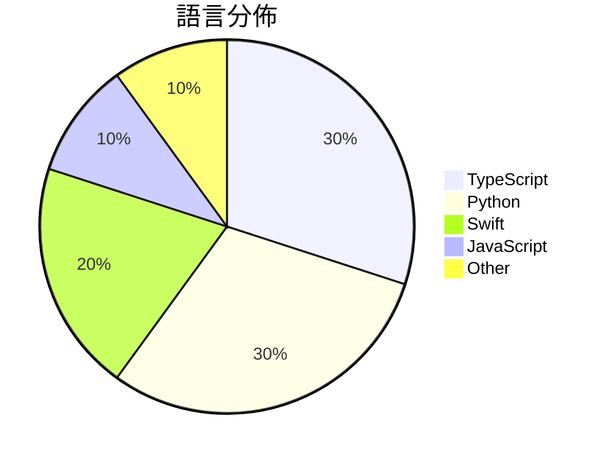

# GitHub Trending - 2026-05-08

> [!summary] 本日摘要
> 收錄 **10** 個新專案，合計 **11.6k** stars
> 語言分佈：TypeScript (3) · Python (3) · Swift (2) · JavaScript (1) · Other (1)

> [!tip] 本週焦點
> **[[darrylmorley--whatcable|darrylmorley/whatcable]]** — 6 天內累積 2.1k stars（351 stars/天）
> 告訴你每根插入 Mac 的 USB-C 線纜實際能做什麼的 macOS 菜單欄應用程式。



---

## 收錄列表

| # | 專案 | 分類 | Stars | 速度 | 安裝 | 語言 | 用途 |
| :--: | --- | --- | ---: | ---: | --- | --- | --- |
| 1 | [[darrylmorley--whatcable\|darrylmorley/whatcable]] | 開發工具 | 2.1k | 351/天 | `easy` | Swift | 告訴你每根插入 Mac 的 USB-C 線纜實際能做什麼的 macOS 菜單欄應 |
| 2 | [[aattaran--deepclaude\|aattaran/deepclaude]] |  | 1.6k | 399/天 |  | JavaScript | Use Claude Code's autonomous agent loop  |
| 3 | [[mattpocock--dictionary-of-ai-coding\|mattpocock/dictionary-of-ai-coding]] | 開發工具 | 1.2k | 204/天 | `easy` | TypeScript | 將 AI 編程術語翻譯成易懂的英文，幫助開發者克服行業術語的困惑。 |
| 4 | [[yaojingang--yao-open-prompts\|yaojingang/yao-open-prompts]] | AI/ML | 1.1k | 1.1k/天 | `easy` | Python | 提供多場景的中文 AI 提示詞庫，適用於工作、學習、內容創作等。 |
| 5 | [[XBuilderLAB--cheat-on-content\|XBuilderLAB/cheat-on-content]] | 開發工具 | 1.0k | 511/天 | `easy` | Python | 透過自動進化的運營專家，幫助創作者量化靈感並提升內容表現。 |
| 6 | [[strukto-ai--mirage\|strukto-ai/mirage]] | 開發工具 | 1.0k | 1.0k/天 | `easy` | TypeScript | 為 AI 代理提供統一的虛擬檔案系統，讓多種服務如 S3、Google Driv |
| 7 | [[crafter-station--petdex\|crafter-station/petdex]] | 開發工具 | 961 | 192/天 | `medium` | TypeScript | 提供 Codex 兼容的動畫寵物的公共畫廊。 |
| 8 | [[jherrodthomas--automotive-skills-suite\|jherrodthomas/automotive-skills-suite]] | 開發工具 | 918 | 153/天 | `medium` | N/A | 提供超過 150 種可安裝的 Claude 技能，涵蓋汽車工程的多個領域，如功能 |
| 9 | [[vibeforge1111--keep-codex-fast\|vibeforge1111/keep-codex-fast]] | 開發工具 | 873 | 175/天 | `easy` | Python | 提供一個備份優先的 Codex 技能，讓本地 Codex 狀態保持快速、乾淨且可 |
| 10 | [[tddworks--baguette\|tddworks/baguette]] | 開發工具 | 739 | 123/天 | `easy` | Swift | 提供無頭 iOS 模擬器管理和主機端輸入注入功能，讓開發者能夠高效測試 iOS  |

---

## 重點摘要

### 1. [[darrylmorley--whatcable|darrylmorley/whatcable]] `開發工具`

> 告訴你每根插入 Mac 的 USB-C 線纜實際能做什麼的 macOS 菜單欄應用程式。

**2.1k** stars · **351** stars/天 · Swift · `easy`

_建立 6 天就累積 2107 stars（351/天），forks 43（2.0%），顯示出穩定的增長趨勢。作者 Darryl Morley 之前的開發經驗使他能夠針對 USB-C 的複雜性提出有效解決方案，這在市場上是之前缺乏的。用戶對於 USB-C 線纜的功能了解不夠，WhatCable 則填補了這一空白，讓用戶能夠清楚知道每根線纜的實際能力。社群的反應也顯示出對於這個工具的需求，特別是在 USB-C 逐漸成為主流的背景下。forks/stars 比率低於 5% 表示大部分用戶仍在觀望，未來可能會有更多的實際應用案例。_

---

### 2. [[aattaran--deepclaude|aattaran/deepclaude]]

**1.6k** stars · **399** stars/天 · JavaScript

---

### 3. [[mattpocock--dictionary-of-ai-coding|mattpocock/dictionary-of-ai-coding]] `開發工具`

> 將 AI 編程術語翻譯成易懂的英文，幫助開發者克服行業術語的困惑。

**1.2k** stars · **204** stars/天 · TypeScript · `easy`

_建立 6 天內累積 1224 stars（204/天），forks 146（11.9%），顯示出開發者對於簡化 AI 編程術語的需求。作者 Matt Pocock 之前在開源社群中活躍，致力於提升 AI 開發的可及性。這個字典解決了許多開發者在學習 AI 編程時遇到的術語障礙，提供了清晰的解釋，讓新手能夠更快上手。近期的推廣活動和社群反饋也促進了這個專案的曝光率。整體來看，這是一個自然擴散的趨勢，因為開發者對於簡化複雜概念的需求持續增長。_

---

### 4. [[yaojingang--yao-open-prompts|yaojingang/yao-open-prompts]] `AI/ML`

> 提供多場景的中文 AI 提示詞庫，適用於工作、學習、內容創作等。

**1.1k** stars · **1.1k** stars/天 · Python · `easy`

_建立 1 天就累積 1131 stars（1131/天），forks 177（15.6%），這顯示出其快速增長的潛力。作者 Yaojingang 在提示詞和 AI 工具方面有一定的背景，這使得他能夠針對市場需求提供實用的解決方案。這個庫解決了中文提示詞資源匱乏的問題，特別是在工作和學習場景中，之前的解決方案往往缺乏針對性和系統性。隨著 AI 應用的普及，對於高質量提示詞的需求也在增加，這使得 Yao Open Prompts 的出現恰逢其時。forks/stars 比率為 15.6%，顯示出許多用戶對此專案有實際的修改和應用需求。_

---

### 5. [[XBuilderLAB--cheat-on-content|XBuilderLAB/cheat-on-content]] `開發工具`

> 透過自動進化的運營專家，幫助創作者量化靈感並提升內容表現。

**1.0k** stars · **511** stars/天 · Python · `easy`

_建立 2 天就累積 1022 stars（511/天），forks 217（21.2%），顯示出強烈的社群興趣。這位開發者過去在內容創作和數據分析方面有豐富經驗，這個工具解決了創作者在內容表現上缺乏量化依據的痛點，讓用戶能夠透過數據來優化內容策略。近期的推廣活動和社群討論也促進了這個工具的曝光度，吸引了大量創作者的關注。這個工具的設計理念迎合了當前對數據驅動創作的需求，並且提供了一個專屬於用戶的運營專家，這在市場上是相對獨特的。_

---

### 6. [[strukto-ai--mirage|strukto-ai/mirage]] `開發工具`

> 為 AI 代理提供統一的虛擬檔案系統，讓多種服務如 S3、Google Drive 等能夠無縫整合。

**1.0k** stars · **1.0k** stars/天 · TypeScript · `easy`

_建立 1 天就累積 1003 stars（1003/天），forks 58（5.8%），這顯示出強烈的興趣和需求。作者 zechengz 在開源領域有一定的影響力，這個專案解決了 AI 代理在多後端整合上的痛點，之前的方案往往需要針對每個服務學習不同的 API。這個工具的出現讓開發者能夠更有效率地使用 AI 代理，並且在社群中引發了熱烈討論。技術上，FUSE 的使用使得這個方案在檔案系統層面上具備了靈活性，這在以往的工具中並不常見。_

---

### 7. [[crafter-station--petdex|crafter-station/petdex]] `開發工具`

> 提供 Codex 兼容的動畫寵物的公共畫廊。

**961** stars · **192** stars/天 · TypeScript · `medium`

_建立 5 天就累積 961 stars（192/天），forks 43（4.5%），這顯示出穩定的增長。這個專案的作者 Railly 和其他貢獻者在開源社群中有一定的影響力，之前也有其他成功的專案。Petdex 解決了動畫寵物分享的痛點，之前的方案通常需要繁瑣的手動上傳和驗證流程，這使得使用者的參與度降低。最近的社群討論和推廣活動也讓這個專案獲得了更多的曝光。技術上，使用 Bun 和 Next.js 的組合讓這個專案在性能和開發效率上都有不錯的表現。forks/stars 比率適中，顯示出有一定的實際使用者在進行修改和擴展。_

---

### 8. [[jherrodthomas--automotive-skills-suite|jherrodthomas/automotive-skills-suite]] `開發工具`

> 提供超過 150 種可安裝的 Claude 技能，涵蓋汽車工程的多個領域，如功能安全、網路安全、品質管理等。

**918** stars · **153** stars/天 · N/A · `medium`

_建立 6 天內累積 918 stars（153/天），forks 15（1.6%），顯示出穩定的增長趨勢。作者 jherrodthomas 具備豐富的汽車工程背景，這個工具解決了傳統手動處理交付物的低效率問題，讓團隊能夠更快速地生成和審核文檔。這個專案的出現正好填補了汽車行業對於自動化工具的需求，特別是在功能安全和網路安全等領域。社群的反饋也顯示出對於這種自動化解決方案的需求，進一步推動了其流行。_

---

### 9. [[vibeforge1111--keep-codex-fast|vibeforge1111/keep-codex-fast]] `開發工具`

> 提供一個備份優先的 Codex 技能，讓本地 Codex 狀態保持快速、乾淨且可恢復。

**873** stars · **175** stars/天 · Python · `easy`

_建立 5 天就累積 873 stars（175/天），forks 51（5.8%），這顯示出相對穩定的增長。作者 vibeforge1111 之前的專案經驗可能使得這個工具在設計上更為成熟。該工具解決了 Codex 使用者在長時間使用後性能下降的痛點，特別是對於需要長期保留對話記錄的開發者。社群對於這個工具的需求在於希望能夠安全地進行維護而不損失重要的上下文。最近的推文和討論也可能促進了這個工具的曝光率。forks/stars 比率顯示出有相當比例的使用者在實際修改和使用這個工具，這是活躍社群的指標。_

---

### 10. [[tddworks--baguette|tddworks/baguette]] `開發工具`

> 提供無頭 iOS 模擬器管理和主機端輸入注入功能，讓開發者能夠高效測試 iOS 應用。

**739** stars · **123** stars/天 · Swift · `easy`

_建立 6 天內累積 739 stars（123/天），forks 27（3.7%），顯示出穩定的增長潛力。作者 hanrw 之前在 iOS 開發領域有豐富經驗，這個工具解決了傳統模擬器管理的繁瑣問題，特別是對於需要高效測試的開發者。沒有明顯的觸發事件，但其功能設計和便利性吸引了開發者的注意。隨著 iOS 開發需求的增加，這個工具的實用性愈發明顯。forks/stars 比率相對較低，顯示出使用者對其功能的實際應用尚在探索階段。_

---

## 今日到期複習

> [!tip] 根據間隔複習排程，今天該回顧的專案

```dataview
TABLE
  stars_per_day AS "Stars/天",
  category AS "分類",
  engagement AS "參與度"
FROM "Repos"
WHERE next_review AND date(next_review) <= date("2026-05-08") AND status != "archived"
SORT priority DESC
```

## 待處理

```dataviewjs
const pending = dv.pages('"Repos"').where(p => p.status === "to-review").length;
const unrated = dv.pages('"Repos"').where(p => p.status !== "archived" && p.status !== "to-review" && (p.my_rating || 0) === 0).length;
const noVerdict = dv.pages('"Repos"').where(p => p.status !== "archived" && (p.my_rating || 0) > 0 && (!p.verdict || p.verdict === "")).length;
const items = [];
if (pending > 0) items.push(`**${pending}** 個待分流`);
if (unrated > 0) items.push(`**${unrated}** 個已讀但未評分`);
if (noVerdict > 0) items.push(`**${noVerdict}** 個已評分但無結論`);
if (items.length > 0) dv.paragraph(items.join(" / "));
else dv.paragraph("所有專案都已處理完畢！");
```
