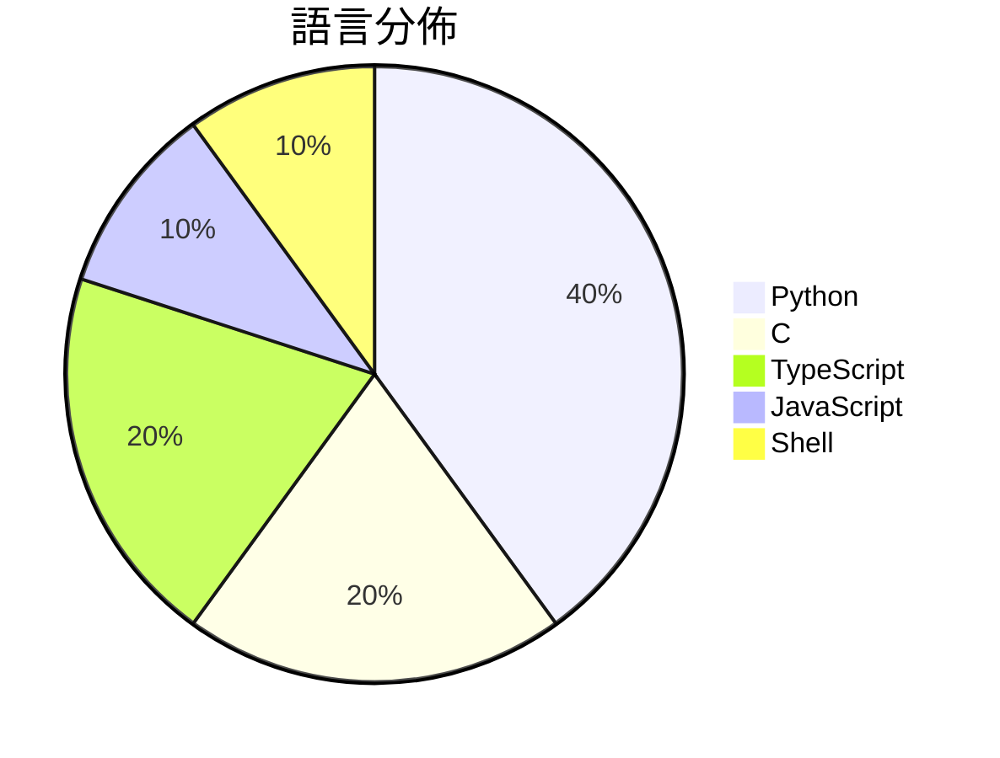

# GitHub Trending - 2026-05-09

> [!summary] 本日摘要
> 收錄 **10** 個新專案，合計 **14.6k** stars
> 語言分佈：Python (4) · C (2) · TypeScript (2) · JavaScript (1) · Shell (1)

> [!tip] 本週焦點
> **[[V4bel--dirtyfrag|V4bel/dirtyfrag]]** — 1 天內累積 2.9k stars（2.9k stars/天）
> 透過鏈結兩個 Linux 漏洞，實現獲取 root 權限的攻擊手法。



---

## 收錄列表

| # | 專案 | 分類 | Stars | 速度 | 安裝 | 語言 | 用途 |
| :--: | --- | --- | ---: | ---: | --- | --- | --- |
| 1 | [[V4bel--dirtyfrag\|V4bel/dirtyfrag]] | 安全 | 2.9k | 2.9k/天 | `easy` | C | 透過鏈結兩個 Linux 漏洞，實現獲取 root 權限的攻擊手法。 |
| 2 | [[antirez--ds4\|antirez/ds4]] | AI/ML | 2.5k | 1.2k/天 | `medium` | C | 提供針對 DeepSeek V4 Flash 模型的本地推理引擎，專為 Meta |
| 3 | [[aattaran--deepclaude\|aattaran/deepclaude]] |  | 1.6k | 328/天 |  | JavaScript | Use Claude Code's autonomous agent loop  |
| 4 | [[strukto-ai--mirage\|strukto-ai/mirage]] | 開發工具 | 1.4k | 724/天 | `medium` | TypeScript | 提供統一的虛擬檔案系統，讓 AI 代理能夠跨服務讀寫數據。 |
| 5 | [[yaojingang--yao-open-prompts\|yaojingang/yao-open-prompts]] | AI/ML | 1.4k | 687/天 | `easy` | Python | 提供一個中文的 AI 提示詞庫，涵蓋多種工作和生活場景，助你提升創作效率。 |
| 6 | [[XBuilderLAB--cheat-on-content\|XBuilderLAB/cheat-on-content]] | 其他 | 1.2k | 405/天 | `easy` | Shell | 幫助內容創作者將每個帖子轉化為經過校準的實驗，提升預測準確性。 |
| 7 | [[crafter-station--petdex\|crafter-station/petdex]] | 開發工具 | 1.1k | 188/天 | `easy` | TypeScript | 提供 Codex 兼容的動畫寵物的公共畫廊，讓用戶可以輕鬆瀏覽和下載。 |
| 8 | [[vibeforge1111--keep-codex-fast\|vibeforge1111/keep-codex-fast]] | 開發工具 | 914 | 152/天 | `easy` | Python | 一個以備份為先的 Codex 技能，幫助保持本地 Codex 狀態快速、乾淨和可 |
| 9 | [[MayersScott--rkn-block-checker\|MayersScott/rkn-block-checker]] | CLI 工具 | 796 | 159/天 | `easy` | Python | 診斷 RKN/TSPU 網路封鎖，逐層分析問題來源。 |
| 10 | [[lightseekorg--tokenspeed\|lightseekorg/tokenspeed]] | AI/ML | 785 | 393/天 | `medium` | Python | 提供高效能的 LLM 推論引擎，專為代理工作負載設計。 |

---

## 重點摘要

### 1. [[V4bel--dirtyfrag|V4bel/dirtyfrag]] `安全`

> 透過鏈結兩個 Linux 漏洞，實現獲取 root 權限的攻擊手法。

**2.9k** stars · **2.9k** stars/天 · C · `easy`

_建立 1 天就累積 2889 stars（2889/天），forks 446（15.4%），顯示出強烈的社群興趣。這位作者 V4bel 之前已經發現過其他類似的漏洞，這使得他在安全研究領域有一定的聲譽。Dirty Frag 解決了之前在 Linux 系統中缺乏有效特權提升漏洞的痛點，特別是在不依賴時間窗口的情況下。這些特性使得它在安全研究者和攻擊者中都引起了廣泛關注。社群討論熱烈，尤其是關於漏洞的利用和修補的問題，顯示出這個專案的實際影響力。_

---

### 2. [[antirez--ds4|antirez/ds4]] `AI/ML`

> 提供針對 DeepSeek V4 Flash 模型的本地推理引擎，專為 Metal 設計。

**2.5k** stars · **1.2k** stars/天 · C · `medium`

_建立 2 天內累積 2460 stars（1230/天），forks 146（5.9%），顯示出強勁的增長潛力。這個專案的作者 antirez 以開源社群中的知名度和過去的貢獻而聞名，特別是在性能優化和本地推理引擎方面。DeepSeek V4 Flash 模型的推出填補了市場上對高效能本地推理引擎的需求，尤其是在 Mac 環境下。這個專案的設計理念是針對特定模型進行深度優化，而不是廣泛支持多個模型，這在當前的推理引擎中是相對少見的。最近的社群討論和需求也促進了這個專案的關注度，特別是對於 Metal 4 Tensor API 和 AMD GPU 支持的需求。forks/stars 比率為 5.9%，顯示出有相當比例的用戶在實際修改和使用這個專案。_

---

### 3. [[aattaran--deepclaude|aattaran/deepclaude]]

**1.6k** stars · **328** stars/天 · JavaScript

---

### 4. [[strukto-ai--mirage|strukto-ai/mirage]] `開發工具`

> 提供統一的虛擬檔案系統，讓 AI 代理能夠跨服務讀寫數據。

**1.4k** stars · **724** stars/天 · TypeScript · `medium`

_建立 2 天內累積 1447 stars（724/天），forks 86（5.9%），顯示出強烈的社群關注。作者 zechengz 之前在 AI 相關領域有豐富經驗，這次推出的 Mirage 解決了多服務操作繁瑣的痛點，讓開發者能夠更方便地整合不同的數據源。這個工具的出現正值 AI 代理需求上升的時期，吸引了不少開發者的目光。forks/stars 比率為 5.9%，顯示出社群對於這個工具的實際修改和使用意圖。_

---

### 5. [[yaojingang--yao-open-prompts|yaojingang/yao-open-prompts]] `AI/ML`

> 提供一個中文的 AI 提示詞庫，涵蓋多種工作和生活場景，助你提升創作效率。

**1.4k** stars · **687** stars/天 · Python · `easy`

_建立 2 天內累積 1374 stars（687/天），forks 211（15.4%），顯示出強烈的需求和使用者關注。作者 yaojingang 之前在提示詞和 AI 相關領域有一定的影響力，這個庫解決了中文使用者在 AI 創作中缺乏高質量提示詞的痛點。特別是針對工作和生活場景的分類，使得用戶能夠快速找到合適的提示詞，這在其他英文主導的提示詞庫中是較少見的。社交媒體上的分享和討論也可能促進了這一增長，尤其是在中文社群中。高達 15.4% 的 forks/stars 比率顯示出許多開發者對這個庫的實際修改和使用，這是其受歡迎的另一個指標。_

---

### 6. [[XBuilderLAB--cheat-on-content|XBuilderLAB/cheat-on-content]] `其他`

> 幫助內容創作者將每個帖子轉化為經過校準的實驗，提升預測準確性。

**1.2k** stars · **405** stars/天 · Shell · `easy`

_建立 3 天內累積 1214 stars（405/天），forks 252（20.8%），顯示出強烈的使用需求。作者 Jooonnn 及其團隊過去在內容創作和數據分析領域有豐富經驗，這個工具解決了內容創作者在發佈後無法有效學習的痛點，讓創作者能夠將每次發佈視為一次實驗，從而不斷優化內容。近期的推廣活動和社群反饋也促進了其快速增長，顯示出市場對於這類工具的需求正在上升。_

---

### 7. [[crafter-station--petdex|crafter-station/petdex]] `開發工具`

> 提供 Codex 兼容的動畫寵物的公共畫廊，讓用戶可以輕鬆瀏覽和下載。

**1.1k** stars · **188** stars/天 · TypeScript · `easy`

_建立 6 天內累積 1126 stars（188/天），forks 53（4.7%），顯示出一定的社群關注度。這個專案由 Railly 和其他幾位貢獻者主導，提供了一個之前缺乏的公共畫廊，讓用戶能夠輕鬆獲取和分享動畫寵物。隨著動畫資源需求的增加，這個工具填補了市場空白。社群對於功能的需求和反饋也促進了其快速發展，特別是針對中文社群的支持需求。這個專案的增長主要來自於自然擴散，並未有明顯的推廣事件。_

---

### 8. [[vibeforge1111--keep-codex-fast|vibeforge1111/keep-codex-fast]] `開發工具`

> 一個以備份為先的 Codex 技能，幫助保持本地 Codex 狀態快速、乾淨和可恢復。

**914** stars · **152** stars/天 · Python · `easy`

_建立 6 天就累積 914 stars（152/天），forks 53（5.8%），這顯示出穩定的增長。作者 vibeforge1111 是一位專注於 Codex 的開發者，這個工具解決了 Codex 使用過程中常見的性能下降問題，特別是在長時間使用後的數據管理。此專案的出現正好填補了 Codex 使用者在維護和數據安全上的需求，並且在社群中引發了討論。這個工具的設計理念是基於用戶的實際需求，提供了一個備份優先的維護方案，讓使用者能夠在不損失數據的情況下進行清理和優化。forks/stars 比率在 5.8% 屬於中等，顯示出有一定的實際使用者在進行修改和應用。_

---

### 9. [[MayersScott--rkn-block-checker|MayersScott/rkn-block-checker]] `CLI 工具`

> 診斷 RKN/TSPU 網路封鎖，逐層分析問題來源。

**796** stars · **159** stars/天 · Python · `easy`

_建立 5 天內累積 796 stars（159/天），forks 32（4.0%），顯示出不錯的增長潛力。作者 MayersScott 及其團隊專注於網路診斷工具，解決了以往檢測封鎖時缺乏細節的痛點。這個工具的出現讓使用者能夠更精確地了解網路封鎖的具體原因，並選擇適合的解決方案。社群的反應熱烈，尤其是對於即將推出的代理支持功能的需求，顯示出該工具的潛在市場需求。_

---

### 10. [[lightseekorg--tokenspeed|lightseekorg/tokenspeed]] `AI/ML`

> 提供高效能的 LLM 推論引擎，專為代理工作負載設計。

**785** stars · **393** stars/天 · Python · `medium`

_建立 2 天就累積 785 stars（392.5/天），forks 48（6.1%），顯示出良好的社群關注度。主要貢獻者包括多位活躍於開源社群的開發者，這些人過去有參與其他高效能計算或 LLM 項目的經驗。TokenSpeed 解決了現有 LLM 推論引擎在性能和可用性上的不足，特別是在代理工作負載方面，這是許多開發者面臨的痛點。隨著 AI 應用需求的增加，對於高效能推論引擎的需求也隨之上升。這個專案的高 forks/stars 比率顯示出許多人對其進行實際修改和使用，反映出其潛在的實用性和需求。_

---

## 今日到期複習

> [!tip] 根據間隔複習排程，今天該回顧的專案

```dataview
TABLE
  stars_per_day AS "Stars/天",
  category AS "分類",
  engagement AS "參與度"
FROM "Repos"
WHERE next_review AND date(next_review) <= date("2026-05-09") AND status != "archived"
SORT priority DESC
```

## 待處理

```dataviewjs
const pending = dv.pages('"Repos"').where(p => p.status === "to-review").length;
const unrated = dv.pages('"Repos"').where(p => p.status !== "archived" && p.status !== "to-review" && (p.my_rating || 0) === 0).length;
const noVerdict = dv.pages('"Repos"').where(p => p.status !== "archived" && (p.my_rating || 0) > 0 && (!p.verdict || p.verdict === "")).length;
const items = [];
if (pending > 0) items.push(`**${pending}** 個待分流`);
if (unrated > 0) items.push(`**${unrated}** 個已讀但未評分`);
if (noVerdict > 0) items.push(`**${noVerdict}** 個已評分但無結論`);
if (items.length > 0) dv.paragraph(items.join(" / "));
else dv.paragraph("所有專案都已處理完畢！");
```
