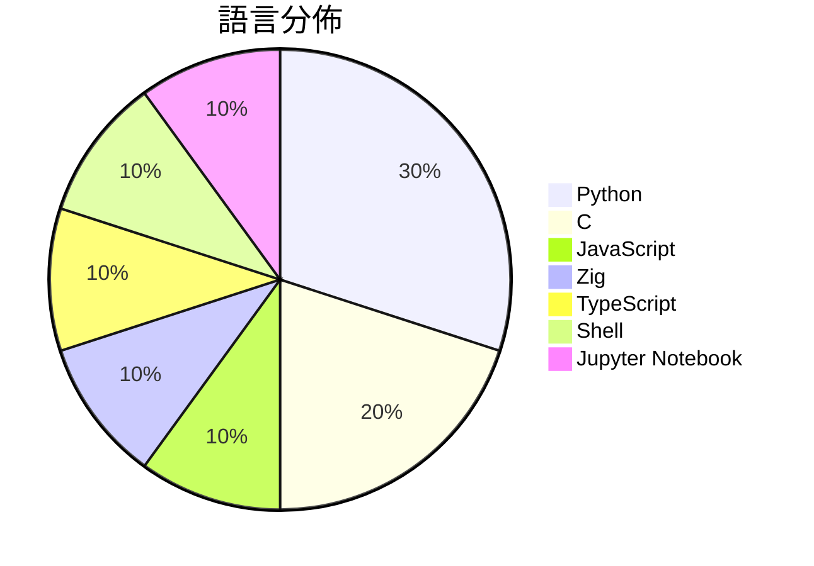

# GitHub Trending - 2026-05-10

> [!summary] 本日摘要
> 收錄 **10** 個新專案，合計 **18.6k** stars
> 語言分佈：Python (3) · C (2) · JavaScript (1) · Zig (1) · TypeScript (1) · Shell (1) · Jupyter Notebook (1)

> [!tip] 本週焦點
> **[[antirez--ds4|antirez/ds4]]** — 3 天內累積 4.5k stars（1.5k stars/天）
> 提供 DeepSeek V4 Flash 的本地推論引擎，專為 Metal 設計。



---

## 收錄列表

| # | 專案 | 分類 | Stars | 速度 | 安裝 | 語言 | 用途 |
| :--: | --- | --- | ---: | ---: | --- | --- | --- |
| 1 | [[antirez--ds4\|antirez/ds4]] | AI/ML | 4.5k | 1.5k/天 | `medium` | C | 提供 DeepSeek V4 Flash 的本地推論引擎，專為 Metal 設計 |
| 2 | [[V4bel--dirtyfrag\|V4bel/dirtyfrag]] | 安全 | 3.6k | 1.8k/天 | `easy` | C | 利用 Dirty Frag 漏洞在 Linux 系統上獲取 root 權限。 |
| 3 | [[aattaran--deepclaude\|aattaran/deepclaude]] |  | 1.7k | 279/天 |  | JavaScript | Use Claude Code's autonomous agent loop  |
| 4 | [[vercel-labs--zero-native\|vercel-labs/zero-native]] | 開發工具 | 1.6k | 1.6k/天 | `easy` | Zig | 用 Zig 和網頁 UI 構建桌面和移動應用，實現小型二進制和快速重建。 |
| 5 | [[strukto-ai--mirage\|strukto-ai/mirage]] | 開發工具 | 1.6k | 544/天 | `medium` | TypeScript | 提供統一的虛擬檔案系統，讓 AI 代理能夠跨服務讀寫資料。 |
| 6 | [[yaojingang--yao-open-prompts\|yaojingang/yao-open-prompts]] | AI/ML | 1.5k | 497/天 | `easy` | Python | 提供中文 AI 提示詞庫，涵蓋多種場景如工作、學習和內容創作。 |
| 7 | [[XBuilderLAB--cheat-on-content\|XBuilderLAB/cheat-on-content]] | 開發工具 | 1.4k | 357/天 | `easy` | Shell | 將每個內容創作轉化為經過校準的實驗，幫助創作者更精準地預測和評估內容表現。 |
| 8 | [[MayersScott--rkn-block-checker\|MayersScott/rkn-block-checker]] | CLI 工具 | 969 | 162/天 | `easy` | Python | 診斷 RKN/TSPU 網路封鎖，逐層分析 DNS、TCP、TLS 和 HTTP |
| 9 | [[lightseekorg--tokenspeed\|lightseekorg/tokenspeed]] | AI/ML | 858 | 286/天 | `medium` | Python | 提供超高速的 LLM 推論引擎，專為代理工作負載設計。 |
| 10 | [[raiyanyahya--how-to-train-your-gpt\|raiyanyahya/how-to-train-your-gpt]] | 開發工具 | 790 | 132/天 | `medium` | Jupyter Notebook | 從零開始構建現代大型語言模型，適合對 GPT 架構感興趣的開發者。 |

---

## 重點摘要

### 1. [[antirez--ds4|antirez/ds4]] `AI/ML`

> 提供 DeepSeek V4 Flash 的本地推論引擎，專為 Metal 設計。

**4.5k** stars · **1.5k** stars/天 · C · `medium`

_建立 3 天內累積 4506 stars（1502/天），forks 314（7.0%），顯示出強烈的社群興趣。這個專案的作者 antirez 以開發高效能軟體聞名，過去的作品如 Redis 也獲得廣泛應用。DeepSeek V4 Flash 提供了一個針對特定模型的高效推論引擎，解決了許多現有推論工具在性能和資源使用上的不足。最近的推特和 Hacker News 討論也引起了開發者的注意，進一步推動了這個專案的曝光。隨著 Apple 硬體性能的提升，Metal 的使用讓這個引擎在 Mac 環境中變得更加實用。forks/stars 比率為 7.0%，顯示出有相當比例的用戶在進行實際修改和使用。_

---

### 2. [[V4bel--dirtyfrag|V4bel/dirtyfrag]] `安全`

> 利用 Dirty Frag 漏洞在 Linux 系統上獲取 root 權限。

**3.6k** stars · **1.8k** stars/天 · C · `easy`

_建立 2 天就累積 3645 stars（1823/天），forks 554（15.2%），這顯示出極高的關注度。這個專案由 V4bel 和 Nriver 共同開發，V4bel 在安全領域有過往的研究經驗。Dirty Frag 解決了在 Linux 系統上獲取 root 權限的痛點，之前的工具往往需要複雜的環境配置或依賴於不穩定的漏洞。近期的社群討論和推文進一步提高了該工具的曝光率，尤其是在安全研究者之間。這個工具的出現正好符合當前對於 Linux 安全漏洞的需求，並且其高效能和簡單的使用方式使其成為熱門選擇。forks/stars 比率為 15.2%，顯示出許多人在實際修改和使用該工具。_

---

### 3. [[aattaran--deepclaude|aattaran/deepclaude]]

**1.7k** stars · **279** stars/天 · JavaScript

---

### 4. [[vercel-labs--zero-native|vercel-labs/zero-native]] `開發工具`

> 用 Zig 和網頁 UI 構建桌面和移動應用，實現小型二進制和快速重建。

**1.6k** stars · **1.6k** stars/天 · Zig · `easy`

_建立 1 天就累積 1650 stars（1650/天），forks 68（4.1%），這顯示出強烈的興趣和潛在的使用者基礎。作者 ctate 之前在開源社區有過多個貢獻，這次專案解決了桌面應用開發中對於輕量和快速重建的需求，特別是在需要使用現代網頁前端技術的情境下。雖然目前沒有明確的觸發事件，但其獨特的設計和功能吸引了開發者的注意。這個工具的出現是因為 Zig 語言的流行和對於高效能應用的需求，forks/stars 比率顯示出一定的實際使用和修改潛力。_

---

### 5. [[strukto-ai--mirage|strukto-ai/mirage]] `開發工具`

> 提供統一的虛擬檔案系統，讓 AI 代理能夠跨服務讀寫資料。

**1.6k** stars · **544** stars/天 · TypeScript · `medium`

_建立 3 天內累積 1632 stars（544/天），forks 95（5.8%），這顯示出快速的增長潛力。作者 zechengz 之前在開源領域有過豐富的經驗，這個專案解決了 AI 代理在不同服務間操作的痛點，之前的解決方案往往需要多個 SDK，學習成本高。近期的推廣和社群討論也可能促進了這個專案的曝光。技術上，隨著虛擬檔案系統和 AI 代理的需求增加，Mirage 的出現正好填補了這一空白。forks/stars 比率在中等範圍，顯示出有一定的實際應用需求。_

---

### 6. [[yaojingang--yao-open-prompts|yaojingang/yao-open-prompts]] `AI/ML`

> 提供中文 AI 提示詞庫，涵蓋多種場景如工作、學習和內容創作。

**1.5k** stars · **497** stars/天 · Python · `easy`

_建立 3 天內累積 1490 stars（497/天），forks 235（15.8%），顯示出強勁的增長勢頭。這個專案的作者 yaojingang 之前在 AI 領域有過其他貢獻，這次專注於中文提示詞的開發，填補了市場上對中文 AI 提示詞的需求空白。近期的推廣活動和社群的討論也促進了這個專案的曝光率。技術上，中文 AI 提示詞的需求隨著 AI 應用的普及而上升，這使得這個工具的實用性大大提高。forks/stars 比率為 15.8%，顯示出許多使用者不僅在觀望，還積極參與修改和擴展。_

---

### 7. [[XBuilderLAB--cheat-on-content|XBuilderLAB/cheat-on-content]] `開發工具`

> 將每個內容創作轉化為經過校準的實驗，幫助創作者更精準地預測和評估內容表現。

**1.4k** stars · **357** stars/天 · Shell · `easy`

_建立 4 天就累積 1426 stars（357/天），forks 296（20.8%），顯示出強烈的用戶興趣。作者 Jooonnn 和其他貢獻者在內容創作和數據分析領域有豐富的經驗，這使得他們能夠針對創作者的痛點提供解決方案。這個工具的出現正好填補了市場上對於個性化內容評估的需求，特別是在創作者需要更精準數據來指導創作的背景下。社群的活躍度和開放的問題反映了使用者對於功能擴展的需求，這也促進了工具的快速迭代。_

---

### 8. [[MayersScott--rkn-block-checker|MayersScott/rkn-block-checker]] `CLI 工具`

> 診斷 RKN/TSPU 網路封鎖，逐層分析 DNS、TCP、TLS 和 HTTP 的問題。

**969** stars · **162** stars/天 · Python · `easy`

_建立 6 天內累積 969 stars（162 stars/天），forks 45（4.6%），顯示出穩定的增長趨勢。這位開發者 MayersScott 先前在網路診斷工具方面有過貢獻，這個專案填補了對於 RKN/TSPU 封鎖的具體診斷需求，特別是在俄羅斯等地區的用戶面臨的網路限制問題。這個工具的推出引起了社群的關注，尤其是在對抗網路審查的討論中。高比例的 forks/stars 比率顯示出許多開發者對這個工具進行了實際修改和使用，反映出其實用性和需求。_

---

### 9. [[lightseekorg--tokenspeed|lightseekorg/tokenspeed]] `AI/ML`

> 提供超高速的 LLM 推論引擎，專為代理工作負載設計。

**858** stars · **286** stars/天 · Python · `medium`

_建立 3 天就累積 858 stars（286/天），forks 60（7.0%），顯示出強勁的增長潛力。作者團隊由多位活躍的開發者組成，過去在 LLM 和推論引擎領域有豐富的經驗。這個專案解決了現有推論引擎在性能和易用性上的不足，特別是針對代理工作負載的需求。近期的技術討論和社群反饋也促進了其快速發展。隨著 AI 應用需求的增加，這樣的高效推論引擎變得越來越重要，尤其是在生產環境中。forks/stars 比率為 7.0%，顯示出有不少開發者在實際修改和使用這個專案。_

---

### 10. [[raiyanyahya--how-to-train-your-gpt|raiyanyahya/how-to-train-your-gpt]] `開發工具`

> 從零開始構建現代大型語言模型，適合對 GPT 架構感興趣的開發者。

**790** stars · **132** stars/天 · Jupyter Notebook · `medium`

_建立 6 天內累積 790 stars（132/天），forks 107（13.5%），顯示出強烈的社群興趣。這位作者 raiyanyahya 以教育為主題，過去的作品也專注於簡化機器學習的複雜性，這次的專案解決了許多新手在學習 LLM 時的困惑，提供了清晰的步驟和豐富的註解。這個專案的出現正好填補了市場上對於深入理解 LLM 架構的需求，特別是對於那些希望從基礎開始學習的開發者來說。社群的反應熱烈，顯示出這種學習方式的有效性。_

---

## 今日到期複習

> [!tip] 根據間隔複習排程，今天該回顧的專案

```dataview
TABLE
  stars_per_day AS "Stars/天",
  category AS "分類",
  engagement AS "參與度"
FROM "Repos"
WHERE next_review AND date(next_review) <= date("2026-05-10") AND status != "archived"
SORT priority DESC
```

## 待處理

```dataviewjs
const pending = dv.pages('"Repos"').where(p => p.status === "to-review").length;
const unrated = dv.pages('"Repos"').where(p => p.status !== "archived" && p.status !== "to-review" && (p.my_rating || 0) === 0).length;
const noVerdict = dv.pages('"Repos"').where(p => p.status !== "archived" && (p.my_rating || 0) > 0 && (!p.verdict || p.verdict === "")).length;
const items = [];
if (pending > 0) items.push(`**${pending}** 個待分流`);
if (unrated > 0) items.push(`**${unrated}** 個已讀但未評分`);
if (noVerdict > 0) items.push(`**${noVerdict}** 個已評分但無結論`);
if (items.length > 0) dv.paragraph(items.join(" / "));
else dv.paragraph("所有專案都已處理完畢！");
```
