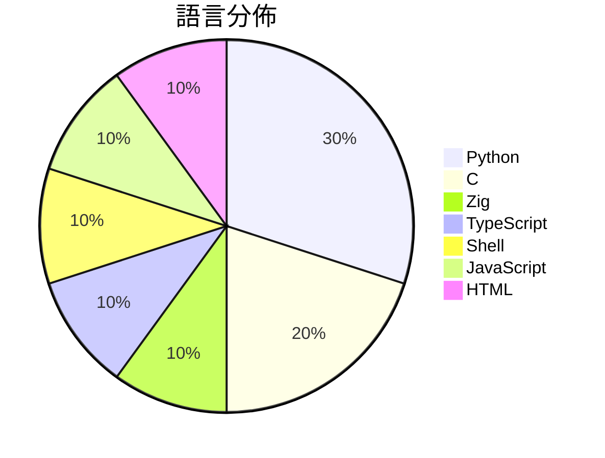

# GitHub Trending - 2026-05-11

> [!summary] 本日摘要
> 收錄 **10** 個新專案，合計 **20.6k** stars
> 語言分佈：Python (3) · C (2) · Zig (1) · TypeScript (1) · Shell (1) · JavaScript (1) · HTML (1)

> [!tip] 本週焦點
> **[[antirez--ds4|antirez/ds4]]** — 4 天內累積 6.2k stars（1.6k stars/天）
> 提供一個專為 DeepSeek V4 Flash 設計的本地推論引擎，專注於 Metal 環境。



---

## 收錄列表

| # | 專案 | 分類 | Stars | 速度 | 安裝 | 語言 | 用途 |
| :--: | --- | --- | ---: | ---: | --- | --- | --- |
| 1 | [[antirez--ds4\|antirez/ds4]] | AI/ML | 6.2k | 1.6k/天 | `medium` | C | 提供一個專為 DeepSeek V4 Flash 設計的本地推論引擎，專注於 M |
| 2 | [[V4bel--dirtyfrag\|V4bel/dirtyfrag]] | 安全 | 4.0k | 1.3k/天 | `easy` | C | 透過 Dirty Frag 漏洞鏈獲取 Linux 系統的 root 權限。 |
| 3 | [[vercel-labs--zero-native\|vercel-labs/zero-native]] | 開發工具 | 2.3k | 1.2k/天 | `easy` | Zig | 用 Zig 和網頁 UI 建構桌面及行動應用程式，提供小型二進位檔和快速重建能力 |
| 4 | [[strukto-ai--mirage\|strukto-ai/mirage]] | 開發工具 | 1.8k | 449/天 | `medium` | TypeScript | 為 AI 代理提供統一的虛擬檔案系統，讓不同服務之間的操作如同在本地檔案系統一般 |
| 5 | [[yaojingang--yao-open-prompts\|yaojingang/yao-open-prompts]] | AI/ML | 1.6k | 389/天 | `easy` | Python | 提供多場景的中文 AI 提示詞庫，助力工作、學習、內容創作等。 |
| 6 | [[XBuilderLAB--cheat-on-content\|XBuilderLAB/cheat-on-content]] | 開發工具 | 1.6k | 311/天 | `easy` | Shell | 將每篇內容轉化為經過校準的實驗，幫助創作者精準預測和評估內容表現。 |
| 7 | [[lightseekorg--tokenspeed\|lightseekorg/tokenspeed]] | AI/ML | 907 | 227/天 | `medium` | Python | 提供超高速的 LLM 推論引擎，專為代理工作負載設計。 |
| 8 | [[huangserva--3DCellForge\|huangserva/3DCellForge]] | 其他 | 757 | 757/天 | `easy` | JavaScript | 提供 AI 驅動的互動式 3D 細胞生成與探索平台。 |
| 9 | [[WenyuChiou--awesome-agentic-ai-zh\|WenyuChiou/awesome-agentic-ai-zh]] | 教學資源 | 736 | 123/天 | `easy` | Python | 提供結構化的 AI Agent 學習路徑，幫助使用者從零開始學習並實作多 age |
| 10 | [[zarazhangrui--beautiful-html-templates\|zarazhangrui/beautiful-html-templates]] | 開發工具 | 730 | 146/天 | `easy` | HTML | 提供一系列可重用的 HTML 幻燈片模板，讓任何編碼代理能自動生成美觀的簡報。 |

---

## 重點摘要

### 1. [[antirez--ds4|antirez/ds4]] `AI/ML`

> 提供一個專為 DeepSeek V4 Flash 設計的本地推論引擎，專注於 Metal 環境。

**6.2k** stars · **1.6k** stars/天 · C · `medium`

_建立 4 天就累積 6219 stars（1555/天），forks 453（7.3%），這顯示出強烈的初期興趣。這個專案的創建者 antirez 是知名的開源開發者，過去在性能優化和推論引擎方面有豐富經驗。DeepSeek V4 Flash 模型的推出填補了市場上對於高效能本地推論引擎的需求，特別是在 Metal 環境下的優化。近期的推廣和社群討論也為這個專案帶來了更多的關注。由於 Metal 的普及和 Apple 硬體的強大，這個工具的需求正在上升。forks/stars 比率為 7.3%，顯示出有相當比例的使用者在進行實際修改和使用。_

---

### 2. [[V4bel--dirtyfrag|V4bel/dirtyfrag]] `安全`

> 透過 Dirty Frag 漏洞鏈獲取 Linux 系統的 root 權限。

**4.0k** stars · **1.3k** stars/天 · C · `easy`

_建立 3 天就累積 4025 stars（1342/天），forks 601（14.9%），這顯示出極高的關注度。作者 V4bel 是知名的安全研究者，過去在漏洞發現方面有豐富經驗。Dirty Frag 解決了 Linux 系統中存在的權限提升問題，這在過去的安全工具中並未有良好的解決方案。該專案的迅速流行可能與其高效的利用方式和對多個發行版的影響有關。社群的反應熱烈，尤其是關於漏洞的討論和修補進展，顯示出使用者對於安全性的高度關注。_

---

### 3. [[vercel-labs--zero-native|vercel-labs/zero-native]] `開發工具`

> 用 Zig 和網頁 UI 建構桌面及行動應用程式，提供小型二進位檔和快速重建能力。

**2.3k** stars · **1.2k** stars/天 · Zig · `easy`

_建立 2 天內累積 2308 stars（1154/天），forks 99（4.3%），顯示出強勁的增長潛力。這個專案由 Vercel Labs 開發，Vercel 在前端開發領域有著良好的聲譽，這使得許多開發者對其新工具充滿期待。zero-native 解決了桌面應用程式開發中對於體積和啟動速度的痛點，特別是對於需要快速重建的開發流程。最近的推文和社群討論也引起了不少注意，進一步推動了其人氣。這個工具的出現正好符合了當前對於輕量級應用程式的需求，尤其是在多平台開發的背景下。_

---

### 4. [[strukto-ai--mirage|strukto-ai/mirage]] `開發工具`

> 為 AI 代理提供統一的虛擬檔案系統，讓不同服務之間的操作如同在本地檔案系統一般簡單。

**1.8k** stars · **449** stars/天 · TypeScript · `medium`

_建立 4 天內累積 1795 stars（449/天），forks 109（6.1%），顯示出強烈的使用者興趣。這個專案的作者 zechengz 之前有開發過多個與 AI 相關的工具，這次的 Mirage 解決了多個後端服務整合的痛點，讓開發者能夠更輕鬆地使用 AI 代理進行資料操作。特別是在 AI 代理日益普及的背景下，這種統一的虛擬檔案系統顯得尤為重要。社群的反應熱烈，特別是對於其簡化的操作流程和強大的整合能力。這種需求的增長也反映了當前技術生態中對於高效能資料處理的迫切需求。_

---

### 5. [[yaojingang--yao-open-prompts|yaojingang/yao-open-prompts]] `AI/ML`

> 提供多場景的中文 AI 提示詞庫，助力工作、學習、內容創作等。

**1.6k** stars · **389** stars/天 · Python · `easy`

_建立 4 天內累積 1555 stars（389/天），forks 247（15.9%），顯示出強勁的增長潛力。作者 yaojingang 在 AI 和提示詞工程領域有豐富的經驗，這個專案解決了中文使用者在生成 AI 提示詞時的需求，之前的工具多數針對英文市場，缺乏針對中文的優化。近期的社交媒體推廣和社群討論也為其增添了曝光度。隨著中文 AI 應用的興起，這個工具的需求自然增加，forks/stars 比率顯示出使用者對其進行實際修改和擴展的意願。_

---

### 6. [[XBuilderLAB--cheat-on-content|XBuilderLAB/cheat-on-content]] `開發工具`

> 將每篇內容轉化為經過校準的實驗，幫助創作者精準預測和評估內容表現。

**1.6k** stars · **311** stars/天 · Shell · `easy`

_建立 5 天內累積 1556 stars（311/天），forks 312（20.1%），顯示出強勁的增長潛力。這個專案的作者 Jooonnn 及其團隊在內容創作領域有豐富的經驗，提供了一個之前缺乏的系統化工具，幫助創作者從數據中學習和進步。這個工具的出現正好填補了創作者在內容評估上的空白，讓他們能夠更有效地分析和優化自己的作品。社群的反饋和需求也促進了這個工具的快速發展，特別是在內容創作日益競爭的環境中，這樣的工具顯得尤為重要。_

---

### 7. [[lightseekorg--tokenspeed|lightseekorg/tokenspeed]] `AI/ML`

> 提供超高速的 LLM 推論引擎，專為代理工作負載設計。

**907** stars · **227** stars/天 · Python · `medium`

_建立 4 天就累積 907 stars（227/天），forks 64（7.1%），這顯示出快速的增長潛力。主要貢獻者來自於活躍的開源社群，過去在 LLM 領域有豐富的經驗。TokenSpeed 解決了高效能推論引擎的需求，特別是在代理工作負載下，這在市場上尚無其他相似方案。近期的推文和討論也引起了開發者的注意，進一步促進了其曝光度。技術上，隨著硬體性能的提升，TokenSpeed 的設計理念正好契合了當前對高效能推論的需求。forks/stars 比率為 7.1%，顯示出有相當比例的用戶在實際修改和使用此專案。_

---

### 8. [[huangserva--3DCellForge|huangserva/3DCellForge]] `其他`

> 提供 AI 驅動的互動式 3D 細胞生成與探索平台。

**757** stars · **757** stars/天 · JavaScript · `easy`

_建立 1 天就累積 757 stars（757/天），forks 131（17.3%），這顯示出強烈的初期興趣。專案的作者是 Huang Serva，過去在生物資訊和前端開發領域有一定的經驗。這個工具解決了生物學家在細胞模型可視化上的需求，之前的工具往往缺乏互動性和靈活性。近期的推廣活動和社群討論也為這個專案帶來了關注。技術上，WebGL 和 React 的結合使得這個工具能夠在瀏覽器中實現高效的 3D 渲染，這在目前的生態中是相對少見的。forks/stars 比率為 17.3%，顯示出許多用戶不僅在觀望，還在積極修改和使用這個專案。_

---

### 9. [[WenyuChiou--awesome-agentic-ai-zh|WenyuChiou/awesome-agentic-ai-zh]] `教學資源`

> 提供結構化的 AI Agent 學習路徑，幫助使用者從零開始學習並實作多 agent 系統。

**736** stars · **123** stars/天 · Python · `easy`

_建立 6 天內累積 736 stars（123/天），forks 69（9.4%），顯示出強烈的社群興趣。專案的主要貢獻者 WenyuChiou 和 scott0127 在 AI 和開源領域有豐富經驗，這使得專案內容的可信度和質量更高。這個專案解決了學習 AI agent 的系統性問題，過去學習者往往面對零散的資源，無法有效地規劃學習路徑。透過結構化的學習地圖，使用者能夠更清楚地掌握學習進度和方向。社群的參與也促進了內容的持續更新和優化，這對於學習者來說是一個重要的優勢。_

---

### 10. [[zarazhangrui--beautiful-html-templates|zarazhangrui/beautiful-html-templates]] `開發工具`

> 提供一系列可重用的 HTML 幻燈片模板，讓任何編碼代理能自動生成美觀的簡報。

**730** stars · **146** stars/天 · HTML · `easy`

_建立 5 天就累積 730 stars（146/天），forks 67（9.2%），這顯示出相對穩定的增長。作者 zarazhangrui 之前有其他開源專案，這次專案解決了簡報設計的痛點，讓使用者能快速生成美觀的簡報，這在傳統的簡報工具中是較難實現的。社群對於簡報設計的需求持續增長，特別是在遠端工作和線上會議的情境下。forks/stars 比率為 9.2%，顯示出有不少使用者在積極修改和使用這個專案。_

---

## 今日到期複習

> [!tip] 根據間隔複習排程，今天該回顧的專案

```dataview
TABLE
  stars_per_day AS "Stars/天",
  category AS "分類",
  engagement AS "參與度"
FROM "Repos"
WHERE next_review AND date(next_review) <= date("2026-05-11") AND status != "archived"
SORT priority DESC
```

## 待處理

```dataviewjs
const pending = dv.pages('"Repos"').where(p => p.status === "to-review").length;
const unrated = dv.pages('"Repos"').where(p => p.status !== "archived" && p.status !== "to-review" && (p.my_rating || 0) === 0).length;
const noVerdict = dv.pages('"Repos"').where(p => p.status !== "archived" && (p.my_rating || 0) > 0 && (!p.verdict || p.verdict === "")).length;
const items = [];
if (pending > 0) items.push(`**${pending}** 個待分流`);
if (unrated > 0) items.push(`**${unrated}** 個已讀但未評分`);
if (noVerdict > 0) items.push(`**${noVerdict}** 個已評分但無結論`);
if (items.length > 0) dv.paragraph(items.join(" / "));
else dv.paragraph("所有專案都已處理完畢！");
```
