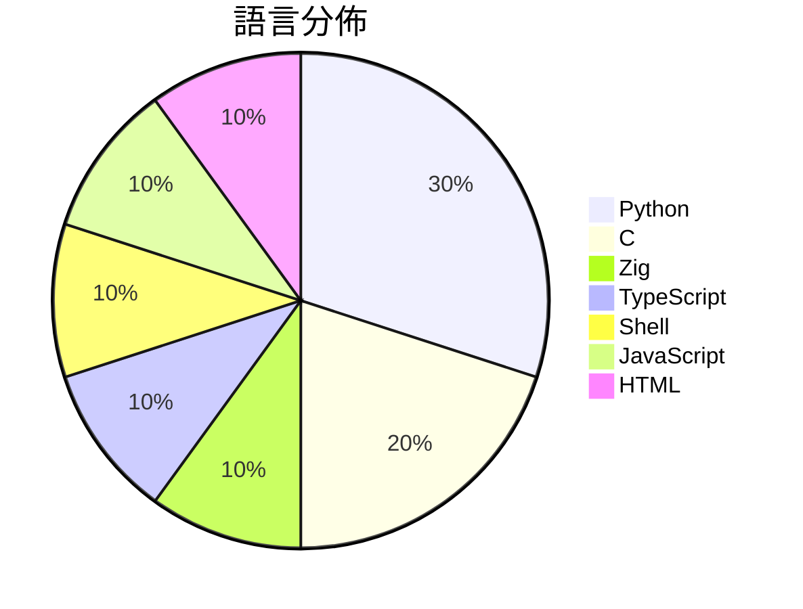

# GitHub Trending - 2026-05-12

> [!summary] 本日摘要
> 收錄 **10** 個新專案，合計 **23.7k** stars
> 語言分佈：Python (3) · C (2) · Zig (1) · TypeScript (1) · Shell (1) · JavaScript (1) · HTML (1)

> [!tip] 本週焦點
> **[[antirez--ds4|antirez/ds4]]** — 5 天內累積 7.4k stars（1.5k stars/天）
> 提供一個針對 DeepSeek V4 Flash 的本地推論引擎，專為 Metal 和 CUDA 優化。



---

## 收錄列表

| # | 專案 | 分類 | Stars | 速度 | 安裝 | 語言 | 用途 |
| :--: | --- | --- | ---: | ---: | --- | --- | --- |
| 1 | [[antirez--ds4\|antirez/ds4]] | AI/ML | 7.4k | 1.5k/天 | `medium` | C | 提供一個針對 DeepSeek V4 Flash 的本地推論引擎，專為 Meta |
| 2 | [[V4bel--dirtyfrag\|V4bel/dirtyfrag]] | 安全 | 4.2k | 1.1k/天 | `easy` | C | 透過 Dirty Frag 漏洞鏈獲得 Linux 系統的 root 權限。 |
| 3 | [[vercel-labs--zero-native\|vercel-labs/zero-native]] | 開發工具 | 2.6k | 883/天 | `easy` | Zig | 用 Zig 和網頁 UI 建構原生桌面和行動應用程式，實現小型二進位檔和快速重建 |
| 4 | [[strukto-ai--mirage\|strukto-ai/mirage]] | 開發工具 | 1.9k | 388/天 | `medium` | TypeScript | 提供一個統一的虛擬檔案系統，讓 AI 代理能夠跨多個服務進行讀寫操作。 |
| 5 | [[XBuilderLAB--cheat-on-content\|XBuilderLAB/cheat-on-content]] | 開發工具 | 1.7k | 278/天 | `easy` | Shell | 將每個內容創作轉化為可校準的實驗，幫助創作者精準預測和提升內容表現。 |
| 6 | [[yaojingang--yao-open-prompts\|yaojingang/yao-open-prompts]] | AI/ML | 1.6k | 326/天 | `easy` | Python | 提供多場景的中文 AI 提示詞庫，助力工作、學習和生活。 |
| 7 | [[huangserva--3DCellForge\|huangserva/3DCellForge]] | 開發工具 | 1.4k | 1.4k/天 | `easy` | JavaScript | 提供 AI 驅動的互動式 3D 細胞生成與探索平台。 |
| 8 | [[BigPizzaV3--CodexPlusPlus\|BigPizzaV3/CodexPlusPlus]] | 開發工具 | 1.0k | 208/天 | `medium` | Python | 提供 Codex App 的外部增強功能，解決原生插件功能受限的問題。 |
| 9 | [[lightseekorg--tokenspeed\|lightseekorg/tokenspeed]] | AI/ML | 945 | 189/天 | `medium` | Python | 提供超高速的 LLM 推論引擎，專為智能工作負載設計。 |
| 10 | [[zarazhangrui--beautiful-html-templates\|zarazhangrui/beautiful-html-templates]] | 其他 | 863 | 144/天 | `easy` | HTML | 提供可重用的 HTML 幻燈片模板，讓任何編碼代理可以自動生成美觀的簡報。 |

---

## 重點摘要

### 1. [[antirez--ds4|antirez/ds4]] `AI/ML`

> 提供一個針對 DeepSeek V4 Flash 的本地推論引擎，專為 Metal 和 CUDA 優化。

**7.4k** stars · **1.5k** stars/天 · C · `medium`

_建立 5 天內累積 7402 stars（1480/天），forks 555（7.5%），顯示出強烈的社群關注。這個專案的主要貢獻者 antirez 以其在開源社群中的影響力而聞名，過去也有多個成功的專案。DeepSeek 4 Flash 解決了本地推論引擎在高效能和長上下文處理上的痛點，特別是針對 Mac 環境的優化，這在其他推論工具中並不常見。隨著 AI 模型的快速發展，對於高效能推論的需求日益增加，這使得該專案的出現正好符合市場需求。forks/stars 比率為 7.5%，顯示出有相當多的使用者在進行實際修改和使用，這反映了其實用性和潛力。_

---

### 2. [[V4bel--dirtyfrag|V4bel/dirtyfrag]] `安全`

> 透過 Dirty Frag 漏洞鏈獲得 Linux 系統的 root 權限。

**4.2k** stars · **1.1k** stars/天 · C · `easy`

_建立 4 天就累積 4201 stars（1050/天），forks 625（14.9%），這顯示出極高的關注度。作者 V4bel 之前在安全領域有過多次貢獻，這次的漏洞發現填補了 Linux 系統中一個長期存在的安全漏洞。這個漏洞的發現引起了社群的熱烈討論，特別是關於如何有效防範這類漏洞的問題。由於 Dirty Frag 的利用方法相對簡單，且影響範圍廣泛，吸引了許多安全研究者的注意。社群的反應和討論進一步推動了這個專案的流行。_

---

### 3. [[vercel-labs--zero-native|vercel-labs/zero-native]] `開發工具`

> 用 Zig 和網頁 UI 建構原生桌面和行動應用程式，實現小型二進位檔和快速重建。

**2.6k** stars · **883** stars/天 · Zig · `easy`

_建立 3 天就累積 2649 stars（883/天），forks 116（4.4%），這顯示出強勁的增長潛力。這個專案的主要貢獻者 ctate 之前在開源界有過豐富的經驗，這使得專案在技術上具備一定的信任度。zero-native 解決了傳統桌面應用開發中二進位檔過大和啟動速度慢的痛點，這在使用 Electron 等框架時常常會遇到。近期的推廣活動和社群討論也可能促進了其曝光率。技術上，Zig 的使用讓這個框架在性能上具備優勢，這是其他框架所無法比擬的。forks/stars 比率在 4.4% 屬於中等，顯示出有一定數量的開發者在實際修改和使用這個專案。_

---

### 4. [[strukto-ai--mirage|strukto-ai/mirage]] `開發工具`

> 提供一個統一的虛擬檔案系統，讓 AI 代理能夠跨多個服務進行讀寫操作。

**1.9k** stars · **388** stars/天 · TypeScript · `medium`

_建立 5 天內累積 1941 stars（388/天），forks 121（6.2%），顯示出強勁的增長勢頭。作者 zechengz 之前在 AI 和開源領域有豐富經驗，這個專案解決了 AI 代理在多後端操作時的複雜性問題，讓開發者能夠使用統一的檔案系統進行操作。社群中對於這種統一操作界面的需求日益增加，特別是在多服務整合的場景中。這樣的需求促使了專案的快速成長。forks/stars 比率在 6.2% 屬於中等，顯示出有一定比例的用戶在實際修改和使用這個工具。_

---

### 5. [[XBuilderLAB--cheat-on-content|XBuilderLAB/cheat-on-content]] `開發工具`

> 將每個內容創作轉化為可校準的實驗，幫助創作者精準預測和提升內容表現。

**1.7k** stars · **278** stars/天 · Shell · `easy`

_建立 6 天就累積 1665 stars（278/天），forks 334（20.1%），這顯示出強烈的社群興趣。作者 Jooonnn 及其團隊在內容創作領域有豐富的經驗，這個工具解決了創作者在內容發佈後無法有效學習的痛點。之前，創作者往往只能依賴直覺和運氣，而這個工具提供了一個系統化的方法來提升內容的表現。近期的社交媒體討論和推廣活動也可能促進了這個工具的曝光。高達 20.1% 的 forks/stars 比率顯示出許多使用者對這個工具的實際修改和應用，反映出其在社群中的活躍度。_

---

### 6. [[yaojingang--yao-open-prompts|yaojingang/yao-open-prompts]] `AI/ML`

> 提供多場景的中文 AI 提示詞庫，助力工作、學習和生活。

**1.6k** stars · **326** stars/天 · Python · `easy`

_建立 5 天內累積 1628 stars（326/天），forks 252（15.5%），顯示出強烈的社群關注。作者 yaojingang 專注於 AI 領域，過去有相關的開源貢獻。這個專案解決了中文提示詞缺乏的痛點，特別是針對工作和學習場景的需求。近期的推廣活動和社群討論也可能促進了其快速增長。高 forks/stars 比率顯示許多人在實際修改和使用這個庫，反映出其實用性和需求。_

---

### 7. [[huangserva--3DCellForge|huangserva/3DCellForge]] `開發工具`

> 提供 AI 驅動的互動式 3D 細胞生成與探索平台。

**1.4k** stars · **1.4k** stars/天 · JavaScript · `easy`

_建立 1 天就累積 1405 stars（1405/天），forks 241（17.2%），顯示出強烈的社群興趣。這個專案由一位活躍的開發者主導，過去可能有相關的開源經驗。它解決了傳統 3D 模型生成工具的複雜性問題，讓用戶能夠輕鬆生成和探索細胞模型。雖然目前的開放問題數量不多，但這可能是因為專案剛啟動，未來的發展潛力值得期待。_

---

### 8. [[BigPizzaV3--CodexPlusPlus|BigPizzaV3/CodexPlusPlus]] `開發工具`

> 提供 Codex App 的外部增強功能，解決原生插件功能受限的問題。

**1.0k** stars · **208** stars/天 · Python · `medium`

_建立 5 天內累積 1040 stars（208/天），forks 68（6.5%），顯示出穩定的增長趨勢。作者 BigPizzaV3 及其團隊在開源社群中活躍，過去有多個成功的專案。Codex++ 解決了 Codex 原生插件功能受限的痛點，讓使用者能夠更靈活地管理會話和插件。社群的反饋和需求驅動了這個專案的發展，並且有持續的更新和修復。這些因素共同促進了其快速的成長。_

---

### 9. [[lightseekorg--tokenspeed|lightseekorg/tokenspeed]] `AI/ML`

> 提供超高速的 LLM 推論引擎，專為智能工作負載設計。

**945** stars · **189** stars/天 · Python · `medium`

_建立 5 天內累積 945 stars（189/天），forks 71（7.5%），顯示出不錯的增長潛力。作者團隊擁有豐富的背景，專注於高效能計算和 LLM 技術，解決了當前市場上 LLM 推論引擎在性能和易用性上的不足。近期的推廣活動和社群討論也為其帶來了關注。技術上，TensorRT 的使用使得這個引擎在性能上有了顯著的提升，這在當前的 AI 生態中是非常重要的。forks/stars 比率顯示出有相當比例的用戶在實際修改和使用這個工具，這意味著它的實用性和需求正在增長。_

---

### 10. [[zarazhangrui--beautiful-html-templates|zarazhangrui/beautiful-html-templates]] `其他`

> 提供可重用的 HTML 幻燈片模板，讓任何編碼代理可以自動生成美觀的簡報。

**863** stars · **144** stars/天 · HTML · `easy`

_建立 6 天就累積 863 stars（144/天），forks 80（9.3%），這顯示出其在短時間內的高需求。作者 zarazhangrui 以其對設計和開發的熱情，創建了這個專案，解決了簡報製作過程中模板選擇和內容適配的痛點。之前的簡報工具往往缺乏靈活性和設計自由度，這個專案的出現正好填補了這個空白。社群對於自動化簡報生成的需求日益增加，這也促進了這個專案的快速成長。forks/stars 比率為 9.3%，顯示出有相當一部分用戶在積極修改和使用這個工具。_

---

## 今日到期複習

> [!tip] 根據間隔複習排程，今天該回顧的專案

```dataview
TABLE
  stars_per_day AS "Stars/天",
  category AS "分類",
  engagement AS "參與度"
FROM "Repos"
WHERE next_review AND date(next_review) <= date("2026-05-12") AND status != "archived"
SORT priority DESC
```

## 待處理

```dataviewjs
const pending = dv.pages('"Repos"').where(p => p.status === "to-review").length;
const unrated = dv.pages('"Repos"').where(p => p.status !== "archived" && p.status !== "to-review" && (p.my_rating || 0) === 0).length;
const noVerdict = dv.pages('"Repos"').where(p => p.status !== "archived" && (p.my_rating || 0) > 0 && (!p.verdict || p.verdict === "")).length;
const items = [];
if (pending > 0) items.push(`**${pending}** 個待分流`);
if (unrated > 0) items.push(`**${unrated}** 個已讀但未評分`);
if (noVerdict > 0) items.push(`**${noVerdict}** 個已評分但無結論`);
if (items.length > 0) dv.paragraph(items.join(" / "));
else dv.paragraph("所有專案都已處理完畢！");
```
