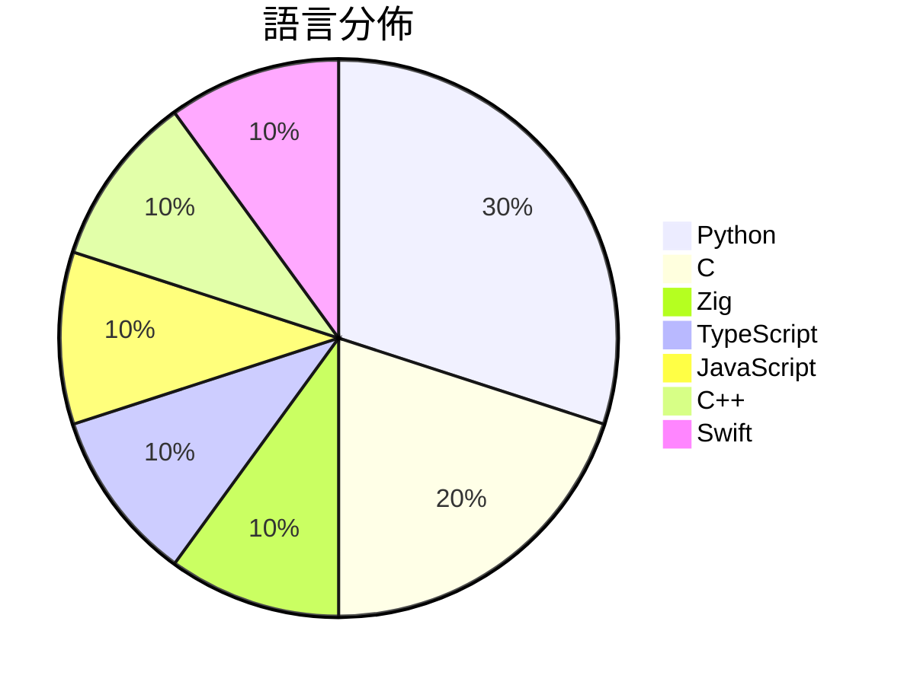

# GitHub Trending - 2026-05-13

> [!summary] 本日摘要
> 收錄 **10** 個新專案，合計 **25.2k** stars
> 語言分佈：Python (3) · C (2) · Zig (1) · TypeScript (1) · JavaScript (1) · C++ (1) · Swift (1)

> [!tip] 本週焦點
> **[[antirez--ds4|antirez/ds4]]** — 6 天內累積 8.1k stars（1.3k stars/天）
> 提供一個針對 DeepSeek V4 Flash 的本地推論引擎，支持 Metal 和 CUDA。



---

## 收錄列表

| # | 專案 | 分類 | Stars | 速度 | 安裝 | 語言 | 用途 |
| :--: | --- | --- | ---: | ---: | --- | --- | --- |
| 1 | [[antirez--ds4\|antirez/ds4]] | AI/ML | 8.1k | 1.3k/天 | `medium` | C | 提供一個針對 DeepSeek V4 Flash 的本地推論引擎，支持 Meta |
| 2 | [[V4bel--dirtyfrag\|V4bel/dirtyfrag]] | 安全 | 4.3k | 866/天 | `easy` | C | 透過鏈接兩個 Linux 漏洞來獲取 root 權限的工具。 |
| 3 | [[vercel-labs--zero-native\|vercel-labs/zero-native]] | 開發工具 | 3.0k | 738/天 | `medium` | Zig | 使用 Zig 和網頁 UI 建立桌面和行動應用程式，實現輕量化和快速重建。 |
| 4 | [[strukto-ai--mirage\|strukto-ai/mirage]] | 開發工具 | 2.1k | 344/天 | `medium` | TypeScript | 提供一個統一的虛擬檔案系統，讓 AI 代理能夠跨多個服務進行讀寫操作。 |
| 5 | [[yaojingang--yao-open-prompts\|yaojingang/yao-open-prompts]] | AI/ML | 1.8k | 306/天 | `easy` | Python | 提供針對工作、學習、內容、營銷和生活場景的中文 AI 提示詞庫。 |
| 6 | [[huangserva--3DCellForge\|huangserva/3DCellForge]] | 其他 | 1.7k | 856/天 | `easy` | JavaScript | 提供 AI 驅動的互動式 3D 細胞生成與探索平台。 |
| 7 | [[BigPizzaV3--CodexPlusPlus\|BigPizzaV3/CodexPlusPlus]] | 開發工具 | 1.5k | 254/天 | `medium` | Python | 一個增強 CodexApp 的工具，讓使用過程更流暢和舒適。 |
| 8 | [[FULU-Foundation--OrcaSlicer-bambulab\|FULU-Foundation/OrcaSlicer-bambulab]] | 開發工具 | 1.2k | 1.2k/天 | `medium` | C++ | 恢復對 Bambu Lab 打印機的完整支持，無論是 LAN 還是互聯網均可使用 |
| 9 | [[lightseekorg--tokenspeed\|lightseekorg/tokenspeed]] | AI/ML | 976 | 163/天 | `medium` | Python | 提供超快速的 LLM 推論引擎，專為代理工作負載設計。 |
| 10 | [[pixel-point--media-downloader\|pixel-point/media-downloader]] | 開發工具 | 596 | 99/天 | `medium` | Swift | 一款美觀的原生 macOS 影片下載器，支持下載和剪輯功能。 |

---

## 重點摘要

### 1. [[antirez--ds4|antirez/ds4]] `AI/ML`

> 提供一個針對 DeepSeek V4 Flash 的本地推論引擎，支持 Metal 和 CUDA。

**8.1k** stars · **1.3k** stars/天 · C · `medium`

_建立 6 天內累積 8080 stars（1347/天），forks 637（7.9%），顯示出強烈的社群興趣。作者 antirez 以其在開源社群中的貢獻而聞名，這個專案解決了在本地運行大型模型的需求，特別是在高效能計算方面的挑戰。之前的解決方案往往依賴於雲端服務，這樣的做法在資料隱私和延遲方面存在問題。最近的社群討論和需求（如對 Metal 4 Tensor API 的支持）也顯示出對這個專案的需求。技術上，隨著硬體性能的提升，特別是在 Mac 環境中，這個工具的可行性和需求也隨之增加。forks/stars 比率為 7.9%，顯示出許多人在實際修改和使用這個專案。_

---

### 2. [[V4bel--dirtyfrag|V4bel/dirtyfrag]] `安全`

> 透過鏈接兩個 Linux 漏洞來獲取 root 權限的工具。

**4.3k** stars · **866** stars/天 · C · `easy`

_建立 5 天內累積 4331 stars（866/天），forks 647（14.9%），顯示出極高的關注度。作者 V4bel 是知名安全研究者，過去在 Linux 漏洞研究上有豐富經驗。Dirty Frag 解決了以往在 Linux 系統中難以利用的特權提升問題，之前的工具往往需要複雜的條件或特權。最近的安全討論和社群反應也促進了這個專案的流行，特別是在安全研究者和系統管理員中。這個工具的出現正好契合了當前對於 Linux 安全性測試的需求，並且其簡單的使用方式使得更多人能夠輕鬆上手。forks/stars 比率為 14.9%，顯示出許多人在實際修改和使用這個工具。_

---

### 3. [[vercel-labs--zero-native|vercel-labs/zero-native]] `開發工具`

> 使用 Zig 和網頁 UI 建立桌面和行動應用程式，實現輕量化和快速重建。

**3.0k** stars · **738** stars/天 · Zig · `medium`

_建立 4 天內累積 2953 stars（738/天），forks 125（4.2%），顯示出強烈的興趣。作者 ctate 及其團隊有著豐富的開源經驗，之前的專案也獲得了良好的反響。zero-native 解決了傳統桌面應用開發中二進位檔過大和啟動速度慢的痛點，特別是對於需要快速迭代的開發者來說，這是一個重要的改進。最近的推文和社群討論也引發了對此工具的關注，尤其是在開發者社群中。隨著 Zig 語言的逐漸流行，zero-native 的出現正好契合了對高效能和低資源消耗的需求。forks/stars 比率為 4.2%，顯示出有相對穩定的使用者在進行實際修改和使用。_

---

### 4. [[strukto-ai--mirage|strukto-ai/mirage]] `開發工具`

> 提供一個統一的虛擬檔案系統，讓 AI 代理能夠跨多個服務進行讀寫操作。

**2.1k** stars · **344** stars/天 · TypeScript · `medium`

_建立 6 天就累積 2065 stars（344/天），forks 133（6.4%），顯示出不錯的增長潛力。作者 zechengz 在開源社群中活躍，過去有多個相關專案。Mirage 解決了 AI 代理在多服務整合上的痛點，之前的解決方案往往需要開發者學習多個 API，這使得開發過程繁瑣。最近在社交媒體上有不少討論，增加了曝光率。技術上，FUSE 的使用讓這個工具能夠在不同平台上運行，這是其受歡迎的原因之一。forks/stars 比率顯示出許多開發者對此專案有實際的修改需求，顯示出其潛在的實用性。_

---

### 5. [[yaojingang--yao-open-prompts|yaojingang/yao-open-prompts]] `AI/ML`

> 提供針對工作、學習、內容、營銷和生活場景的中文 AI 提示詞庫。

**1.8k** stars · **306** stars/天 · Python · `easy`

_建立 6 天內累積 1834 stars（306/天），forks 284（15.5%），顯示出相對高的使用興趣。作者 yaojingang 在中文 AI 領域有一定的影響力，這個庫解決了中文提示詞資源稀缺的問題，讓使用者能夠方便地找到適合的提示詞。近期的推廣可能來自社交媒體的討論，尤其是在中文社群中。這個工具的出現正好填補了市場上對於中文 AI 提示詞的需求，特別是在內容創作和學習輔助方面。高比例的 forks 表示許多用戶在積極修改和使用這個庫，顯示出其實用性。_

---

### 6. [[huangserva--3DCellForge|huangserva/3DCellForge]] `其他`

> 提供 AI 驅動的互動式 3D 細胞生成與探索平台。

**1.7k** stars · **856** stars/天 · JavaScript · `easy`

_建立 2 天內累積 1711 stars（856/天），forks 295（17.2%），顯示出極高的使用者興趣。主要貢獻者 hkulekci 之前有開發相關的 3D 視覺化工具，這使得他對於這個領域有深入的理解。這個專案解決了生物細胞模型視覺化的需求，之前的工具往往缺乏直觀的操作界面和即時的 3D 渲染能力。近期的推廣和展示可能吸引了許多生物學和教育領域的使用者關注。這個工具的高 forks/stars 比率（17.2%）表明許多開發者對其功能感興趣，並可能在實際使用中進行修改和擴展。_

---

### 7. [[BigPizzaV3--CodexPlusPlus|BigPizzaV3/CodexPlusPlus]] `開發工具`

> 一個增強 CodexApp 的工具，讓使用過程更流暢和舒適。

**1.5k** stars · **254** stars/天 · Python · `medium`

_建立 6 天內累積 1526 stars（254/天），forks 93（6.1%），顯示出穩定的增長潛力。這個專案的主要貢獻者有過去的開發經驗，並針對 Codex App 的痛點提供了解決方案，特別是在會話管理和插件使用上。近期的社群討論和功能請求也顯示出用戶對這個工具的需求。Codex++ 的設計使其能夠在不修改原始應用的情況下，提供增強功能，這在市場上是相對獨特的。_

---

### 8. [[FULU-Foundation--OrcaSlicer-bambulab|FULU-Foundation/OrcaSlicer-bambulab]] `開發工具`

> 恢復對 Bambu Lab 打印機的完整支持，無論是 LAN 還是互聯網均可使用。

**1.2k** stars · **1.2k** stars/天 · C++ · `medium`

_建立 1 天就累積 1168 stars（1168/天），forks 296（25.3%），這顯示出極高的用戶興趣。這個專案由 codedbyjake 主導，他在開源社群中有一定的影響力。OrcaSlicer 解決了 Bambu Lab 打印機用戶在網絡打印方面的痛點，之前的工具往往僅限於 LAN 使用，無法滿足遠程打印的需求。此專案的推出引起了廣泛的關注，尤其是在相關社群中。高比例的 forks 表示許多開發者對其進行了實際的修改和使用，顯示出該工具的實用性和潛力。_

---

### 9. [[lightseekorg--tokenspeed|lightseekorg/tokenspeed]] `AI/ML`

> 提供超快速的 LLM 推論引擎，專為代理工作負載設計。

**976** stars · **163** stars/天 · Python · `medium`

_建立 6 天就累積 976 stars（163/天），forks 77（7.9%），顯示出不錯的關注度。主要貢獻者包括 zhyncs 和 syuoni，他們在 LLM 和深度學習領域有豐富的經驗。TokenSpeed 解決了在高性能推論中，開發者需要手動處理並行邏輯的痛點，這在傳統的推論引擎中是個常見問題。近期的推廣活動和社群討論可能進一步提升了其知名度。技術上，TensorRT 和 vLLM 的優化使得這個工具在性能上有了顯著提升，並且其輕量化的設計讓開發者能夠快速上手。_

---

### 10. [[pixel-point--media-downloader|pixel-point/media-downloader]] `開發工具`

> 一款美觀的原生 macOS 影片下載器，支持下載和剪輯功能。

**596** stars · **99** stars/天 · Swift · `medium`

_建立 6 天內累積 596 stars（99/天），forks 27（4.5%），顯示出穩定的增長潛力。主要貢獻者 lnikell 和 kusnizza 具備開發經驗，且過去在開源社群中活躍。這款工具解決了 macOS 用戶在下載影片時的多重需求，特別是對於需要剪輯功能的用戶。隨著社交媒體內容的增長，對於簡單易用的下載工具需求也在增加。高 forks/stars 比率顯示出用戶對該工具的實際修改和使用意願。_

---

## 今日到期複習

> [!tip] 根據間隔複習排程，今天該回顧的專案

```dataview
TABLE
  stars_per_day AS "Stars/天",
  category AS "分類",
  engagement AS "參與度"
FROM "Repos"
WHERE next_review AND date(next_review) <= date("2026-05-13") AND status != "archived"
SORT priority DESC
```

## 待處理

```dataviewjs
const pending = dv.pages('"Repos"').where(p => p.status === "to-review").length;
const unrated = dv.pages('"Repos"').where(p => p.status !== "archived" && p.status !== "to-review" && (p.my_rating || 0) === 0).length;
const noVerdict = dv.pages('"Repos"').where(p => p.status !== "archived" && (p.my_rating || 0) > 0 && (!p.verdict || p.verdict === "")).length;
const items = [];
if (pending > 0) items.push(`**${pending}** 個待分流`);
if (unrated > 0) items.push(`**${unrated}** 個已讀但未評分`);
if (noVerdict > 0) items.push(`**${noVerdict}** 個已評分但無結論`);
if (items.length > 0) dv.paragraph(items.join(" / "));
else dv.paragraph("所有專案都已處理完畢！");
```
