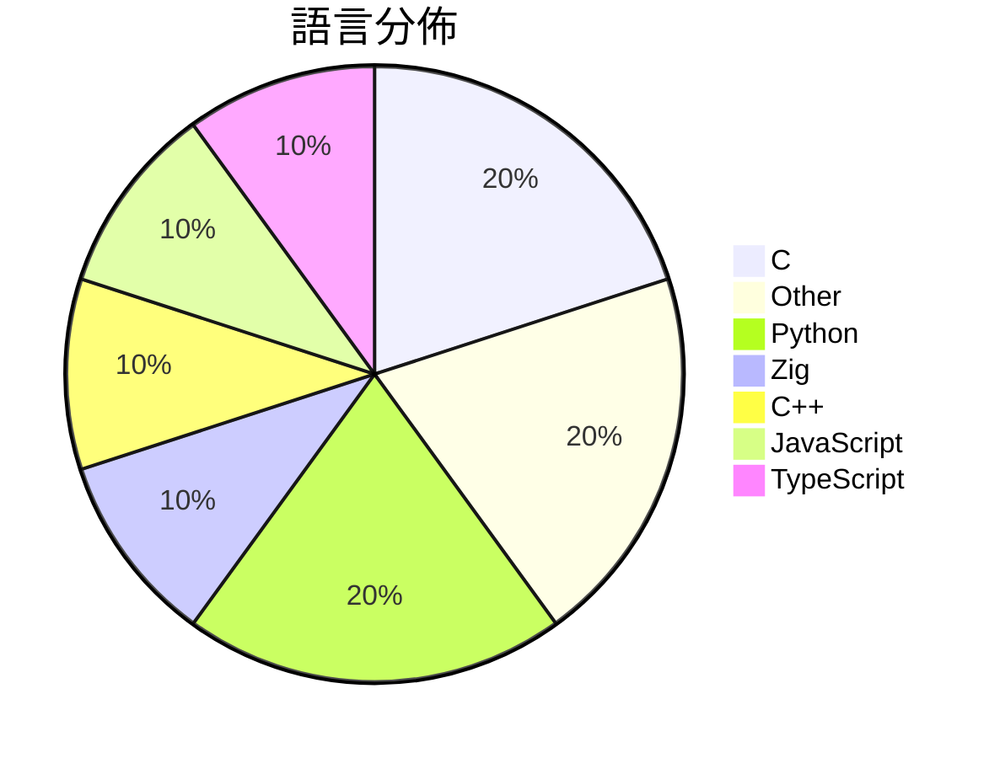

# GitHub Trending - 2026-05-14

> [!summary] 本日摘要
> 收錄 **10** 個新專案，合計 **16.6k** stars
> 語言分佈：C (2) · Other (2) · Python (2) · Zig (1) · C++ (1) · JavaScript (1) · TypeScript (1)

> [!tip] 本週焦點
> **[[V4bel--dirtyfrag|V4bel/dirtyfrag]]** — 6 天內累積 4.4k stars（737 stars/天）
> 透過鏈接兩個漏洞來獲取 Linux 系統的 root 權限。



---

## 收錄列表

| # | 專案 | 分類 | Stars | 速度 | 安裝 | 語言 | 用途 |
| :--: | --- | --- | ---: | ---: | --- | --- | --- |
| 1 | [[V4bel--dirtyfrag\|V4bel/dirtyfrag]] | 安全 | 4.4k | 737/天 | `easy` | C | 透過鏈接兩個漏洞來獲取 Linux 系統的 root 權限。 |
| 2 | [[vercel-labs--zero-native\|vercel-labs/zero-native]] | 開發工具 | 3.3k | 658/天 | `easy` | Zig | 使用 Zig 和網頁 UI 建立桌面和移動應用程式，提供輕量和快速的應用體驗。 |
| 3 | [[FULU-Foundation--OrcaSlicer-bambulab\|FULU-Foundation/OrcaSlicer-bambulab]] | 開發工具 | 3.0k | 1.5k/天 | `medium` | C++ | 恢復對 Bambu Lab 打印機的完整 BambuNetwork 支持，無需僅 |
| 4 | [[huangserva--3DCellForge\|huangserva/3DCellForge]] | 開發工具 | 1.8k | 603/天 | `easy` | JavaScript | 提供 AI 驅動的互動式 3D 細胞生成與探索平台。 |
| 5 | [[Nightmare-Eclipse--YellowKey\|Nightmare-Eclipse/YellowKey]] | 安全 | 1.0k | 1.0k/天 | `easy` | N/A | 利用漏洞繞過 Bitlocker 加密，獲取未授權存取。 |
| 6 | [[ywnd1144--Gopay_plus_automatic\|ywnd1144/Gopay_plus_automatic]] | 開發工具 | 712 | 712/天 | `medium` | Python | 自動化 ChatGPT Plus 訂閱工具，透過 GoPay 完成支付。 |
| 7 | [[HermannBjorgvin--Clawdmeter\|HermannBjorgvin/Clawdmeter]] | 基礎設施 | 683 | 342/天 | `medium` | C | 提供一個 ESP32 控制面板來監控 Claude Code 的使用情況。 |
| 8 | [[haydenbleasel--files-sdk\|haydenbleasel/files-sdk]] | 開發工具 | 645 | 129/天 | `easy` | TypeScript | 提供統一的物件和 blob 存儲 SDK，簡化不同後端的操作。 |
| 9 | [[thakur-works--DarkGPT\|thakur-works/DarkGPT]] | 其他 | 534 | 178/天 | `medium` | N/A | 提供一個免費的 ChatGPT 模組，能夠繞過某些限制。 |
| 10 | [[patchfighterway90--cs2-external-overlay\|patchfighterway90/cs2-external-overlay]] | 開發工具 | 533 | 533/天 | `easy` | Python | 提供可自訂的遊戲疊加工具，增強玩家和開發者的遊戲體驗。 |

---

## 重點摘要

### 1. [[V4bel--dirtyfrag|V4bel/dirtyfrag]] `安全`

> 透過鏈接兩個漏洞來獲取 Linux 系統的 root 權限。

**4.4k** stars · **737** stars/天 · C · `easy`

_建立 6 天就累積 4421 stars（737/天），forks 664（15.0%），這顯示出強烈的社群興趣。作者 V4bel 是漏洞研究者，之前發現過多個安全漏洞，這次的 Dirty Frag 解決了之前無法有效利用的漏洞組合。該專案的發布引起了安全社群的廣泛討論，尤其是在 Linux 系統的安全性方面。技術上，這個工具的出現是因為對於 Linux 核心漏洞的深入研究和發現，使得這種利用方式成為可能。高達 15% 的 forks/stars 比率顯示出許多人正在積極修改和使用這個工具，而不是僅僅觀望。_

---

### 2. [[vercel-labs--zero-native|vercel-labs/zero-native]] `開發工具`

> 使用 Zig 和網頁 UI 建立桌面和移動應用程式，提供輕量和快速的應用體驗。

**3.3k** stars · **658** stars/天 · Zig · `easy`

_建立 5 天就累積 3289 stars（658/天），forks 139（4.2%），顯示出相對穩定的興趣增長。作者 Vercel Labs 以其在前端技術上的專業知識著稱，這個專案解決了開發者在構建輕量級桌面應用時的需求，特別是在需要快速啟動和小型應用的情境下。之前的解決方案往往需要捆綁大型的瀏覽器運行時，導致應用體積龐大且啟動緩慢。這個專案的推出正好填補了這一空白，並且在社群中引起了廣泛的討論和關注。forks/stars 比率為 4.2%，顯示出有一定比例的開發者在實際修改和使用這個專案。_

---

### 3. [[FULU-Foundation--OrcaSlicer-bambulab|FULU-Foundation/OrcaSlicer-bambulab]] `開發工具`

> 恢復對 Bambu Lab 打印機的完整 BambuNetwork 支持，無需僅限於 LAN。

**3.0k** stars · **1.5k** stars/天 · C++ · `medium`

_建立 2 天內累積 2955 stars（1478/天），forks 959（32.5%），顯示出極高的用戶興趣。主要貢獻者 codedbyjake 之前在 OrcaSlicer 的開發中有豐富經驗，這使得該專案能夠快速吸引關注。這個工具解決了以往 Bambu Lab 打印機在遠端操作上的限制，讓用戶能夠更靈活地進行打印。社群對於恢復完整功能的需求強烈，尤其是在熱門的 GitHub 討論中，許多用戶對於如何更好地利用 BambuNetwork 表達了興趣。這種需求的增加，加上快速的開發和反饋，促使了專案的快速成長。_

---

### 4. [[huangserva--3DCellForge|huangserva/3DCellForge]] `開發工具`

> 提供 AI 驅動的互動式 3D 細胞生成與探索平台。

**1.8k** stars · **603** stars/天 · JavaScript · `easy`

_建立 3 天內累積 1809 stars（603/天），forks 309（17.1%），這顯示出強烈的社群興趣。主要貢獻者 hkulekci 在開源社群中有一定的影響力，過去參與過多個相關專案。這個專案解決了傳統 3D 模型生成工具的複雜性問題，提供了一個更直觀的操作界面和多樣化的生成選項。近期的推廣活動和社群討論也可能促進了其曝光率。技術上，隨著 WebGL 和 React 的普及，這個工具的可行性和吸引力大大提升。forks/stars 比率為 17.1%，顯示出許多開發者對此專案有實際修改和使用的意圖。_

---

### 5. [[Nightmare-Eclipse--YellowKey|Nightmare-Eclipse/YellowKey]] `安全`

> 利用漏洞繞過 Bitlocker 加密，獲取未授權存取。

**1.0k** stars · **1.0k** stars/天 · N/A · `easy`

_建立 1 天就累積 1000 stars（1000/天），forks 226（22.6%），這顯示出極高的關注度。作者 Nightmare-Eclipse 似乎在安全研究領域有一定的背景，這次發現的漏洞是針對 Bitlocker 的一個重大安全隱患，之前並沒有類似的有效解決方案。這個工具的出現引起了社群的廣泛討論，特別是在安全研究者和滲透測試者之間。技術上，這個漏洞的發現與 Windows 系統的安全設計有關，這使得它在當前的安全生態中顯得尤為重要。高達 22.6% 的 forks/stars 比率表明，許多人正在實際修改和使用這個工具，而不是僅僅觀望。_

---

### 6. [[ywnd1144--Gopay_plus_automatic|ywnd1144/Gopay_plus_automatic]] `開發工具`

> 自動化 ChatGPT Plus 訂閱工具，透過 GoPay 完成支付。

**712** stars · **712** stars/天 · Python · `medium`

_建立 1 天就累積 712 stars（712/天），forks 459（64.5%），這顯示出極高的使用者參與度。專案的作者 ywnd1144 似乎專注於開源工具的開發，這個專案解決了在印尼市場中，使用 GoPay 進行 ChatGPT Plus 訂閱的需求，之前的解決方案往往需要手動操作，效率低下。此專案的推出正好填補了這一空白。社群的活躍度也反映在開放的 Issues 上，儘管解決率不高，但仍有使用者在積極交流。這樣的情況可能會吸引更多開發者參與改進和擴展功能。_

---

### 7. [[HermannBjorgvin--Clawdmeter|HermannBjorgvin/Clawdmeter]] `基礎設施`

> 提供一個 ESP32 控制面板來監控 Claude Code 的使用情況。

**683** stars · **342** stars/天 · C · `medium`

_建立 2 天就累積 683 stars（341.5/天），forks 41（6.0%），顯示出不錯的增長潛力。作者 HermannBjorgvin 之前有其他開源專案，這次專案解決了用戶在使用 Claude Code 時缺乏實時監控工具的痛點。這個專案的出現正好填補了這一需求，並且其趣味性設計吸引了不少開發者的注意。社群的反應也顯示出對於這類硬體項目的興趣，尤其是結合了動畫和實用功能的設計。forks/stars 比率在中等範圍，意味著不少人有實際修改或使用的意圖。_

---

### 8. [[haydenbleasel--files-sdk|haydenbleasel/files-sdk]] `開發工具`

> 提供統一的物件和 blob 存儲 SDK，簡化不同後端的操作。

**645** stars · **129** stars/天 · TypeScript · `easy`

_建立 5 天內累積 645 stars（129/天），forks 15（2.3%），顯示出穩定的增長潛力。作者 Hayden Bleasel 過去在開源社群中活躍，這個專案解決了多雲存儲整合的痛點，讓開發者不必為不同的存儲後端撰寫重複的代碼。這個工具的出現正好符合了現代應用對於靈活性和可擴展性的需求，特別是在雲計算日益普及的背景下。Forks/stars 比率相對較低，顯示出使用者對於這個專案的觀望態度，可能還在評估其穩定性和適用性。_

---

### 9. [[thakur-works--DarkGPT|thakur-works/DarkGPT]] `其他`

> 提供一個免費的 ChatGPT 模組，能夠繞過某些限制。

**534** stars · **178** stars/天 · N/A · `medium`

_建立 3 天就累積 534 stars（178/天），forks 90（16.9%），這顯示出強烈的興趣和潛在的使用需求。作者 thakur-works 可能在 AI 和開源社群中有一定的影響力，這個專案解決了許多用戶對於 ChatGPT 限制的困擾，提供了一個更自由的使用選擇。近期的推廣活動或社群討論可能也促進了這個專案的曝光度。由於目前的 forks/stars 比率為 16.9%，顯示出許多用戶在實際修改和使用這個模組，而不僅僅是觀望。_

---

### 10. [[patchfighterway90--cs2-external-overlay|patchfighterway90/cs2-external-overlay]] `開發工具`

> 提供可自訂的遊戲疊加工具，增強玩家和開發者的遊戲體驗。

**533** stars · **533** stars/天 · Python · `easy`

_建立 1 天就累積 533 stars（533/天），forks 104（19.5%），這顯示出強烈的用戶興趣。作者 patchfighterway90 之前在遊戲開發領域有一定的經驗，這個工具解決了玩家在遊戲中獲取即時數據的痛點，之前的解決方案往往需要複雜的設置或代碼注入。這個工具的推出正好滿足了用戶對簡單易用的需求。技術上，Windows 平台的遊戲疊加需求一直存在，但缺乏輕量級的解決方案，cs2-external-overlay 的出現填補了這一空白。forks/stars 比率高達 19.5%，顯示出許多用戶正在實際修改和使用這個工具。_

---

## 今日到期複習

> [!tip] 根據間隔複習排程，今天該回顧的專案

```dataview
TABLE
  stars_per_day AS "Stars/天",
  category AS "分類",
  engagement AS "參與度"
FROM "Repos"
WHERE next_review AND date(next_review) <= date("2026-05-14") AND status != "archived"
SORT priority DESC
```

## 待處理

```dataviewjs
const pending = dv.pages('"Repos"').where(p => p.status === "to-review").length;
const unrated = dv.pages('"Repos"').where(p => p.status !== "archived" && p.status !== "to-review" && (p.my_rating || 0) === 0).length;
const noVerdict = dv.pages('"Repos"').where(p => p.status !== "archived" && (p.my_rating || 0) > 0 && (!p.verdict || p.verdict === "")).length;
const items = [];
if (pending > 0) items.push(`**${pending}** 個待分流`);
if (unrated > 0) items.push(`**${unrated}** 個已讀但未評分`);
if (noVerdict > 0) items.push(`**${noVerdict}** 個已評分但無結論`);
if (items.length > 0) dv.paragraph(items.join(" / "));
else dv.paragraph("所有專案都已處理完畢！");
```
