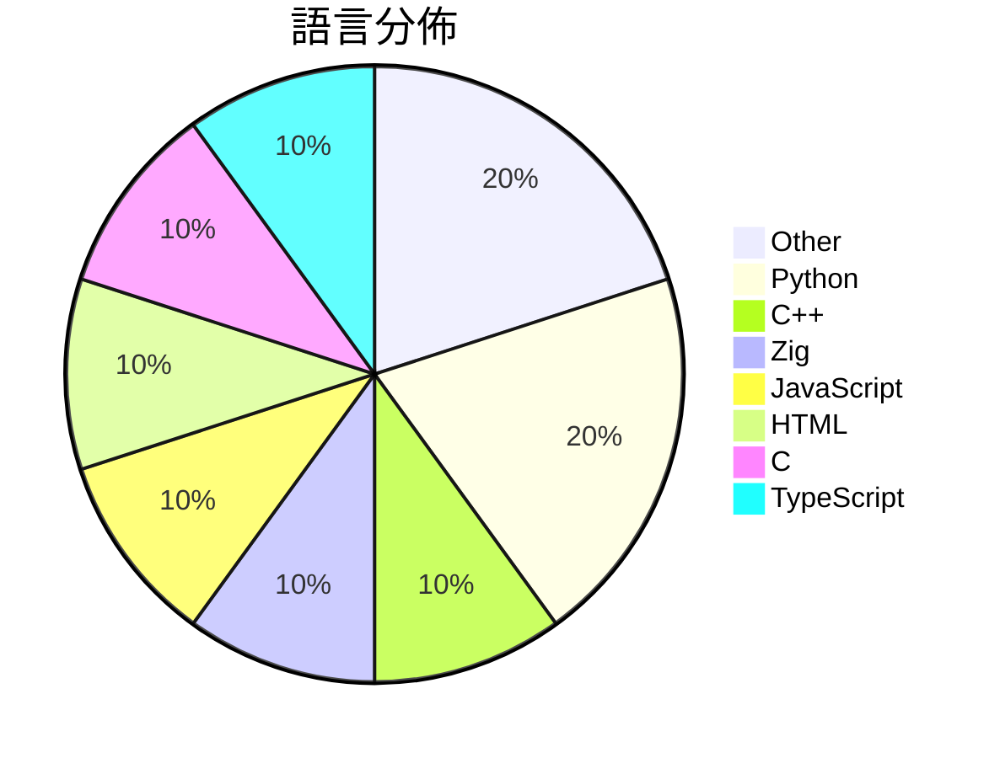

# GitHub Trending - 2026-05-15

> [!summary] 本日摘要
> 收錄 **10** 個新專案，合計 **15.9k** stars
> 語言分佈：Other (2) · Python (2) · C++ (1) · Zig (1) · JavaScript (1) · HTML (1) · C (1) · TypeScript (1)

> [!tip] 本週焦點
> **[[FULU-Foundation--OrcaSlicer-bambulab|FULU-Foundation/OrcaSlicer-bambulab]]** — 3 天內累積 4.1k stars（1.4k stars/天）
> 讓 Bambu Lab 打印機恢復完整的 BambuNetwork 支援，無需局限於 LAN。



---

## 收錄列表

| # | 專案 | 分類 | Stars | 速度 | 安裝 | 語言 | 用途 |
| :--: | --- | --- | ---: | ---: | --- | --- | --- |
| 1 | [[FULU-Foundation--OrcaSlicer-bambulab\|FULU-Foundation/OrcaSlicer-bambulab]] | 開發工具 | 4.1k | 1.4k/天 | `medium` | C++ | 讓 Bambu Lab 打印機恢復完整的 BambuNetwork 支援，無需局 |
| 2 | [[vercel-labs--zero-native\|vercel-labs/zero-native]] | 開發工具 | 3.5k | 583/天 | `easy` | Zig | 使用 Zig 和網頁 UI 建立桌面和行動應用程式。 |
| 3 | [[huangserva--3DCellForge\|huangserva/3DCellForge]] | 開發工具 | 2.0k | 503/天 | `easy` | JavaScript | 提供 AI 驅動的互動式 3D 模型生成、檢查和展示工作室。 |
| 4 | [[Nightmare-Eclipse--YellowKey\|Nightmare-Eclipse/YellowKey]] | 安全 | 1.8k | 878/天 | `easy` | N/A | 繞過 Bitlocker 的漏洞，讓攻擊者能夠獲得未經授權的存取權限。 |
| 5 | [[nexu-io--html-anything\|nexu-io/html-anything]] | 開發工具 | 930 | 310/天 | `medium` | HTML | 讓你的本地 AI 代理自動生成 HTML，無需手動編輯，快速發佈內容。 |
| 6 | [[HermannBjorgvin--Clawdmeter\|HermannBjorgvin/Clawdmeter]] | 其他 | 869 | 290/天 | `medium` | C | 一個 ESP32 桌面儀表板，用來監控 Claude Code 的使用情況。 |
| 7 | [[ywnd1144--Gopay_plus_automatic\|ywnd1144/Gopay_plus_automatic]] | 開發工具 | 793 | 397/天 | `medium` | Python | 自動化 ChatGPT Plus 訂閱工具，透過支付鏈路完成 0 元首月訂閱。 |
| 8 | [[simonlin1212--a-stock-data\|simonlin1212/a-stock-data]] | 資料科學 | 706 | 177/天 | `easy` | N/A | 整合多個數據源的 A 股市場數據工具包，提供即時數據和分析能力。 |
| 9 | [[haydenbleasel--files-sdk\|haydenbleasel/files-sdk]] | 開發工具 | 667 | 111/天 | `easy` | TypeScript | 提供統一的物件和 Blob 存儲 SDK，簡化不同後端的操作。 |
| 10 | [[TencentARC--Pixal3D\|TencentARC/Pixal3D]] | AI/ML | 640 | 160/天 | `medium` | Python | 從單張圖片生成高保真 3D 資產，提供像素對齊的 3D 生成技術。 |

---

## 重點摘要

### 1. [[FULU-Foundation--OrcaSlicer-bambulab|FULU-Foundation/OrcaSlicer-bambulab]] `開發工具`

> 讓 Bambu Lab 打印機恢復完整的 BambuNetwork 支援，無需局限於 LAN。

**4.1k** stars · **1.4k** stars/天 · C++ · `medium`

_建立 3 天就累積 4057 stars（1352/天），forks 1370（33.8%），顯示出強勁的社群關注度。主要貢獻者 codedbyjake 之前在 OrcaSlicer 專案中有過豐富的經驗，這次的分支專案解決了用戶對於 BambuNetwork 支援的迫切需求。此專案的推出正好填補了之前用戶在網絡打印上的空白，並且在社群中引發了討論和反饋。技術上，隨著 Bambu Lab 打印機的普及，這個工具的需求也隨之上升，讓更多用戶能夠享受無縫的打印體驗。forks/stars 比率高達 33.8%，顯示出許多人對於這個專案的實際應用和修改意願。_

---

### 2. [[vercel-labs--zero-native|vercel-labs/zero-native]] `開發工具`

> 使用 Zig 和網頁 UI 建立桌面和行動應用程式。

**3.5k** stars · **583** stars/天 · Zig · `easy`

_建立 6 天就累積 3496 stars（583/天），forks 143（4.1%），這顯示出其快速增長的潛力。作者 ctate 和其他貢獻者在開源社群中有著良好的聲譽，之前也參與過其他成功的專案。這個專案解決了在桌面應用開發中對於小型和快速重建的需求，之前的解決方案如 Electron 通常會導致應用體積過大且啟動緩慢。最近的推廣活動和社群討論也吸引了不少注意。隨著 Zig 語言的興起，這個工具的可行性和受歡迎程度也隨之增加。forks/stars 比率顯示出有相對較多的用戶在實際修改和使用這個專案，這是健康的社群信號。_

---

### 3. [[huangserva--3DCellForge|huangserva/3DCellForge]] `開發工具`

> 提供 AI 驅動的互動式 3D 模型生成、檢查和展示工作室。

**2.0k** stars · **503** stars/天 · JavaScript · `easy`

_建立 4 天內累積 2011 stars（503/天），forks 336（16.7%），顯示出強烈的興趣。作者 hkulekci 過去在開源社群中活躍，這個專案解決了傳統 3D 模型生成工具缺乏互動性和即時反饋的痛點。這個工具的出現正好符合了對於更直觀、易用的 3D 模型處理需求，特別是在 AI 驅動的生成方面。社群的反應熱烈，顯示出對於這類工具的需求正在上升。_

---

### 4. [[Nightmare-Eclipse--YellowKey|Nightmare-Eclipse/YellowKey]] `安全`

> 繞過 Bitlocker 的漏洞，讓攻擊者能夠獲得未經授權的存取權限。

**1.8k** stars · **878** stars/天 · N/A · `easy`

_建立 2 天就累積 1756 stars（878/天），forks 415（23.6%），這顯示出強烈的社群關注。作者 Nightmare-Eclipse 似乎是一位專注於安全漏洞的研究者，過去的發現也引起了廣泛的討論。這個專案解決了 Bitlocker 繞過的痛點，之前的解決方案往往需要更高的技術門檻或不夠便利。近期的社群討論和推文可能進一步推動了這個專案的曝光度。由於此漏洞的影響範圍廣泛，特別是在企業環境中，這使得它的關注度迅速上升。forks/stars 比率高達 23.6%，顯示出許多開發者對此專案有實際的修改和使用需求。_

---

### 5. [[nexu-io--html-anything|nexu-io/html-anything]] `開發工具`

> 讓你的本地 AI 代理自動生成 HTML，無需手動編輯，快速發佈內容。

**930** stars · **310** stars/天 · HTML · `medium`

_建立 3 天內累積 930 stars（310/天），forks 94（10.1%），顯示出強勁的增長潛力。這個專案的背後團隊來自於 Open Design，擁有豐富的開發經驗，並且針對現有的 Markdown 編輯工具的局限性提出了解決方案，讓使用者能夠直接生成 HTML，避免了傳統編輯器的繁瑣步驟。近期的推廣活動和社群討論也可能促進了這個專案的曝光度。技術上，這個工具的設計利用了多個 AI 代理的能力，讓使用者能夠在本地環境中運行，這在當前的開發生態中是相對少見的。forks/stars 比率為 10.1%，顯示出有相當比例的使用者對這個專案進行了實際的修改和使用。_

---

### 6. [[HermannBjorgvin--Clawdmeter|HermannBjorgvin/Clawdmeter]] `其他`

> 一個 ESP32 桌面儀表板，用來監控 Claude Code 的使用情況。

**869** stars · **290** stars/天 · C · `medium`

_建立 3 天內累積 869 stars（290/天），forks 62（7.1%），顯示出強勁的增長潛力。作者 HermannBjorgvin 之前有其他開源專案的經驗，這使得他能夠快速推出這個專案。Clawdmeter 解決了開發者在使用 Claude Code 時，缺乏即時監控工具的痛點，之前的解決方案多依賴於手動查詢或不夠直觀的界面。這個專案的推出引起了一些社群的關注，尤其是在 Twitter 上的分享和討論。技術上，ESP32 的普及和 BLE 的應用使得這個專案變得可行，並且 forks/stars 比率顯示出許多人對這個工具的實際修改和使用需求。_

---

### 7. [[ywnd1144--Gopay_plus_automatic|ywnd1144/Gopay_plus_automatic]] `開發工具`

> 自動化 ChatGPT Plus 訂閱工具，透過支付鏈路完成 0 元首月訂閱。

**793** stars · **397** stars/天 · Python · `medium`

_建立 2 天就累積 793 stars（397/天），forks 501（63.2%），這顯示出極高的使用者參與度。專案的作者 ywnd1144 似乎專注於開發自動化工具，這個專案解決了過去手動訂閱 ChatGPT Plus 的繁瑣過程，並且提供了自動化的 OTP 獲取方案。近期的熱門 Issues 反映出使用者對於功能和問題的積極討論，顯示出社群的活躍度。這個工具的出現正好符合了對於自動化和便捷性的需求，尤其是在需要快速獲取服務的場景下。_

---

### 8. [[simonlin1212--a-stock-data|simonlin1212/a-stock-data]] `資料科學`

> 整合多個數據源的 A 股市場數據工具包，提供即時數據和分析能力。

**706** stars · **177** stars/天 · N/A · `easy`

_建立 4 天內累積 706 stars（177/天），forks 173（24.5%），顯示出強烈的社群興趣。專案的作者 simonlin1212 之前在金融數據處理領域有過豐富的經驗，這個工具解決了用戶在獲取 A 股數據時的繁瑣流程，特別是對於需要即時數據的投資者來說，這是一個高效的解決方案。社群的活躍度和開放的問題反饋機制也促進了其快速成長。_

---

### 9. [[haydenbleasel--files-sdk|haydenbleasel/files-sdk]] `開發工具`

> 提供統一的物件和 Blob 存儲 SDK，簡化不同後端的操作。

**667** stars · **111** stars/天 · TypeScript · `easy`

_建立 6 天就累積 667 stars（111/天），forks 16（2.4%），這顯示出一定的社群關注度。作者 Hayden Bleasel 在開源社群中有一定的影響力，過去曾參與多個相關專案。這個 SDK 解決了開發者在不同雲端存儲服務之間切換時的痛點，以前開發者需要為每個服務編寫不同的代碼，這個 SDK 的出現使得這個過程變得簡單。近期的推廣活動和社群討論也可能促進了其快速增長。技術上，隨著 TypeScript 和現代 JavaScript 生態的普及，這個工具的可行性和吸引力也隨之提升。forks/stars 比率相對較低，顯示出大多數用戶對此專案的興趣主要在於觀望和使用，而非修改。_

---

### 10. [[TencentARC--Pixal3D|TencentARC/Pixal3D]] `AI/ML`

> 從單張圖片生成高保真 3D 資產，提供像素對齊的 3D 生成技術。

**640** stars · **160** stars/天 · Python · `medium`

_建立 4 天就累積 640 stars（160/天），forks 48（7.5%），顯示出一定的使用者興趣。這個專案由 Tsinghua University 和 Tencent ARC Lab 的團隊開發，解決了從單張圖片生成 3D 資產的技術挑戰，這在過去的工具中並不常見。最近的 SIGGRAPH 2026 會議上發表的論文也引起了關注，並且提供了線上演示，讓使用者能夠直接體驗其功能。這些因素共同促進了其快速增長的關注度。_

---

## 今日到期複習

> [!tip] 根據間隔複習排程，今天該回顧的專案

```dataview
TABLE
  stars_per_day AS "Stars/天",
  category AS "分類",
  engagement AS "參與度"
FROM "Repos"
WHERE next_review AND date(next_review) <= date("2026-05-15") AND status != "archived"
SORT priority DESC
```

## 待處理

```dataviewjs
const pending = dv.pages('"Repos"').where(p => p.status === "to-review").length;
const unrated = dv.pages('"Repos"').where(p => p.status !== "archived" && p.status !== "to-review" && (p.my_rating || 0) === 0).length;
const noVerdict = dv.pages('"Repos"').where(p => p.status !== "archived" && (p.my_rating || 0) > 0 && (!p.verdict || p.verdict === "")).length;
const items = [];
if (pending > 0) items.push(`**${pending}** 個待分流`);
if (unrated > 0) items.push(`**${unrated}** 個已讀但未評分`);
if (noVerdict > 0) items.push(`**${noVerdict}** 個已評分但無結論`);
if (items.length > 0) dv.paragraph(items.join(" / "));
else dv.paragraph("所有專案都已處理完畢！");
```
