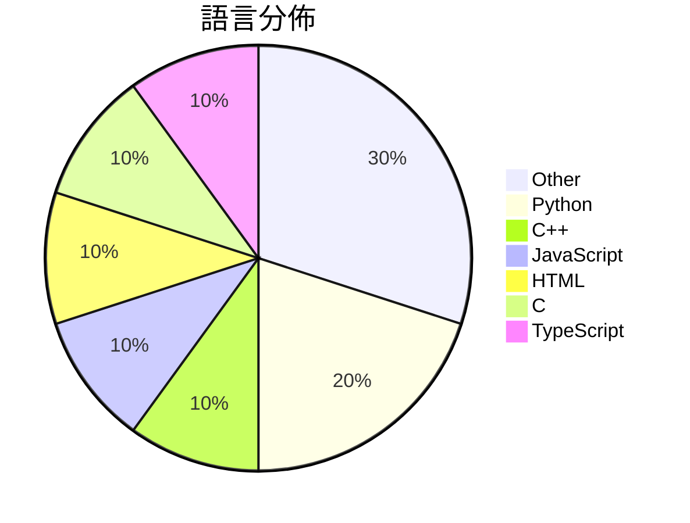

# GitHub Trending - 2026-05-16

> [!summary] 本日摘要
> 收錄 **10** 個新專案，合計 **16.3k** stars
> 語言分佈：Other (3) · Python (2) · C++ (1) · JavaScript (1) · HTML (1) · C (1) · TypeScript (1)

> [!tip] 本週焦點
> **[[FULU-Foundation--OrcaSlicer-bambulab|FULU-Foundation/OrcaSlicer-bambulab]]** — 4 天內累積 4.7k stars（1.2k stars/天）
> 恢復對 Bambu Lab 打印機的完整支持，無論是局域網還是互聯網均可使用。



---

## 收錄列表

| # | 專案 | 分類 | Stars | 速度 | 安裝 | 語言 | 用途 |
| :--: | --- | --- | ---: | ---: | --- | --- | --- |
| 1 | [[FULU-Foundation--OrcaSlicer-bambulab\|FULU-Foundation/OrcaSlicer-bambulab]] | 開發工具 | 4.7k | 1.2k/天 | `medium` | C++ | 恢復對 Bambu Lab 打印機的完整支持，無論是局域網還是互聯網均可使用。 |
| 2 | [[Nightmare-Eclipse--YellowKey\|Nightmare-Eclipse/YellowKey]] | 安全 | 2.4k | 812/天 | `easy` | N/A | 利用 YellowKey 漏洞繞過 Bitlocker 加密保護。 |
| 3 | [[huangserva--3DCellForge\|huangserva/3DCellForge]] | 開發工具 | 2.1k | 412/天 | `easy` | JavaScript | 提供 AI 驅動的互動式 3D 模型生成、檢查和展示平台。 |
| 4 | [[nexu-io--html-anything\|nexu-io/html-anything]] | 開發工具 | 2.0k | 497/天 | `medium` | HTML | 讓你的本地 AI 代理自動生成 HTML，簡化發佈流程。 |
| 5 | [[yetone--native-feel-skill\|yetone/native-feel-skill]] | 開發工具 | 1.1k | 1.1k/天 | `easy` | N/A | 設計跨平台桌面應用程式，實現近乎原生的使用體驗。 |
| 6 | [[HermannBjorgvin--Clawdmeter\|HermannBjorgvin/Clawdmeter]] | 開發工具 | 1.0k | 251/天 | `medium` | C | 一個 ESP32 桌面儀表板，用於監控 Claude Code 的使用情況。 |
| 7 | [[simonlin1212--a-stock-data\|simonlin1212/a-stock-data]] | 資料科學 | 882 | 176/天 | `easy` | N/A | 整合多個數據源，為中國 A 股市場提供全方位的數據工具包。 |
| 8 | [[ywnd1144--Gopay_plus_automatic\|ywnd1144/Gopay_plus_automatic]] | 開發工具 | 876 | 292/天 | `medium` | Python | 自動化 ChatGPT Plus 訂閱工具，透過 GoPay 完成支付。 |
| 9 | [[TencentARC--Pixal3D\|TencentARC/Pixal3D]] | AI/ML | 732 | 146/天 | `medium` | Python | 從單一圖像生成高保真 3D 資產，提供像素對齊的 3D 生成技術。 |
| 10 | [[cclank--cell-architecture-studio\|cclank/cell-architecture-studio]] | 教育資源 | 610 | 122/天 | `easy` | TypeScript | 提供互動式的細胞結構畫廊，讓使用者深入了解各種細胞類型及其組織。 |

---

## 重點摘要

### 1. [[FULU-Foundation--OrcaSlicer-bambulab|FULU-Foundation/OrcaSlicer-bambulab]] `開發工具`

> 恢復對 Bambu Lab 打印機的完整支持，無論是局域網還是互聯網均可使用。

**4.7k** stars · **1.2k** stars/天 · C++ · `medium`

_建立 4 天內累積 4668 stars（1167/天），forks 1610（34.5%），顯示出極高的用戶興趣。作者 codedbyjake 之前有開發相關的切片工具，這次專案解決了用戶對於 Bambu Lab 打印機的網絡支持需求，之前的方案無法有效支持遠程打印。最近的推廣活動和社群討論也促進了這個專案的曝光率。技術上，隨著 CMake 和多語言支持的普及，這個工具的開發變得更加可行，並且 forks/stars 比率高達 34.5%，顯示出許多用戶在實際修改和使用這個工具。_

---

### 2. [[Nightmare-Eclipse--YellowKey|Nightmare-Eclipse/YellowKey]] `安全`

> 利用 YellowKey 漏洞繞過 Bitlocker 加密保護。

**2.4k** stars · **812** stars/天 · N/A · `easy`

_建立 3 天就累積 2435 stars（812/天），forks 521（21.4%），顯示出極高的關注度。作者 Nightmare-Eclipse 之前在安全領域有過多次貢獻，這次的發現填補了 Bitlocker 繞過的空白，之前的工具無法有效針對此漏洞。社群對於這一漏洞的討論熱烈，尤其是針對其潛在的安全風險和實用性。技術上，Windows 11 的特定設計讓這個漏洞得以存在，這引發了安全專家的廣泛關注。高 forks/stars 比率顯示出許多人在實際修改和使用這個工具，這是其受歡迎的原因之一。_

---

### 3. [[huangserva--3DCellForge|huangserva/3DCellForge]] `開發工具`

> 提供 AI 驅動的互動式 3D 模型生成、檢查和展示平台。

**2.1k** stars · **412** stars/天 · JavaScript · `easy`

_建立 5 天內累積 2059 stars（412/天），forks 345（16.8%），顯示出強勁的增長潛力。這個專案由 hkulekci 主導，過去在 3D 和 AI 領域有豐富經驗。它解決了傳統 3D 建模工具複雜的操作流程，提供了一個更簡單的界面來生成和檢查模型。最近的推廣活動和社群反饋也促進了其快速成長。技術上，隨著 WebGL 和 React 的普及，這個工具的可行性大幅提升。forks/stars 比率為 16.8%，顯示出相對較高的實際使用和修改需求。_

---

### 4. [[nexu-io--html-anything|nexu-io/html-anything]] `開發工具`

> 讓你的本地 AI 代理自動生成 HTML，簡化發佈流程。

**2.0k** stars · **497** stars/天 · HTML · `medium`

_建立 4 天就累積 1989 stars（497/天），forks 226（11.4%），這顯示出強烈的使用者興趣。這個專案由 Open Design 團隊開發，該團隊在 AI 編輯器領域已有豐富經驗，並且針對 Markdown 和 HTML 之間的轉換痛點提供了解決方案。此專案的推出正好滿足了對於快速生成可發佈內容的需求，特別是在社交媒體和數位出版的背景下。最近的推特討論和社群反饋也促進了其知名度的提升。相對於傳統的編輯工具，html-anything 提供了更高的效率和靈活性，這使得它在當前的技術生態中顯得尤為重要。_

---

### 5. [[yetone--native-feel-skill|yetone/native-feel-skill]] `開發工具`

> 設計跨平台桌面應用程式，實現近乎原生的使用體驗。

**1.1k** stars · **1.1k** stars/天 · N/A · `easy`

_建立 1 天就累積 1066 stars（1066/天），forks 46（4.3%），這顯示出強烈的興趣和潛在的實際應用需求。這個專案的作者 yetone 和 notdp 在開源社群中有一定的影響力，過去可能參與過其他相關專案。它解決了跨平台開發中常見的性能妥協問題，提供了一個清晰的架構和實用的檢查清單，讓開發者能夠在不妥協的情況下實現原生感。這個技能的出現正好契合了開發者對於高效能和良好使用者體驗的需求，並且在社群中引起了討論和關注。_

---

### 6. [[HermannBjorgvin--Clawdmeter|HermannBjorgvin/Clawdmeter]] `開發工具`

> 一個 ESP32 桌面儀表板，用於監控 Claude Code 的使用情況。

**1.0k** stars · **251** stars/天 · C · `medium`

_建立 4 天就累積 1004 stars（251/天），forks 88（8.8%），這顯示出強勁的增長潛力。作者 HermannBjorgvin 之前的作品可能在社群中有一定的影響力，這個專案解決了使用 Claude Code 時缺乏即時監控工具的痛點。之前的解決方案往往需要手動查詢使用數據，無法實時反饋。這個專案的推出可能引起了開發者社群的廣泛關注，尤其是那些經常使用 Claude 的人。技術上，ESP32 的普及和 BLE 的便利性使得這個工具的實現變得可行。forks/stars 比率為 8.8%，顯示出許多人對這個專案有實際的修改和使用需求。_

---

### 7. [[simonlin1212--a-stock-data|simonlin1212/a-stock-data]] `資料科學`

> 整合多個數據源，為中國 A 股市場提供全方位的數據工具包。

**882** stars · **176** stars/天 · N/A · `easy`

_建立 5 天內累積 882 stars（176/天），forks 212（24.0%），顯示出強烈的社群興趣。作者 Simon Lin 是一位專注於金融數據分析的開發者，這個工具解決了以往數據來源分散、整合困難的問題，讓用戶能夠更方便地獲取 A 股市場的數據。近期的推廣和社群討論也促進了這個專案的曝光度。隨著金融科技的發展，對於即時數據的需求越來越高，這個工具正好滿足了這一需求。高達 24% 的 forks/stars 比率顯示出許多人正在實際修改和使用這個專案，反映了其實用性和潛在的應用價值。_

---

### 8. [[ywnd1144--Gopay_plus_automatic|ywnd1144/Gopay_plus_automatic]] `開發工具`

> 自動化 ChatGPT Plus 訂閱工具，透過 GoPay 完成支付。

**876** stars · **292** stars/天 · Python · `medium`

_建立 3 天內累積 876 stars（292/天），forks 531（60.6%），這顯示出強烈的社群興趣。專案的作者 ywnd1144 似乎是個活躍的開發者，這個工具解決了以往手動處理 ChatGPT 訂閱的繁瑣過程，並且提供了一個自動化的解決方案。社群中對於如何繞過 GoPay 的風控問題有一定的討論，這可能是吸引使用者的原因之一。隨著對自動化工具需求的增加，這個專案的出現恰好滿足了這一需求。_

---

### 9. [[TencentARC--Pixal3D|TencentARC/Pixal3D]] `AI/ML`

> 從單一圖像生成高保真 3D 資產，提供像素對齊的 3D 生成技術。

**732** stars · **146** stars/天 · Python · `medium`

_建立 5 天內累積 732 stars（146/天），forks 56（7.7%），顯示出不錯的初期關注度。該專案由 Tsinghua University 和 Tencent ARC Lab 的研究者共同開發，解決了從單一圖像生成高保真 3D 資產的痛點，這在以往的技術中並不常見。近期的 SIGGRAPH 2026 接受論文也引起了業界的注意，可能是推動其快速增長的原因之一。技術上，隨著深度學習和計算機視覺的進步，這種基於像素的 3D 生成變得可行，並且能夠提供更高的真實感。forks/stars 比率在 7.7% 表示有相當一部分使用者對此專案進行了實際的修改和使用，顯示出其實用性和潛在的擴展性。_

---

### 10. [[cclank--cell-architecture-studio|cclank/cell-architecture-studio]] `教育資源`

> 提供互動式的細胞結構畫廊，讓使用者深入了解各種細胞類型及其組織。

**610** stars · **122** stars/天 · TypeScript · `easy`

_建立 5 天內累積 610 stars（122/天），forks 133（21.8%），這顯示出相對活躍的社群參與。作者 cclank 之前有過相關的開發經驗，這個專案解決了在網頁上呈現細胞結構的需求，之前的工具多數缺乏互動性和高保真度。最近的推文和社群討論也引起了關注，讓這個專案迅速成為焦點。技術上，使用 React 和 Three.js 的組合使得這個工具能夠在瀏覽器中流暢運行，這在過去是難以實現的。forks/stars 比率高達 21.8%，顯示出許多人對這個專案的實際修改和使用。_

---

## 今日到期複習

> [!tip] 根據間隔複習排程，今天該回顧的專案

```dataview
TABLE
  stars_per_day AS "Stars/天",
  category AS "分類",
  engagement AS "參與度"
FROM "Repos"
WHERE next_review AND date(next_review) <= date("2026-05-16") AND status != "archived"
SORT priority DESC
```

## 待處理

```dataviewjs
const pending = dv.pages('"Repos"').where(p => p.status === "to-review").length;
const unrated = dv.pages('"Repos"').where(p => p.status !== "archived" && p.status !== "to-review" && (p.my_rating || 0) === 0).length;
const noVerdict = dv.pages('"Repos"').where(p => p.status !== "archived" && (p.my_rating || 0) > 0 && (!p.verdict || p.verdict === "")).length;
const items = [];
if (pending > 0) items.push(`**${pending}** 個待分流`);
if (unrated > 0) items.push(`**${unrated}** 個已讀但未評分`);
if (noVerdict > 0) items.push(`**${noVerdict}** 個已評分但無結論`);
if (items.length > 0) dv.paragraph(items.join(" / "));
else dv.paragraph("所有專案都已處理完畢！");
```
