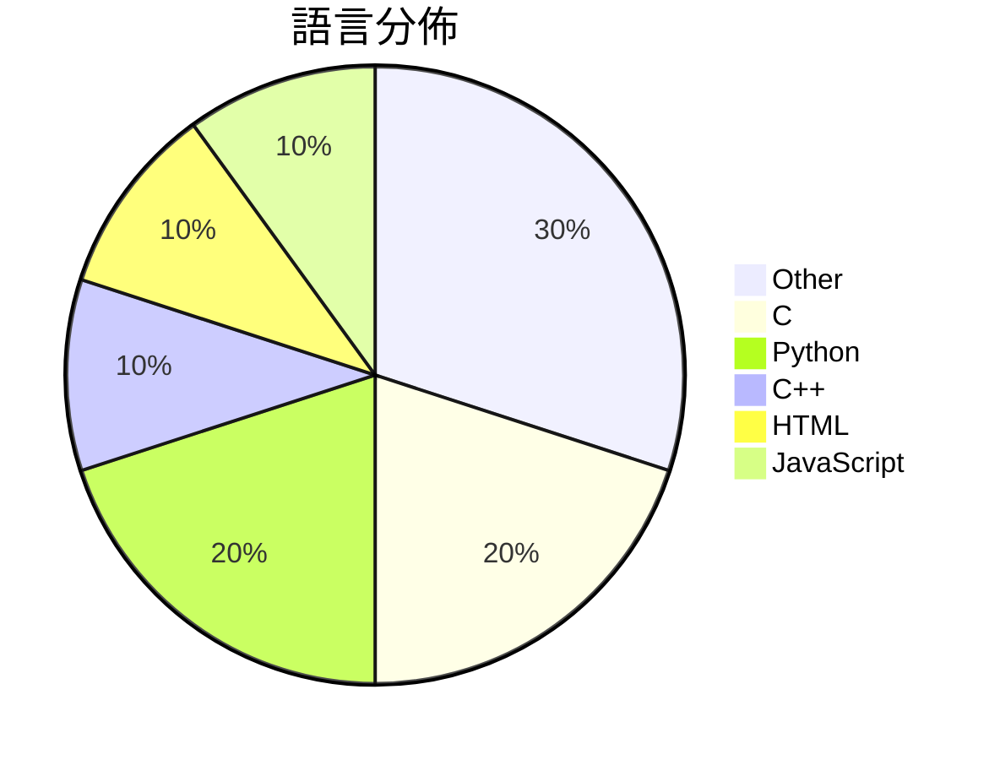

# GitHub Trending - 2026-05-17

> [!summary] 本日摘要
> 收錄 **10** 個新專案，合計 **18.8k** stars
> 語言分佈：Other (3) · C (2) · Python (2) · C++ (1) · HTML (1) · JavaScript (1)

> [!tip] 本週焦點
> **[[FULU-Foundation--OrcaSlicer-bambulab|FULU-Foundation/OrcaSlicer-bambulab]]** — 5 天內累積 5.4k stars（1.1k stars/天）
> 恢復 Bambu Lab 打印機的完整 BambuNetwork 支持，無論是 LAN 還是互聯網都能正常使用。



---

## 收錄列表

| # | 專案 | 分類 | Stars | 速度 | 安裝 | 語言 | 用途 |
| :--: | --- | --- | ---: | ---: | --- | --- | --- |
| 1 | [[FULU-Foundation--OrcaSlicer-bambulab\|FULU-Foundation/OrcaSlicer-bambulab]] | 開發工具 | 5.4k | 1.1k/天 | `medium` | C++ | 恢復 Bambu Lab 打印機的完整 BambuNetwork 支持，無論是  |
| 2 | [[Nightmare-Eclipse--YellowKey\|Nightmare-Eclipse/YellowKey]] | 安全 | 2.9k | 713/天 | `easy` | N/A | 繞過 BitLocker 保護的漏洞利用工具。 |
| 3 | [[nexu-io--html-anything\|nexu-io/html-anything]] | 開發工具 | 2.5k | 491/天 | `medium` | HTML | 讓你的本地 AI 代理編寫 HTML，快速發佈內容，無需 API 金鑰。 |
| 4 | [[huangserva--3DCellForge\|huangserva/3DCellForge]] | 開發工具 | 2.1k | 349/天 | `easy` | JavaScript | 提供 AI 驅動的互動式 3D 模型生成、檢查和展示工作室。 |
| 5 | [[yetone--native-feel-skill\|yetone/native-feel-skill]] | 開發工具 | 1.2k | 615/天 | `easy` | N/A | 設計跨平台桌面應用程式，讓它們感覺像原生應用程式。 |
| 6 | [[HermannBjorgvin--Clawdmeter\|HermannBjorgvin/Clawdmeter]] | 基礎設施 | 1.1k | 217/天 | `medium` | C | 一個 ESP32 桌面儀表板，用於監控 Claude Code 的使用情況。 |
| 7 | [[vercel-labs--zero\|vercel-labs/zero]] | 開發工具 | 1.0k | 1.0k/天 | `easy` | C | 為代理程式設計的編程語言，專注於小型原生工具的開發。 |
| 8 | [[simonlin1212--a-stock-data\|simonlin1212/a-stock-data]] | 開發工具 | 991 | 165/天 | `easy` | N/A | 整合多個數據源的 A 股數據工具，讓 AI 助手能夠輕鬆獲取市場資訊。 |
| 9 | [[ywnd1144--Gopay_plus_automatic\|ywnd1144/Gopay_plus_automatic]] | 其他 | 902 | 226/天 | `medium` | Python | 自動化 ChatGPT Plus 訂閱流程，透過 GoPay 完成支付。 |
| 10 | [[TencentARC--Pixal3D\|TencentARC/Pixal3D]] | AI/ML | 799 | 133/天 | `medium` | Python | 從單一圖像生成高保真 3D 資產，實現像素對齊的 3D 生成。 |

---

## 重點摘要

### 1. [[FULU-Foundation--OrcaSlicer-bambulab|FULU-Foundation/OrcaSlicer-bambulab]] `開發工具`

> 恢復 Bambu Lab 打印機的完整 BambuNetwork 支持，無論是 LAN 還是互聯網都能正常使用。

**5.4k** stars · **1.1k** stars/天 · C++ · `medium`

_建立 5 天內累積 5361 stars（1072/天），forks 3343（62.4%），顯示出強烈的社群參與。主要貢獻者 codedbyjake 過去在開源社群有良好表現，這使得該專案受到信任。該工具解決了 Bambu Lab 打印機用戶在網絡使用上的痛點，之前的解決方案往往僅限於 LAN，無法滿足遠程打印的需求。近期的推廣活動和社群反饋也促進了其快速增長。該工具的設計使得用戶能夠在不同的網絡環境下靈活使用，這在當前的市場需求中是非常重要的。forks/stars 比率高達 62.4%，顯示出許多人在積極修改和使用這個工具。_

---

### 2. [[Nightmare-Eclipse--YellowKey|Nightmare-Eclipse/YellowKey]] `安全`

> 繞過 BitLocker 保護的漏洞利用工具。

**2.9k** stars · **713** stars/天 · N/A · `easy`

_建立 4 天就累積 2851 stars（713/天），forks 598（21.0%），顯示出極高的關注度。作者 Nightmare-Eclipse 以發現漏洞聞名，這次的工具解決了過去 BitLocker 繞過的困難，讓使用者能夠輕鬆獲取加密資料。此專案的曝光可能與社群對於 Windows 安全性問題的持續關注有關，特別是在最近的安全漏洞報導中。forks/stars 比率為 21.0%，顯示出許多使用者對於實際修改和使用此工具的興趣。_

---

### 3. [[nexu-io--html-anything|nexu-io/html-anything]] `開發工具`

> 讓你的本地 AI 代理編寫 HTML，快速發佈內容，無需 API 金鑰。

**2.5k** stars · **491** stars/天 · HTML · `medium`

_建立 5 天內累積 2456 stars（491/天），forks 287（11.7%），顯示出強勁的增長潛力。這個專案由 Open Design 團隊開發，該團隊在內容生成方面已有豐富經驗，並且針對 Markdown 的限制提出了 HTML 生成的解決方案。此工具的出現正好填補了需要快速生成可視化內容的市場空白。社群對於其功能的需求和反饋也促進了其快速發展。依賴於本地 AI 代理的設計，使得使用者不需要額外的 API 金鑰，降低了使用門檻，這也是其受歡迎的原因之一。_

---

### 4. [[huangserva--3DCellForge|huangserva/3DCellForge]] `開發工具`

> 提供 AI 驅動的互動式 3D 模型生成、檢查和展示工作室。

**2.1k** stars · **349** stars/天 · JavaScript · `easy`

_建立 6 天內累積 2091 stars（349/天），forks 351（16.8%），顯示出強勁的增長潛力。作者 hkulekci 之前在 3D 和 AI 領域有過相關經驗，這使得他能夠針對市場需求開發出這樣的工具。3DCellForge 解決了傳統 3D 模型生成工具的複雜性，通過簡化操作流程和提供即時反饋，讓用戶能夠快速創建和展示模型。這種需求在當前的設計和開發環境中非常迫切，特別是對於需要快速迭代的團隊來說。技術上，隨著 WebGL 和現代前端框架的成熟，這個工具的可行性大大提升。Forks/stars 比率為 16.8%，顯示出許多開發者對此工具的實際修改和使用意圖。_

---

### 5. [[yetone--native-feel-skill|yetone/native-feel-skill]] `開發工具`

> 設計跨平台桌面應用程式，讓它們感覺像原生應用程式。

**1.2k** stars · **615** stars/天 · N/A · `easy`

_建立 2 天內累積 1230 stars（615/天），forks 56（4.6%），顯示出相對穩定的關注度。這個專案的作者 yetone 和 notdp 具備豐富的開發背景，專注於解決跨平台開發中常見的性能與原生感之間的矛盾。之前的解決方案往往在便利性和性能上無法取得平衡，而這個專案提供了一個清晰的架構和實用的檢查清單，讓開發者能夠更容易地達成目標。社群的反饋和使用情境的多樣性也促進了這個專案的快速成長。_

---

### 6. [[HermannBjorgvin--Clawdmeter|HermannBjorgvin/Clawdmeter]] `基礎設施`

> 一個 ESP32 桌面儀表板，用於監控 Claude Code 的使用情況。

**1.1k** stars · **217** stars/天 · C · `medium`

_建立 5 天內累積 1086 stars（217/天），forks 98（9.0%），顯示出強勁的增長潛力。作者 HermannBjorgvin 以其創意和技術背景，解決了監控 Claude Code 使用的需求，之前的工具多數缺乏即時反饋和可視化界面。該專案的推廣可能受到社群的積極討論和分享影響，特別是在開源硬體和 AI 工具的交集上。高達 9% 的 forks/stars 比率顯示出許多開發者對這個專案的實際修改和使用意圖。_

---

### 7. [[vercel-labs--zero|vercel-labs/zero]] `開發工具`

> 為代理程式設計的編程語言，專注於小型原生工具的開發。

**1.0k** stars · **1.0k** stars/天 · C · `easy`

_建立 1 天就累積 1030 stars（1030/天），forks 56（5.4%），這顯示出強烈的興趣。作者 ctate 之前在開源社群中有一定的影響力，這個專案解決了小型原生工具開發中的靈活性和效率問題，之前的方案如 Rust 和 Go 雖然強大，但在小型工具開發上不夠專注。社群的反應和問題討論也顯示出使用者對於功能和穩定性的期待。技術生態的變化，如對於小型工具需求的增加，也讓這個工具變得更加可行。forks/stars 比率在中等範圍，顯示出一些開發者開始實際修改和使用此工具。_

---

### 8. [[simonlin1212--a-stock-data|simonlin1212/a-stock-data]] `開發工具`

> 整合多個數據源的 A 股數據工具，讓 AI 助手能夠輕鬆獲取市場資訊。

**991** stars · **165** stars/天 · N/A · `easy`

_建立 6 天就累積 991 stars（165/天），forks 232（23.4%），顯示出強烈的社群參與。作者 simonlin1212 在 A 股數據領域有豐富經驗，這個工具解決了以往數據獲取繁瑣的問題，讓使用者能夠快速整合多個數據源。近期的推廣活動和社群討論也可能促進了這個專案的流行。高達 23.4% 的 forks/stars 比率顯示出許多使用者對此專案的實際修改和貢獻，這是其社群活躍度的良好指標。_

---

### 9. [[ywnd1144--Gopay_plus_automatic|ywnd1144/Gopay_plus_automatic]] `其他`

> 自動化 ChatGPT Plus 訂閱流程，透過 GoPay 完成支付。

**902** stars · **226** stars/天 · Python · `medium`

_建立 4 天內累積 902 stars（226/天），forks 535（59.3%），這顯示出強烈的社群參與。專案作者 ywnd1144 之前有其他開源專案，這使得他在社群中有一定的信譽。這個工具解決了手動訂閱 ChatGPT Plus 的繁瑣流程，讓使用者能夠快速且自動化地完成訂閱，這在當前需求上是相當受歡迎的。社群對於自動化工具的需求持續增長，尤其是在 AI 相關的應用上，這使得該專案的吸引力大增。最近的推廣活動或社群討論可能也促進了它的曝光率。_

---

### 10. [[TencentARC--Pixal3D|TencentARC/Pixal3D]] `AI/ML`

> 從單一圖像生成高保真 3D 資產，實現像素對齊的 3D 生成。

**799** stars · **133** stars/天 · Python · `medium`

_建立 6 天內累積 799 stars（133/天），forks 63（7.9%），顯示出強勁的增長潛力。這個專案由來自清華大學和騰訊 ARC 實驗室的團隊主導，他們在 3D 生成技術上有著深厚的背景。Pixal3D 解決了以往方法中對圖像特徵的模糊注入問題，提供了一種更精確的像素對齊技術。最近的 SIGGRAPH 2026 論文發表也為其帶來了關注，進一步提升了其曝光率。技術生態的變化，如深度學習模型的進步，使得這種高保真 3D 生成變得可行。forks/stars 比率為 7.9%，顯示出有相當比例的用戶在進行實際修改和使用。_

---

## 今日到期複習

> [!tip] 根據間隔複習排程，今天該回顧的專案

```dataview
TABLE
  stars_per_day AS "Stars/天",
  category AS "分類",
  engagement AS "參與度"
FROM "Repos"
WHERE next_review AND date(next_review) <= date("2026-05-17") AND status != "archived"
SORT priority DESC
```

## 待處理

```dataviewjs
const pending = dv.pages('"Repos"').where(p => p.status === "to-review").length;
const unrated = dv.pages('"Repos"').where(p => p.status !== "archived" && p.status !== "to-review" && (p.my_rating || 0) === 0).length;
const noVerdict = dv.pages('"Repos"').where(p => p.status !== "archived" && (p.my_rating || 0) > 0 && (!p.verdict || p.verdict === "")).length;
const items = [];
if (pending > 0) items.push(`**${pending}** 個待分流`);
if (unrated > 0) items.push(`**${unrated}** 個已讀但未評分`);
if (noVerdict > 0) items.push(`**${noVerdict}** 個已評分但無結論`);
if (items.length > 0) dv.paragraph(items.join(" / "));
else dv.paragraph("所有專案都已處理完畢！");
```
