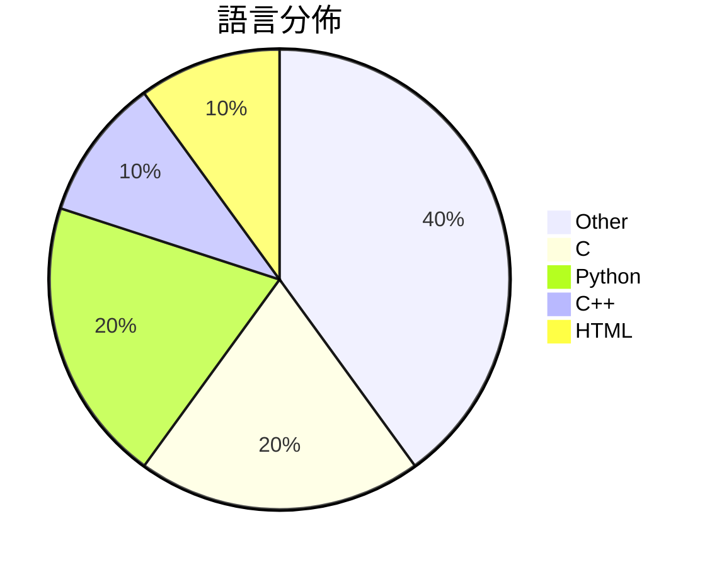

# GitHub Trending - 2026-05-18

> [!summary] 本日摘要
> 收錄 **10** 個新專案，合計 **19.2k** stars
> 語言分佈：Other (4) · C (2) · Python (2) · C++ (1) · HTML (1)

> [!tip] 本週焦點
> **[[FULU-Foundation--OrcaSlicer-bambulab|FULU-Foundation/OrcaSlicer-bambulab]]** — 6 天內累積 5.7k stars（954 stars/天）
> 恢復對 Bambu Lab 打印機的完整支持，無論是局域網還是互聯網均可使用。



---

## 收錄列表

| # | 專案 | 分類 | Stars | 速度 | 安裝 | 語言 | 用途 |
| :--: | --- | --- | ---: | ---: | --- | --- | --- |
| 1 | [[FULU-Foundation--OrcaSlicer-bambulab\|FULU-Foundation/OrcaSlicer-bambulab]] | 開發工具 | 5.7k | 954/天 | `medium` | C++ | 恢復對 Bambu Lab 打印機的完整支持，無論是局域網還是互聯網均可使用。 |
| 2 | [[Nightmare-Eclipse--YellowKey\|Nightmare-Eclipse/YellowKey]] | 安全 | 3.2k | 631/天 | `easy` | N/A | 繞過 Bitlocker 保護的漏洞利用工具。 |
| 3 | [[nexu-io--html-anything\|nexu-io/html-anything]] | 開發工具 | 2.8k | 468/天 | `medium` | HTML | 讓你的本地 AI 代理自動生成 HTML，簡化內容發佈流程。 |
| 4 | [[vercel-labs--zero\|vercel-labs/zero]] | 開發工具 | 1.7k | 849/天 | `easy` | C | 提供一種專為代理設計的系統語言，讓開發者能夠創建小型原生工具，並明確控制效應和記 |
| 5 | [[yetone--native-feel-skill\|yetone/native-feel-skill]] | 開發工具 | 1.3k | 425/天 | `easy` | N/A | 設計跨平台桌面應用程式，讓它們感覺像原生應用。 |
| 6 | [[HermannBjorgvin--Clawdmeter\|HermannBjorgvin/Clawdmeter]] | 開發工具 | 1.1k | 189/天 | `medium` | C | 提供一個 ESP32 控制面板，實時監控 Claude Code 的使用情況。 |
| 7 | [[simonlin1212--a-stock-data\|simonlin1212/a-stock-data]] | 資料科學 | 1.1k | 158/天 | `easy` | N/A | 整合 A 股數據的全棧工具包，讓 AI 編程助手輕鬆獲取市場數據。 |
| 8 | [[ywnd1144--Gopay_plus_automatic\|ywnd1144/Gopay_plus_automatic]] | 其他 | 921 | 184/天 | `medium` | Python | 自動化 ChatGPT Plus 訂閱，透過 GoPay 完成支付。 |
| 9 | [[DenisSergeevitch--agents-best-practices\|DenisSergeevitch/agents-best-practices]] | AI/ML | 721 | 361/天 | `easy` | N/A | 提供中立的代理技能設計，適用於 Codex 和 Claude Code。 |
| 10 | [[DepthFirstDisclosures--Nginx-Rift\|DepthFirstDisclosures/Nginx-Rift]] | 安全 | 674 | 135/天 | `medium` | Python | 針對 CVE-2026-42945 的遠端代碼執行漏洞利用工具。 |

---

## 重點摘要

### 1. [[FULU-Foundation--OrcaSlicer-bambulab|FULU-Foundation/OrcaSlicer-bambulab]] `開發工具`

> 恢復對 Bambu Lab 打印機的完整支持，無論是局域網還是互聯網均可使用。

**5.7k** stars · **954** stars/天 · C++ · `medium`

_建立 6 天內累積 5724 stars（954/天），forks 4141（72.3%），顯示出極高的用戶參與度。這個專案由 codedbyjake 主導，他在開源社群中有一定的知名度。OrcaSlicer 解決了 Bambu Lab 打印機用戶在網絡打印方面的痛點，之前的解決方案往往局限於局域網，無法滿足遠程打印的需求。最近的推廣活動和社群討論也促進了這個專案的曝光率。技術上，隨著 CMake 和多平台支持的發展，這個工具的可行性大幅提升。高達 72.3% 的 forks/stars 比率顯示出許多開發者對於這個專案的實際修改和使用，這是一個良好的信號。_

---

### 2. [[Nightmare-Eclipse--YellowKey|Nightmare-Eclipse/YellowKey]] `安全`

> 繞過 Bitlocker 保護的漏洞利用工具。

**3.2k** stars · **631** stars/天 · N/A · `easy`

_建立 5 天就累積 3157 stars（631/天），forks 671（21.3%），顯示出強烈的社群關注。作者 Nightmare-Eclipse 以其在安全漏洞研究方面的貢獻而知名，此次發現的漏洞解決了過去在 Bitlocker 繞過方面的痛點，因為之前的工具多數需要複雜的配置或特定的硬體支持。社群中的討論和反應也顯示出對此漏洞的高度關注，尤其是對其是否為後門的質疑。這一切都促進了該專案的快速增長。_

---

### 3. [[nexu-io--html-anything|nexu-io/html-anything]] `開發工具`

> 讓你的本地 AI 代理自動生成 HTML，簡化內容發佈流程。

**2.8k** stars · **468** stars/天 · HTML · `medium`

_建立 6 天就累積 2805 stars（468/天），forks 334（11.9%），這顯示出相當高的興趣和活躍度。這個專案由 Open Design 團隊開發，該團隊在開源社群中已有相當的影響力。html-anything 解決了傳統 Markdown 編輯器在格式化和發佈過程中的繁瑣問題，提供了一個更直觀的解決方案。近期的推廣活動和社群討論也提升了其曝光率。這個工具的設計符合當前對於 AI 助手的需求，讓用戶能夠更輕鬆地創建內容。_

---

### 4. [[vercel-labs--zero|vercel-labs/zero]] `開發工具`

> 提供一種專為代理設計的系統語言，讓開發者能夠創建小型原生工具，並明確控制效應和記憶體。

**1.7k** stars · **849** stars/天 · C · `easy`

_建立 2 天內累積 1697 stars（849/天），forks 106（6.2%），顯示出強烈的社群興趣。作者 ctate 之前在編程語言和系統工具方面有豐富經驗，Zero 解決了現有語言在代理開發中的不足，特別是在效應管理和記憶體控制方面。最近的推文和討論引發了對這個新語言的關注。技術上，Zero 的設計理念和實作方式使其能夠在當前語言生態中脫穎而出，尤其是在高效能需求的場景中。forks/stars 比率顯示出相對較高的實際使用意圖，這意味著許多開發者正在考慮將其納入自己的工具鏈。_

---

### 5. [[yetone--native-feel-skill|yetone/native-feel-skill]] `開發工具`

> 設計跨平台桌面應用程式，讓它們感覺像原生應用。

**1.3k** stars · **425** stars/天 · N/A · `easy`

_建立 3 天內累積 1276 stars（425/天），forks 61（4.8%），這顯示出相對穩定的興趣增長。這個專案由 yetone 和 notdp 共同開發，且基於 Raycast 的技術深度分析和反向工程，解決了跨平台開發中性能和原生感之間的矛盾。之前的解決方案如 Electron 和 Tauri 雖然流行，但往往在原生感上有所妥協。這個專案的出現正好填補了這一空白，並且在技術社群中引發了討論。_

---

### 6. [[HermannBjorgvin--Clawdmeter|HermannBjorgvin/Clawdmeter]] `開發工具`

> 提供一個 ESP32 控制面板，實時監控 Claude Code 的使用情況。

**1.1k** stars · **189** stars/天 · C · `medium`

_建立 6 天就累積 1136 stars（189/天），forks 101（8.9%），這顯示出強烈的社群興趣。作者 HermannBjorgvin 之前有過多個成功的開源專案，這次專案解決了開發者在使用 Claude Code 時缺乏即時監控工具的痛點。之前的解決方案多數依賴於桌面應用程式，無法提供即時的使用反饋。這個專案的推出正好填補了這一空白，並且在社群中引起了廣泛的關注。_

---

### 7. [[simonlin1212--a-stock-data|simonlin1212/a-stock-data]] `資料科學`

> 整合 A 股數據的全棧工具包，讓 AI 編程助手輕鬆獲取市場數據。

**1.1k** stars · **158** stars/天 · N/A · `easy`

_建立 7 天就累積 1105 stars（158/天），forks 259（23.4%），這顯示出強烈的社群參與和需求。作者 simonlin1212 在開源社群中活躍，專注於提供高效的數據獲取工具，解決了開發者在使用 akshare 時遇到的依賴和穩定性問題。這個工具的推出正好填補了市場上對於 A 股數據獲取的需求，特別是在 AI 編程助手的應用場景中。社群的活躍度和快速的反饋也促進了這個專案的成長。_

---

### 8. [[ywnd1144--Gopay_plus_automatic|ywnd1144/Gopay_plus_automatic]] `其他`

> 自動化 ChatGPT Plus 訂閱，透過 GoPay 完成支付。

**921** stars · **184** stars/天 · Python · `medium`

_建立 5 天內累積 921 stars（184/天），forks 539（58.5%），這顯示出極高的使用者參與度。專案作者 ywnd1144 似乎在開源社群中有一定的影響力，這個工具解決了手動訂閱 ChatGPT Plus 的繁瑣過程，並且提供了自動化的解決方案。這種自動化的需求在當前的開發環境中越來越受到重視，尤其是在需要快速部署和測試的情境下。社群中對於自動化工具的需求持續增長，這也促進了本專案的快速增長。forks/stars 比率高達 58.5%，顯示出許多人對這個工具的實際修改和使用。_

---

### 9. [[DenisSergeevitch--agents-best-practices|DenisSergeevitch/agents-best-practices]] `AI/ML`

> 提供中立的代理技能設計，適用於 Codex 和 Claude Code。

**721** stars · **361** stars/天 · N/A · `easy`

_建立 2 天內累積 721 stars（361/天），forks 60（8.3%），顯示出不錯的增長潛力。作者 DenisSergeevitch 在代理技能設計方面有一定的專業背景，這個專案解決了之前代理設計中缺乏統一框架的問題，讓開發者能夠更快速地建立和審核代理系統。此專案的推出正值 AI 代理技術快速發展的時期，需求日益增加。高達 8.3% 的 forks/stars 比率表明許多人對這個專案進行了實際的修改和使用，顯示出其實用性和潛在的影響力。_

---

### 10. [[DepthFirstDisclosures--Nginx-Rift|DepthFirstDisclosures/Nginx-Rift]] `安全`

> 針對 CVE-2026-42945 的遠端代碼執行漏洞利用工具。

**674** stars · **135** stars/天 · Python · `medium`

_建立 5 天內累積 674 stars（135/天），forks 113（16.8%），這顯示出相對高的活躍度。作者 Markakd 是安全領域的貢獻者，這個專案解決了 NGINX 中一個長期存在的漏洞，之前的解決方案多數無法有效利用此漏洞。該專案的推出引起了社群的關注，尤其是在安全研究者中。技術上，這個漏洞的發現和利用是基於深度學習的安全分析系統，這使得該工具的可行性大大提高。forks/stars 比率為 16.8%，顯示出許多使用者對此專案有實際的修改和使用需求。_

---

## 今日到期複習

> [!tip] 根據間隔複習排程，今天該回顧的專案

```dataview
TABLE
  stars_per_day AS "Stars/天",
  category AS "分類",
  engagement AS "參與度"
FROM "Repos"
WHERE next_review AND date(next_review) <= date("2026-05-18") AND status != "archived"
SORT priority DESC
```

## 待處理

```dataviewjs
const pending = dv.pages('"Repos"').where(p => p.status === "to-review").length;
const unrated = dv.pages('"Repos"').where(p => p.status !== "archived" && p.status !== "to-review" && (p.my_rating || 0) === 0).length;
const noVerdict = dv.pages('"Repos"').where(p => p.status !== "archived" && (p.my_rating || 0) > 0 && (!p.verdict || p.verdict === "")).length;
const items = [];
if (pending > 0) items.push(`**${pending}** 個待分流`);
if (unrated > 0) items.push(`**${unrated}** 個已讀但未評分`);
if (noVerdict > 0) items.push(`**${noVerdict}** 個已評分但無結論`);
if (items.length > 0) dv.paragraph(items.join(" / "));
else dv.paragraph("所有專案都已處理完畢！");
```
