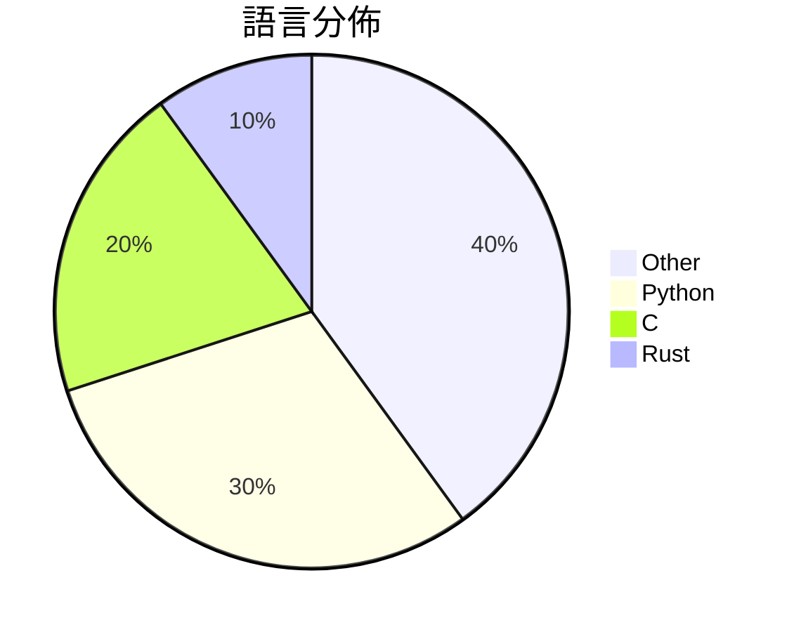

# GitHub Trending - 2026-05-19

> [!summary] 本日摘要
> 收錄 **10** 個新專案，合計 **12.8k** stars
> 語言分佈：Other (4) · Python (3) · C (2) · Rust (1)

> [!tip] 本週焦點
> **[[Nightmare-Eclipse--YellowKey|Nightmare-Eclipse/YellowKey]]** — 6 天內累積 3.4k stars（570 stars/天）
> 利用 YellowKey 漏洞繞過 Bitlocker 保護，獲取未經授權的存取權限。



---

## 收錄列表

| # | 專案 | 分類 | Stars | 速度 | 安裝 | 語言 | 用途 |
| :--: | --- | --- | ---: | ---: | --- | --- | --- |
| 1 | [[Nightmare-Eclipse--YellowKey\|Nightmare-Eclipse/YellowKey]] | 安全 | 3.4k | 570/天 | `easy` | N/A | 利用 YellowKey 漏洞繞過 Bitlocker 保護，獲取未經授權的存取 |
| 2 | [[vercel-labs--zero\|vercel-labs/zero]] | 開發工具 | 2.3k | 767/天 | `easy` | C | 為代理人設計的編程語言，旨在簡化學習和開發過程。 |
| 3 | [[yetone--native-feel-skill\|yetone/native-feel-skill]] | 開發工具 | 1.3k | 328/天 | `easy` | N/A | 設計跨平台桌面應用程式，讓它們感覺像原生應用程式。 |
| 4 | [[facebookresearch--vggt-omega\|facebookresearch/vggt-omega]] | AI/ML | 984 | 246/天 | `medium` | Python | 提供高效的相機姿態估計和深度推斷模型，適用於多視角影像處理。 |
| 5 | [[ywnd1144--Gopay_plus_automatic\|ywnd1144/Gopay_plus_automatic]] | 開發工具 | 934 | 156/天 | `medium` | Python | 自動化 ChatGPT Plus 訂閱工具，透過 Stripe 和 GoPay  |
| 6 | [[DenisSergeevitch--agents-best-practices\|DenisSergeevitch/agents-best-practices]] |  | 816 | 272/天 |  | N/A | Provider-neutral Agent Skill for Codex,  |
| 7 | [[TriangleFalcon--KMS-Tools-Portable-2026-Last-Version\|TriangleFalcon/KMS-Tools-Portable-2026-Last-Version]] | 其他 | 778 | 130/天 | `easy` | N/A | 提供一套便攜式的 KMS 激活工具，方便用戶激活 Windows 11 等軟體。 |
| 8 | [[DuskMosquito--Lossless-Scaling-Desktop-2026\|DuskMosquito/Lossless-Scaling-Desktop-2026]] | 其他 | 776 | 776/天 | `easy` | C | 提供無損縮放的桌面應用程式，提升遊戲和圖形性能。 |
| 9 | [[Kappaemme-git--codex-complexity-optimizer\|Kappaemme-git/codex-complexity-optimizer]] | 開發工具 | 749 | 250/天 | `easy` | Python | 提供安全的代碼複雜度分析和性能優化報告的工具。 |
| 10 | [[gi-dellav--zerostack\|gi-dellav/zerostack]] | 開發工具 | 726 | 121/天 | `easy` | Rust | 一個極簡的編碼代理，專為記憶體佔用和性能優化而設計。 |

---

## 重點摘要

### 1. [[Nightmare-Eclipse--YellowKey|Nightmare-Eclipse/YellowKey]] `安全`

> 利用 YellowKey 漏洞繞過 Bitlocker 保護，獲取未經授權的存取權限。

**3.4k** stars · **570** stars/天 · N/A · `easy`

_建立 6 天內累積 3419 stars（570/天），forks 725（21.2%），顯示出極高的關注度。這個專案的作者 Nightmare-Eclipse 以其在安全領域的貢獻而聞名，這次的發現解決了之前沒有有效繞過 Bitlocker 的痛點。這個漏洞的曝光引起了廣泛的討論，尤其是在安全社群中，許多使用者對於其可能的後門性質表示關注。技術上，Windows 11 的安全架構變化使得這個漏洞得以存在，並且其高 forks/stars 比率顯示出許多人在實際修改和使用這個工具。_

---

### 2. [[vercel-labs--zero|vercel-labs/zero]] `開發工具`

> 為代理人設計的編程語言，旨在簡化學習和開發過程。

**2.3k** stars · **767** stars/天 · C · `easy`

_建立 3 天內累積 2302 stars（767/天），forks 148（6.4%），顯示出強烈的興趣。作者 ctate 之前在開源社群活躍，這個專案解決了代理人編程的學習曲線問題，提供了一個簡化的語言環境。近期的推文和社群討論也引起了關注，尤其是針對語言設計的創新思考。技術上，Zero 的設計理念與當前 AI 和自動化趨勢相符，讓這個工具在市場上獲得了良好的反響。高 forks/stars 比率顯示出許多開發者對此專案的實際修改和使用意圖。_

---

### 3. [[yetone--native-feel-skill|yetone/native-feel-skill]] `開發工具`

> 設計跨平台桌面應用程式，讓它們感覺像原生應用程式。

**1.3k** stars · **328** stars/天 · N/A · `easy`

_建立 4 天內累積 1310 stars（328/天），forks 61（4.7%），顯示出穩定的增長。這個專案的作者 yetone 和 notdp 在開源社群中有一定的影響力，且該專案解決了跨平台開發中常見的性能與便利性之間的矛盾，特別是針對原生應用的需求。此專案的出現正好填補了市場上對於高效能跨平台應用的需求，並且其設計理念來自於 Raycast 的深度分析，這使得它在技術上具有可信度。社群的反應也顯示出對於這種解決方案的興趣，可能是因為開發者們對於提升應用性能的需求日益增加。_

---

### 4. [[facebookresearch--vggt-omega|facebookresearch/vggt-omega]] `AI/ML`

> 提供高效的相機姿態估計和深度推斷模型，適用於多視角影像處理。

**984** stars · **246** stars/天 · Python · `medium`

_建立 4 天內累積 984 stars（246/天），forks 23（2.3%），這顯示出社群對於其功能的高度興趣。作者 Jianyuan Wang 等人來自於牛津大學的視覺幾何組和 Meta AI，這樣的背景為專案提供了強大的技術支持。VGGT Omega 解決了多視角影像處理中相機姿態估計的準確性問題，之前的解決方案往往無法有效處理不同視角的影像。此專案的推出正好填補了這一空白，特別是在自駕車和虛擬現實等應用場景中。社群的活躍度和問題解決率也反映了其實用性和需求。_

---

### 5. [[ywnd1144--Gopay_plus_automatic|ywnd1144/Gopay_plus_automatic]] `開發工具`

> 自動化 ChatGPT Plus 訂閱工具，透過 Stripe 和 GoPay 完成支付。

**934** stars · **156** stars/天 · Python · `medium`

_建立 6 天就累積 934 stars（156/天），forks 546（58.5%），這顯示出極高的使用者參與度。作者 ywnd1144 在開源社群中活躍，過去可能有其他相關專案，這個專案解決了 ChatGPT 訂閱過程中的繁瑣步驟，特別是對於需要批量訂閱的用戶來說，之前的手動流程效率低下且容易出錯。這個工具的出現正好滿足了這部分需求。社群中對於自動化和簡化支付流程的需求日益增加，這也促進了專案的快速成長。forks/stars 比率高達 58.5%，顯示出許多使用者在實際修改和使用這個工具。_

---

### 6. [[DenisSergeevitch--agents-best-practices|DenisSergeevitch/agents-best-practices]]

**816** stars · **272** stars/天 · N/A

---

### 7. [[TriangleFalcon--KMS-Tools-Portable-2026-Last-Version|TriangleFalcon/KMS-Tools-Portable-2026-Last-Version]] `其他`

> 提供一套便攜式的 KMS 激活工具，方便用戶激活 Windows 11 等軟體。

**778** stars · **130** stars/天 · N/A · `easy`

_建立 6 天內累積 778 stars（130/天），forks 0，顯示出強烈的關注度。作者 TriangleFalcon 似乎專注於開發便攜式工具，這款工具解決了用戶在激活 Windows 軟體時的繁瑣流程，提供了即時可用的解決方案。由於激活需求的普遍性，這款工具的出現填補了市場上便攜式激活工具的空白。社群對於這類工具的需求持續增長，可能是推動其快速增長的原因之一。_

---

### 8. [[DuskMosquito--Lossless-Scaling-Desktop-2026|DuskMosquito/Lossless-Scaling-Desktop-2026]] `其他`

> 提供無損縮放的桌面應用程式，提升遊戲和圖形性能。

**776** stars · **776** stars/天 · C · `easy`

_建立 1 天就累積 776 stars（776/天），forks 0，顯示出強烈的市場需求。作者 DuskMosquito 似乎專注於遊戲性能優化，這個工具解決了許多玩家在使用低解析度遊戲時的畫質問題，之前的解決方案往往需要複雜的設定或不夠直觀。雖然目前沒有明顯的觸發事件，但這種即時可用的工具對於遊戲社群來說無疑是個吸引點。技術生態的變化，如高解析度顯示器的普及，讓這種工具的需求日益增加。forks/stars 比率為 0% 顯示出目前使用者對於修改的需求不高，可能是因為工具本身已經滿足了大部分需求。_

---

### 9. [[Kappaemme-git--codex-complexity-optimizer|Kappaemme-git/codex-complexity-optimizer]] `開發工具`

> 提供安全的代碼複雜度分析和性能優化報告的工具。

**749** stars · **250** stars/天 · Python · `easy`

_建立 3 天內累積 749 stars（249.67/天），forks 40（5.3%），顯示出穩定的增長潛力。作者 Kappaemme-git 針對代碼複雜度的分析需求，提供了一個前所未有的解決方案，過去開發者通常依賴手動檢查或使用不夠精確的工具，這導致了效率低下和潛在的錯誤。這個工具的出現正好填補了這一空白，讓開發者能夠在優化代碼時，獲得更安全和可靠的建議。隨著代碼庫的複雜性不斷增加，這種需求將會持續上升，進一步推動其流行。_

---

### 10. [[gi-dellav--zerostack|gi-dellav/zerostack]] `開發工具`

> 一個極簡的編碼代理，專為記憶體佔用和性能優化而設計。

**726** stars · **121** stars/天 · Rust · `easy`

_建立 6 天內累積 726 stars（121/天），forks 47（6.5%），顯示出穩定的增長潛力。這個專案由 Giuseppe Della Vedova 主導，他在 Rust 和開發工具方面有豐富的經驗。zerostack 解決了現有編碼代理在性能和記憶體使用上的不足，特別是針對長期任務的管理。這個專案的推出引發了開發者社群的關注，尤其是在 GitHub 上的討論和反饋中。其輕量化的設計和高效能使其成為一個有吸引力的選擇，特別是在資源有限的環境中。forks/stars 比率為 6.5%，顯示出使用者對這個工具的實際修改和應用需求。_

---

## 今日到期複習

> [!tip] 根據間隔複習排程，今天該回顧的專案

```dataview
TABLE
  stars_per_day AS "Stars/天",
  category AS "分類",
  engagement AS "參與度"
FROM "Repos"
WHERE next_review AND date(next_review) <= date("2026-05-19") AND status != "archived"
SORT priority DESC
```

## 待處理

```dataviewjs
const pending = dv.pages('"Repos"').where(p => p.status === "to-review").length;
const unrated = dv.pages('"Repos"').where(p => p.status !== "archived" && p.status !== "to-review" && (p.my_rating || 0) === 0).length;
const noVerdict = dv.pages('"Repos"').where(p => p.status !== "archived" && (p.my_rating || 0) > 0 && (!p.verdict || p.verdict === "")).length;
const items = [];
if (pending > 0) items.push(`**${pending}** 個待分流`);
if (unrated > 0) items.push(`**${unrated}** 個已讀但未評分`);
if (noVerdict > 0) items.push(`**${noVerdict}** 個已評分但無結論`);
if (items.length > 0) dv.paragraph(items.join(" / "));
else dv.paragraph("所有專案都已處理完畢！");
```
