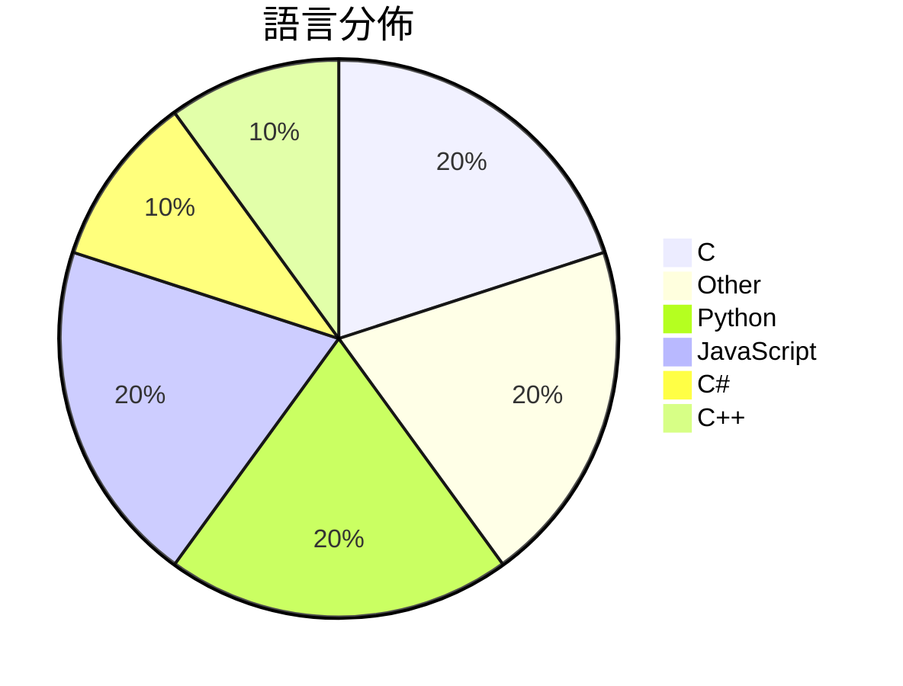

# GitHub Trending - 2026-05-20

> [!summary] 本日摘要
> 收錄 **10** 個新專案，合計 **10.9k** stars
> 語言分佈：C (2) · Other (2) · Python (2) · JavaScript (2) · C# (1) · C++ (1)

> [!tip] 本週焦點
> **[[vercel-labs--zerolang|vercel-labs/zerolang]]** — 4 天內累積 3.2k stars（811 stars/天）
> 為代理人設計的編程語言，專注於快速學習和結構化調試。



---

## 收錄列表

| # | 專案 | 分類 | Stars | 速度 | 安裝 | 語言 | 用途 |
| :--: | --- | --- | ---: | ---: | --- | --- | --- |
| 1 | [[vercel-labs--zerolang\|vercel-labs/zerolang]] | 開發工具 | 3.2k | 811/天 | `easy` | C | 為代理人設計的編程語言，專注於快速學習和結構化調試。 |
| 2 | [[yetone--native-feel-skill\|yetone/native-feel-skill]] | 開發工具 | 1.3k | 267/天 | `easy` | N/A | 設計跨平台桌面應用程式，讓使用者感受原生體驗的解決方案。 |
| 3 | [[facebookresearch--vggt-omega\|facebookresearch/vggt-omega]] | AI/ML | 1.2k | 244/天 | `medium` | Python | 提供高效的深度推理模型，專注於圖像處理和相機姿態估計。 |
| 4 | [[DenisSergeevitch--agents-best-practices\|DenisSergeevitch/agents-best-practices]] | 開發工具 | 853 | 213/天 | `easy` | N/A | 提供一個中立的代理技能，用於設計、生成 MVP 藍圖，審核、重構和解釋代理架構。 |
| 5 | [[Kappaemme-git--codex-complexity-optimizer\|Kappaemme-git/codex-complexity-optimizer]] | 開發工具 | 788 | 197/天 | `easy` | Python | 分析代碼庫的複雜度並生成安全的性能優化報告。 |
| 6 | [[DuskMosquito--Lossless-Scaling-Desktop-2026\|DuskMosquito/Lossless-Scaling-Desktop-2026]] | 其他 | 778 | 778/天 | `easy` | C | 提供無損縮放功能的桌面應用程式，提升遊戲和圖形性能。 |
| 7 | [[Doorman11991--smallcode\|Doorman11991/smallcode]] | AI/ML | 728 | 728/天 | `easy` | JavaScript | 針對小型 LLM 優化的 AI 編碼代理，幫助開發者在本地環境中高效編寫程式碼。 |
| 8 | [[cdanielc293--Jenny-Mod-All-Versions\|cdanielc293/Jenny-Mod-All-Versions]] | 其他 | 669 | 223/天 | `medium` | C# | 提供多版本的 Minecraft 成人模組，增添互動角色與動畫。 |
| 9 | [[boona13--mykonos-island-voxels\|boona13/mykonos-island-voxels]] | 遊戲 | 661 | 132/天 | `easy` | JavaScript | 一個基於瀏覽器的等角島嶼建造工具，擁有柔和的陽光褪色外觀，讓你隨心所欲地創建小村 |
| 10 | [[Juwluuu--Subnautica-2-Release\|Juwluuu/Subnautica-2-Release]] | 遊戲 | 644 | 129/天 | `easy` | C++ | 提供多人合作的水下生存冒險遊戲 Subnautica 2，探索新星球 Zazur |

---

## 重點摘要

### 1. [[vercel-labs--zerolang|vercel-labs/zerolang]] `開發工具`

> 為代理人設計的編程語言，專注於快速學習和結構化調試。

**3.2k** stars · **811** stars/天 · C · `easy`

_建立 4 天內累積 3242 stars（811/天），forks 193（6.0%），顯示出強勁的增長潛力。作者 ctate 之前在開源社群中活躍，這個專案解決了傳統編程語言在代理人使用上的不足，提供了一種更適合自動化和智能代理的語言。這個專案的推出引起了開發者的興趣，特別是在 AI 和自動化領域。技術生態的演進，尤其是對於智能代理的需求增加，使得這個工具的可行性大幅提升。forks/stars 比率顯示出開發者對此專案的實際修改和使用意願相對較高，這表明社群對這個專案的參與度較高。_

---

### 2. [[yetone--native-feel-skill|yetone/native-feel-skill]] `開發工具`

> 設計跨平台桌面應用程式，讓使用者感受原生體驗的解決方案。

**1.3k** stars · **267** stars/天 · N/A · `easy`

_建立 5 天內累積 1335 stars（267/天），forks 60（4.5%），顯示出穩定的增長潛力。這個專案的作者 yetone 和 notdp 在開源社群中有一定的影響力，之前的作品也獲得了良好的反響。它解決了跨平台開發中常見的性能問題，特別是對於需要原生感的應用，這在市場上是相對少見的。最近的推廣活動和社群討論也可能促進了這個專案的曝光率。這個工具的出現正好對應了開發者對高效能桌面應用需求的增加，尤其是在多平台支持的背景下，這讓它的可行性大大提高。forks/stars 比率為 4.5%，顯示出使用者對這個專案的實際修改和使用意願。_

---

### 3. [[facebookresearch--vggt-omega|facebookresearch/vggt-omega]] `AI/ML`

> 提供高效的深度推理模型，專注於圖像處理和相機姿態估計。

**1.2k** stars · **244** stars/天 · Python · `medium`

_建立 5 天內累積 1219 stars（244/天），forks 34（2.8%），顯示出良好的社群關注度。這個專案由 Facebook Research 的團隊開發，這些成員在計算機視覺領域有著豐富的經驗。VGGT Omega 解決了在高解析度圖像處理中對於相機姿態估計的需求，這在過去的模型中往往無法兼顧精度與效率。近期的 CVPR 2026 會議上進行了口頭報告，進一步提升了其曝光度。技術上，隨著深度學習框架的進步，這個模型能夠在更高效的硬體上運行，並且提供了更好的性能。forks/stars 比率相對較低，顯示出使用者對於這個專案的興趣較高，並且在實際應用中進行修改的需求不大。_

---

### 4. [[DenisSergeevitch--agents-best-practices|DenisSergeevitch/agents-best-practices]] `開發工具`

> 提供一個中立的代理技能，用於設計、生成 MVP 藍圖，審核、重構和解釋代理架構。

**853** stars · **213** stars/天 · N/A · `easy`

_建立 4 天內累積 853 stars（213/天），forks 78（9.1%），顯示出快速增長的潛力。作者 DenisSergeevitch 在代理技能方面有豐富的經驗，這個專案解決了在多種行業中設計和管理代理架構的痛點，特別是在缺乏統一標準的情況下。專案的推出正好填補了市場上對於中立代理技能的需求，並且在社群中引發了討論。技術上，這個工具的可攜性和多用途設計使其在當前的 AI 生態系統中更具吸引力。高達 9.1% 的 forks/stars 比率顯示出許多人對這個專案的實際修改和使用。_

---

### 5. [[Kappaemme-git--codex-complexity-optimizer|Kappaemme-git/codex-complexity-optimizer]] `開發工具`

> 分析代碼庫的複雜度並生成安全的性能優化報告。

**788** stars · **197** stars/天 · Python · `easy`

_建立 4 天就累積 788 stars（197/天），forks 46（5.8%），這顯示出其快速增長的潛力。作者 Kappaemme-git 針對代碼複雜度的分析需求提供了有效的解決方案，之前的工具多數無法提供安全的優化建議。這個工具的出現恰好填補了這一空白，讓開發者能在複雜的代碼庫中進行安全的優化。社群的反饋也顯示出對這類工具的需求，特別是在大型專案中，這使得該工具的受歡迎程度迅速上升。_

---

### 6. [[DuskMosquito--Lossless-Scaling-Desktop-2026|DuskMosquito/Lossless-Scaling-Desktop-2026]] `其他`

> 提供無損縮放功能的桌面應用程式，提升遊戲和圖形性能。

**778** stars · **778** stars/天 · C · `easy`

_建立 1 天就累積 778 stars（778/天），forks 0，這顯示出極高的初期關注度。作者 DuskMosquito 似乎專注於遊戲性能優化，這款工具解決了許多遊戲玩家在高解析度顯示器上遇到的畫質問題。這個專案的出現正好填補了市場上對於無損縮放技術的需求，特別是在遊戲領域。雖然目前的 forks/stars 比率為 0%，但這可能意味著用戶尚在評估其實用性。_

---

### 7. [[Doorman11991--smallcode|Doorman11991/smallcode]] `AI/ML`

> 針對小型 LLM 優化的 AI 編碼代理，幫助開發者在本地環境中高效編寫程式碼。

**728** stars · **728** stars/天 · JavaScript · `easy`

_建立 1 天就累積 728 stars（728/天），forks 42（5.8%），這顯示出相對穩定的社群關注。作者 Doorman11991 及其團隊在 AI 編碼領域有一定的背景，這個工具解決了小型 LLM 在實際應用中的效能問題，特別是在本地開發環境中。這個專案的推出可能受到開發者對於隱私和本地運行需求的驅動。forks/stars 比率顯示出使用者對於這個工具的實際修改和應用有一定的興趣，這是健康的社群信號。_

---

### 8. [[cdanielc293--Jenny-Mod-All-Versions|cdanielc293/Jenny-Mod-All-Versions]] `其他`

> 提供多版本的 Minecraft 成人模組，增添互動角色與動畫。

**669** stars · **223** stars/天 · C# · `medium`

_建立 3 天內累積 669 stars（223/天），forks 僅 1（0.1%），顯示出相對較低的實際使用情況。該專案由 cdanielc293 發起，專注於提供成人內容的 Minecraft 模組，這在遊戲社群中有其特定需求。雖然目前的 stars 數量看似不錯，但低 forks 比率顯示出大部分用戶仍在觀望階段，未必會進行實際修改或使用。這個模組的出現滿足了對成人內容的需求，尤其是在 Minecraft 這個平台上，這類模組的選擇相對有限。_

---

### 9. [[boona13--mykonos-island-voxels|boona13/mykonos-island-voxels]] `遊戲`

> 一個基於瀏覽器的等角島嶼建造工具，擁有柔和的陽光褪色外觀，讓你隨心所欲地創建小村莊。

**661** stars · **132** stars/天 · JavaScript · `easy`

_建立 5 天內累積 661 stars（132/天），forks 158（23.9%），顯示出強烈的社群參與。這個專案由 boona13 開發，其背景可能與遊戲開發相關，並且解決了傳統建造遊戲中繁瑣的資源管理問題。專案的簡單性和即時的創作體驗吸引了許多用戶，特別是在社交媒體上分享的時候。技術上，使用純 ES 模組的設計使得它在現代瀏覽器中運行流暢，並且無需複雜的安裝過程，這也可能是其受歡迎的原因之一。Forks/stars 比率顯示出許多開發者對這個專案的興趣，可能會進行修改或擴展。_

---

### 10. [[Juwluuu--Subnautica-2-Release|Juwluuu/Subnautica-2-Release]] `遊戲`

> 提供多人合作的水下生存冒險遊戲 Subnautica 2，探索新星球 Zazura。

**644** stars · **129** stars/天 · C++ · `easy`

_建立 5 天內累積 644 stars（129/天），forks 0，顯示出強烈的關注度。作者 Juwluuu 之前在遊戲開發方面有一定經驗，這次推出的 Subnautica 2 針對多人合作的需求進行了優化，填補了市場上對於水下生存遊戲的需求。遊戲的早期訪問版本吸引了玩家的注意，尤其是在 Steam 和 Xbox Game Pass 上的可用性提升了其曝光率。由於目前沒有其他類似的多人水下生存遊戲，這使得 Subnautica 2 在市場上具有獨特的競爭優勢。_

---

## 今日到期複習

> [!tip] 根據間隔複習排程，今天該回顧的專案

```dataview
TABLE
  stars_per_day AS "Stars/天",
  category AS "分類",
  engagement AS "參與度"
FROM "Repos"
WHERE next_review AND date(next_review) <= date("2026-05-20") AND status != "archived"
SORT priority DESC
```

## 待處理

```dataviewjs
const pending = dv.pages('"Repos"').where(p => p.status === "to-review").length;
const unrated = dv.pages('"Repos"').where(p => p.status !== "archived" && p.status !== "to-review" && (p.my_rating || 0) === 0).length;
const noVerdict = dv.pages('"Repos"').where(p => p.status !== "archived" && (p.my_rating || 0) > 0 && (!p.verdict || p.verdict === "")).length;
const items = [];
if (pending > 0) items.push(`**${pending}** 個待分流`);
if (unrated > 0) items.push(`**${unrated}** 個已讀但未評分`);
if (noVerdict > 0) items.push(`**${noVerdict}** 個已評分但無結論`);
if (items.length > 0) dv.paragraph(items.join(" / "));
else dv.paragraph("所有專案都已處理完畢！");
```
