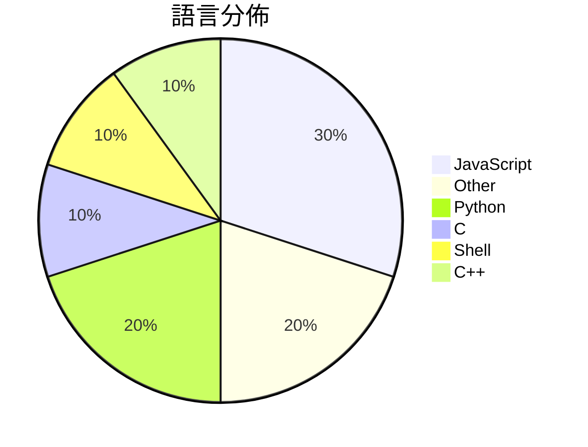

# GitHub Trending - 2026-05-21

> [!summary] 本日摘要
> 收錄 **10** 個新專案，合計 **12.4k** stars
> 語言分佈：JavaScript (3) · Other (2) · Python (2) · C (1) · Shell (1) · C++ (1)

> [!tip] 本週焦點
> **[[vercel-labs--zerolang|vercel-labs/zerolang]]** — 5 天內累積 4.0k stars（796 stars/天）
> 一種為代理設計的編程語言，旨在優化代理的學習與使用體驗。



---

## 收錄列表

| # | 專案 | 分類 | Stars | 速度 | 安裝 | 語言 | 用途 |
| :--: | --- | --- | ---: | ---: | --- | --- | --- |
| 1 | [[vercel-labs--zerolang\|vercel-labs/zerolang]] | 開發工具 | 4.0k | 796/天 | `easy` | C | 一種為代理設計的編程語言，旨在優化代理的學習與使用體驗。 |
| 2 | [[yetone--native-feel-skill\|yetone/native-feel-skill]] | 開發工具 | 1.4k | 226/天 | `easy` | N/A | 設計跨平台桌面應用程式，讓使用者感受到原生體驗。 |
| 3 | [[facebookresearch--vggt-omega\|facebookresearch/vggt-omega]] | AI/ML | 1.4k | 225/天 | `medium` | Python | 提供高效的相機姿態估計和深度推斷模型，讓計算機視覺應用更簡單。 |
| 4 | [[FoundZiGu--GuJumpgate\|FoundZiGu/GuJumpgate]] | 開發工具 | 957 | 957/天 | `medium` | JavaScript | 自動化 GPT Plus 註冊流程的瀏覽器擴展，解決繁瑣的手動註冊問題。 |
| 5 | [[DenisSergeevitch--agents-best-practices\|DenisSergeevitch/agents-best-practices]] | 開發工具 | 902 | 180/天 | `easy` | N/A | 提供中立的代理技能設計和生成 MVP 藍圖，適用於多種 AI 代理。 |
| 6 | [[thananon--9arm-skills\|thananon/9arm-skills]] | 開發工具 | 890 | 890/天 | `easy` | Shell | 提供一系列針對工程和生產力的 Shell 技能，幫助開發者提升日常工作效率。 |
| 7 | [[Doorman11991--smallcode\|Doorman11991/smallcode]] | AI/ML | 842 | 421/天 | `easy` | JavaScript | 針對小型 LLM 優化的 AI 編碼代理，能在消費級硬體上運行。 |
| 8 | [[Kappaemme-git--codex-complexity-optimizer\|Kappaemme-git/codex-complexity-optimizer]] | 開發工具 | 805 | 161/天 | `easy` | Python | 分析代碼庫的複雜度並提供性能優化報告的工具。 |
| 9 | [[boona13--mykonos-island-voxels\|boona13/mykonos-island-voxels]] | 遊戲 | 679 | 113/天 | `easy` | JavaScript | 一個瀏覽器基於等角投影的島嶼建造遊戲，讓你隨意創建夢幻的希臘小島。 |
| 10 | [[Juwluuu--Subnautica-2-Release\|Juwluuu/Subnautica-2-Release]] | 遊戲 | 669 | 112/天 | `easy` | C++ | 提供多人合作的水下生存冒險遊戲 Subnautica 2，探索外星海洋與建設基地 |

---

## 重點摘要

### 1. [[vercel-labs--zerolang|vercel-labs/zerolang]] `開發工具`

> 一種為代理設計的編程語言，旨在優化代理的學習與使用體驗。

**4.0k** stars · **796** stars/天 · C · `easy`

_建立 5 天內累積 3980 stars（796/天），forks 238（6.0%），顯示出強烈的興趣和參與度。作者 ctate 在開源社群中有一定的影響力，過去的專案也受到關注。zerolang 解決了現有編程語言在代理使用上的不足，提供了一個更適合代理的學習和使用環境。近期的討論和提案也促進了社群的活躍度，顯示出對這個新語言的探索熱情。技術上，隨著 AI 和代理技術的發展，這個工具的出現正好符合當前的需求，讓開發者能夠更好地與代理互動。forks/stars 比率適中，顯示出使用者對這個專案的實際修改和使用意圖。_

---

### 2. [[yetone--native-feel-skill|yetone/native-feel-skill]] `開發工具`

> 設計跨平台桌面應用程式，讓使用者感受到原生體驗。

**1.4k** stars · **226** stars/天 · N/A · `easy`

_建立 6 天就累積 1353 stars（226/天），forks 61（4.5%），這顯示出穩定的增長潛力。專案的主要貢獻者 yetone 和 notdp 在這個領域有豐富的經驗，且這個工具解決了跨平台開發中常見的性能和原生感之間的矛盾。之前的解決方案如 Electron 雖然方便，但在性能上有明顯的妥協。最近的討論和推文也讓這個專案受到更多關注，尤其是在開發者社群中。這個工具的設計理念和架構選擇使其在當前技術生態中顯得尤為重要，尤其是在需要高性能的桌面應用開發上。forks/stars 比率顯示出有相當比例的開發者對此工具進行實際修改和使用，反映出其實用性。_

---

### 3. [[facebookresearch--vggt-omega|facebookresearch/vggt-omega]] `AI/ML`

> 提供高效的相機姿態估計和深度推斷模型，讓計算機視覺應用更簡單。

**1.4k** stars · **225** stars/天 · Python · `medium`

_建立 6 天內累積 1351 stars（225/天），forks 42（3.1%），顯示出良好的關注度。作者 Jianyuan Wang 和團隊來自於知名的視覺幾何組，過去在計算機視覺領域有多項研究成果。VGGT Omega 解決了相機姿態估計模型在資源使用上的痛點，特別是對於需要高效推斷的應用場景。此專案的推出正值計算機視覺需求上升的時期，並且在 Hugging Face 上的可用性也吸引了不少開發者的注意。forks/stars 比率約 3.1%，顯示出使用者對於進一步修改和使用的興趣。_

---

### 4. [[FoundZiGu--GuJumpgate|FoundZiGu/GuJumpgate]] `開發工具`

> 自動化 GPT Plus 註冊流程的瀏覽器擴展，解決繁瑣的手動註冊問題。

**957** stars · **957** stars/天 · JavaScript · `medium`

_建立 1 天就累積 957 stars（957/天），forks 350（36.6%），顯示出強烈的社群興趣。作者 FoundZiGu 之前參與過多個開源項目，這次推出的 GuJumpgate 解決了註冊過程中的繁瑣步驟，特別是在 OAuth 驗證風控嚴重的情況下，提供了一個自動化的解決方案。這個專案的推出正好滿足了大量用戶對於簡化註冊流程的需求，並且在社群中引起了廣泛的討論。由於 OAuth 的風控加劇，這個工具的需求也隨之上升，讓它成為了當前的熱門選擇。_

---

### 5. [[DenisSergeevitch--agents-best-practices|DenisSergeevitch/agents-best-practices]] `開發工具`

> 提供中立的代理技能設計和生成 MVP 藍圖，適用於多種 AI 代理。

**902** stars · **180** stars/天 · N/A · `easy`

_建立 5 天內累積 902 stars（180/天），forks 83（9.2%），顯示出良好的社群反應。作者 DenisSergeevitch 在代理技能領域有豐富的經驗，這個專案解決了多種業務流程中對於代理技能的需求，特別是在設計和審核代理架構方面。該專案的出現恰逢 AI 代理技術快速發展的時期，並且提供了一個通用的解決方案，讓開發者能夠更方便地整合和使用代理技能。高比例的 forks/stars 顯示出許多人在實際修改和使用這個專案，反映出其實用性和需求。_

---

### 6. [[thananon--9arm-skills|thananon/9arm-skills]] `開發工具`

> 提供一系列針對工程和生產力的 Shell 技能，幫助開發者提升日常工作效率。

**890** stars · **890** stars/天 · Shell · `easy`

_建立 1 天就累積 890 stars（890/天），forks 124（13.9%），這顯示出相對較高的使用者興趣。專案作者似乎專注於開發實用的工具，並且過去有相關的開發經驗。這個專案解決了工程師在日常工作中缺乏高效工具的痛點，提供了具體的技能來提升工作效率。社群的反應也顯示出對這類工具的需求，尤其是在工程領域。這些因素共同促成了專案的快速增長。_

---

### 7. [[Doorman11991--smallcode|Doorman11991/smallcode]] `AI/ML`

> 針對小型 LLM 優化的 AI 編碼代理，能在消費級硬體上運行。

**842** stars · **421** stars/天 · JavaScript · `easy`

_建立 2 天就累積 842 stars（421/天），forks 55（6.5%），這顯示出一定的關注度。作者 Doorman11991 之前有開發相關的 AI 工具，這次的 SmallCode 解決了小型 LLM 在本地運行的需求，特別是針對消費級硬體的優化。這個專案的出現正好填補了市場上對小型模型的需求，尤其是在開發者希望保持數據隱私的情況下。雖然目前沒有明顯的觸發事件，但其設計理念和功能設定都符合當前開發者的需求。forks/stars 比率為 6.5%，顯示出使用者對這個工具的實際修改和使用意圖。_

---

### 8. [[Kappaemme-git--codex-complexity-optimizer|Kappaemme-git/codex-complexity-optimizer]] `開發工具`

> 分析代碼庫的複雜度並提供性能優化報告的工具。

**805** stars · **161** stars/天 · Python · `easy`

_建立 5 天內累積 805 stars（161/天），forks 47（5.8%），這顯示出一定的關注度。作者 Kappaemme-git 似乎專注於開發 Codex 相關的技能，這個工具解決了代碼複雜度分析的需求，之前的工具往往缺乏深入的性能分析功能。沒有明顯的觸發事件，但這個工具的出現恰逢開發者對代碼質量和性能的重視增加。forks/stars 比率在 5.8%，顯示出一些開發者對其進行了實際修改或擴展，這是良好的社群互動指標。_

---

### 9. [[boona13--mykonos-island-voxels|boona13/mykonos-island-voxels]] `遊戲`

> 一個瀏覽器基於等角投影的島嶼建造遊戲，讓你隨意創建夢幻的希臘小島。

**679** stars · **113** stars/天 · JavaScript · `easy`

_建立 6 天內累積 679 stars（113/天），forks 160（23.6%），這顯示出強烈的社群興趣。作者 boona13 之前可能有其他開源專案，這次的專案解決了簡單易用的島嶼建造需求，讓玩家能夠快速創建而不需繁瑣的學習曲線。雖然沒有明確的觸發事件，但遊戲的獨特視覺風格和簡單的操作吸引了不少使用者。這個專案的技術選擇，如純 ES 模組，讓它在現代瀏覽器中運行流暢，並且無需額外的依賴。高達 23.6% 的 forks/stars 比率顯示出許多人對這個專案的興趣，並可能在實際使用中進行修改。_

---

### 10. [[Juwluuu--Subnautica-2-Release|Juwluuu/Subnautica-2-Release]] `遊戲`

> 提供多人合作的水下生存冒險遊戲 Subnautica 2，探索外星海洋與建設基地。

**669** stars · **112** stars/天 · C++ · `easy`

_建立 6 天內累積 669 stars（111.5/天），forks 0，顯示出玩家對這款遊戲的高度期待。作者 Juwluuu 是一位熱愛遊戲開發的開發者，這款遊戲解決了多人水下生存遊戲的需求，之前的 Subnautica 雖然受歡迎，但缺乏多人合作的功能。這次的推出吸引了許多玩家的注意，尤其是在 Xbox Game Pass 和 Steam 上的預載選項，讓更多人能輕鬆體驗。遊戲的技術實現上，C++ 的高效能使得畫面流暢，並且能夠處理複雜的遊戲邏輯，這在水下生存遊戲中是非常重要的。forks/stars 比率為 0% 代表目前還沒有其他開發者進行修改，顯示出這是一個全新的專案。_

---

## 今日到期複習

> [!tip] 根據間隔複習排程，今天該回顧的專案

```dataview
TABLE
  stars_per_day AS "Stars/天",
  category AS "分類",
  engagement AS "參與度"
FROM "Repos"
WHERE next_review AND date(next_review) <= date("2026-05-21") AND status != "archived"
SORT priority DESC
```

## 待處理

```dataviewjs
const pending = dv.pages('"Repos"').where(p => p.status === "to-review").length;
const unrated = dv.pages('"Repos"').where(p => p.status !== "archived" && p.status !== "to-review" && (p.my_rating || 0) === 0).length;
const noVerdict = dv.pages('"Repos"').where(p => p.status !== "archived" && (p.my_rating || 0) > 0 && (!p.verdict || p.verdict === "")).length;
const items = [];
if (pending > 0) items.push(`**${pending}** 個待分流`);
if (unrated > 0) items.push(`**${unrated}** 個已讀但未評分`);
if (noVerdict > 0) items.push(`**${noVerdict}** 個已評分但無結論`);
if (items.length > 0) dv.paragraph(items.join(" / "));
else dv.paragraph("所有專案都已處理完畢！");
```
