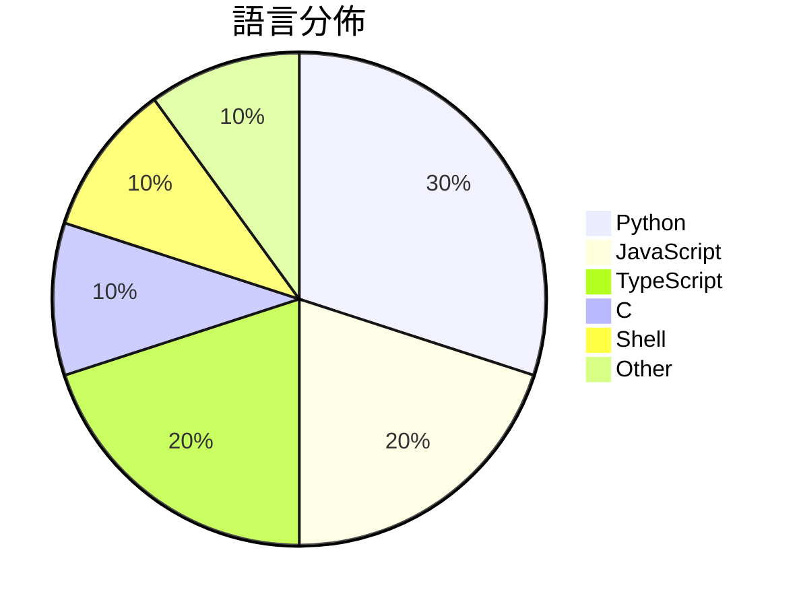

# GitHub Trending - 2026-05-22

> [!summary] 本日摘要
> 收錄 **10** 個新專案，合計 **12.2k** stars
> 語言分佈：Python (3) · JavaScript (2) · TypeScript (2) · C (1) · Shell (1) · Other (1)

> [!tip] 本週焦點
> **[[vercel-labs--zerolang|vercel-labs/zerolang]]** — 6 天內累積 4.2k stars（700 stars/天）
> 為代理人設計的編程語言，強調學習能力和工具的可用性。



---

## 收錄列表

| # | 專案 | 分類 | Stars | 速度 | 安裝 | 語言 | 用途 |
| :--: | --- | --- | ---: | ---: | --- | --- | --- |
| 1 | [[vercel-labs--zerolang\|vercel-labs/zerolang]] | 開發工具 | 4.2k | 700/天 | `easy` | C | 為代理人設計的編程語言，強調學習能力和工具的可用性。 |
| 2 | [[FoundZiGu--GuJumpgate\|FoundZiGu/GuJumpgate]] | 開發工具 | 1.4k | 724/天 | `medium` | JavaScript | 自動化 GPT Plus 註冊的瀏覽器擴展，簡化支付流程。 |
| 3 | [[thananon--9arm-skills\|thananon/9arm-skills]] | 開發工具 | 1.2k | 583/天 | `easy` | Shell | 提供一系列針對工程和生產力的 Shell 技能，幫助開發者提升工作效率。 |
| 4 | [[Doorman11991--smallcode\|Doorman11991/smallcode]] | AI/ML | 1.1k | 361/天 | `easy` | JavaScript | 針對小型 LLM 優化的 AI 編碼代理，能有效處理小型模型的限制。 |
| 5 | [[DenisSergeevitch--agents-best-practices\|DenisSergeevitch/agents-best-practices]] | 開發工具 | 944 | 157/天 | `easy` | N/A | 提供一個中立的代理技能，幫助設計和生成 MVP 藍圖，審核和重構代理系統。 |
| 6 | [[Kappaemme-git--codex-complexity-optimizer\|Kappaemme-git/codex-complexity-optimizer]] | 開發工具 | 819 | 137/天 | `easy` | Python | 提供安全的代碼庫複雜度分析和性能優化報告的 Codex 技能。 |
| 7 | [[bytedance--Lance\|bytedance/Lance]] | AI/ML | 665 | 111/天 | `medium` | Python | 提供統一的多模態模型，實現影像和視頻的理解、生成及編輯。 |
| 8 | [[sapientinc--HRM-Text\|sapientinc/HRM-Text]] | AI/ML | 631 | 210/天 | `medium` | Python | 提供一個高效的文本生成模型，讓使用者以更少的計算資源和數據進行預訓練。 |
| 9 | [[xw7872081123--wallpaper-engine-steam\|xw7872081123/wallpaper-engine-steam]] | 其他 | 618 | 206/天 | `easy` | TypeScript | 提供免費的 Wallpaper Engine 下載，解決高 CPU 及 RAM  |
| 10 | [[openclaw--clawpatch\|openclaw/clawpatch]] | 開發工具 | 618 | 103/天 | `easy` | TypeScript | 自動化的代碼審查工具，幫助修復錯誤並提交 PR。 |

---

## 重點摘要

### 1. [[vercel-labs--zerolang|vercel-labs/zerolang]] `開發工具`

> 為代理人設計的編程語言，強調學習能力和工具的可用性。

**4.2k** stars · **700** stars/天 · C · `easy`

_建立 6 天就累積 4198 stars（700/天），forks 252（6.0%），顯示出一定的社群興趣。作者 ctate 之前在開源社群中有一定的貢獻背景，這次專案針對代理人開發語言的需求，填補了市場上缺乏針對性語言的空白。近期的推廣活動和社群討論也引起了開發者的注意，特別是對於語言學習和工具可用性的關注。這個專案的高 forks/stars 比率顯示出不少開發者在積極修改和使用這個工具。_

---

### 2. [[FoundZiGu--GuJumpgate|FoundZiGu/GuJumpgate]] `開發工具`

> 自動化 GPT Plus 註冊的瀏覽器擴展，簡化支付流程。

**1.4k** stars · **724** stars/天 · JavaScript · `medium`

_建立 2 天內累積 1448 stars（724/天），forks 451（31.1%），顯示出強烈的社群參與度。作者 FoundZiGu 在開源社群中活躍，之前的項目也獲得了一定的關注。GuJumpgate 解決了用戶在註冊和支付過程中面臨的繁瑣問題，特別是針對 PayPal 的自動化處理，這在目前的市場上尚無其他工具能夠完全覆蓋。這個工具的出現恰逢許多用戶對於自動化註冊的需求上升，尤其是在 GPT 相關服務的熱潮中。forks/stars 比率高達 31.1%，顯示出許多用戶不僅在觀望，還在積極修改和使用這個工具。_

---

### 3. [[thananon--9arm-skills|thananon/9arm-skills]] `開發工具`

> 提供一系列針對工程和生產力的 Shell 技能，幫助開發者提升工作效率。

**1.2k** stars · **583** stars/天 · Shell · `easy`

_建立 2 天就累積 1166 stars（583/天），forks 180（15.4%），顯示出強烈的使用興趣。這個專案的作者是 Thananon，過去在開源社群中活躍，專注於開發工具的創建。這個專案解決了開發者在日常工作中缺乏高效工具的痛點，提供了結構化的技能來提升生產力。由於其簡單易用的 Shell 腳本設計，這個專案在開發者中引起了廣泛的關注。forks/stars 比率為 15.4%，顯示出許多人在實際修改和使用這個工具，而不是僅僅觀望。_

---

### 4. [[Doorman11991--smallcode|Doorman11991/smallcode]] `AI/ML`

> 針對小型 LLM 優化的 AI 編碼代理，能有效處理小型模型的限制。

**1.1k** stars · **361** stars/天 · JavaScript · `easy`

_建立 3 天內累積 1082 stars（361/天），forks 75（6.9%），顯示出強勁的增長潛力。作者 Doorman11991 及其團隊在 AI 編碼代理領域有豐富經驗，這個專案解決了小型 LLM 在多步驟工具使用上的痛點，提供了一個更靈活的解決方案。近期的推廣活動和社群討論也促進了其曝光率，讓更多開發者注意到這個工具的潛力。隨著小型模型的應用需求增加，這個工具的出現正好填補了市場的空白。_

---

### 5. [[DenisSergeevitch--agents-best-practices|DenisSergeevitch/agents-best-practices]] `開發工具`

> 提供一個中立的代理技能，幫助設計和生成 MVP 藍圖，審核和重構代理系統。

**944** stars · **157** stars/天 · N/A · `easy`

_建立 6 天內累積 944 stars（157/天），forks 84（8.9%），顯示出相對穩定的增長。作者 DenisSergeevitch 在代理技能領域有一定的經驗，這個專案解決了在多種應用場景下設計和管理代理系統的痛點，特別是在工具權限和執行效率方面。社群對於這個專案的反饋也顯示出需求的存在，尤其是在開發和運營方面的應用。這個工具的出現正好填補了市場上對於中立代理技能的需求，並且有助於提高代理系統的可用性和安全性。_

---

### 6. [[Kappaemme-git--codex-complexity-optimizer|Kappaemme-git/codex-complexity-optimizer]] `開發工具`

> 提供安全的代碼庫複雜度分析和性能優化報告的 Codex 技能。

**819** stars · **137** stars/天 · Python · `easy`

_建立 6 天就累積 819 stars（137/天），forks 50（6.1%），顯示出穩定的增長潛力。作者 Kappaemme-git 是一位專注於開發工具的開發者，這個專案解決了代碼性能優化的痛點，特別是在大型代碼庫中，傳統的靜態分析工具往往無法提供具體的性能建議。這個工具的出現恰好填補了這一空白。社群的反饋和需求推動了這個專案的快速發展，並且在開發者社群中引起了廣泛的討論。其技術生態的變化，如 Codex 的普及，使得這種工具的實現變得可行。forks/stars 比率顯示出使用者對這個工具的實際修改和貢獻意願，顯示出它不僅是觀望者的選擇。_

---

### 7. [[bytedance--Lance|bytedance/Lance]] `AI/ML`

> 提供統一的多模態模型，實現影像和視頻的理解、生成及編輯。

**665** stars · **111** stars/天 · Python · `medium`

_建立 6 天內累積 665 stars（111/天），forks 36（5.4%），顯示出穩定的增長潛力。作者來自 ByteDance，這是一個在 AI 領域有豐富經驗的團隊，過去的作品也獲得了良好的反響。Lance 解決了多模態模型在影像和視頻處理上的整合問題，之前的工具往往只能專注於單一任務，無法有效應對多樣化需求。近期的推廣活動和社群討論也可能促進了這個專案的曝光度。這個工具的設計和實現符合當前對於高效能多模態處理的需求，並且在技術生態中具備良好的適應性。forks/stars 比率為 5.4%，顯示出使用者對於這個專案的實際修改和使用意願。_

---

### 8. [[sapientinc--HRM-Text|sapientinc/HRM-Text]] `AI/ML`

> 提供一個高效的文本生成模型，讓使用者以更少的計算資源和數據進行預訓練。

**631** stars · **210** stars/天 · Python · `medium`

_建立 3 天就累積 631 stars（210/天），forks 58（9.2%），顯示出穩定的增長潛力。作者 imoneoi 和其他貢獻者在 AI 和機器學習領域有豐富的經驗，這使得他們能夠針對現有模型的計算和數據需求進行優化，解決了許多開發者面臨的高成本問題。這個專案的出現正好滿足了對高效文本生成模型的需求，特別是在資源有限的情況下。社群的活躍度和開放的問題討論也顯示出使用者對這個工具的興趣和需求。這種需求的增長可能與最近的 AI 技術進展有關，特別是在文本生成和推理方面。_

---

### 9. [[xw7872081123--wallpaper-engine-steam|xw7872081123/wallpaper-engine-steam]] `其他`

> 提供免費的 Wallpaper Engine 下載，解決高 CPU 及 RAM 使用問題，並支援多種自訂功能。

**618** stars · **206** stars/天 · TypeScript · `easy`

_建立 3 天就累積 618 stars（206/天），forks 0，顯示出使用者對於這個免費壁紙引擎的高度關注。作者 xw7872081123 之前可能在相關領域有過其他貢獻，這個專案解決了許多使用者在使用 Wallpaper Engine 時遇到的性能問題，如高 CPU 和 RAM 使用率，這在其他類似工具中並不常見。專案的快速增長可能受到社群對於高品質壁紙需求的推動，並且在社交媒體上有一定的討論。這個工具的出現正好契合了對於個性化桌面需求的增長，尤其是在 Windows 10 和 11 的使用者中。forks/stars 比率為 0%，顯示出目前使用者主要是觀望，尚未進行修改。_

---

### 10. [[openclaw--clawpatch|openclaw/clawpatch]] `開發工具`

> 自動化的代碼審查工具，幫助修復錯誤並提交 PR。

**618** stars · **103** stars/天 · TypeScript · `easy`

_建立 6 天內累積 618 stars（103/天），forks 91（14.7%），顯示出不錯的社群關注度。這個專案的主要貢獻者來自於開源社群，過去有多個成功的開源專案經驗。它解決了代碼審查過程中的繁瑣手動操作，之前的工具往往無法提供如此細緻的特徵映射和自動修復功能。近期的推廣和討論可能促進了其快速增長，尤其是在開發者社群中。這個工具的設計使其能夠在多種語言和框架中運行，這在當前多樣化的開發環境中是非常有價值的。forks/stars 比率為 14.7%，顯示出有相當一部分用戶在實際修改和使用這個工具。_

---

## 今日到期複習

> [!tip] 根據間隔複習排程，今天該回顧的專案

```dataview
TABLE
  stars_per_day AS "Stars/天",
  category AS "分類",
  engagement AS "參與度"
FROM "Repos"
WHERE next_review AND date(next_review) <= date("2026-05-22") AND status != "archived"
SORT priority DESC
```

## 待處理

```dataviewjs
const pending = dv.pages('"Repos"').where(p => p.status === "to-review").length;
const unrated = dv.pages('"Repos"').where(p => p.status !== "archived" && p.status !== "to-review" && (p.my_rating || 0) === 0).length;
const noVerdict = dv.pages('"Repos"').where(p => p.status !== "archived" && (p.my_rating || 0) > 0 && (!p.verdict || p.verdict === "")).length;
const items = [];
if (pending > 0) items.push(`**${pending}** 個待分流`);
if (unrated > 0) items.push(`**${unrated}** 個已讀但未評分`);
if (noVerdict > 0) items.push(`**${noVerdict}** 個已評分但無結論`);
if (items.length > 0) dv.paragraph(items.join(" / "));
else dv.paragraph("所有專案都已處理完畢！");
```
