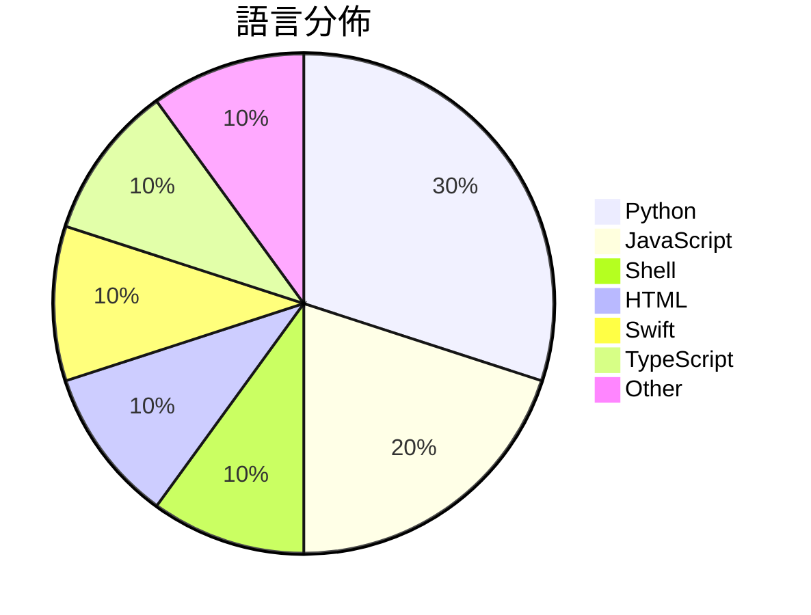

# GitHub Trending - 2026-05-23

> [!summary] 本日摘要
> 收錄 **10** 個新專案，合計 **8.6k** stars
> 語言分佈：Python (3) · JavaScript (2) · Shell (1) · HTML (1) · Swift (1) · TypeScript (1) · Other (1)

> [!tip] 本週焦點
> **[[FoundZiGu--GuJumpgate|FoundZiGu/GuJumpgate]]** — 3 天內累積 1.8k stars（588 stars/天）
> 全自動 GPT Plus 註冊與支付流程的瀏覽器擴展。



---

## 收錄列表

| # | 專案 | 分類 | Stars | 速度 | 安裝 | 語言 | 用途 |
| :--: | --- | --- | ---: | ---: | --- | --- | --- |
| 1 | [[FoundZiGu--GuJumpgate\|FoundZiGu/GuJumpgate]] | 開發工具 | 1.8k | 588/天 | `medium` | JavaScript | 全自動 GPT Plus 註冊與支付流程的瀏覽器擴展。 |
| 2 | [[thananon--9arm-skills\|thananon/9arm-skills]] | 開發工具 | 1.5k | 507/天 | `easy` | Shell | 提供一系列針對工程和生產力的 Shell 腳本技能，幫助工程師提高工作效率。 |
| 3 | [[Doorman11991--smallcode\|Doorman11991/smallcode]] | AI/ML | 1.2k | 307/天 | `easy` | JavaScript | 針對小型 LLM 優化的 AI 編碼代理，能在消費級硬體上運行。 |
| 4 | [[datawhalechina--Agent-Learning-Hub\|datawhalechina/Agent-Learning-Hub]] | 教學資源 | 1.1k | 218/天 | `easy` | HTML | 提供一個有系統的 AI Agent 學習路線圖，幫助開發者建立可靠的代理系統。 |
| 5 | [[sapientinc--HRM-Text\|sapientinc/HRM-Text]] | AI/ML | 650 | 163/天 | `medium` | Python | 提供一個高效的文本生成模型，讓基礎模型的預訓練變得更容易和成本更低。 |
| 6 | [[kageroumado--phosphene\|kageroumado/phosphene]] | 其他 | 597 | 299/天 | `medium` | Swift | 讓你的 macOS 桌面和鎖屏變成視頻牆紙，隨心所欲地使用自己的視頻檔案。 |
| 7 | [[xw7872081123--wallpaper-engine-steam\|xw7872081123/wallpaper-engine-steam]] | 其他 | 453 | 113/天 | `easy` | TypeScript | 提供免費的 Wallpaper Engine 下載及多種問題解決方案，讓你的桌面 |
| 8 | [[lynote-ai--humanize-text\|lynote-ai/humanize-text]] | AI/ML | 453 | 113/天 | `medium` | Python | 將 AI 生成的內容轉換為無法檢測的人類寫作，繞過各大 AI 檢測工具。 |
| 9 | [[SubamanojJ-2004--gta-5-mod-menu\|SubamanojJ-2004/gta-5-mod-menu]] | 遊戲 | 445 | 74/天 | `easy` | N/A | 為 GTA V 提供強大的模組菜單，包含 ESP、載具生成器、恢復功能和乾淨的  |
| 10 | [[LiuMengxuan04--shushu-internship-tool\|LiuMengxuan04/shushu-internship-tool]] | 開發工具 | 437 | 87/天 | `easy` | Python | 幫助候選人將職位描述轉化為可投遞的項目和面試材料。 |

---

## 重點摘要

### 1. [[FoundZiGu--GuJumpgate|FoundZiGu/GuJumpgate]] `開發工具`

> 全自動 GPT Plus 註冊與支付流程的瀏覽器擴展。

**1.8k** stars · **588** stars/天 · JavaScript · `medium`

_建立 3 天內累積 1764 stars（588/天），forks 521（29.5%），顯示出強烈的社群興趣。作者 FoundZiGu 之前有開發類似的自動化工具，這次的 GuJumpgate 專注於解決 PayPal 的註冊與支付流程，填補了市場上對於自動化註冊工具的需求。近期的社群討論和問題反饋也促進了工具的快速迭代與改進，顯示出其潛在的實用性和需求。高達 29.5% 的 forks/stars 比率表明許多用戶對於這個工具進行了實際的修改和使用，顯示出其在社群中的活躍度。_

---

### 2. [[thananon--9arm-skills|thananon/9arm-skills]] `開發工具`

> 提供一系列針對工程和生產力的 Shell 腳本技能，幫助工程師提高工作效率。

**1.5k** stars · **507** stars/天 · Shell · `easy`

_建立 3 天就累積 1522 stars（507/天），forks 204（13.4%），顯示出強烈的社群興趣。這個專案的作者似乎專注於開發針對工程師的實用工具，解決了日常開發中技能管理的痛點。過去，工程師可能需要手動管理各種腳本，這個專案提供了一個集中的解決方案。近期的推廣或社群討論可能也促進了其快速增長，具體事件尚不明確。這個工具的設計使得它能夠輕鬆融入現有的開發流程，並且因為其輕量的特性，適合各種環境使用。高達 13.4% 的 forks/stars 比率顯示出許多開發者對此專案的實際修改和使用，這是相對健康的社群參與指標。_

---

### 3. [[Doorman11991--smallcode|Doorman11991/smallcode]] `AI/ML`

> 針對小型 LLM 優化的 AI 編碼代理，能在消費級硬體上運行。

**1.2k** stars · **307** stars/天 · JavaScript · `easy`

_建立 4 天就累積 1226 stars（307/天），forks 88（7.2%），顯示出不錯的社群關注度。作者 Doorman11991 及其團隊針對小型 LLM 的需求設計了這個工具，解決了小型模型在多步驟工具使用上的困難，這在當前的 AI 開發環境中是個明顯的痛點。這個工具的推出正好填補了市場上對於小型模型的需求，特別是在消費級硬體上運行的場景。_

---

### 4. [[datawhalechina--Agent-Learning-Hub|datawhalechina/Agent-Learning-Hub]] `教學資源`

> 提供一個有系統的 AI Agent 學習路線圖，幫助開發者建立可靠的代理系統。

**1.1k** stars · **218** stars/天 · HTML · `easy`

_建立 5 天就累積 1092 stars（218/天），forks 116（10.6%），顯示出強勁的增長潛力。這個專案由 Datawhale 團隊維護，成員在 AI 領域有豐富的經驗。它解決了開發者在學習 AI Agent 時面臨的資料分散問題，提供了一個集中且系統化的學習資源。近期的推廣活動和社群互動也促進了其曝光率，讓更多開發者注意到這個資源的價值。這個專案的成功也反映了對於 AI Agent 開發需求的增長，尤其是在實際應用層面。_

---

### 5. [[sapientinc--HRM-Text|sapientinc/HRM-Text]] `AI/ML`

> 提供一個高效的文本生成模型，讓基礎模型的預訓練變得更容易和成本更低。

**650** stars · **163** stars/天 · Python · `medium`

_建立 4 天內累積 650 stars（163/天），forks 59（9.1%），這顯示出社群對於這個模型的興趣。作者 imoneoi 和其他貢獻者在大型語言模型領域有豐富經驗，這使得 HRM-Text 能夠解決以往預訓練模型所需的高計算成本和數據需求的痛點。這個專案的推出正值大型語言模型需求上升的時期，並且其高效的預訓練框架吸引了許多開發者的注意。社群的反饋和熱門問題也顯示出使用者對於數據集和模型權重的關注，這表明了實際使用中的需求和挑戰。_

---

### 6. [[kageroumado--phosphene|kageroumado/phosphene]] `其他`

> 讓你的 macOS 桌面和鎖屏變成視頻牆紙，隨心所欲地使用自己的視頻檔案。

**597** stars · **299** stars/天 · Swift · `medium`

_建立 2 天內累積 597 stars（299/天），forks 17（2.8%），顯示出一定的關注度。作者 kageroumado 之前有商業背景，這個專案的開源是因為市場競爭激烈，顯示出對視頻牆紙需求的高漲。這個工具解決了 macOS 用戶在視頻牆紙方面的需求，因為之前的選擇有限且多數為付費軟體。近期的推廣活動或社群討論可能也促進了其曝光率。這個工具的成功也反映了 macOS 生態系統中對於個性化桌面環境的需求增長。_

---

### 7. [[xw7872081123--wallpaper-engine-steam|xw7872081123/wallpaper-engine-steam]] `其他`

> 提供免費的 Wallpaper Engine 下載及多種問題解決方案，讓你的桌面充滿動態壁紙。

**453** stars · **113** stars/天 · TypeScript · `easy`

_建立 4 天就累積 453 stars（113/天），forks 0（0.0%），顯示出初期的關注度。作者 xw7872081123 似乎專注於提供免費的 Wallpaper Engine 下載和解決方案，填補了市場上對於高品質動態壁紙的需求。這個工具的出現正好對應了用戶對於個性化桌面的需求，尤其是在 Windows 10 和 11 的普及下。由於目前的 forks/stars 比率為 0，顯示出用戶對於這個專案的實際修改興趣不高，可能是因為功能相對單一或社群活躍度不足。_

---

### 8. [[lynote-ai--humanize-text|lynote-ai/humanize-text]] `AI/ML`

> 將 AI 生成的內容轉換為無法檢測的人類寫作，繞過各大 AI 檢測工具。

**453** stars · **113** stars/天 · Python · `medium`

_建立 4 天內累積 453 stars（113/天），forks 38（8.4%），這顯示出相對高的使用興趣。主要貢獻者包括 fendouai、molly554 和 Danny991111，他們在 AI 工具開發方面有豐富經驗。這個工具解決了以往 AI 生成內容容易被檢測的痛點，提供了一種新的文本處理方式，讓使用者能夠更自信地使用 AI 生成的內容。社群中對於其能否通過 Turnitin 的討論也引發了廣泛關注，顯示出實際需求的存在。技術上，這個工具的多語言轉換和人性化重寫方法是其成功的關鍵，並且在當前 AI 檢測技術日益嚴格的環境中，提供了一個有效的解決方案。_

---

### 9. [[SubamanojJ-2004--gta-5-mod-menu|SubamanojJ-2004/gta-5-mod-menu]] `遊戲`

> 為 GTA V 提供強大的模組菜單，包含 ESP、載具生成器、恢復功能和乾淨的 UI。

**445** stars · **74** stars/天 · N/A · `easy`

_建立 6 天內累積 445 stars（74/天），forks 61（13.7%），顯示出強勁的增長潛力。開發者 SubamanojJ-2004 似乎專注於遊戲增強工具，這個專案解決了玩家在 GTA V 中需要更高自由度和自定義選項的痛點。之前的解決方案往往複雜且不易使用，這個工具則以簡單的安裝和使用流程為主打，吸引了大量玩家的注意。社群的反應也相當熱烈，無開放問題顯示出良好的使用體驗。這個工具的成功可能與其清晰的功能定位和優化的性能有關。_

---

### 10. [[LiuMengxuan04--shushu-internship-tool|LiuMengxuan04/shushu-internship-tool]] `開發工具`

> 幫助候選人將職位描述轉化為可投遞的項目和面試材料。

**437** stars · **87** stars/天 · Python · `easy`

_建立 5 天就累積 437 stars（87/天），forks 18（4.1%），顯示出初期的良好增長。作者 LiuMengxuan04 之前的開源經歷可能為這個專案的推廣奠定了基礎。這個工具解決了求職者在面試準備過程中的痛點，特別是對於缺乏經驗的候選人，提供了一個系統化的流程來提升他們的面試表現。最近的社交媒體討論和求職者的需求也可能推動了這個工具的關注度。這個工具的設計正好符合當前求職市場的需求，特別是在技術領域，這使得它的可行性和實用性得到了驗證。_

---

## 今日到期複習

> [!tip] 根據間隔複習排程，今天該回顧的專案

```dataview
TABLE
  stars_per_day AS "Stars/天",
  category AS "分類",
  engagement AS "參與度"
FROM "Repos"
WHERE next_review AND date(next_review) <= date("2026-05-23") AND status != "archived"
SORT priority DESC
```

## 待處理

```dataviewjs
const pending = dv.pages('"Repos"').where(p => p.status === "to-review").length;
const unrated = dv.pages('"Repos"').where(p => p.status !== "archived" && p.status !== "to-review" && (p.my_rating || 0) === 0).length;
const noVerdict = dv.pages('"Repos"').where(p => p.status !== "archived" && (p.my_rating || 0) > 0 && (!p.verdict || p.verdict === "")).length;
const items = [];
if (pending > 0) items.push(`**${pending}** 個待分流`);
if (unrated > 0) items.push(`**${unrated}** 個已讀但未評分`);
if (noVerdict > 0) items.push(`**${noVerdict}** 個已評分但無結論`);
if (items.length > 0) dv.paragraph(items.join(" / "));
else dv.paragraph("所有專案都已處理完畢！");
```
