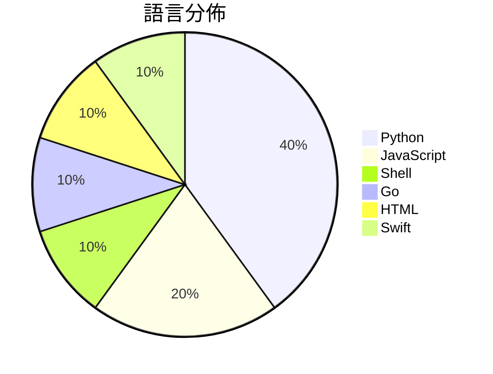

# GitHub Trending - 2026-05-24

> [!summary] 本日摘要
> 收錄 **10** 個新專案，合計 **10.6k** stars
> 語言分佈：Python (4) · JavaScript (2) · Shell (1) · Go (1) · HTML (1) · Swift (1)

> [!tip] 本週焦點
> **[[FoundZiGu--GuJumpgate|FoundZiGu/GuJumpgate]]** — 4 天內累積 2.1k stars（514 stars/天）
> 全自動 GPT Plus 註冊瀏覽器擴展，幫助用戶自動處理註冊與支付流程。



---

## 收錄列表

| # | 專案 | 分類 | Stars | 速度 | 安裝 | 語言 | 用途 |
| :--: | --- | --- | ---: | ---: | --- | --- | --- |
| 1 | [[FoundZiGu--GuJumpgate\|FoundZiGu/GuJumpgate]] | 開發工具 | 2.1k | 514/天 | `medium` | JavaScript | 全自動 GPT Plus 註冊瀏覽器擴展，幫助用戶自動處理註冊與支付流程。 |
| 2 | [[thananon--9arm-skills\|thananon/9arm-skills]] | 開發工具 | 1.9k | 466/天 | `easy` | Shell | 提供一系列針對工程與生產力的 Shell 腳本技能，幫助開發者提升工作效率。 |
| 3 | [[Doorman11991--smallcode\|Doorman11991/smallcode]] | AI/ML | 1.3k | 264/天 | `easy` | JavaScript | 針對小型 LLM 優化的 AI 編碼代理，能在消費級硬體上運行。 |
| 4 | [[perplexityai--bumblebee\|perplexityai/bumblebee]] | 安全 | 1.3k | 429/天 | `easy` | Go | 檢查開發者端點的已知軟體供應鏈漏洞，提供只讀的包、擴展和開發工具元數據掃描。 |
| 5 | [[datawhalechina--Agent-Learning-Hub\|datawhalechina/Agent-Learning-Hub]] | 教學資源 | 1.2k | 203/天 | `easy` | HTML | 提供一個結構化的 AI Agent 學習路線圖和資源庫，幫助開發者建立可靠的 A |
| 6 | [[sapientinc--HRM-Text\|sapientinc/HRM-Text]] | AI/ML | 677 | 135/天 | `medium` | Python | 提供一個高效的文本生成模型，讓基礎模型預訓練變得更簡單且成本更低。 |
| 7 | [[kageroumado--phosphene\|kageroumado/phosphene]] | 其他 | 627 | 209/天 | `medium` | Swift | 讓 macOS 桌面和鎖屏顯示自訂影片作為壁紙。 |
| 8 | [[lynote-ai--humanize-text\|lynote-ai/humanize-text]] | AI/ML | 557 | 111/天 | `medium` | Python | 將 AI 生成的內容轉換為無法檢測的人類寫作，繞過主要的 AI 檢測工具。 |
| 9 | [[WUBING2023--PaperSpine\|WUBING2023/PaperSpine]] |  | 517 | 86/天 |  | Python | PaperSpine is a motivation-driven Codex  |
| 10 | [[LiuMengxuan04--shushu-internship-tool\|LiuMengxuan04/shushu-internship-tool]] | 其他 | 463 | 77/天 | `easy` | Python | 幫助低經驗候選人快速將工作描述轉化為可投遞的項目和面試材料。 |

---

## 重點摘要

### 1. [[FoundZiGu--GuJumpgate|FoundZiGu/GuJumpgate]] `開發工具`

> 全自動 GPT Plus 註冊瀏覽器擴展，幫助用戶自動處理註冊與支付流程。

**2.1k** stars · **514** stars/天 · JavaScript · `medium`

_建立 4 天就累積 2055 stars（514/天），forks 590（28.7%），這顯示出其在用戶中的高度關注。作者 FoundZiGu 似乎在自動化工具領域有一定的經驗，這個專案解決了註冊過程中繁瑣的手動操作，特別是在 PayPal 驗證碼的處理上，這是許多用戶面臨的痛點。隨著 GPT Plus 需求的增加，這個工具的出現正好滿足了市場需求。社群的反饋和熱門問題顯示出用戶在使用過程中的實際困難，這也促進了專案的快速迭代。_

---

### 2. [[thananon--9arm-skills|thananon/9arm-skills]] `開發工具`

> 提供一系列針對工程與生產力的 Shell 腳本技能，幫助開發者提升工作效率。

**1.9k** stars · **466** stars/天 · Shell · `easy`

_建立 4 天就累積 1863 stars（466/天），forks 244（13.1%），這顯示出其在開發者社群中的快速吸引力。這個專案由一位活躍的開發者維護，專注於提供實用的工程技能，解決了許多工程師在日常工作中面臨的重複性問題。作者的背景和過去的貢獻也為這個專案增添了可信度。社群的反饋和需求可能是推動其快速增長的原因之一，特別是在工程師尋求提高生產力的背景下。_

---

### 3. [[Doorman11991--smallcode|Doorman11991/smallcode]] `AI/ML`

> 針對小型 LLM 優化的 AI 編碼代理，能在消費級硬體上運行。

**1.3k** stars · **264** stars/天 · JavaScript · `easy`

_建立 5 天就累積 1321 stars（264/天），forks 95（7.2%），顯示出穩定的增長潛力。作者 Doorman11991 及其團隊在 AI 和編碼工具領域有豐富的經驗，這使得他們能夠針對小型 LLM 的需求進行優化。這個專案解決了小型模型在多步驟工具使用中的困難，並提供了一個本地運行的解決方案，避免了雲端依賴的隱私問題。社群的反饋和活躍度也促進了專案的快速迭代和改進。這些因素共同推動了 SmallCode 的快速成長。_

---

### 4. [[perplexityai--bumblebee|perplexityai/bumblebee]] `安全`

> 檢查開發者端點的已知軟體供應鏈漏洞，提供只讀的包、擴展和開發工具元數據掃描。

**1.3k** stars · **429** stars/天 · Go · `easy`

_建立 3 天內累積 1288 stars（429/天），forks 102（7.9%），顯示出強勁的增長勢頭。這個專案的作者 Adel Ka 在供應鏈安全領域有豐富經驗，之前的工作涉及多個開源安全工具。Bumblebee 解決了開發者在快速識別本地環境中已知漏洞的需求，特別是在傳統工具無法提供即時檢查的情況下。近期的供應鏈攻擊事件引發了對這類工具的需求，進一步推動了其受歡迎程度。高比例的 forks/stars（7.9%）表明許多開發者正在積極修改和使用這個工具，顯示出其實用性和潛在的社群支持。_

---

### 5. [[datawhalechina--Agent-Learning-Hub|datawhalechina/Agent-Learning-Hub]] `教學資源`

> 提供一個結構化的 AI Agent 學習路線圖和資源庫，幫助開發者建立可靠的 AI 代理。

**1.2k** stars · **203** stars/天 · HTML · `easy`

_建立 6 天就累積 1217 stars（203/天），forks 127（10.4%），顯示出強勁的增長潛力。這個專案由 Datawhale 團隊維護，成員在 AI 領域有豐富的經驗，提供了針對 AI 代理的系統學習路徑，填補了市場上對於結構化學習資源的需求。社群的快速反應和高參與度也促進了這個專案的成長，顯示出對於 AI 代理開發的關注和需求。這個專案的出現正好契合了當前 AI 技術快速發展的趨勢，並且提供了實用的學習資源，讓開發者能夠快速上手。forks/stars 比率為 10.4%，顯示出許多使用者對於這個專案的實際應用有興趣，並可能進行修改或擴展。_

---

### 6. [[sapientinc--HRM-Text|sapientinc/HRM-Text]] `AI/ML`

> 提供一個高效的文本生成模型，讓基礎模型預訓練變得更簡單且成本更低。

**677** stars · **135** stars/天 · Python · `medium`

_建立 5 天就累積 677 stars（135/天），forks 62（9.2%），這顯示出穩定的增長潛力。該專案由多位貢獻者共同開發，解決了大型模型預訓練過程中資源消耗過高的痛點，之前的解決方案往往需要昂貴的計算資源和大量數據。作者的背景和過去的經驗使其在這個領域具備專業知識，並且有潛在的社群支持。這個專案的出現正好符合了對高效能文本生成模型的需求，尤其是在預算有限的情況下。forks/stars 比率為 9.2%，顯示出使用者對此專案的實際修改和應用興趣。_

---

### 7. [[kageroumado--phosphene|kageroumado/phosphene]] `其他`

> 讓 macOS 桌面和鎖屏顯示自訂影片作為壁紙。

**627** stars · **209** stars/天 · Swift · `medium`

_建立 3 天就累積 627 stars（209/天），forks 17（2.7%），顯示出不錯的增長潛力。開發者 kageroumado 之前的專案經驗使其能夠快速推出這個工具，解決了 macOS 使用者對於自訂影片壁紙的需求，因為市面上類似的工具不多。這個專案的推出恰逢 macOS Tahoe 的發布，利用了新版本的功能來提供更好的使用體驗。forks/stars 比率相對較低，顯示出目前使用者對此專案的興趣仍在觀望階段。_

---

### 8. [[lynote-ai--humanize-text|lynote-ai/humanize-text]] `AI/ML`

> 將 AI 生成的內容轉換為無法檢測的人類寫作，繞過主要的 AI 檢測工具。

**557** stars · **111** stars/天 · Python · `medium`

_建立 5 天就累積 557 stars（111/天），forks 41（7.4%），顯示出穩定的增長潛力。這個專案的作者團隊有著豐富的背景，專注於 AI 應用開發，解決了以往 AI 生成內容在學術和創作領域的檢測問題，提供了一個無需註冊的免費工具，這在當前的市場中是相對少見的。近期的推廣活動和社群討論也為其帶來了更多的曝光，尤其是在學術寫作和內容創作的需求上。這個工具的設計使得它能夠有效地應對 AI 檢測技術的挑戰，並在技術生態中找到了自己的定位。_

---

### 9. [[WUBING2023--PaperSpine|WUBING2023/PaperSpine]]

**517** stars · **86** stars/天 · Python

---

### 10. [[LiuMengxuan04--shushu-internship-tool|LiuMengxuan04/shushu-internship-tool]] `其他`

> 幫助低經驗候選人快速將工作描述轉化為可投遞的項目和面試材料。

**463** stars · **77** stars/天 · Python · `easy`

_建立 6 天就累積 463 stars（77/天），forks 18（3.9%），這顯示出相對穩定的增長。作者LiuMengxuan04在AI和技能相關領域有一定的背景，這個工具解決了求職者在面試準備過程中的痛點，特別是對於缺乏經驗的候選人來說，能夠快速將JD轉化為實際可用的項目材料。社群的活躍度和開發者的持續投入也為這個工具的發展提供了良好的基礎。_

---

## 今日到期複習

> [!tip] 根據間隔複習排程，今天該回顧的專案

```dataview
TABLE
  stars_per_day AS "Stars/天",
  category AS "分類",
  engagement AS "參與度"
FROM "Repos"
WHERE next_review AND date(next_review) <= date("2026-05-24") AND status != "archived"
SORT priority DESC
```

## 待處理

```dataviewjs
const pending = dv.pages('"Repos"').where(p => p.status === "to-review").length;
const unrated = dv.pages('"Repos"').where(p => p.status !== "archived" && p.status !== "to-review" && (p.my_rating || 0) === 0).length;
const noVerdict = dv.pages('"Repos"').where(p => p.status !== "archived" && (p.my_rating || 0) > 0 && (!p.verdict || p.verdict === "")).length;
const items = [];
if (pending > 0) items.push(`**${pending}** 個待分流`);
if (unrated > 0) items.push(`**${unrated}** 個已讀但未評分`);
if (noVerdict > 0) items.push(`**${noVerdict}** 個已評分但無結論`);
if (items.length > 0) dv.paragraph(items.join(" / "));
else dv.paragraph("所有專案都已處理完畢！");
```
