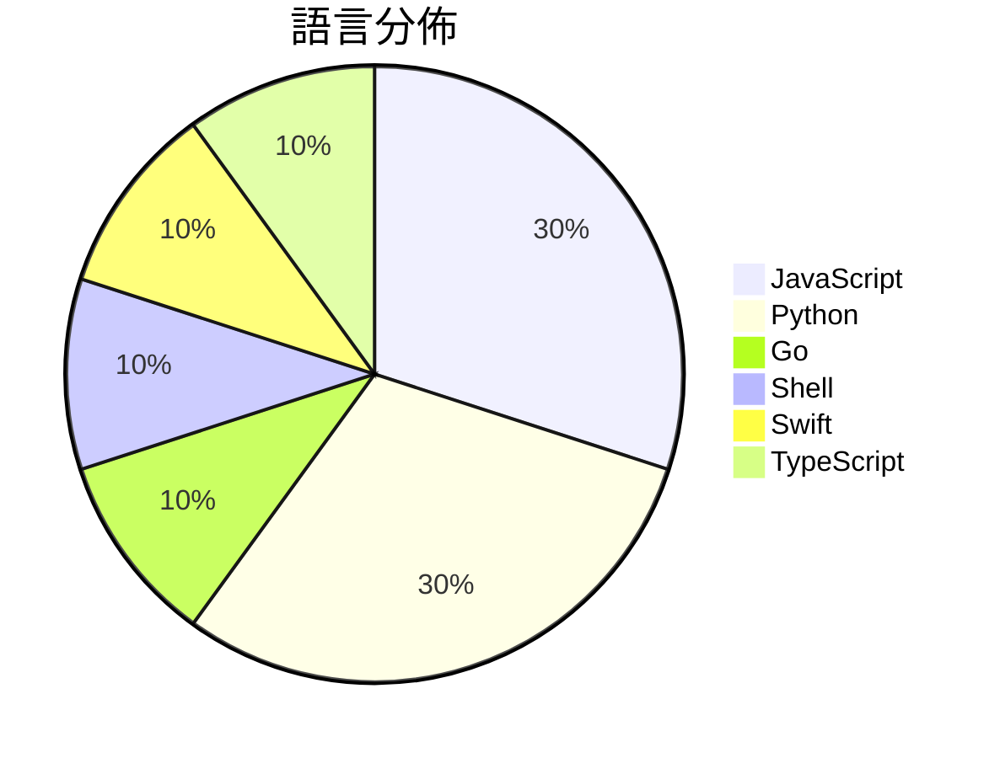

# GitHub Trending - 2026-05-25

> [!summary] 本日摘要
> 收錄 **10** 個新專案，合計 **11.5k** stars
> 語言分佈：JavaScript (3) · Python (3) · Go (1) · Shell (1) · Swift (1) · TypeScript (1)

> [!tip] 本週焦點
> **[[FoundZiGu--GuJumpgate|FoundZiGu/GuJumpgate]]** — 5 天內累積 2.3k stars（468 stars/天）
> 自動化 GPT Plus 註冊流程，減少手動操作的繁瑣。



---

## 收錄列表

| # | 專案 | 分類 | Stars | 速度 | 安裝 | 語言 | 用途 |
| :--: | --- | --- | ---: | ---: | --- | --- | --- |
| 1 | [[FoundZiGu--GuJumpgate\|FoundZiGu/GuJumpgate]] | 開發工具 | 2.3k | 468/天 | `medium` | JavaScript | 自動化 GPT Plus 註冊流程，減少手動操作的繁瑣。 |
| 2 | [[perplexityai--bumblebee\|perplexityai/bumblebee]] | 安全 | 2.2k | 542/天 | `easy` | Go | 檢查開發者端點的已知軟體供應鏈漏洞，提供只讀的包、擴展和開發工具元數據掃描。 |
| 3 | [[thananon--9arm-skills\|thananon/9arm-skills]] | 開發工具 | 2.0k | 399/天 | `easy` | Shell | 提供一系列 Shell 腳本技能，幫助工程師和生產力提升。 |
| 4 | [[Doorman11991--smallcode\|Doorman11991/smallcode]] | AI/ML | 1.4k | 231/天 | `easy` | JavaScript | 針對小型 LLM 優化的 AI 編碼代理，提供高達 87% 的基準測試表現。 |
| 5 | [[sapientinc--HRM-Text\|sapientinc/HRM-Text]] | AI/ML | 710 | 118/天 | `medium` | Python | 提供一個高效的文本生成模型，讓基礎模型預訓練變得更容易且成本更低。 |
| 6 | [[lynote-ai--humanize-text\|lynote-ai/humanize-text]] | AI/ML | 688 | 115/天 | `medium` | Python | 將 AI 生成的內容轉換為無法檢測的人類寫作，繞過所有主要的 AI 偵測工具。 |
| 7 | [[kageroumado--phosphene\|kageroumado/phosphene]] | 其他 | 654 | 164/天 | `medium` | Swift | 讓你的 macOS 桌面和鎖屏變成動態視頻牆紙，隨心所欲地選擇視頻文件。 |
| 8 | [[open-gsd--get-shit-done-redux\|open-gsd/get-shit-done-redux]] | 開發工具 | 566 | 283/天 | `easy` | JavaScript | 幫助獨立開發者和小團隊高效地管理 AI 開發流程，避免上下文混亂。 |
| 9 | [[Tong89--smartNode\|Tong89/smartNode]] | 開發工具 | 510 | 170/天 | `medium` | Python | 提供天基數據回傳的可視化仿真平台，展示衛星與地面站的協同關係。 |
| 10 | [[basketikun--infinite-canvas\|basketikun/infinite-canvas]] | 開發工具 | 480 | 80/天 | `medium` | TypeScript | 提供一個集成 AI 創作的開源無限畫布工作台，讓用戶能夠輕鬆編排和生成圖像。 |

---

## 重點摘要

### 1. [[FoundZiGu--GuJumpgate|FoundZiGu/GuJumpgate]] `開發工具`

> 自動化 GPT Plus 註冊流程，減少手動操作的繁瑣。

**2.3k** stars · **468** stars/天 · JavaScript · `medium`

_建立 5 天內累積 2339 stars（468/天），forks 651（27.8%），顯示出強烈的用戶需求和活躍的社群參與。作者 FoundZiGu 之前有開發過類似的自動化工具，這次專案解決了用戶在註冊過程中遇到的多個痛點，如 PayPal 的驗證問題和 OAuth 的風控挑戰。近期的社群討論和問題反饋也促進了該專案的快速迭代。技術上，隨著自動化需求的上升，這個工具的實用性愈加凸顯，尤其是在需要大量註冊的場景中。高達 27.8% 的 forks/stars 比率顯示出許多開發者正在積極修改和使用這個工具，這是其受歡迎的原因之一。_

---

### 2. [[perplexityai--bumblebee|perplexityai/bumblebee]] `安全`

> 檢查開發者端點的已知軟體供應鏈漏洞，提供只讀的包、擴展和開發工具元數據掃描。

**2.2k** stars · **542** stars/天 · Go · `easy`

_建立 4 天就累積 2168 stars（542/天），forks 166（7.7%），這顯示出強烈的社群興趣。這個專案的主要貢獻者 Adel Ka 來自 Perplexity.ai，過去在供應鏈安全領域有豐富的經驗。Bumblebee 解決了開發者在面對供應鏈漏洞時，如何快速獲取本地環境中已知漏洞的包和擴展的問題，這在傳統的掃描工具中往往需要手動查詢和比對。近期的安全事件和漏洞曝光促使開發者尋求更有效的工具來保護其開發環境，這也可能是其迅速受關注的原因。forks/stars 比率為 7.7%，顯示出有不少使用者在實際修改和使用這個工具。_

---

### 3. [[thananon--9arm-skills|thananon/9arm-skills]] `開發工具`

> 提供一系列 Shell 腳本技能，幫助工程師和生產力提升。

**2.0k** stars · **399** stars/天 · Shell · `easy`

_建立 5 天內累積 1994 stars（399/天），forks 266（13.3%），顯示出強烈的社群興趣。專案的作者在開源社群中活躍，過去有多個成功的專案，這使得這個新專案受到關注。這些技能解決了工程師在日常工作中面臨的效率問題，之前的解決方案往往缺乏系統化的技能集合。最近的推文和社群討論也促進了這個專案的曝光。這些技能的設計和實作符合當前開發者對簡化工作流程的需求，並且能夠輕鬆整合進現有的開發環境中。forks/stars 比率為 13.3%，顯示出相對較高的實際使用和修改潛力。_

---

### 4. [[Doorman11991--smallcode|Doorman11991/smallcode]] `AI/ML`

> 針對小型 LLM 優化的 AI 編碼代理，提供高達 87% 的基準測試表現。

**1.4k** stars · **231** stars/天 · JavaScript · `easy`

_建立 6 天就累積 1383 stars（231/天），forks 96（6.9%），這顯示出其快速增長的潛力。作者 Doorman11991 及其團隊在開源社群中活躍，專注於解決小型 LLM 的使用痛點，這在先前的工具中並未得到充分重視。SmallCode 的設計針對小型模型的限制進行了優化，提供了更好的上下文管理和工具調用方式，這在當前的 AI 開發環境中是個重要的需求。社群的反饋和活躍度也顯示出使用者對這個工具的需求和期待。_

---

### 5. [[sapientinc--HRM-Text|sapientinc/HRM-Text]] `AI/ML`

> 提供一個高效的文本生成模型，讓基礎模型預訓練變得更容易且成本更低。

**710** stars · **118** stars/天 · Python · `medium`

_建立 6 天就累積 710 stars（118/天），forks 65（9.2%），顯示出不錯的增長潛力。作者 imoneoi 和其他貢獻者在大型語言模型領域有一定的經驗，這使得他們能夠針對現有模型的高計算和數據需求提出解決方案。HRM-Text 解決了傳統模型預訓練過程中的高成本問題，特別適合資源有限的開發者。社群中對於預訓練數據集的討論和建議顯示出使用者對於模型的實際應用需求。這個工具的出現正好契合了對高效能文本生成模型的需求，並且在技術生態中提供了一個新的選擇。_

---

### 6. [[lynote-ai--humanize-text|lynote-ai/humanize-text]] `AI/ML`

> 將 AI 生成的內容轉換為無法檢測的人類寫作，繞過所有主要的 AI 偵測工具。

**688** stars · **115** stars/天 · Python · `medium`

_建立 6 天內累積 688 stars（115/天），forks 45（6.5%），顯示出穩定的增長潛力。主要貢獻者包括 fendouai 和 molly554，他們在 AI 工具開發方面有豐富經驗。這個專案解決了 AI 生成內容在學術和創作領域的可檢測性問題，之前的解決方案往往無法有效繞過檢測工具。最近的推廣活動和社群討論也可能促進了這一增長。技術上，這個工具的多語言翻譯和人性化寫作的結合使其在市場上具備競爭優勢。forks/stars 比率適中，顯示出一定的實際使用需求。_

---

### 7. [[kageroumado--phosphene|kageroumado/phosphene]] `其他`

> 讓你的 macOS 桌面和鎖屏變成動態視頻牆紙，隨心所欲地選擇視頻文件。

**654** stars · **164** stars/天 · Swift · `medium`

_建立 4 天就累積 654 stars（164/天），forks 17（2.6%），這顯示出一定的市場需求。作者 kageroumado 之前有商業背景，這個專案的開源是因為市場競爭激烈，顯示出對視頻牆紙的需求未被充分滿足。此工具解決了用戶在 macOS 上無法輕鬆使用自定義視頻作為壁紙的痛點，之前的解決方案往往功能有限或不夠靈活。社群的反饋和問題追蹤顯示出用戶對於多顯示器支持和性能優化的需求，這些都是目前市場上其他工具未能很好解決的問題。_

---

### 8. [[open-gsd--get-shit-done-redux|open-gsd/get-shit-done-redux]] `開發工具`

> 幫助獨立開發者和小團隊高效地管理 AI 開發流程，避免上下文混亂。

**566** stars · **283** stars/天 · JavaScript · `easy`

_建立 2 天內累積 566 stars（283/天），forks 42（7.4%），這顯示出相對穩定的增長。這個專案的主要貢獻者來自於開源社群，並且在過去的開發中有著良好的聲譽。它解決了 AI 開發中上下文混亂的問題，這是許多開發者在使用傳統工具時常遇到的痛點。特別是在多個 AI 模型之間切換時，GSD 提供了更好的上下文管理和驗證機制。社群的活躍度也顯示出使用者對這個工具的需求和期望，尤其是在 AI 開發的快速變化中。這個工具的設計和功能使其在當前的開發環境中具備了良好的適應性和可擴展性。_

---

### 9. [[Tong89--smartNode|Tong89/smartNode]] `開發工具`

> 提供天基數據回傳的可視化仿真平台，展示衛星與地面站的協同關係。

**510** stars · **170** stars/天 · Python · `medium`

_建立 3 天就累積 510 stars（170/天），forks 47（9.2%），這顯示出不錯的增長潛力。作者團隊由多位貢獻者組成，顯示出良好的合作基礎。這個專案解決了衛星數據回傳的可視化需求，以往的工具往往缺乏針對性，無法有效展示衛星與地面站的協同作業。最近的推廣活動和社群討論也可能促進了其曝光度。技術上，這個工具的開放 API 設計使得用戶能夠進行二次開發，這在目前的開發生態中是非常受歡迎的。forks/stars 比率在 9.2% 的範圍內，顯示出用戶對這個工具的實際修改和使用意願較高。_

---

### 10. [[basketikun--infinite-canvas|basketikun/infinite-canvas]] `開發工具`

> 提供一個集成 AI 創作的開源無限畫布工作台，讓用戶能夠輕鬆編排和生成圖像。

**480** stars · **80** stars/天 · TypeScript · `medium`

_建立 6 天就累積 480 stars（80/天），forks 91（19.0%），這顯示出相對較高的社群參與度。作者 basketikun 之前有其他開源項目經驗，這次專案解決了在 AI 圖像創作過程中缺乏一體化工具的痛點，讓用戶能夠在一個平台上完成多種任務。近期的推廣活動和社群討論也可能促進了其知名度的提升。技術上，隨著 AI 圖像生成技術的成熟，這個工具的需求也隨之增加。高達 19% 的 forks/stars 比率顯示出許多開發者對此專案的實際修改和使用，表明其在社群中的實用性和潛力。_

---

## 今日到期複習

> [!tip] 根據間隔複習排程，今天該回顧的專案

```dataview
TABLE
  stars_per_day AS "Stars/天",
  category AS "分類",
  engagement AS "參與度"
FROM "Repos"
WHERE next_review AND date(next_review) <= date("2026-05-25") AND status != "archived"
SORT priority DESC
```

## 待處理

```dataviewjs
const pending = dv.pages('"Repos"').where(p => p.status === "to-review").length;
const unrated = dv.pages('"Repos"').where(p => p.status !== "archived" && p.status !== "to-review" && (p.my_rating || 0) === 0).length;
const noVerdict = dv.pages('"Repos"').where(p => p.status !== "archived" && (p.my_rating || 0) > 0 && (!p.verdict || p.verdict === "")).length;
const items = [];
if (pending > 0) items.push(`**${pending}** 個待分流`);
if (unrated > 0) items.push(`**${unrated}** 個已讀但未評分`);
if (noVerdict > 0) items.push(`**${noVerdict}** 個已評分但無結論`);
if (items.length > 0) dv.paragraph(items.join(" / "));
else dv.paragraph("所有專案都已處理完畢！");
```
