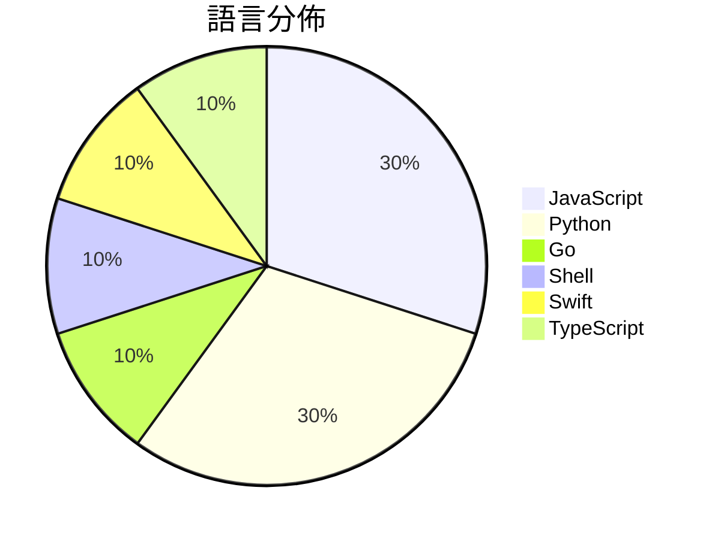

# GitHub Trending - 2026-05-26

> [!summary] 本日摘要
> 收錄 **10** 個新專案，合計 **11.6k** stars
> 語言分佈：JavaScript (3) · Python (3) · Go (1) · Shell (1) · Swift (1) · TypeScript (1)

> [!tip] 本週焦點
> **[[perplexityai--bumblebee|perplexityai/bumblebee]]** — 5 天內累積 2.6k stars（517 stars/天）
> 檢查開發者端點的已知軟體供應鏈漏洞暴露情況的只讀掃描工具。



---

## 收錄列表

| # | 專案 | 分類 | Stars | 速度 | 安裝 | 語言 | 用途 |
| :--: | --- | --- | ---: | ---: | --- | --- | --- |
| 1 | [[perplexityai--bumblebee\|perplexityai/bumblebee]] | 安全 | 2.6k | 517/天 | `easy` | Go | 檢查開發者端點的已知軟體供應鏈漏洞暴露情況的只讀掃描工具。 |
| 2 | [[FoundZiGu--GuJumpgate\|FoundZiGu/GuJumpgate]] | 開發工具 | 2.5k | 424/天 | `medium` | JavaScript | 自動化 GPT Plus 註冊流程，解決繁瑣的手機驗證和支付問題。 |
| 3 | [[thananon--9arm-skills\|thananon/9arm-skills]] | 開發工具 | 2.2k | 361/天 | `easy` | Shell | 提供一系列 Shell 技能以提升工程師的工作效率。 |
| 4 | [[open-gsd--get-shit-done-redux\|open-gsd/get-shit-done-redux]] | 開發工具 | 857 | 286/天 | `easy` | JavaScript | 幫助開發者有效管理 AI 開發過程中的上下文和規範，避免質量下降。 |
| 5 | [[Tong89--smartNode\|Tong89/smartNode]] | 開發工具 | 703 | 176/天 | `medium` | Python | 提供天基數據回傳的可視化仿真平台，協助展示衛星與地面站的協同關係。 |
| 6 | [[kageroumado--phosphene\|kageroumado/phosphene]] | 其他 | 673 | 135/天 | `medium` | Swift | 讓你的 macOS 桌面和鎖屏變成動態視頻牆紙，隨心所欲選擇視頻文件。 |
| 7 | [[0xSero--codex-shim\|0xSero/codex-shim]] | 開發工具 | 593 | 198/天 | `medium` | Python | 讓 Codex Desktop 能夠使用自訂的 BYOK 模型，並可選擇透過 C |
| 8 | [[run-liyi--wechatpay\|run-liyi/wechatpay]] | 開發工具 | 536 | 134/天 | `easy` | JavaScript | 一個基於 Electron 的微信帳單可視化分析工具，幫助用戶深入了解個人財務狀 |
| 9 | [[MoonshotAI--kimi-code\|MoonshotAI/kimi-code]] | 開發工具 | 500 | 167/天 | `easy` | TypeScript | 提供一個終端機中的 AI 編碼代理，能夠讀取和編輯代碼、執行命令及選擇後續步驟。 |
| 10 | [[zhaoyue4810--pianke\|zhaoyue4810/pianke]] | 開發工具 | 400 | 133/天 | `medium` | Python | 讓 AI 協助初篩與分組，把最終的審美決定權留給自己。 |

---

## 重點摘要

### 1. [[perplexityai--bumblebee|perplexityai/bumblebee]] `安全`

> 檢查開發者端點的已知軟體供應鏈漏洞暴露情況的只讀掃描工具。

**2.6k** stars · **517** stars/天 · Go · `easy`

_建立 5 天內累積 2586 stars（517/天），forks 205（7.9%），顯示出強勁的增長潛力。這個專案的主要貢獻者 Adel Ka 在供應鏈安全領域有豐富的經驗，之前的工作涉及多個開源安全工具。Bumblebee 解決了傳統工具無法有效檢查本地開發環境的問題，特別是在快速變化的供應鏈安全環境中，能夠提供即時的暴露檢查。最近的推文和社群討論也引起了開發者的關注，進一步推動了它的流行。其輕量級的設計和無依賴的特性，使得它在當前的開發生態中更具吸引力，尤其是在需要快速部署和高效能的場景中。_

---

### 2. [[FoundZiGu--GuJumpgate|FoundZiGu/GuJumpgate]] `開發工具`

> 自動化 GPT Plus 註冊流程，解決繁瑣的手機驗證和支付問題。

**2.5k** stars · **424** stars/天 · JavaScript · `medium`

_建立 6 天就累積 2544 stars（424/天），forks 699（27.5%），顯示出強烈的社群參與。作者 FoundZiGu 之前在開源社區活躍，這個專案解決了用戶在註冊 GPT Plus 時遇到的繁瑣手續，特別是手機驗證和支付過程的自動化。這一需求在社群中引起了廣泛關注，尤其是對於需要頻繁進行這些操作的用戶。技術上，這個工具的出現正好滿足了用戶對於自動化和便利性的需求，並且在短時間內獲得了大量的使用者反饋和改進建議。_

---

### 3. [[thananon--9arm-skills|thananon/9arm-skills]] `開發工具`

> 提供一系列 Shell 技能以提升工程師的工作效率。

**2.2k** stars · **361** stars/天 · Shell · `easy`

_建立 6 天內累積 2167 stars（361/天），forks 297（13.7%），顯示出強勁的增長潛力。作者 Thananon 是一位活躍的開發者，專注於提升工程師的工作流程。這個專案解決了工程師在日常工作中面臨的效率問題，提供了具體的技能來簡化常見任務。最近的推文和社群討論也引起了對這個專案的關注，進一步促進了其傳播。技術上，這個工具的可行性得益於 Shell 腳本的廣泛應用，讓它能夠在多種環境中運行。forks/stars 的比率為 13.7%，顯示出許多人對其進行實際修改和使用。_

---

### 4. [[open-gsd--get-shit-done-redux|open-gsd/get-shit-done-redux]] `開發工具`

> 幫助開發者有效管理 AI 開發過程中的上下文和規範，避免質量下降。

**857** stars · **286** stars/天 · JavaScript · `easy`

_建立 3 天就累積 857 stars（286/天），forks 57（6.7%），顯示出強烈的社群興趣。主要貢獻者來自於 open-gsd 團隊，這是一個專注於 AI 開發的團隊，之前的版本在社群中有一定的基礎。這個專案解決了在 AI 開發中上下文管理不善導致的質量下降問題，這在過去的工具中並未得到很好的解決。最近的推文和討論也引起了不少關注，進一步推動了其流行。這個工具的出現正好契合了當前對於高效開發工具的需求，特別是在 AI 領域。_

---

### 5. [[Tong89--smartNode|Tong89/smartNode]] `開發工具`

> 提供天基數據回傳的可視化仿真平台，協助展示衛星與地面站的協同關係。

**703** stars · **176** stars/天 · Python · `medium`

_建立 4 天就累積 703 stars（176/天），forks 59（8.4%），顯示出不錯的增長潛力。作者團隊在衛星數據處理和可視化方面有豐富經驗，這個專案解決了過去在衛星數據回傳仿真中缺乏直觀可視化工具的痛點。近期的推廣活動和社群討論也可能促進了這個專案的曝光率。這個工具的開放 API 設計使得它能夠輕鬆集成到現有的工作流中，進一步提升了其吸引力。_

---

### 6. [[kageroumado--phosphene|kageroumado/phosphene]] `其他`

> 讓你的 macOS 桌面和鎖屏變成動態視頻牆紙，隨心所欲選擇視頻文件。

**673** stars · **135** stars/天 · Swift · `medium`

_建立 5 天內累積 673 stars（134.6/天），forks 17（2.5%），顯示出一定的使用者興趣。作者 kageroumado 之前有商業背景，這個專案的開源是因為市場競爭激烈，顯示出對於視頻牆紙應用的需求。此專案解決了 macOS 用戶在視頻牆紙方面的不足，尤其是對於多顯示器和動態視頻的支持，這在現有的應用中並不常見。隨著 macOS Tahoe 的推出，這個工具的可行性大幅提升，並且社群的反饋也在持續增長。_

---

### 7. [[0xSero--codex-shim|0xSero/codex-shim]] `開發工具`

> 讓 Codex Desktop 能夠使用自訂的 BYOK 模型，並可選擇透過 ChatGPT GPT-5.5 進行傳遞。

**593** stars · **198** stars/天 · Python · `medium`

_建立 3 天內累積 593 stars（198/天），forks 51（8.6%），顯示出強勁的增長潛力。作者 0xSero 及 OnlyTerp 在開源社群中有一定的影響力，之前的專案也獲得過良好的反響。這個工具解決了 Codex Desktop 使用自訂模型的痛點，之前需要重建 Codex 或使用繁瑣的配置，現在只需簡單的設定檔即可。近期在社交媒體上有關於此工具的討論也引起了開發者的注意，進一步推動了其流行。forks/stars 比率為 8.6%，顯示出有不少人對此專案進行了實際的修改和使用。_

---

### 8. [[run-liyi--wechatpay|run-liyi/wechatpay]] `開發工具`

> 一個基於 Electron 的微信帳單可視化分析工具，幫助用戶深入了解個人財務狀況。

**536** stars · **134** stars/天 · JavaScript · `easy`

_建立 4 天就累積 536 stars（134/天），forks 45（8.4%），這顯示出用戶對於此工具的高度興趣。開發者 EchoFish 和 run-liyi 以其過往的開源貢獻為基礎，針對微信用戶的需求開發了這個工具，填補了市場上對於微信帳單分析的空白。這個工具的可視化功能和多維度分析能力是之前工具所缺乏的，特別是針對個人消費的深入分析。社群的反饋和需求驅動了這個專案的快速增長，特別是在微信支付使用者中。forks/stars 比率為 8.4%，顯示出有不少用戶在實際修改或使用此工具。_

---

### 9. [[MoonshotAI--kimi-code|MoonshotAI/kimi-code]] `開發工具`

> 提供一個終端機中的 AI 編碼代理，能夠讀取和編輯代碼、執行命令及選擇後續步驟。

**500** stars · **167** stars/天 · TypeScript · `easy`

_建立 3 天內累積 500 stars（167/天），forks 30（6.0%），顯示出一定的社群關注。這個專案的主要貢獻者來自 Moonshot AI 團隊，過去在 AI 代理領域有豐富的經驗。Kimi Code CLI 解決了傳統編碼工具無法有效整合 AI 代理的痛點，讓開發者能夠在終端中直接進行代碼操作。近期的推廣活動和社群討論也可能促進了它的快速增長。這個工具的出現正好契合了開發者對於更智能化編碼助手的需求，尤其是在 AI 技術逐漸成熟的背景下。_

---

### 10. [[zhaoyue4810--pianke|zhaoyue4810/pianke]] `開發工具`

> 讓 AI 協助初篩與分組，把最終的審美決定權留給自己。

**400** stars · **133** stars/天 · Python · `medium`

_建立 3 天就累積 400 stars（133/天），forks 90（22.5%），這顯示出強烈的用戶興趣。作者 zhaoyue4810 在開源社群中活躍，這個專案解決了攝影師在選片過程中面臨的繁瑣和隱私問題，之前的工具往往需要上傳照片到雲端，這使得用戶的隱私受到威脅。這個工具的本地運行特性吸引了許多關注，特別是在對隱私有高要求的用戶中。社群的反饋和問題解決也顯示出用戶對此工具的需求和期望。_

---

## 今日到期複習

> [!tip] 根據間隔複習排程，今天該回顧的專案

```dataview
TABLE
  stars_per_day AS "Stars/天",
  category AS "分類",
  engagement AS "參與度"
FROM "Repos"
WHERE next_review AND date(next_review) <= date("2026-05-26") AND status != "archived"
SORT priority DESC
```

## 待處理

```dataviewjs
const pending = dv.pages('"Repos"').where(p => p.status === "to-review").length;
const unrated = dv.pages('"Repos"').where(p => p.status !== "archived" && p.status !== "to-review" && (p.my_rating || 0) === 0).length;
const noVerdict = dv.pages('"Repos"').where(p => p.status !== "archived" && (p.my_rating || 0) > 0 && (!p.verdict || p.verdict === "")).length;
const items = [];
if (pending > 0) items.push(`**${pending}** 個待分流`);
if (unrated > 0) items.push(`**${unrated}** 個已讀但未評分`);
if (noVerdict > 0) items.push(`**${noVerdict}** 個已評分但無結論`);
if (items.length > 0) dv.paragraph(items.join(" / "));
else dv.paragraph("所有專案都已處理完畢！");
```
