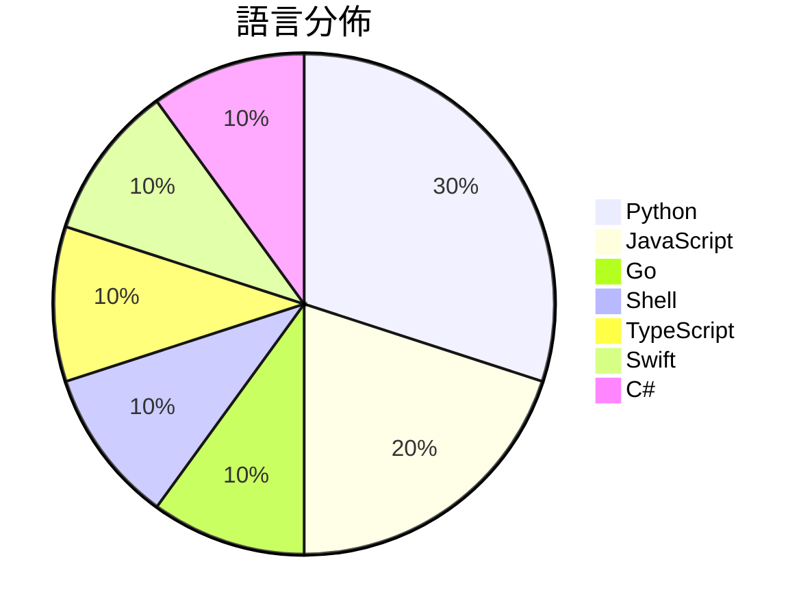

# GitHub Trending - 2026-05-27

> [!summary] 本日摘要
> 收錄 **10** 個新專案，合計 **11.4k** stars
> 語言分佈：Python (3) · JavaScript (2) · Go (1) · Shell (1) · TypeScript (1) · Swift (1) · C# (1)

> [!tip] 本週焦點
> **[[perplexityai--bumblebee|perplexityai/bumblebee]]** — 6 天內累積 3.2k stars（533 stars/天）
> 檢查開發者端點的已知軟體供應鏈漏洞，提供只讀的元數據掃描。



---

## 收錄列表

| # | 專案 | 分類 | Stars | 速度 | 安裝 | 語言 | 用途 |
| :--: | --- | --- | ---: | ---: | --- | --- | --- |
| 1 | [[perplexityai--bumblebee\|perplexityai/bumblebee]] | 安全 | 3.2k | 533/天 | `easy` | Go | 檢查開發者端點的已知軟體供應鏈漏洞，提供只讀的元數據掃描。 |
| 2 | [[thananon--9arm-skills\|thananon/9arm-skills]] | 開發工具 | 2.4k | 337/天 | `easy` | Shell | 提供一系列針對工程和生產力的技能，讓 Claude Code 更加高效。 |
| 3 | [[Tong89--smartNode\|Tong89/smartNode]] | 其他 | 1.1k | 226/天 | `medium` | Python | 提供天基數據回傳的可視化仿真平台，展示衛星與地面站的協同關係。 |
| 4 | [[open-gsd--get-shit-done-redux\|open-gsd/get-shit-done-redux]] | 開發工具 | 1.1k | 276/天 | `easy` | JavaScript | 幫助開發者高效管理 AI 開發過程，避免上下文混亂與質量下降。 |
| 5 | [[run-liyi--wechatpay\|run-liyi/wechatpay]] | 生產力 | 802 | 160/天 | `easy` | JavaScript | 一款基於 Electron 的微信帳單可視化分析工具，幫助用戶深入了解個人消費習 |
| 6 | [[MoonshotAI--kimi-code\|MoonshotAI/kimi-code]] | 開發工具 | 724 | 181/天 | `easy` | TypeScript | 提供一個在終端運行的 AI 編碼代理，能讀取和編輯代碼、執行命令、搜尋文件等。 |
| 7 | [[kageroumado--phosphene\|kageroumado/phosphene]] | 其他 | 686 | 114/天 | `medium` | Swift | 讓你的 macOS 桌面和鎖屏變成視頻牆紙，隨心所欲使用自己的影片。 |
| 8 | [[0xSero--codex-shim\|0xSero/codex-shim]] | 開發工具 | 635 | 159/天 | `medium` | Python | 讓 Codex Desktop 能夠使用自訂模型而不需重建 Codex。 |
| 9 | [[zhaoyue4810--pianke\|zhaoyue4810/pianke]] | 開發工具 | 438 | 110/天 | `medium` | Python | 讓 AI 協助初篩與分組，把最終的審美決定權留給自己。 |
| 10 | [[KNG7-P--Se7en-Pro\|KNG7-P/Se7en-Pro]] | 開發工具 | 378 | 63/天 | `medium` | C# | 提供一個現代化的 Windows 桌面客戶端，基於 Psiphon 3 網路隧道 |

---

## 重點摘要

### 1. [[perplexityai--bumblebee|perplexityai/bumblebee]] `安全`

> 檢查開發者端點的已知軟體供應鏈漏洞，提供只讀的元數據掃描。

**3.2k** stars · **533** stars/天 · Go · `easy`

_建立 6 天內累積 3196 stars（533/天），forks 256（8.0%），顯示出強烈的社群興趣。這個專案由 Perplexity AI 的 Adel Ka 開發，解決了在開發者端點上檢查已知供應鏈漏洞的需求，之前的工具往往無法有效整合本地元數據。Bumblebee 的出現填補了這一空白，特別是在供應鏈安全日益受到重視的背景下。社群對於其功能的需求也反映在熱門 Issues 上，像是對 Homebrew 和 NuGet 的支援請求。這些需求的增長顯示出開發者對於供應鏈安全的重視，並希望有更好的工具來應對這些挑戰。_

---

### 2. [[thananon--9arm-skills|thananon/9arm-skills]] `開發工具`

> 提供一系列針對工程和生產力的技能，讓 Claude Code 更加高效。

**2.4k** stars · **337** stars/天 · Shell · `easy`

_建立 7 天內累積 2356 stars（337/天），forks 324（13.8%），顯示出強烈的社群興趣。作者 narze 之前有其他開源專案經驗，這使得他能夠針對開發者的需求設計出這樣的技能集。這個專案解決了開發者在日常工作中缺乏高效工具的痛點，之前的解決方案往往分散且缺乏整合性。最近的推廣活動和社群討論也可能促進了這個專案的曝光率。技術上，這個專案的 Shell 腳本設計使得它能夠快速集成到現有的開發環境中，這也是其受歡迎的原因之一。forks/stars 比率為 13.8%，顯示出許多開發者在實際使用和修改這個專案。_

---

### 3. [[Tong89--smartNode|Tong89/smartNode]] `其他`

> 提供天基數據回傳的可視化仿真平台，展示衛星與地面站的協同關係。

**1.1k** stars · **226** stars/天 · Python · `medium`

_建立 5 天內累積 1128 stars（226/天），forks 95（8.4%），顯示出良好的社群關注度。主要貢獻者包括 lws1227 和 Tong89，他們在開源社群中有一定的影響力。這個專案解決了天基數據回傳的可視化需求，之前的工具往往缺乏直觀的界面和即時數據回傳功能。隨著衛星技術的進步，對於這類工具的需求越來越高。社群的活躍度也反映在開放的 API 設計上，讓開發者能夠輕鬆進行擴展和二次開發。_

---

### 4. [[open-gsd--get-shit-done-redux|open-gsd/get-shit-done-redux]] `開發工具`

> 幫助開發者高效管理 AI 開發過程，避免上下文混亂與質量下降。

**1.1k** stars · **276** stars/天 · JavaScript · `easy`

_建立 4 天內累積 1102 stars（276/天），forks 68（6.2%），顯示出強烈的增長潛力。作者 TÂCHES 之前在 AI 開發工具方面有豐富經驗，這個專案解決了開發者在使用 AI 時面臨的上下文混亂和質量下降的問題。之前的工具往往無法有效管理上下文，導致開發效率低下。近期的社群討論和安全審計報告也提升了使用者的信任度。這個工具的出現正好填補了市場上對於高效開發工具的需求，特別是在多種 AI 平台上運行的情境下。forks/stars 比率適中，顯示出使用者對於修改和實際應用的興趣。_

---

### 5. [[run-liyi--wechatpay|run-liyi/wechatpay]] `生產力`

> 一款基於 Electron 的微信帳單可視化分析工具，幫助用戶深入了解個人消費習慣。

**802** stars · **160** stars/天 · JavaScript · `easy`

_建立 5 天內累積 802 stars（160/天），forks 67（8.4%），顯示出不錯的增長潛力。開發者 EchoFish 和 run-liyi 具備相關背景，專注於提供微信帳單的可視化分析，解決了用戶在財務管理上缺乏直觀工具的痛點。這個工具的出現正好填補了市場上針對微信支付的專業分析需求，特別是在個人理財方面。社群的反應熱烈，可能受到微信用戶群體的推動，並且在社交媒體上引起了一定的討論。其高 fork/stars 比率（8.4%）顯示出有不少開發者對這個專案進行了實際修改和使用，表明其在開發者社群中受到了重視。_

---

### 6. [[MoonshotAI--kimi-code|MoonshotAI/kimi-code]] `開發工具`

> 提供一個在終端運行的 AI 編碼代理，能讀取和編輯代碼、執行命令、搜尋文件等。

**724** stars · **181** stars/天 · TypeScript · `easy`

_建立 4 天內累積 724 stars（181/天），forks 50（6.9%），顯示出良好的增長潛力。作者 MoonshotAI 團隊過去在 AI 領域有豐富的經驗，這個專案解決了開發者在終端中使用 AI 助手的需求，之前的解決方案多數需要繁瑣的環境設置。這個專案的推出正好填補了市場上對輕量級 AI 編碼工具的需求，並且其簡單的安裝方式吸引了大量使用者。社群的反應也相當熱烈，特別是在 GitHub Issues 中，對於功能的需求和改進建議頻繁出現，顯示出使用者對這個工具的期待。_

---

### 7. [[kageroumado--phosphene|kageroumado/phosphene]] `其他`

> 讓你的 macOS 桌面和鎖屏變成視頻牆紙，隨心所欲使用自己的影片。

**686** stars · **114** stars/天 · Swift · `medium`

_建立 6 天內累積 686 stars（114/天），forks 17（2.5%），這顯示出一定的使用者興趣。這個專案由 kageroumado 和 0oAstro 共同開發，解決了 macOS 用戶在壁紙選擇上的單一性問題，讓用戶能夠自定義桌面環境。過去，macOS 用戶只能使用靜態圖片或 Apple 提供的 Aerial 壁紙，而 Phosphene 則提供了視頻作為選擇，這在市場上是相對新穎的。隨著 macOS Tahoe 的推出，這個工具的可行性得到了進一步提升。forks/stars 比率顯示出使用者對這個工具的興趣相對較低，可能還在觀望階段。_

---

### 8. [[0xSero--codex-shim|0xSero/codex-shim]] `開發工具`

> 讓 Codex Desktop 能夠使用自訂模型而不需重建 Codex。

**635** stars · **159** stars/天 · Python · `medium`

_建立 4 天內累積 635 stars（159/天），forks 56（8.8%），顯示出良好的社群反響。作者 0xSero 在開源社群中活躍，針對 Codex 的需求提供了靈活的解決方案，填補了市場上對於 BYOK 模型整合的需求。此專案的出現正好解決了開發者在使用 Codex 時無法靈活使用自訂模型的痛點，並且在社群中引發了討論和關注。技術上，aiohttp 的使用使得這個工具能夠在多平台上運行，進一步擴大了其適用範圍。_

---

### 9. [[zhaoyue4810--pianke|zhaoyue4810/pianke]] `開發工具`

> 讓 AI 協助初篩與分組，把最終的審美決定權留給自己。

**438** stars · **110** stars/天 · Python · `medium`

_建立 4 天就累積 438 stars（109.5/天），forks 99（22.6%），這顯示出相對高的實際使用和修改潛力。作者 zhaoyue4810 之前可能有其他開源項目，這次專案解決了攝影師在選片過程中的繁瑣問題，提供了一個本地化的解決方案，避免了雲端服務的隱私風險。近期的推廣或社群討論可能引發了這波關注。技術上，隨著 AI 和機器學習的進步，這樣的工具變得越來越可行，特別是在圖像處理領域。forks/stars 比率高達 22.6% 表示許多用戶在實際修改和使用這個工具。_

---

### 10. [[KNG7-P--Se7en-Pro|KNG7-P/Se7en-Pro]] `開發工具`

> 提供一個現代化的 Windows 桌面客戶端，基於 Psiphon 3 網路隧道。

**378** stars · **63** stars/天 · C# · `medium`

_建立 6 天內累積 378 stars（63/天），forks 26（6.9%），這顯示出不錯的增長潛力。作者 KNG7-P 是這個專案的主要貢獻者，過去的開發經驗可能使其在這個領域有一定的專業知識。這個專案解決了使用 Psiphon 的開發者在 UI 和功能擴展上的需求，之前的解決方案往往缺乏靈活性和可擴展性。社群的反饋和需求也促進了這個專案的快速成長。由於 Psiphon 本身的使用需求和隱私保護的關注，這個工具的實用性和必要性顯而易見。_

---

## 今日到期複習

> [!tip] 根據間隔複習排程，今天該回顧的專案

```dataview
TABLE
  stars_per_day AS "Stars/天",
  category AS "分類",
  engagement AS "參與度"
FROM "Repos"
WHERE next_review AND date(next_review) <= date("2026-05-27") AND status != "archived"
SORT priority DESC
```

## 待處理

```dataviewjs
const pending = dv.pages('"Repos"').where(p => p.status === "to-review").length;
const unrated = dv.pages('"Repos"').where(p => p.status !== "archived" && p.status !== "to-review" && (p.my_rating || 0) === 0).length;
const noVerdict = dv.pages('"Repos"').where(p => p.status !== "archived" && (p.my_rating || 0) > 0 && (!p.verdict || p.verdict === "")).length;
const items = [];
if (pending > 0) items.push(`**${pending}** 個待分流`);
if (unrated > 0) items.push(`**${unrated}** 個已讀但未評分`);
if (noVerdict > 0) items.push(`**${noVerdict}** 個已評分但無結論`);
if (items.length > 0) dv.paragraph(items.join(" / "));
else dv.paragraph("所有專案都已處理完畢！");
```
