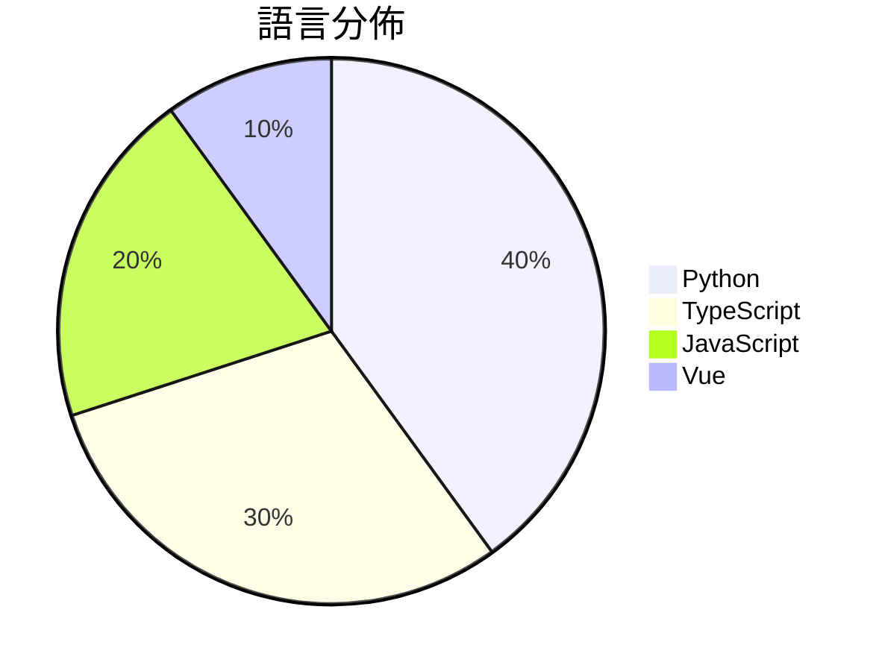

# GitHub Trending - 2026-05-28

> [!summary] 本日摘要
> 收錄 **10** 個新專案，合計 **7.7k** stars
> 語言分佈：Python (4) · TypeScript (3) · JavaScript (2) · Vue (1)

> [!tip] 本週焦點
> **[[Tong89--smartNode|Tong89/smartNode]]** — 6 天內累積 1.6k stars（264 stars/天）
> 提供天基數據回傳的可視化仿真平台，展示衛星與地面站的協同關係。



---

## 收錄列表

| # | 專案 | 分類 | Stars | 速度 | 安裝 | 語言 | 用途 |
| :--: | --- | --- | ---: | ---: | --- | --- | --- |
| 1 | [[Tong89--smartNode\|Tong89/smartNode]] | 其他 | 1.6k | 264/天 | `medium` | Python | 提供天基數據回傳的可視化仿真平台，展示衛星與地面站的協同關係。 |
| 2 | [[open-gsd--get-shit-done-redux\|open-gsd/get-shit-done-redux]] | 開發工具 | 1.3k | 269/天 | `easy` | JavaScript | 幫助小型團隊和獨立開發者高效管理 AI 開發過程的工具。 |
| 3 | [[run-liyi--wechatpay\|run-liyi/wechatpay]] | 其他 | 1.1k | 176/天 | `easy` | JavaScript | 提供微信账单的可视化分析，帮助用户了解消费习惯和财务状况。 |
| 4 | [[MoonshotAI--kimi-code\|MoonshotAI/kimi-code]] | 開發工具 | 889 | 178/天 | `easy` | TypeScript | 提供一個 AI 編碼代理，能在終端中讀取和編輯代碼、執行命令。 |
| 5 | [[0xSero--codex-shim\|0xSero/codex-shim]] | 開發工具 | 659 | 132/天 | `medium` | Python | 讓 Codex Desktop 能夠使用自訂模型，並可選擇性接入 ChatGPT |
| 6 | [[study8677--awesome-architecture\|study8677/awesome-architecture]] | 開發工具 | 569 | 142/天 | `easy` | Vue | 幫助開發者從架構思維出發，設計高效系統的開源知識庫。 |
| 7 | [[zhaoyue4810--pianke\|zhaoyue4810/pianke]] | 其他 | 502 | 100/天 | `medium` | Python | 讓 AI 協助初篩與分組，把最終的審美決定權留給自己。 |
| 8 | [[XingYu-Zhong--DeepSeek-GUI\|XingYu-Zhong/DeepSeek-GUI]] | 開發工具 | 421 | 70/天 | `medium` | TypeScript | 提供一個圖形化的 AI agent 工作空間，讓開發者能夠更方便地使用 Deep |
| 9 | [[nv-tlabs--PiD\|nv-tlabs/PiD]] | AI/ML | 371 | 53/天 | `easy` | Python | 提供快速且高解析度的潛在解碼，將潛在表示直接轉換為超解析度像素。 |
| 10 | [[UditAkhourii--adhd\|UditAkhourii/adhd]] | AI/ML | 354 | 177/天 | `easy` | TypeScript | 提供一種創新的思維技能，幫助編碼代理進行多元思考與創意發想。 |

---

## 重點摘要

### 1. [[Tong89--smartNode|Tong89/smartNode]] `其他`

> 提供天基數據回傳的可視化仿真平台，展示衛星與地面站的協同關係。

**1.6k** stars · **264** stars/天 · Python · `medium`

_建立 6 天就累積 1581 stars（264/天），forks 134（8.5%），這顯示出其在特定社群中的快速增長。作者 Tong89 和其他貢獻者在開源社群中有一定的影響力，這個專案填補了天基數據回傳仿真平台的空白，之前類似的工具往往缺乏可視化和易用的 API。這個專案的推出可能受到了一些技術論壇的討論推動，讓更多人注意到這個解決方案。其開放的 API 設計和無需密碼的特性，讓用戶能夠輕鬆上手，這在目前的開發生態中是相對少見的。forks/stars 比率為 8.5%，顯示出有相當一部分用戶在積極修改和使用這個專案。_

---

### 2. [[open-gsd--get-shit-done-redux|open-gsd/get-shit-done-redux]] `開發工具`

> 幫助小型團隊和獨立開發者高效管理 AI 開發過程的工具。

**1.3k** stars · **269** stars/天 · JavaScript · `easy`

_建立 5 天內累積 1344 stars（269/天），forks 77（5.7%），顯示出強勁的增長潛力。這個專案由 open-gsd 團隊維護，解決了 AI 開發中上下文管理的痛點，特別是在多代理協作的情境下。過去的解決方案往往無法有效處理上下文膨脹問題，導致質量下降。近期的社群討論和安全審計報告也提高了使用者的信心，進一步推動了專案的關注度。這個工具的出現正好契合了當前對於高效 AI 開發流程的需求，並且其設計理念也反映了開源社群對於可持續發展的重視。_

---

### 3. [[run-liyi--wechatpay|run-liyi/wechatpay]] `其他`

> 提供微信账单的可视化分析，帮助用户了解消费习惯和财务状况。

**1.1k** stars · **176** stars/天 · JavaScript · `easy`

_建立 6 天就累積 1057 stars（176/天），forks 89（8.4%），顯示出穩定的增長趨勢。專案的主要貢獻者有過去的開源經驗，並且這個工具解決了用戶在分析微信支付帳單時的痛點，之前用戶多依賴手動處理數據或使用不專業的工具。最近的社交媒體討論和用戶反饋也促進了其知名度。隨著個人財務管理需求的增加，這個工具的出現正好滿足了市場的需求。forks/stars 比率為 8.4%，顯示出不少用戶對此專案有實際的修改和使用需求。_

---

### 4. [[MoonshotAI--kimi-code|MoonshotAI/kimi-code]] `開發工具`

> 提供一個 AI 編碼代理，能在終端中讀取和編輯代碼、執行命令。

**889** stars · **178** stars/天 · TypeScript · `easy`

_建立 5 天內累積 889 stars（178/天），forks 74（8.3%），顯示出強勁的增長潛力。這個專案的主要貢獻者包括多位活躍的開發者，顯示出團隊的實力。Kimi Code CLI 解決了開發者在終端中使用 AI 的痛點，之前的工具多數需要繁瑣的設置和配置，這使得 Kimi Code 的簡化安裝和使用成為一大優勢。社群中對於其功能的討論和需求也促進了其快速發展，特別是對於支持多種功能的需求。_

---

### 5. [[0xSero--codex-shim|0xSero/codex-shim]] `開發工具`

> 讓 Codex Desktop 能夠使用自訂模型，並可選擇性接入 ChatGPT 的 GPT-5.5。

**659** stars · **132** stars/天 · Python · `medium`

_建立 5 天內累積 659 stars（132/天），forks 57（8.6%），這顯示出不錯的增長潛力。作者 0xSero 和其他貢獻者在開源社群中有一定的影響力，之前的專案也獲得過關注。這個工具解決了 Codex Desktop 使用自訂模型的痛點，之前用戶需要手動配置或重建 Codex，這樣的流程繁瑣且容易出錯。近期的社群討論和需求推動了這個工具的開發，特別是在模型多樣性和使用便利性上。高 forks/stars 比率顯示出許多用戶對這個工具的實際修改和使用，顯示出其在社群中的活躍度。_

---

### 6. [[study8677--awesome-architecture|study8677/awesome-architecture]] `開發工具`

> 幫助開發者從架構思維出發，設計高效系統的開源知識庫。

**569** stars · **142** stars/天 · Vue · `easy`

_建立 4 天內累積 569 stars（142/天），forks 55（9.7%），這顯示出強烈的社群需求。作者 study8677 專注於架構設計，過去有多個相關專案，這個工具填補了開發者在架構設計上的知識空白。隨著 AI 和自動化技術的興起，開發者越來越需要理解系統架構而非僅僅編寫代碼，這使得該專案的價值愈加凸顯。社群的反饋和需求促進了這個專案的快速增長，特別是在技術面試和系統設計的背景下。forks/stars 比率接近 10%，顯示出許多人對此專案的實際修改和使用。_

---

### 7. [[zhaoyue4810--pianke|zhaoyue4810/pianke]] `其他`

> 讓 AI 協助初篩與分組，把最終的審美決定權留給自己。

**502** stars · **100** stars/天 · Python · `medium`

_建立 5 天就累積 502 stars（100/天），forks 111（22.1%），這顯示出其在攝影社群中的快速擴散。作者 zhaoyue4810 之前有其他開源專案，這次針對攝影選片的需求提供了一個本地化的解決方案，解決了許多攝影師在選片過程中需要上傳照片到雲端的隱私問題。此專案的推出正好滿足了對於本地化工具的需求，尤其是在隱私保護日益受到重視的當下。forks/stars 比率高達 22.1%，顯示有許多用戶在實際修改和使用這個工具。_

---

### 8. [[XingYu-Zhong--DeepSeek-GUI|XingYu-Zhong/DeepSeek-GUI]] `開發工具`

> 提供一個圖形化的 AI agent 工作空間，讓開發者能夠更方便地使用 DeepSeek 模型進行代碼編寫和自動化任務。

**421** stars · **70** stars/天 · TypeScript · `medium`

_建立 6 天就累積 421 stars（70/天），forks 33（7.8%），顯示出強勁的增長潛力。作者 XingYu-Zhong 之前在 DeepSeek TUI 的開發上已有經驗，這使得他能夠針對開發者需求設計出更友好的 GUI。這個工具解決了開發者在使用 DeepSeek 模型時，缺乏直觀操作界面的痛點，之前的解決方案多數依賴終端操作，使用不便。近期的社群討論和需求也促進了這個專案的快速發展。技術上，Electron 框架的選擇使得跨平台支持變得容易，這是許多開發者所需要的功能。forks/stars 比率為 7.8%，顯示出有相當比例的用戶在實際修改和使用這個工具。_

---

### 9. [[nv-tlabs--PiD|nv-tlabs/PiD]] `AI/ML`

> 提供快速且高解析度的潛在解碼，將潛在表示直接轉換為超解析度像素。

**371** stars · **53** stars/天 · Python · `easy`

_建立 7 天內累積 371 stars（53/天），forks 13（3.5%），這顯示出穩定的增長趨勢。這個專案由 NVIDIA 團隊開發，專注於高解析度圖像生成，解決了傳統 VAE/RAE 解碼器在效率和質量上的不足。PiD 的推出正好填補了市場對於快速且高質量圖像生成工具的需求，特別是在當前深度學習技術快速演進的背景下。這個工具的受歡迎程度也可能受到社群分享和討論的推動，尤其是在 AI 和圖像生成領域的專業論壇上。forks/stars 比率顯示出使用者對這個工具的實際修改和使用意圖，這意味著有不少開發者在積極探索和實驗這個新工具。_

---

### 10. [[UditAkhourii--adhd|UditAkhourii/adhd]] `AI/ML`

> 提供一種創新的思維技能，幫助編碼代理進行多元思考與創意發想。

**354** stars · **177** stars/天 · TypeScript · `easy`

_建立 2 天內累積 354 stars（177/天），forks 16（4.5%），顯示出強勁的增長潛力。作者 Udit Akhouri 之前在 AI 代理領域有過多項研究，這個專案解決了傳統推理模型在創意生成過程中的收斂問題，讓使用者能夠在多元思維中找到最佳解決方案。近期的推廣活動和社群討論也使得這個專案受到關注，特別是在創意和跨學科合作的需求上。高達 4.5% 的 forks/stars 比率顯示出使用者對這個工具的實際修改和應用意願。_

---

## 今日到期複習

> [!tip] 根據間隔複習排程，今天該回顧的專案

```dataview
TABLE
  stars_per_day AS "Stars/天",
  category AS "分類",
  engagement AS "參與度"
FROM "Repos"
WHERE next_review AND date(next_review) <= date("2026-05-28") AND status != "archived"
SORT priority DESC
```

## 待處理

```dataviewjs
const pending = dv.pages('"Repos"').where(p => p.status === "to-review").length;
const unrated = dv.pages('"Repos"').where(p => p.status !== "archived" && p.status !== "to-review" && (p.my_rating || 0) === 0).length;
const noVerdict = dv.pages('"Repos"').where(p => p.status !== "archived" && (p.my_rating || 0) > 0 && (!p.verdict || p.verdict === "")).length;
const items = [];
if (pending > 0) items.push(`**${pending}** 個待分流`);
if (unrated > 0) items.push(`**${unrated}** 個已讀但未評分`);
if (noVerdict > 0) items.push(`**${noVerdict}** 個已評分但無結論`);
if (items.length > 0) dv.paragraph(items.join(" / "));
else dv.paragraph("所有專案都已處理完畢！");
```
