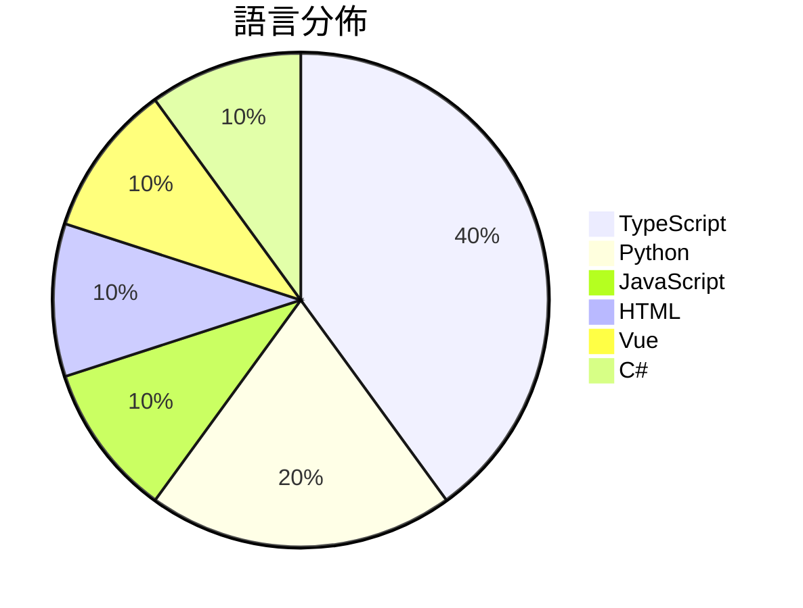

# GitHub Trending - 2026-05-29

> [!summary] 本日摘要
> 收錄 **10** 個新專案，合計 **8.4k** stars
> 語言分佈：TypeScript (4) · Python (2) · JavaScript (1) · HTML (1) · Vue (1) · C# (1)

> [!tip] 本週焦點
> **[[open-gsd--get-shit-done-redux|open-gsd/get-shit-done-redux]]** — 6 天內累積 1.6k stars（263 stars/天）
> 幫助開發者高效管理 AI 開發過程，減少上下文混亂和質量下降。



---

## 收錄列表

| # | 專案 | 分類 | Stars | 速度 | 安裝 | 語言 | 用途 |
| :--: | --- | --- | ---: | ---: | --- | --- | --- |
| 1 | [[open-gsd--get-shit-done-redux\|open-gsd/get-shit-done-redux]] | 開發工具 | 1.6k | 263/天 | `easy` | JavaScript | 幫助開發者高效管理 AI 開發過程，減少上下文混亂和質量下降。 |
| 2 | [[OpenBMB--PilotDeck\|OpenBMB/PilotDeck]] | 生產力 | 1.5k | 254/天 | `easy` | TypeScript | 一個以任務為導向的 AI 代理生產力平台，重新定義操作邊界與記憶演進。 |
| 3 | [[MoonshotAI--kimi-code\|MoonshotAI/kimi-code]] | 開發工具 | 1.2k | 208/天 | `easy` | TypeScript | 提供一個 AI 編碼代理，能在終端機中讀取和編輯代碼，執行命令並根據反饋選擇下一 |
| 4 | [[op7418--guizang-social-card-skill\|op7418/guizang-social-card-skill]] | 開發工具 | 783 | 783/天 | `easy` | HTML | 生成小紅書和微信封面的圖文卡片，適合多種社交媒體需求。 |
| 5 | [[study8677--awesome-architecture\|study8677/awesome-architecture]] | 開發工具 | 727 | 145/天 | `easy` | Vue | 幫助開發者從架構思維出發，設計系統而非僅僅寫程式碼。 |
| 6 | [[0xSero--codex-shim\|0xSero/codex-shim]] | 開發工具 | 703 | 117/天 | `medium` | Python | 讓 Codex Desktop 能夠使用自帶的 BYOK 模型，並選擇性地透過  |
| 7 | [[zhaoyue4810--pianke\|zhaoyue4810/pianke]] | 其他 | 525 | 88/天 | `medium` | Python | 讓 AI 協助攝影師快速篩選和分組照片，提升選片效率。 |
| 8 | [[UditAkhourii--adhd\|UditAkhourii/adhd]] |  | 468 | 156/天 |  | TypeScript | ADHD — a skill for coding agents. Tree-o |
| 9 | [[harrietteehisqu7759383--kms-pico-latest-april-2026\|harrietteehisqu7759383/kms-pico-latest-april-2026]] | 開發工具 | 447 | 149/天 | `easy` | C# | 提供安全的教育工具包，幫助理解 KMS 激活機制，專為實驗室環境設計。 |
| 10 | [[alfiyahkamilah1239298--WallpaperDownloader-26\|alfiyahkamilah1239298/WallpaperDownloader-26]] | 開發工具 | 398 | 398/天 | `medium` | TypeScript | 提供一個全面的社群工具包，用於組織、創建和管理動態桌布專案，提升你的 Wallp |

---

## 重點摘要

### 1. [[open-gsd--get-shit-done-redux|open-gsd/get-shit-done-redux]] `開發工具`

> 幫助開發者高效管理 AI 開發過程，減少上下文混亂和質量下降。

**1.6k** stars · **263** stars/天 · JavaScript · `easy`

_建立 6 天內累積 1576 stars（263/天），forks 87（5.5%），顯示出穩定的增長。專案的主要貢獻者來自於開源社群，並且有過去的成功經驗。這個工具解決了 AI 開發中上下文混亂的問題，之前的解決方案往往無法有效管理上下文，導致質量下降。社群的活躍度和持續的開發更新也吸引了更多使用者的關注。_

---

### 2. [[OpenBMB--PilotDeck|OpenBMB/PilotDeck]] `生產力`

> 一個以任務為導向的 AI 代理生產力平台，重新定義操作邊界與記憶演進。

**1.5k** stars · **254** stars/天 · TypeScript · `easy`

_建立 6 天內累積 1524 stars（254/天），forks 120（7.9%），顯示出強勁的社群反響。開發者來自清華大學和其他知名機構，這增強了專案的可信度。PilotDeck 解決了以往 AI 代理在多專案管理上的痛點，特別是記憶的可追蹤性和任務的成本控制，這在當前的 AI 生態中是相對缺乏的。社群的活躍度和開源的透明性也吸引了更多開發者的參與。最近的推文和討論進一步提升了其曝光率。_

---

### 3. [[MoonshotAI--kimi-code|MoonshotAI/kimi-code]] `開發工具`

> 提供一個 AI 編碼代理，能在終端機中讀取和編輯代碼，執行命令並根據反饋選擇下一步。

**1.2k** stars · **208** stars/天 · TypeScript · `easy`

_建立 6 天內累積 1245 stars（208/天），forks 104（8.4%），顯示出良好的增長潛力。這個專案由 MoonshotAI 團隊開發，專注於提供一個高效的 AI 編碼代理，解決了傳統 IDE 中缺乏自動化和智能化的痛點。之前的解決方案多依賴於繁瑣的設置和配置，Kimi Code 則以簡單的安裝和快速的啟動時間為賣點。社群的反饋和需求也促進了這個專案的快速迭代，特別是在功能擴展方面。_

---

### 4. [[op7418--guizang-social-card-skill|op7418/guizang-social-card-skill]] `開發工具`

> 生成小紅書和微信封面的圖文卡片，適合多種社交媒體需求。

**783** stars · **783** stars/天 · HTML · `easy`

_建立 1 天就累積 783 stars（783/天），forks 101（12.9%），顯示出強烈的需求和使用興趣。這個專案的作者在設計上解決了社交媒體內容生成的痛點，特別是在視覺設計和排版方面，提供了一個簡單的解決方案。之前的工具往往需要較高的設置成本或不夠靈活，而這個專案則通過簡化流程來提高效率。社交媒體內容的需求持續增長，這使得這個工具在市場上具備了良好的發展潛力。_

---

### 5. [[study8677--awesome-architecture|study8677/awesome-architecture]] `開發工具`

> 幫助開發者從架構思維出發，設計系統而非僅僅寫程式碼。

**727** stars · **145** stars/天 · Vue · `easy`

_建立 5 天就累積 727 stars（145/天），forks 75（10.3%），顯示出良好的增長潛力。專案的作者 study8677 之前的工作主要集中在架構設計和開源教育，這個專案填補了開發者在架構思維方面的空白。隨著 AI 和自動化技術的興起，開發者需要更強的架構設計能力來應對快速變化的技術環境。這個專案的推出正好符合這一需求，並且在社群中引發了廣泛的討論和興趣。高 forks/stars 比率（10.3%）表明許多人在實際使用和修改這個專案，顯示出其實用性。_

---

### 6. [[0xSero--codex-shim|0xSero/codex-shim]] `開發工具`

> 讓 Codex Desktop 能夠使用自帶的 BYOK 模型，並選擇性地透過 ChatGPT GPT-5.5 進行請求。

**703** stars · **117** stars/天 · Python · `medium`

_建立 6 天就累積 703 stars（117/天），forks 59（8.4%），顯示出穩定的增長。作者 0xSero 和其他貢獻者在開源社群中有一定的知名度，這個專案解決了 Codex Desktop 使用自定義模型的痛點，之前的解決方案往往需要重建或複雜的配置。近期的推文和社群討論也引發了對此工具的關注，特別是在開發者中。技術上，aiohttp 的使用使得這個工具能夠輕量且高效地處理請求，適合多平台使用。forks/stars 比率顯示出有相當比例的用戶在積極修改和使用此工具。_

---

### 7. [[zhaoyue4810--pianke|zhaoyue4810/pianke]] `其他`

> 讓 AI 協助攝影師快速篩選和分組照片，提升選片效率。

**525** stars · **88** stars/天 · Python · `medium`

_建立 6 天內累積 525 stars（87.5/天），forks 122（23.2%），這顯示出強烈的社群參與度。作者 zhaoyue4810 之前有其他開源專案，這個專案解決了攝影師在選片過程中的繁瑣問題，提供了一個高效的本地解決方案。近期可能因為社群的討論或需求增加而受到關注。高於 20% 的 forks/stars 比率表示許多人在實際修改和使用這個工具。_

---

### 8. [[UditAkhourii--adhd|UditAkhourii/adhd]]

**468** stars · **156** stars/天 · TypeScript

---

### 9. [[harrietteehisqu7759383--kms-pico-latest-april-2026|harrietteehisqu7759383/kms-pico-latest-april-2026]] `開發工具`

> 提供安全的教育工具包，幫助理解 KMS 激活機制，專為實驗室環境設計。

**447** stars · **149** stars/天 · C# · `easy`

_建立 3 天就累積 447 stars（149/天），forks 0（0.0%），這顯示出初期的關注度。作者 harrietteehisqu7759383 似乎專注於教育和安全領域，這個工具包填補了教育機構和 IT 專業人士在 KMS 激活研究中的需求。此工具包的推出可能受到對安全審計需求增加的影響，尤其是在教育環境中。由於目前的 forks/stars 比率為 0%，顯示出使用者尚未進行實際修改，這可能意味著目前還在觀望階段。_

---

### 10. [[alfiyahkamilah1239298--WallpaperDownloader-26|alfiyahkamilah1239298/WallpaperDownloader-26]] `開發工具`

> 提供一個全面的社群工具包，用於組織、創建和管理動態桌布專案，提升你的 Wallpaper Engine 體驗。

**398** stars · **398** stars/天 · TypeScript · `medium`

_建立 1 天就累積 398 stars（398/天），forks 0（0.0%），顯示出強烈的初期興趣。作者 alfiyahkamilah1239298 是一位活躍的開發者，這個專案填補了動態桌布創作中缺乏結構化管理工具的空白。之前的解決方案往往缺乏標準化，導致用戶在創作過程中面臨困難。這個工具包的推出正好解決了這些痛點，並且因為其社群驅動的特性，未來可能會吸引更多的貢獻者。_

---

## 今日到期複習

> [!tip] 根據間隔複習排程，今天該回顧的專案

```dataview
TABLE
  stars_per_day AS "Stars/天",
  category AS "分類",
  engagement AS "參與度"
FROM "Repos"
WHERE next_review AND date(next_review) <= date("2026-05-29") AND status != "archived"
SORT priority DESC
```

## 待處理

```dataviewjs
const pending = dv.pages('"Repos"').where(p => p.status === "to-review").length;
const unrated = dv.pages('"Repos"').where(p => p.status !== "archived" && p.status !== "to-review" && (p.my_rating || 0) === 0).length;
const noVerdict = dv.pages('"Repos"').where(p => p.status !== "archived" && (p.my_rating || 0) > 0 && (!p.verdict || p.verdict === "")).length;
const items = [];
if (pending > 0) items.push(`**${pending}** 個待分流`);
if (unrated > 0) items.push(`**${unrated}** 個已讀但未評分`);
if (noVerdict > 0) items.push(`**${noVerdict}** 個已評分但無結論`);
if (items.length > 0) dv.paragraph(items.join(" / "));
else dv.paragraph("所有專案都已處理完畢！");
```
