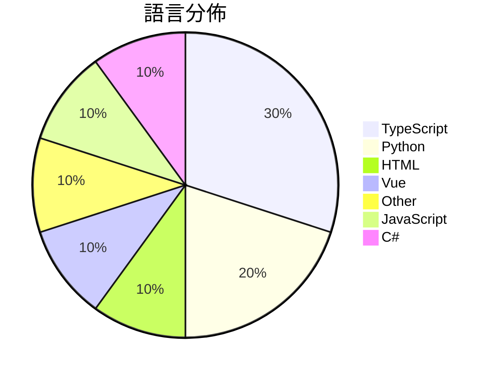

# GitHub Trending - 2026-05-30

> [!summary] 本日摘要
> 收錄 **10** 個新專案，合計 **5.9k** stars
> 語言分佈：TypeScript (3) · Python (2) · HTML (1) · Vue (1) · Other (1) · JavaScript (1) · C# (1)

> [!tip] 本週焦點
> **[[op7418--guizang-social-card-skill|op7418/guizang-social-card-skill]]** — 2 天內累積 1.2k stars（584 stars/天）
> 自動生成小紅書和微信封面的圖文卡片，讓內容創作者輕鬆製作精美的社交媒體內容。



---

## 收錄列表

| # | 專案 | 分類 | Stars | 速度 | 安裝 | 語言 | 用途 |
| :--: | --- | --- | ---: | ---: | --- | --- | --- |
| 1 | [[op7418--guizang-social-card-skill\|op7418/guizang-social-card-skill]] | 開發工具 | 1.2k | 584/天 | `easy` | HTML | 自動生成小紅書和微信封面的圖文卡片，讓內容創作者輕鬆製作精美的社交媒體內容。 |
| 2 | [[study8677--awesome-architecture\|study8677/awesome-architecture]] | 開發工具 | 817 | 136/天 | `easy` | Vue | 幫助開發者從架構思維出發，設計出可擴展的系統架構。 |
| 3 | [[helloianneo--ian-xiaohei-illustrations\|helloianneo/ian-xiaohei-illustrations]] | AI/ML | 817 | 409/天 | `easy` | N/A | 生成中文文章的手绘配图，讓 AI 不只是配圖，而是具體表達文章中的關鍵認知。 |
| 4 | [[UditAkhourii--adhd\|UditAkhourii/adhd]] |  | 516 | 129/天 |  | TypeScript | ADHD — a skill for coding agents. Tree-o |
| 5 | [[withkynam--vibecode-pro-max-kit\|withkynam/vibecode-pro-max-kit]] | 開發工具 | 507 | 254/天 | `easy` | JavaScript | 提供 AI 編碼代理的上下文記憶，幫助開發者自動化開發流程，避免上下文遺失。 |
| 6 | [[harrietteehisqu7759383--kms-pico-latest-april-2026\|harrietteehisqu7759383/kms-pico-latest-april-2026]] | 教育資源 | 449 | 112/天 | `medium` | C# | 提供安全的教育工具包，幫助理解 KMS 激活機制，專為實驗室環境設計。 |
| 7 | [[Michaelliv--pi-dynamic-workflows\|Michaelliv/pi-dynamic-workflows]] | 開發工具 | 436 | 436/天 | `easy` | TypeScript | 提供 Claude-Code 風格的動態工作流程，讓多個子代理協同處理任務。 |
| 8 | [[baoweise-bot--aimili-vpngate\|baoweise-bot/aimili-vpngate]] | 基礎設施 | 401 | 100/天 | `easy` | Python | 提供 Linux VPS 使用干净 IP 的智能 VPN 代理管理工具。 |
| 9 | [[alfiyahkamilah1239298--WallpaperDownloader-26\|alfiyahkamilah1239298/WallpaperDownloader-26]] | 開發工具 | 400 | 400/天 | `medium` | TypeScript | 提供一套完整的社群工具包，幫助用戶組織、創建和管理動態壁紙專案，提升 Wallp |
| 10 | [[FlashML-org--flashlib\|FlashML-org/flashlib]] | AI/ML | 392 | 131/天 | `easy` | Python | 提供快速且記憶體高效的傳統機器學習運算元。 |

---

## 重點摘要

### 1. [[op7418--guizang-social-card-skill|op7418/guizang-social-card-skill]] `開發工具`

> 自動生成小紅書和微信封面的圖文卡片，讓內容創作者輕鬆製作精美的社交媒體內容。

**1.2k** stars · **584** stars/天 · HTML · `easy`

_建立 2 天就累積 1168 stars（584/天），forks 134（11.5%），這顯示出強烈的興趣和需求。作者 op7418 之前有其他成功的專案，這次專注於社交媒體內容生成，解決了許多內容創作者面臨的設計困難。這個工具的出現恰逢社交媒體內容需求激增，尤其是在小紅書和微信等平台上，讓用戶能夠快速生成高品質的圖文內容。forks/stars 比率 11.5% 表示有相當一部分用戶在積極修改和使用這個工具，顯示出其實用性和可擴展性。_

---

### 2. [[study8677--awesome-architecture|study8677/awesome-architecture]] `開發工具`

> 幫助開發者從架構思維出發，設計出可擴展的系統架構。

**817** stars · **136** stars/天 · Vue · `easy`

_建立 6 天內累積 817 stars（136/天），forks 83（10.2%），這顯示出相對活躍的興趣。作者 study8677 專注於架構設計，過去有多個相關專案，這個專案解決了開發者在架構思維上的需求，特別是在 AI 逐漸取代編碼的背景下，架構設計的能力變得愈加重要。社群對於架構設計的需求不斷上升，這個工具正好填補了這一空白。最近的推廣活動和社群討論也可能促進了其快速增長。_

---

### 3. [[helloianneo--ian-xiaohei-illustrations|helloianneo/ian-xiaohei-illustrations]] `AI/ML`

> 生成中文文章的手绘配图，讓 AI 不只是配圖，而是具體表達文章中的關鍵認知。

**817** stars · **409** stars/天 · N/A · `easy`

_建立 2 天就累積 817 stars（409/天），forks 74（9.1%），顯示出強烈的使用需求。作者 Ian 是一位產品設計師，專注於 AI 相關的工具開發，這個專案解決了中文內容創作者在插圖生成上的痛點，提供了一個針對性強的解決方案。近期的社交媒體討論和對手繪風格的需求上升，可能也促進了這個專案的曝光和使用。_

---

### 4. [[UditAkhourii--adhd|UditAkhourii/adhd]]

**516** stars · **129** stars/天 · TypeScript

---

### 5. [[withkynam--vibecode-pro-max-kit|withkynam/vibecode-pro-max-kit]] `開發工具`

> 提供 AI 編碼代理的上下文記憶，幫助開發者自動化開發流程，避免上下文遺失。

**507** stars · **254** stars/天 · JavaScript · `easy`

_建立 2 天就累積 507 stars（254/天），forks 126（24.9%），這顯示出強烈的社群關注。作者 withkynam 是一位專注於 AI 代理開發的工程師，過去在多個開源專案中有豐富經驗。這個專案解決了 AI 編碼過程中上下文遺失的問題，這在目前的 AI 工具中仍然是一個未被充分解決的痛點。隨著開發者對於自動化和上下文管理的需求增加，這個專案的出現正好填補了這一空白。forks/stars 比率接近 25%，顯示出許多開發者對於這個工具的實際修改和使用。_

---

### 6. [[harrietteehisqu7759383--kms-pico-latest-april-2026|harrietteehisqu7759383/kms-pico-latest-april-2026]] `教育資源`

> 提供安全的教育工具包，幫助理解 KMS 激活機制，專為實驗室環境設計。

**449** stars · **112** stars/天 · C# · `medium`

_建立 4 天就累積 449 stars（112/天），forks 0（0.0%），顯示出初期的關注度。作者 harrietteehisqu7759383 似乎專注於教育和安全領域，這個工具包解決了在安全環境中學習 KMS 激活的需求，之前的方案往往缺乏結構化的學習資源。沒有明顯的觸發事件，但這個工具的推出正好符合對安全和合規性日益增長的需求。forks/stars 比率為 0% 代表目前的使用者尚未進行實際修改，可能是因為這是一個新專案，使用者仍在評估其價值。_

---

### 7. [[Michaelliv--pi-dynamic-workflows|Michaelliv/pi-dynamic-workflows]] `開發工具`

> 提供 Claude-Code 風格的動態工作流程，讓多個子代理協同處理任務。

**436** stars · **436** stars/天 · TypeScript · `easy`

_建立 1 天就累積 436 stars（436/天），forks 19（4.4%），這顯示出強烈的初始興趣。作者 Michaelliv 之前的作品可能在開源社群中有一定的影響力，這個專案解決了在 Pi 環境中動態管理多任務的需求，這在現有工具中並不常見。技術上，這個工具利用了 JavaScript 的靈活性來實現工作流程的動態生成，並且在多個子代理之間進行任務分配，這是傳統單一代理模型所無法比擬的。社群的反饋和需求驅動了這個專案的快速成長。_

---

### 8. [[baoweise-bot--aimili-vpngate|baoweise-bot/aimili-vpngate]] `基礎設施`

> 提供 Linux VPS 使用干净 IP 的智能 VPN 代理管理工具。

**401** stars · **100** stars/天 · Python · `easy`

_建立 4 天內累積 401 stars（100/天），forks 156（38.9%），顯示出強烈的社群興趣。作者 baoweise-bot 是一位專注於開源工具的開發者，這個專案解決了用戶在使用 VPN 時常遇到的 IP 被鎖定問題，之前的解決方案往往無法有效管理多個 VPN 節點。最近的推廣活動和社群討論也促進了這個專案的曝光率。隨著 VPN 需求的增加，這個工具的實用性和便利性使其成為一個受歡迎的選擇。forks/stars 比率高達 38.9%，顯示出許多人在實際修改和使用這個專案。_

---

### 9. [[alfiyahkamilah1239298--WallpaperDownloader-26|alfiyahkamilah1239298/WallpaperDownloader-26]] `開發工具`

> 提供一套完整的社群工具包，幫助用戶組織、創建和管理動態壁紙專案，提升 Wallpaper Engine 使用體驗。

**400** stars · **400** stars/天 · TypeScript · `medium`

_建立 1 天就累積 400 stars（400/天），forks 0（0.0%），這顯示出強烈的初期興趣。作者 alfiyahkamilah1239298 是這個專案的主要貢獻者，這個工具解決了動態壁紙專案管理的複雜性，提供了一個標準化的框架，讓創作者能更有效率地進行開發。這樣的需求在社群中一直存在，但以往缺乏一個全面的解決方案。此專案的推出正好填補了這一空白，並且其開源性質吸引了許多創作者的注意。_

---

### 10. [[FlashML-org--flashlib|FlashML-org/flashlib]] `AI/ML`

> 提供快速且記憶體高效的傳統機器學習運算元。

**392** stars · **131** stars/天 · Python · `easy`

_建立 3 天就累積 392 stars（131/天），forks 21（5.4%），這顯示出相對穩定的關注度。作者 Shuo Yang 來自伯克利，過去在機器學習領域有豐富經驗。這個專案解決了傳統機器學習運算元在 GPU 加速方面的不足，讓使用者能夠在大資料集上進行更快速的運算。近期的推文和討論也引起了對此專案的注意，特別是在學術界和研究領域。技術上，NVIDIA 的 GPU 和 Triton 的結合使得這個庫在性能上具有優勢，特別是在計算密集型的任務中。forks/stars 比率相對較低，顯示出使用者對於這個專案的實際修改和應用仍在觀望中。_

---

## 今日到期複習

> [!tip] 根據間隔複習排程，今天該回顧的專案

```dataview
TABLE
  stars_per_day AS "Stars/天",
  category AS "分類",
  engagement AS "參與度"
FROM "Repos"
WHERE next_review AND date(next_review) <= date("2026-05-30") AND status != "archived"
SORT priority DESC
```

## 待處理

```dataviewjs
const pending = dv.pages('"Repos"').where(p => p.status === "to-review").length;
const unrated = dv.pages('"Repos"').where(p => p.status !== "archived" && p.status !== "to-review" && (p.my_rating || 0) === 0).length;
const noVerdict = dv.pages('"Repos"').where(p => p.status !== "archived" && (p.my_rating || 0) > 0 && (!p.verdict || p.verdict === "")).length;
const items = [];
if (pending > 0) items.push(`**${pending}** 個待分流`);
if (unrated > 0) items.push(`**${unrated}** 個已讀但未評分`);
if (noVerdict > 0) items.push(`**${noVerdict}** 個已評分但無結論`);
if (items.length > 0) dv.paragraph(items.join(" / "));
else dv.paragraph("所有專案都已處理完畢！");
```
