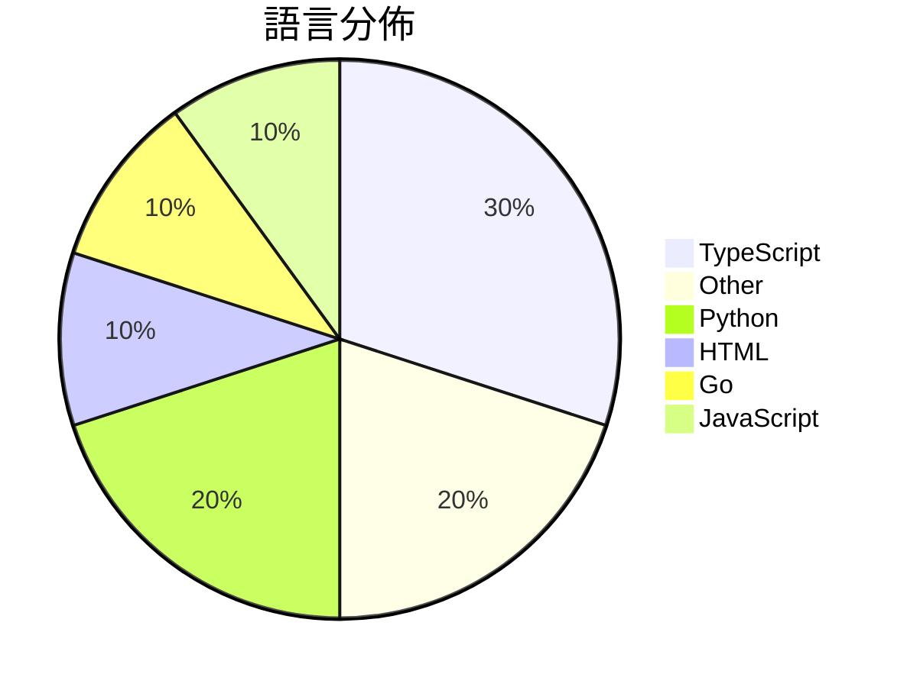

# GitHub Trending - 2026-05-31

> [!summary] 本日摘要
> 收錄 **10** 個新專案，合計 **7.0k** stars
> 語言分佈：TypeScript (3) · Other (2) · Python (2) · HTML (1) · Go (1) · JavaScript (1)

> [!tip] 本週焦點
> **[[op7418--guizang-social-card-skill|op7418/guizang-social-card-skill]]** — 3 天內累積 1.6k stars（542 stars/天）
> 自動生成小紅書圖文和微信封面，讓內容創作者輕鬆製作視覺吸引的社交媒體卡片。



---

## 收錄列表

| # | 專案 | 分類 | Stars | 速度 | 安裝 | 語言 | 用途 |
| :--: | --- | --- | ---: | ---: | --- | --- | --- |
| 1 | [[op7418--guizang-social-card-skill\|op7418/guizang-social-card-skill]] | 開發工具 | 1.6k | 542/天 | `easy` | HTML | 自動生成小紅書圖文和微信封面，讓內容創作者輕鬆製作視覺吸引的社交媒體卡片。 |
| 2 | [[helloianneo--ian-xiaohei-illustrations\|helloianneo/ian-xiaohei-illustrations]] | AI/ML | 1.1k | 378/天 | `medium` | N/A | 生成中文文章的手绘配图，讓 AI 理解並視覺化關鍵認知動作。 |
| 3 | [[UditAkhourii--adhd\|UditAkhourii/adhd]] |  | 602 | 120/天 |  | TypeScript | ADHD — a skill for coding agents. Tree-o |
| 4 | [[MatinSenPai--SenPaiScanner\|MatinSenPai/SenPaiScanner]] | 開發工具 | 595 | 298/天 | `easy` | Go | 輕量級的 Cloudflare IP 掃描工具，幫助用戶快速找到可用的 IP。 |
| 5 | [[withkynam--vibecode-pro-max-kit\|withkynam/vibecode-pro-max-kit]] | 開發工具 | 594 | 198/天 | `easy` | JavaScript | 讓 AI 記住上下文，避免忘記，並能自動化開發流程，提升團隊效率。 |
| 6 | [[Michaelliv--pi-dynamic-workflows\|Michaelliv/pi-dynamic-workflows]] | 開發工具 | 576 | 288/天 | `easy` | TypeScript | 提供 Claude-Code 風格的動態工作流程，讓 Pi 能夠並行處理多個子代 |
| 7 | [[Sophomoresty--gemini-web2api\|Sophomoresty/gemini-web2api]] | 開發工具 | 519 | 260/天 | `easy` | Python | 將 Google Gemini 網頁轉換為 OpenAI 兼容的 API，無需身 |
| 8 | [[baoweise-bot--aimili-vpngate\|baoweise-bot/aimili-vpngate]] | 基礎設施 | 512 | 102/天 | `easy` | Python | 透過 vpngate.net 提供的開放節點，讓 Linux VPS 使用乾淨  |
| 9 | [[2aronS--Duel-Agents\|2aronS/Duel-Agents]] | 開發工具 | 459 | 230/天 | `easy` | TypeScript | 提供 CLI、SDK 和 IDE 插件，讓開發者能夠輕鬆整合多個 LLM 模型並 |
| 10 | [[nv-tlabs--Gamma-World\|nv-tlabs/Gamma-World]] | AI/ML | 430 | 86/天 | `medium` | N/A | 實現一個生成式多代理世界模型，支持超過兩個玩家的互動。 |

---

## 重點摘要

### 1. [[op7418--guizang-social-card-skill|op7418/guizang-social-card-skill]] `開發工具`

> 自動生成小紅書圖文和微信封面，讓內容創作者輕鬆製作視覺吸引的社交媒體卡片。

**1.6k** stars · **542** stars/天 · HTML · `easy`

_建立 3 天就累積 1625 stars（542/天），forks 171（10.5%），這顯示出其在社群中的快速接受度。作者 op7418 之前有開發過其他相關工具，這次專注於社交媒體內容生成，解決了許多內容創作者在視覺設計上的痛點。這個工具的出現正好滿足了市場對於高效且美觀的社交媒體內容的需求。技術上，隨著 Playwright 的普及，這種無需前端構建的渲染方式也變得越來越可行。高 forks/stars 比率（10.5%）顯示出許多開發者對這個工具進行了實際修改和使用，顯示出其潛在的實用性和靈活性。_

---

### 2. [[helloianneo--ian-xiaohei-illustrations|helloianneo/ian-xiaohei-illustrations]] `AI/ML`

> 生成中文文章的手绘配图，讓 AI 理解並視覺化關鍵認知動作。

**1.1k** stars · **378** stars/天 · N/A · `medium`

_建立 3 天內累積 1133 stars（378/天），forks 93（8.2%），顯示出強烈的用戶興趣。作者 Ian 是一位產品設計師，專注於 AI 應用，這個工具解決了中文內容插圖的需求，特別是在手繪風格方面。由於目前市場上缺乏針對中文文章的專業插圖工具，這個專案填補了這一空白，吸引了大量的內容創作者。社群對於這個工具的反應熱烈，顯示出它在特定用戶群中的潛在價值。_

---

### 3. [[UditAkhourii--adhd|UditAkhourii/adhd]]

**602** stars · **120** stars/天 · TypeScript

---

### 4. [[MatinSenPai--SenPaiScanner|MatinSenPai/SenPaiScanner]] `開發工具`

> 輕量級的 Cloudflare IP 掃描工具，幫助用戶快速找到可用的 IP。

**595** stars · **298** stars/天 · Go · `easy`

_建立 2 天內累積 595 stars（298/天），forks 41（6.9%），顯示出較高的使用者興趣。作者 MatinSenPai 及其團隊在開源社群中有一定的影響力，並且這個工具解決了以往在不穩定網路環境下難以找到有效 Cloudflare IP 的問題，特別是在使用 VLESS 和 Trojan 配置時。此工具的推出正好填補了這一需求空白，並且在社群中引發了討論。_

---

### 5. [[withkynam--vibecode-pro-max-kit|withkynam/vibecode-pro-max-kit]] `開發工具`

> 讓 AI 記住上下文，避免忘記，並能自動化開發流程，提升團隊效率。

**594** stars · **198** stars/天 · JavaScript · `easy`

_建立 3 天內累積 594 stars（198/天），forks 147（24.7%），這顯示出高需求和活躍的社群參與。作者 withkynam 來自 flowser.ai，專注於 AI 代理技術，這個專案解決了開發過程中上下文遺失的問題，之前的解決方案往往無法持續保持上下文的連貫性。社群中的討論和需求推動了這個專案的快速成長，並且其設計理念符合當前 AI 開發的趨勢，讓開發者能夠更有效率地完成專案。_

---

### 6. [[Michaelliv--pi-dynamic-workflows|Michaelliv/pi-dynamic-workflows]] `開發工具`

> 提供 Claude-Code 風格的動態工作流程，讓 Pi 能夠並行處理多個子代理的任務。

**576** stars · **288** stars/天 · TypeScript · `easy`

_建立 2 天就累積 576 stars（288/天），forks 29（5%），顯示出強烈的興趣。作者 Michaelliv 是一位活躍的開發者，專注於 Pi 生態系統，這個專案解決了在多任務處理中缺乏靈活性的問題，之前的工具往往只能依賴靜態定義的工作流程。此專案的推出可能受到社群對於動態工作流需求增加的驅動，並且在 GitHub 上的討論也顯示出對於這類工具的渴望。這個工具的可行性也得益於 TypeScript 和 Node.js 的成熟生態系統，讓開發者能夠快速上手。_

---

### 7. [[Sophomoresty--gemini-web2api|Sophomoresty/gemini-web2api]] `開發工具`

> 將 Google Gemini 網頁轉換為 OpenAI 兼容的 API，無需身份驗證，跨平台，單檔案運行。

**519** stars · **260** stars/天 · Python · `easy`

_建立 2 天內累積 519 stars（260/天），forks 173（33.3%），這顯示出極高的社群關注度。作者 Sophomoresty 和其他貢獻者在開源社群中有一定的影響力，並且這個專案解決了開發者在使用 Google Gemini 時的身份驗證問題，讓開發者能夠更方便地使用其功能。這種簡化的 API 設計與當前對於快速開發的需求相吻合，吸引了大量的使用者。技術生態的變化，如對於無需身份驗證的 API 的需求增加，也使得這個工具的出現變得更加合時宜。forks/stars 比率為 33.3%，顯示出許多開發者在實際修改和使用這個工具。_

---

### 8. [[baoweise-bot--aimili-vpngate|baoweise-bot/aimili-vpngate]] `基礎設施`

> 透過 vpngate.net 提供的開放節點，讓 Linux VPS 使用乾淨 IP 出站的代理工具。

**512** stars · **102** stars/天 · Python · `easy`

_建立 5 天內累積 512 stars（102/天），forks 206（40.2%），顯示出強烈的社群參與度。作者 baoweise-bot 似乎專注於開發開源工具，這個專案解決了使用者在尋找高品質 VPN 服務時的痛點，特別是在 Linux 環境中。這個工具的出現正好填補了市場上對於自動化 VPN 節點管理的需求，並且其設計能有效避免 VPS 被鎖定的問題。社群的活躍度和高 fork 比率表明許多使用者在實際修改和使用這個工具，顯示出其實用性和需求。_

---

### 9. [[2aronS--Duel-Agents|2aronS/Duel-Agents]] `開發工具`

> 提供 CLI、SDK 和 IDE 插件，讓開發者能夠輕鬆整合多個 LLM 模型並選擇最具成本效益的回應。

**459** stars · **230** stars/天 · TypeScript · `easy`

_建立 2 天就累積 459 stars（230/天），forks 12（2.6%），這顯示出一定的關注度。作者 2aronS 是一位活躍的開發者，專注於 AI 代理的整合。這個專案解決了開發者在使用多個 LLM 模型時的複雜性，之前的解決方案往往需要手動配置和管理。近期的推廣活動和社群討論可能也促進了其曝光率。技術上，Duel Agents 利用現有的 LLM 生態系統，並提供了簡單的 API 接口，這使得它在開發者中更具吸引力。forks/stars 比率相對較低，顯示出目前大多數使用者仍在觀望階段。_

---

### 10. [[nv-tlabs--Gamma-World|nv-tlabs/Gamma-World]] `AI/ML`

> 實現一個生成式多代理世界模型，支持超過兩個玩家的互動。

**430** stars · **86** stars/天 · N/A · `medium`

_建立 5 天內累積 430 stars（86/天），forks 2（0.5%），顯示出一定的關注度。這個專案由 NVIDIA 的研究團隊開發，解決了多代理互動生成的需求，之前的模型大多集中於單代理設定，無法有效處理多代理的複雜性。最近的發佈可能引起了社群的興趣，特別是在多代理系統和機器人協調的應用領域。forks/stars 比率較低，顯示出目前大多數人仍在觀望階段。_

---

## 今日到期複習

> [!tip] 根據間隔複習排程，今天該回顧的專案

```dataview
TABLE
  stars_per_day AS "Stars/天",
  category AS "分類",
  engagement AS "參與度"
FROM "Repos"
WHERE next_review AND date(next_review) <= date("2026-05-31") AND status != "archived"
SORT priority DESC
```

## 待處理

```dataviewjs
const pending = dv.pages('"Repos"').where(p => p.status === "to-review").length;
const unrated = dv.pages('"Repos"').where(p => p.status !== "archived" && p.status !== "to-review" && (p.my_rating || 0) === 0).length;
const noVerdict = dv.pages('"Repos"').where(p => p.status !== "archived" && (p.my_rating || 0) > 0 && (!p.verdict || p.verdict === "")).length;
const items = [];
if (pending > 0) items.push(`**${pending}** 個待分流`);
if (unrated > 0) items.push(`**${unrated}** 個已讀但未評分`);
if (noVerdict > 0) items.push(`**${noVerdict}** 個已評分但無結論`);
if (items.length > 0) dv.paragraph(items.join(" / "));
else dv.paragraph("所有專案都已處理完畢！");
```
