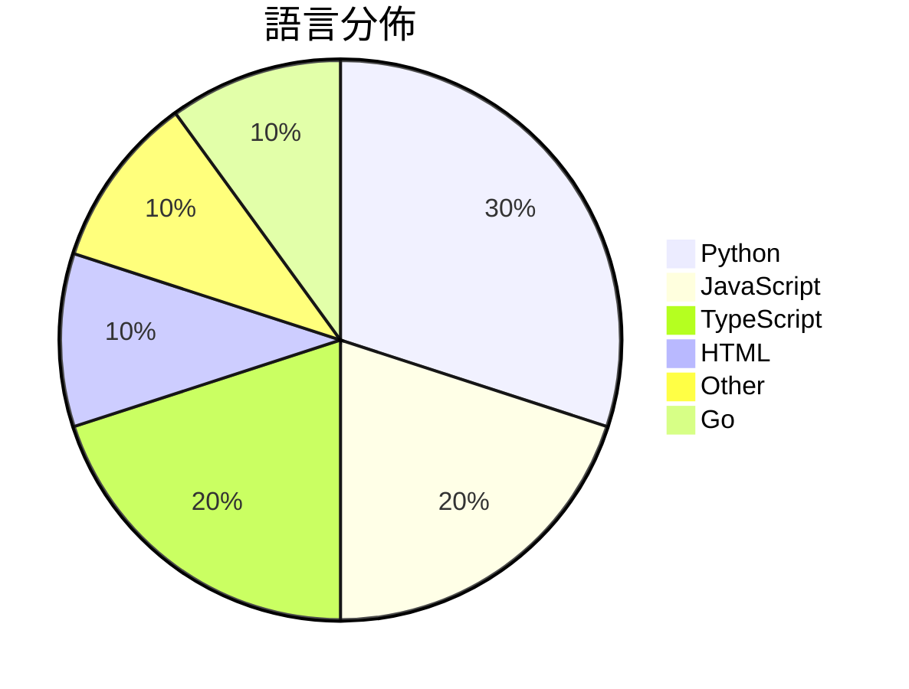

# GitHub Trending - 2026-06-01

> [!summary] 本日摘要
> 收錄 **10** 個新專案，合計 **16.8k** stars
> 語言分佈：Python (3) · JavaScript (2) · TypeScript (2) · HTML (1) · Other (1) · Go (1)

> [!tip] 本週焦點
> **[[pewdiepie-archdaemon--odysseus|pewdiepie-archdaemon/odysseus]]** — 1 天內累積 8.1k stars（8.1k stars/天）
> 提供自我托管的 AI 工作區，讓用戶在本地運行各種 AI 模型和應用。



---

## 收錄列表

| # | 專案 | 分類 | Stars | 速度 | 安裝 | 語言 | 用途 |
| :--: | --- | --- | ---: | ---: | --- | --- | --- |
| 1 | [[pewdiepie-archdaemon--odysseus\|pewdiepie-archdaemon/odysseus]] | AI/ML | 8.1k | 8.1k/天 | `medium` | JavaScript | 提供自我托管的 AI 工作區，讓用戶在本地運行各種 AI 模型和應用。 |
| 2 | [[op7418--guizang-social-card-skill\|op7418/guizang-social-card-skill]] | 開發工具 | 2.1k | 516/天 | `easy` | HTML | 自動生成小紅書和微信封面的圖文卡片，讓內容呈現更具吸引力。 |
| 3 | [[helloianneo--ian-xiaohei-illustrations\|helloianneo/ian-xiaohei-illustrations]] | AI/ML | 1.4k | 361/天 | `easy` | N/A | 生成中文文章的怪诞手绘配图，帮助视觉化抽象概念。 |
| 4 | [[Sophomoresty--gemini-web2api\|Sophomoresty/gemini-web2api]] | 開發工具 | 899 | 300/天 | `easy` | Python | 將 Google Gemini 網頁介面轉換為 OpenAI 兼容的 API，無 |
| 5 | [[GordenSun--GordenPPTSkill\|GordenSun/GordenPPTSkill]] | 生產力 | 874 | 219/天 | `medium` | Python | 提供 AI 友好的 PPT 建構工具，包含 17 種精美的中文 PPTX 模板及 |
| 6 | [[MatinSenPai--SenPaiScanner\|MatinSenPai/SenPaiScanner]] | 開發工具 | 802 | 267/天 | `easy` | Go | 一個輕量級的 Cloudflare IP 掃描器，專為連接不穩定的網絡設計。 |
| 7 | [[withkynam--vibecode-pro-max-kit\|withkynam/vibecode-pro-max-kit]] | 開發工具 | 668 | 167/天 | `easy` | JavaScript | 幫助 AI 記住上下文，讓開發者專注於交付功能而非雜亂的代碼。 |
| 8 | [[UditAkhourii--adhd\|UditAkhourii/adhd]] |  | 660 | 110/天 |  | TypeScript | ADHD — a skill for coding agents. Tree-o |
| 9 | [[baoweise-bot--aimili-vpngate\|baoweise-bot/aimili-vpngate]] | 基礎設施 | 655 | 109/天 | `easy` | Python | 提供基於 VPNGate 的高性能代理服務，讓 Linux 用戶能夠使用乾淨的  |
| 10 | [[Michaelliv--pi-dynamic-workflows\|Michaelliv/pi-dynamic-workflows]] | 開發工具 | 633 | 211/天 | `easy` | TypeScript | 提供 Claude-Code 風格的動態工作流程，讓多個子代理協同作業。 |

---

## 重點摘要

### 1. [[pewdiepie-archdaemon--odysseus|pewdiepie-archdaemon/odysseus]] `AI/ML`

> 提供自我托管的 AI 工作區，讓用戶在本地運行各種 AI 模型和應用。

**8.1k** stars · **8.1k** stars/天 · JavaScript · `medium`

_建立 1 天就累積 8074 stars（8074/天），forks 1151（14.3%），這顯示出強烈的社群興趣。作者 pewdiepie-archdaemon 是一位活躍的開發者，過去在開源社群中有良好的聲譽。Odysseus 解決了許多用戶對於 AI 模型自我托管的需求，尤其是在隱私和數據控制方面，這在現有的商業解決方案中往往無法滿足。最近的推廣活動和社群討論也促進了這個專案的曝光率。技術上，Docker 的使用讓這個工具能夠在多種環境中輕鬆部署，這也是其受歡迎的原因之一。forks/stars 比率為 14.3%，顯示出許多用戶在實際修改和使用這個專案。_

---

### 2. [[op7418--guizang-social-card-skill|op7418/guizang-social-card-skill]] `開發工具`

> 自動生成小紅書和微信封面的圖文卡片，讓內容呈現更具吸引力。

**2.1k** stars · **516** stars/天 · HTML · `easy`

_建立 4 天內累積 2062 stars（515.5/天），forks 209（10.1%），顯示出強勁的增長潛力。這個專案的作者過去有開發其他相關工具的經驗，解決了在社交媒體內容創作中缺乏高效工具的痛點。隨著小紅書和微信等平台的興起，對於高質量圖文內容的需求也在增加，這使得這個工具的出現恰逢其時。此專案的 forks/stars 比率為 10.1%，顯示出許多用戶對其有實際的修改和使用需求，這是活躍社群的指標。_

---

### 3. [[helloianneo--ian-xiaohei-illustrations|helloianneo/ian-xiaohei-illustrations]] `AI/ML`

> 生成中文文章的怪诞手绘配图，帮助视觉化抽象概念。

**1.4k** stars · **361** stars/天 · N/A · `easy`

_建立 4 天內累積 1442 stars（361/天），forks 120（8.3%），顯示出穩定的增長。作者 Ian 是一位產品設計師，專注於 AI 生成內容，這個工具解決了在中文內容創作中缺乏個性化插畫的痛點。之前的工具多數無法提供這種風格化的插畫，且通常需要較高的設計技能。這個工具的出現正好填補了這一空白，並且在社群中引起了關注。_

---

### 4. [[Sophomoresty--gemini-web2api|Sophomoresty/gemini-web2api]] `開發工具`

> 將 Google Gemini 網頁介面轉換為 OpenAI 兼容的 API，無需認證，跨平台，單檔案運行。

**899** stars · **300** stars/天 · Python · `easy`

_建立 3 天就累積 899 stars（299/天），forks 234（26.0%），這顯示出強烈的社群興趣。作者 Sophomoresty 和其他貢獻者在開源社群中有一定的影響力，這個專案解決了將 Google Gemini 轉換為 OpenAI API 的需求，之前的解決方案往往需要複雜的認證或依賴於特定的環境。這個工具的簡單性和即時性吸引了許多開發者的注意，特別是在社交媒體和開發者論壇上得到了廣泛討論。技術上，這個工具的出現是因為 Google Gemini 的 API 需求逐漸增長，而開發者希望能夠更方便地訪問這些功能。高達 26% 的 forks/stars 比率表明許多人在實際修改和使用這個工具。_

---

### 5. [[GordenSun--GordenPPTSkill|GordenSun/GordenPPTSkill]] `生產力`

> 提供 AI 友好的 PPT 建構工具，包含 17 種精美的中文 PPTX 模板及非破壞性文本編輯工具。

**874** stars · **219** stars/天 · Python · `medium`

_建立 4 天就累積 874 stars（219/天），forks 88（10.1%），這顯示出強勁的增長潛力。GordenSun 是這個專案的主要貢獻者，過去在 PPT 生成工具方面有一定的經驗。這個工具解決了傳統 PPT 工具在中國市場上模板不足和自動化程度低的痛點，特別是針對商業和學術需求。社群的反饋和活躍度也表明了用戶對這個工具的期待。技術上，這個專案利用了 Python 的強大生態系統，讓用戶能夠快速上手並生成專業的 PPT 文件。_

---

### 6. [[MatinSenPai--SenPaiScanner|MatinSenPai/SenPaiScanner]] `開發工具`

> 一個輕量級的 Cloudflare IP 掃描器，專為連接不穩定的網絡設計。

**802** stars · **267** stars/天 · Go · `easy`

_建立 3 天就累積 802 stars（267/天），forks 55（6.9%），顯示出不錯的增長潛力。作者 MatinSenPai 之前有開發其他網絡工具，這次專案解決了在不穩定網絡環境中查找可用 Cloudflare IP 的痛點，這是許多使用者在使用其他工具時常遇到的問題。社群中對於這個工具的討論也逐漸增加，特別是針對其使用的便捷性和即時結果的特性。技術上，Go 語言的選擇使得這個工具在性能和可擴展性上都有不錯的表現，這也符合當前對於輕量級工具的需求。_

---

### 7. [[withkynam--vibecode-pro-max-kit|withkynam/vibecode-pro-max-kit]] `開發工具`

> 幫助 AI 記住上下文，讓開發者專注於交付功能而非雜亂的代碼。

**668** stars · **167** stars/天 · JavaScript · `easy`

_建立 4 天就累積 668 stars（167/天），forks 160（24.0%），這顯示出強烈的社群參與度。作者 withkynam 之前有相關的 AI 開發經驗，這個專案解決了 AI 在開發過程中上下文遺忘的痛點，讓開發者能夠更有效率地完成專案。近期的推廣活動和社群討論可能也促進了這個專案的曝光率。高達 24% 的 forks/stars 比率顯示出許多開發者正在實際修改和使用這個工具，反映出其實用性和需求。_

---

### 8. [[UditAkhourii--adhd|UditAkhourii/adhd]]

**660** stars · **110** stars/天 · TypeScript

---

### 9. [[baoweise-bot--aimili-vpngate|baoweise-bot/aimili-vpngate]] `基礎設施`

> 提供基於 VPNGate 的高性能代理服務，讓 Linux 用戶能夠使用乾淨的 IP 出站。

**655** stars · **109** stars/天 · Python · `easy`

_建立 6 天就累積 655 stars（109/天），forks 239（36.5%），顯示出強勁的增長潛力。作者 baoweise-bot 是一名活躍的開發者，專注於開源工具的開發。這個專案解決了在 Linux 環境中使用 VPN 的複雜性，提供了一個簡單易用的解決方案。近期的社群討論和反饋也促進了專案的快速迭代。高比例的 forks 表示使用者對於這個工具有實際的修改需求，顯示出其在實際應用中的潛力。_

---

### 10. [[Michaelliv--pi-dynamic-workflows|Michaelliv/pi-dynamic-workflows]] `開發工具`

> 提供 Claude-Code 風格的動態工作流程，讓多個子代理協同作業。

**633** stars · **211** stars/天 · TypeScript · `easy`

_建立 3 天就累積 633 stars（211/天），forks 37（5.8%），顯示出穩定的增長。這個專案由 Michaelliv 主導，他在開源社區有一定的影響力，且過去有相關的開發經驗。它解決了傳統工作流程工具在處理多任務時的局限性，特別是在需要多角度評估和代碼審核的場景。最近的推廣活動和社群討論也可能促進了其曝光率。技術上，Node.js 和 TypeScript 的普及使得這個工具的實現變得可行，並且能夠吸引更多開發者的關注。forks/stars 比率為 5.8%，顯示出相對較高的實際使用和修改需求。_

---

## 今日到期複習

> [!tip] 根據間隔複習排程，今天該回顧的專案

```dataview
TABLE
  stars_per_day AS "Stars/天",
  category AS "分類",
  engagement AS "參與度"
FROM "Repos"
WHERE next_review AND date(next_review) <= date("2026-06-01") AND status != "archived"
SORT priority DESC
```

## 待處理

```dataviewjs
const pending = dv.pages('"Repos"').where(p => p.status === "to-review").length;
const unrated = dv.pages('"Repos"').where(p => p.status !== "archived" && p.status !== "to-review" && (p.my_rating || 0) === 0).length;
const noVerdict = dv.pages('"Repos"').where(p => p.status !== "archived" && (p.my_rating || 0) > 0 && (!p.verdict || p.verdict === "")).length;
const items = [];
if (pending > 0) items.push(`**${pending}** 個待分流`);
if (unrated > 0) items.push(`**${unrated}** 個已讀但未評分`);
if (noVerdict > 0) items.push(`**${noVerdict}** 個已評分但無結論`);
if (items.length > 0) dv.paragraph(items.join(" / "));
else dv.paragraph("所有專案都已處理完畢！");
```
