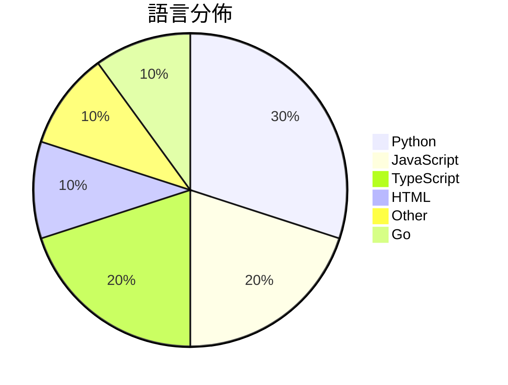

# GitHub Trending - 2026-06-02

> [!summary] 本日摘要
> 收錄 **10** 個新專案，合計 **31.4k** stars
> 語言分佈：Python (3) · JavaScript (2) · TypeScript (2) · HTML (1) · Other (1) · Go (1)

> [!tip] 本週焦點
> **[[pewdiepie-archdaemon--odysseus|pewdiepie-archdaemon/odysseus]]** — 1 天內累積 21.3k stars（21.3k stars/天）
> 提供自我託管的 AI 工作空間，讓用戶能夠在本地運行 AI 模型，並保持數據隱私。



---

## 收錄列表

| # | 專案 | 分類 | Stars | 速度 | 安裝 | 語言 | 用途 |
| :--: | --- | --- | ---: | ---: | --- | --- | --- |
| 1 | [[pewdiepie-archdaemon--odysseus\|pewdiepie-archdaemon/odysseus]] | 開發工具 | 21.3k | 21.3k/天 | `medium` | JavaScript | 提供自我託管的 AI 工作空間，讓用戶能夠在本地運行 AI 模型，並保持數據隱私 |
| 2 | [[op7418--guizang-social-card-skill\|op7418/guizang-social-card-skill]] | 開發工具 | 2.4k | 485/天 | `easy` | HTML | 自動生成小紅書和微信封面的圖文卡片，支持多種設計風格和版式。 |
| 3 | [[helloianneo--ian-xiaohei-illustrations\|helloianneo/ian-xiaohei-illustrations]] | AI/ML | 1.6k | 325/天 | `easy` | N/A | 生成中文文章的手绘配图，帮助理解关键认知点。 |
| 4 | [[GordenSun--GordenPPTSkill\|GordenSun/GordenPPTSkill]] | 生產力 | 1.4k | 285/天 | `medium` | Python | 提供 AI 友好的 PPT 建構工具，包含 17 款精緻的中文 PPTX 模板及 |
| 5 | [[Sophomoresty--gemini-web2api\|Sophomoresty/gemini-web2api]] | 開發工具 | 1.1k | 265/天 | `easy` | Python | 將 Google Gemini 網頁介面轉換為 OpenAI 兼容的 API，無 |
| 6 | [[MatinSenPai--SenPaiScanner\|MatinSenPai/SenPaiScanner]] | CLI 工具 | 857 | 214/天 | `easy` | Go | 一個輕量級的 Cloudflare IP 掃描器，幫助用戶找到可用的 Cloud |
| 7 | [[Michaelliv--pi-dynamic-workflows\|Michaelliv/pi-dynamic-workflows]] | 開發工具 | 703 | 176/天 | `easy` | TypeScript | 提供 Claude-Code 風格的動態工作流程，讓 Pi 能夠並行處理任務。 |
| 8 | [[withkynam--vibecode-pro-max-kit\|withkynam/vibecode-pro-max-kit]] | 開發工具 | 700 | 140/天 | `easy` | JavaScript | 提供一個自我改善的上下文記憶系統，幫助 AI 開發者有效管理專案與代碼。 |
| 9 | [[asz798838958--aBaiAutoplus\|asz798838958/aBaiAutoplus]] | 開發工具 | 652 | 652/天 | `medium` | Python | 自動化註冊與管理多平台 AI 帳號，並一鍵開通 ChatGPT Plus。 |
| 10 | [[2aronS--Duel-Agents\|2aronS/Duel-Agents]] | 開發工具 | 639 | 160/天 | `easy` | TypeScript | 提供 CLI、SDK 和 IDE 插件，讓開發者能夠輕鬆整合多種 LLM 模型。 |

---

## 重點摘要

### 1. [[pewdiepie-archdaemon--odysseus|pewdiepie-archdaemon/odysseus]] `開發工具`

> 提供自我託管的 AI 工作空間，讓用戶能夠在本地運行 AI 模型，並保持數據隱私。

**21.3k** stars · **21.3k** stars/天 · JavaScript · `medium`

_建立 1 天就累積 21283 stars（21283/天），forks 2599（12.2%），這顯示出極高的使用者興趣。作者 pewdiepie-archdaemon 是一個活躍的開源貢獻者，這個專案解決了自我託管 AI 工作空間的需求，以往用戶只能依賴雲端服務，無法完全掌控數據。社群的反應熱烈，尤其是對於 AI 的隱私和控制問題，這使得 Odysseus 成為一個吸引人的選擇。技術上，Odysseus 利用現有的開源庫來實現其功能，並且設計上考慮到了用戶的使用便利性。_

---

### 2. [[op7418--guizang-social-card-skill|op7418/guizang-social-card-skill]] `開發工具`

> 自動生成小紅書和微信封面的圖文卡片，支持多種設計風格和版式。

**2.4k** stars · **485** stars/天 · HTML · `easy`

_建立 5 天就累積 2423 stars（485/天），forks 245（10.1%），這顯示出此專案受到廣泛關注。作者 op7418 之前有其他相關專案，這次專注於社交媒體內容生成，解決了內容創作者在設計和排版上的痛點。這個工具的出現正好符合了市場對於高效內容生成的需求，特別是在小紅書和微信這類平台上。forks/stars 比率 10.1% 表示許多人在實際修改和使用這個工具，顯示出其實用性和需求。_

---

### 3. [[helloianneo--ian-xiaohei-illustrations|helloianneo/ian-xiaohei-illustrations]] `AI/ML`

> 生成中文文章的手绘配图，帮助理解关键认知点。

**1.6k** stars · **325** stars/天 · N/A · `easy`

_建立 5 天內累積 1627 stars（325/天），forks 146（9.0%），顯示出強烈的使用者興趣。作者 Ian 是產品設計師，專注於 AI 相關的工具開發，這個專案填補了中文內容生成插圖的市場空白，之前的工具多數無法針對中文文章進行有效的視覺化。這個專案的推出引發了社群的關注，特別是在內容創作者中，因為它提供了一個簡單的方式來生成獨特的插圖。技術上，Codex 的進步讓這個工具的實現變得可行，並且 forks/stars 比率高達 9.0%，顯示出使用者對其進行修改和擴展的潛力。_

---

### 4. [[GordenSun--GordenPPTSkill|GordenSun/GordenPPTSkill]] `生產力`

> 提供 AI 友好的 PPT 建構工具，包含 17 款精緻的中文 PPTX 模板及非破壞性文本編輯工具。

**1.4k** stars · **285** stars/天 · Python · `medium`

_建立 5 天內累積 1423 stars（285/天），forks 128（9.0%），顯示出強烈的社群興趣。作者 GordenSun 之前的專案在社群中有良好的反響，這次專注於中文 PPT 的需求，填補了市場上缺乏合適工具的空白。專案的非商業使用限制和自動更新機制也吸引了許多希望提升工作效率的個人用戶。社群的活躍度高，問題解決率達到 100%，顯示出良好的支持和維護。_

---

### 5. [[Sophomoresty--gemini-web2api|Sophomoresty/gemini-web2api]] `開發工具`

> 將 Google Gemini 網頁介面轉換為 OpenAI 兼容的 API，無需身份驗證，跨平台，單一檔案。

**1.1k** stars · **265** stars/天 · Python · `easy`

_建立 4 天就累積 1060 stars（265/天），forks 283（26.7%），這顯示出強勁的增長潛力。作者 Sophomoresty 和其他貢獻者在開源社群中有一定的影響力，過去也有其他成功的專案。這個工具解決了開發者在使用 Google Gemini 時面臨的身份驗證和接口兼容性問題，讓他們能夠更方便地接入 Gemini 的功能。最近的社群討論和問題反饋也顯示出用戶對於這個工具的需求和期待。技術上，這個工具的設計使得它能夠在多種環境中運行，並且不依賴於複雜的外部庫，這在當前的開發生態中是非常受歡迎的。_

---

### 6. [[MatinSenPai--SenPaiScanner|MatinSenPai/SenPaiScanner]] `CLI 工具`

> 一個輕量級的 Cloudflare IP 掃描器，幫助用戶找到可用的 Cloudflare IP。

**857** stars · **214** stars/天 · Go · `easy`

_建立 4 天就累積 857 stars（214/天），forks 57（6.7%），顯示出穩定的增長趨勢。這個專案由 MatinSenPai 和其他幾位貢獻者共同開發，解決了在不穩定網路環境中尋找可用 Cloudflare IP 的痛點。之前的解決方案往往需要記憶命令或使用複雜的配置，而 SenPai Scanner 提供了簡單的終端 UI，讓使用者可以輕鬆操作。近期的推廣活動和社群討論也吸引了不少注意，進一步推動了其受歡迎程度。_

---

### 7. [[Michaelliv--pi-dynamic-workflows|Michaelliv/pi-dynamic-workflows]] `開發工具`

> 提供 Claude-Code 風格的動態工作流程，讓 Pi 能夠並行處理任務。

**703** stars · **176** stars/天 · TypeScript · `easy`

_建立 4 天就累積 703 stars（176/天），forks 39（5.5%），顯示出穩定的增長潛力。作者 Michaelliv 之前在開源社區活躍，這個專案解決了在 Pi 環境中進行動態工作流程的需求，特別是在多任務處理方面。這個工具的出現正好填補了現有工具在工作流程靈活性上的不足，並且在社群中引發了討論。由於目前的開源生態中，類似的動態工作流程工具較少，這使得該專案在特定需求下顯得尤為重要。_

---

### 8. [[withkynam--vibecode-pro-max-kit|withkynam/vibecode-pro-max-kit]] `開發工具`

> 提供一個自我改善的上下文記憶系統，幫助 AI 開發者有效管理專案與代碼。

**700** stars · **140** stars/天 · JavaScript · `easy`

_建立 5 天內累積 700 stars（140/天），forks 169（24.1%），顯示出強烈的社群興趣。作者 withkynam 來自 flowser.ai，專注於 AI 代理的開發，這個工具解決了 AI 開發中上下文丟失的痛點，提供了一個有效的開發流程。這個工具的推出也引起了一些社群討論，顯示出其潛在的需求。高達 24.1% 的 forks/stars 比率表明許多人正在實際使用和修改這個工具，而非單純觀望。_

---

### 9. [[asz798838958--aBaiAutoplus|asz798838958/aBaiAutoplus]] `開發工具`

> 自動化註冊與管理多平台 AI 帳號，並一鍵開通 ChatGPT Plus。

**652** stars · **652** stars/天 · Python · `medium`

_建立 1 天就累積 652 stars（652/天），forks 397（60.9%），這顯示出強烈的社群參與度。作者 asz798838958 是一位活躍的開源貢獻者，之前的專案也有良好的反響。這個工具解決了多平台帳號註冊的繁瑣流程，特別是針對需要使用 GoPay 的印尼市場，這在之前的工具中並未得到充分支持。最近的推廣和社群反饋也促進了其快速增長。_

---

### 10. [[2aronS--Duel-Agents|2aronS/Duel-Agents]] `開發工具`

> 提供 CLI、SDK 和 IDE 插件，讓開發者能夠輕鬆整合多種 LLM 模型。

**639** stars · **160** stars/天 · TypeScript · `easy`

_建立 4 天內累積 639 stars（160/天），forks 17（2.7%），顯示出一定的社群關注度。作者 2aronS 之前有開發過其他相關工具，這次專案解決了多模型 LLM 整合的痛點，讓開發者能夠更靈活地選擇模型。雖然目前的 stars/ forks 比率較低，但這可能是因為專案剛開始，使用者還在觀望階段。社群的反饋和使用情況將會影響未來的發展。_

---

## 今日到期複習

> [!tip] 根據間隔複習排程，今天該回顧的專案

```dataview
TABLE
  stars_per_day AS "Stars/天",
  category AS "分類",
  engagement AS "參與度"
FROM "Repos"
WHERE next_review AND date(next_review) <= date("2026-06-02") AND status != "archived"
SORT priority DESC
```

## 待處理

```dataviewjs
const pending = dv.pages('"Repos"').where(p => p.status === "to-review").length;
const unrated = dv.pages('"Repos"').where(p => p.status !== "archived" && p.status !== "to-review" && (p.my_rating || 0) === 0).length;
const noVerdict = dv.pages('"Repos"').where(p => p.status !== "archived" && (p.my_rating || 0) > 0 && (!p.verdict || p.verdict === "")).length;
const items = [];
if (pending > 0) items.push(`**${pending}** 個待分流`);
if (unrated > 0) items.push(`**${unrated}** 個已讀但未評分`);
if (noVerdict > 0) items.push(`**${noVerdict}** 個已評分但無結論`);
if (items.length > 0) dv.paragraph(items.join(" / "));
else dv.paragraph("所有專案都已處理完畢！");
```
