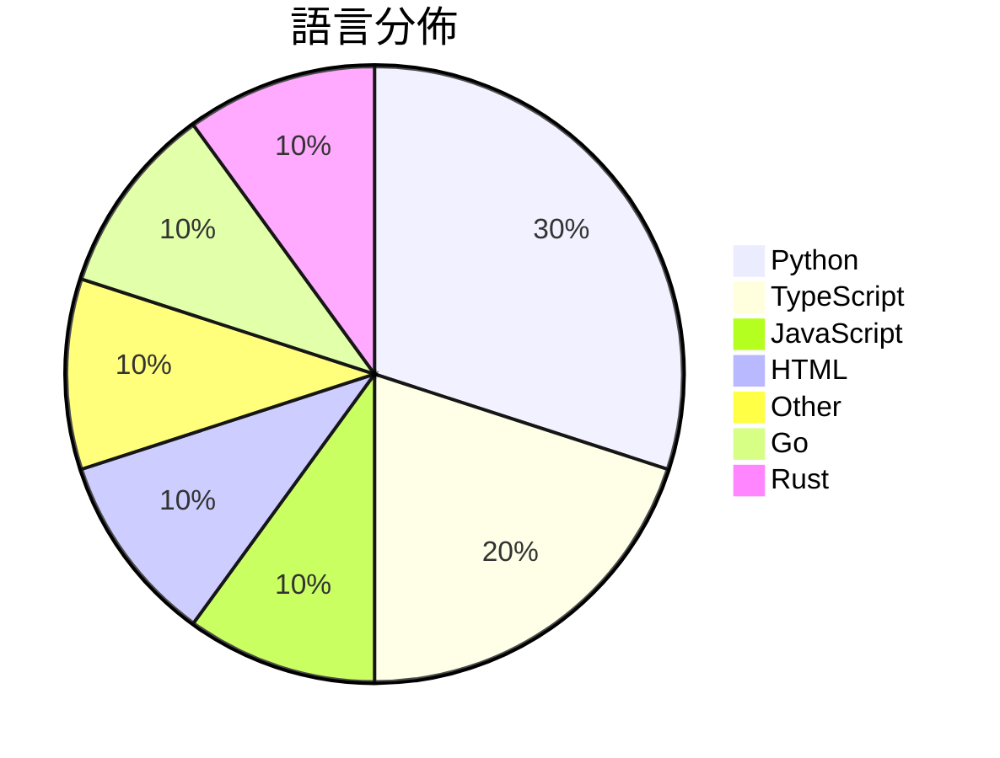

# GitHub Trending - 2026-06-03

> [!summary] 本日摘要
> 收錄 **10** 個新專案，合計 **45.6k** stars
> 語言分佈：Python (3) · TypeScript (2) · JavaScript (1) · HTML (1) · Other (1) · Go (1) · Rust (1)

> [!tip] 本週焦點
> **[[pewdiepie-archdaemon--odysseus|pewdiepie-archdaemon/odysseus]]** — 2 天內累積 33.6k stars（16.8k stars/天）
> 提供自我託管的 AI 工作空間，讓開發者能夠在本地運行 AI 模型，保護隱私且不依賴外部服務。



---

## 收錄列表

| # | 專案 | 分類 | Stars | 速度 | 安裝 | 語言 | 用途 |
| :--: | --- | --- | ---: | ---: | --- | --- | --- |
| 1 | [[pewdiepie-archdaemon--odysseus\|pewdiepie-archdaemon/odysseus]] | AI/ML | 33.6k | 16.8k/天 | `medium` | JavaScript | 提供自我託管的 AI 工作空間，讓開發者能夠在本地運行 AI 模型，保護隱私且不 |
| 2 | [[op7418--guizang-social-card-skill\|op7418/guizang-social-card-skill]] | 開發工具 | 2.6k | 431/天 | `easy` | HTML | 自動生成小紅書和微信封面的圖文卡片，兼具編輯與瑞士設計風格。 |
| 3 | [[helloianneo--ian-xiaohei-illustrations\|helloianneo/ian-xiaohei-illustrations]] | AI/ML | 1.7k | 291/天 | `medium` | N/A | 生成中文文章配图，使用小黑怪诞风格，适合知识型内容创作者。 |
| 4 | [[GordenSun--GordenPPTSkill\|GordenSun/GordenPPTSkill]] | 開發工具 | 1.6k | 260/天 | `medium` | Python | 提供 AI 友好的 PPT 建構工具，包含 17 種精心設計的中文 PPTX 模 |
| 5 | [[Gloridust--WechatOnCloud\|Gloridust/WechatOnCloud]] | 其他 | 1.5k | 367/天 | `medium` | TypeScript | 在自己的伺服器上運行多個獨立的微信實例，實現跨設備消息同步。 |
| 6 | [[Sophomoresty--gemini-web2api\|Sophomoresty/gemini-web2api]] | 開發工具 | 1.3k | 251/天 | `easy` | Python | 將 Google Gemini 網頁介面轉換為 OpenAI 兼容的 API，無 |
| 7 | [[asz798838958--aBaiAutoplus\|asz798838958/aBaiAutoplus]] | 開發工具 | 1.0k | 525/天 | `medium` | Python | 提供多平台 AI 账号自动注册与管理，支持协议化付款一键开通 ChatGPT P |
| 8 | [[MatinSenPai--SenPaiScanner\|MatinSenPai/SenPaiScanner]] | CLI 工具 | 905 | 181/天 | `easy` | Go | 一個輕量級的 Cloudflare IP 掃描器，幫助用戶快速找到可用的 IP。 |
| 9 | [[b-nnett--goose\|b-nnett/goose]] | 開發工具 | 752 | 752/天 | `medium` | Rust | 提供 WHOOP 5.0 數據和健康指標的本地應用原型。 |
| 10 | [[Michaelliv--pi-dynamic-workflows\|Michaelliv/pi-dynamic-workflows]] | 開發工具 | 739 | 148/天 | `easy` | TypeScript | 提供 Claude-Code 風格的動態工作流，讓 Pi 能夠並行處理多個子代理 |

---

## 重點摘要

### 1. [[pewdiepie-archdaemon--odysseus|pewdiepie-archdaemon/odysseus]] `AI/ML`

> 提供自我託管的 AI 工作空間，讓開發者能夠在本地運行 AI 模型，保護隱私且不依賴外部服務。

**33.6k** stars · **16.8k** stars/天 · JavaScript · `medium`

_建立 2 天內累積 33559 stars（16780/天），forks 4004（11.9%），顯示出強勁的增長勢頭。這個專案的主要貢獻者 pewdiepie-archdaemon 和其他幾位開發者在開源社群中有一定的影響力。Odysseus 解決了自我託管 AI 工具的需求，之前的解決方案往往依賴於外部服務，導致數據隱私問題。社群中對於這個專案的討論熱烈，尤其是在 GitHub Issues 中出現的提案和問題，顯示出用戶對於架構和功能的關注。技術上，Docker 的普及使得這種自我託管的解決方案變得可行，並且降低了部署的複雜度。_

---

### 2. [[op7418--guizang-social-card-skill|op7418/guizang-social-card-skill]] `開發工具`

> 自動生成小紅書和微信封面的圖文卡片，兼具編輯與瑞士設計風格。

**2.6k** stars · **431** stars/天 · HTML · `easy`

_建立 6 天就累積 2588 stars（431/天），forks 253（9.8%），顯示出強烈的社群興趣。這個專案的作者過去在設計和開發領域有豐富經驗，解決了在社交媒體上生成高品質圖文的痛點，之前的解決方案往往缺乏靈活性和美學考量。近期的推廣活動和社群討論也可能促進了其曝光率。這個工具的設計理念符合當前對於社交媒體內容質量的需求，並且其功能覆蓋範圍廣泛，能夠滿足不同用戶的需求。_

---

### 3. [[helloianneo--ian-xiaohei-illustrations|helloianneo/ian-xiaohei-illustrations]] `AI/ML`

> 生成中文文章配图，使用小黑怪诞风格，适合知识型内容创作者。

**1.7k** stars · **291** stars/天 · N/A · `medium`

_建立 6 天就累積 1744 stars（291/天），forks 160（9.2%），顯示出穩定的增長。作者 Ian 是一位產品設計師，專注於 AI 生成內容，這款工具解決了傳統插圖工具無法滿足的需求，特別是在中文內容創作方面。近期的社交媒體討論和分享也推動了其知名度。這個工具的出現是因為對個性化、輕量化插圖需求的增加，尤其是在知識型內容創作領域。forks/stars 比率為 9.2%，顯示出有相當比例的用戶在進行實際修改和使用。_

---

### 4. [[GordenSun--GordenPPTSkill|GordenSun/GordenPPTSkill]] `開發工具`

> 提供 AI 友好的 PPT 建構工具，包含 17 種精心設計的中文 PPTX 模板與非破壞性文本編輯工具。

**1.6k** stars · **260** stars/天 · Python · `medium`

_建立 6 天內累積 1560 stars（260/天），forks 142（9.1%），顯示出穩定的增長潛力。作者 GordenSun 以其對於 PPT 工具的深入理解，針對中國市場的需求開發了這個專案，解決了傳統 PPT 生成工具在中文環境下的不足。這個工具的出現恰逢 AI 助手需求上升的時期，許多使用者希望能夠快速生成高質量的簡報。forks/stars 比率為 9.1%，顯示出有相當比例的使用者在積極修改和使用這個工具。_

---

### 5. [[Gloridust--WechatOnCloud|Gloridust/WechatOnCloud]] `其他`

> 在自己的伺服器上運行多個獨立的微信實例，實現跨設備消息同步。

**1.5k** stars · **367** stars/天 · TypeScript · `medium`

_建立 4 天就累積 1468 stars（367/天），forks 425（29.0%），這顯示出強烈的社群需求。作者 Gloridust 和 huglemon 之前有過多個成功的開源專案，這次專案解決了在伺服器上運行微信的痛點，特別是多用戶協作的需求。近期的推廣活動和社群反饋也促進了這個專案的快速增長。這個工具的出現正好填補了市場上對於安全、靈活的微信伺服器解決方案的需求，並且其高 fork 比率顯示出許多開發者對於進一步修改和使用的興趣。_

---

### 6. [[Sophomoresty--gemini-web2api|Sophomoresty/gemini-web2api]] `開發工具`

> 將 Google Gemini 網頁介面轉換為 OpenAI 兼容的 API，無需身份驗證，跨平台，單檔案運行。

**1.3k** stars · **251** stars/天 · Python · `easy`

_建立 5 天內累積 1253 stars（251/天），forks 323（25.8%），這顯示出強烈的社群興趣。專案的主要貢獻者來自於開源社群，並且在相關領域有過往的開發經驗。這個工具解決了開發者在使用 Google Gemini 時的身份驗證和接入問題，讓他們能夠以更簡單的方式使用 Gemini 的功能。近期的討論和反饋也促進了專案的快速成長，顯示出社群對於這類工具的需求。技術上，無需額外的付費訂閱和複雜的配置，使得這個工具在當前市場中具有競爭優勢。_

---

### 7. [[asz798838958--aBaiAutoplus|asz798838958/aBaiAutoplus]] `開發工具`

> 提供多平台 AI 账号自动注册与管理，支持协议化付款一键开通 ChatGPT Plus。

**1.0k** stars · **525** stars/天 · Python · `medium`

_建立 2 天就累積 1049 stars（524.5/天），forks 546（52.0%），這顯示出其高活躍度和實際使用需求。作者 asz798838958 是一位活躍的開源貢獻者，之前的開源項目也有類似的功能。這個專案解決了多平台 AI 账号注册的繁瑣過程，特別是針對需要使用 GoPay 的印尼用戶，之前的方案往往需要手動操作，效率低下。近期的社交媒體討論和開源社群的反饋也促進了該專案的快速成長。高 forks/stars 比率（52.0%）表明許多開發者在實際修改和使用這個工具，顯示出其實用性和需求。_

---

### 8. [[MatinSenPai--SenPaiScanner|MatinSenPai/SenPaiScanner]] `CLI 工具`

> 一個輕量級的 Cloudflare IP 掃描器，幫助用戶快速找到可用的 IP。

**905** stars · **181** stars/天 · Go · `easy`

_建立 5 天內累積 905 stars（181/天），forks 59（6.5%），顯示出穩定的增長趨勢。作者 MatinSenPai 及其團隊在開源社群中有一定的知名度，之前也有其他相關專案。這個專案解決了在不穩定網路環境中尋找可用 Cloudflare IP 的痛點，之前的工具多數無法兼顧速度和穩定性。社群的反饋和需求推動了這個專案的快速發展。_

---

### 9. [[b-nnett--goose|b-nnett/goose]] `開發工具`

> 提供 WHOOP 5.0 數據和健康指標的本地應用原型。

**752** stars · **752** stars/天 · Rust · `medium`

_建立 1 天就累積 752 stars（752/天），forks 231（30.7%），這顯示出開發者對這個專案的高度興趣。作者 b-nnett 是一位活躍的開發者，專注於健康數據應用的開發。這個專案解決了目前 WHOOP 5.0 數據處理的需求，提供了一個本地化的解決方案，避免了雲端依賴的風險。由於專案剛開始，尚未有大量的社群討論或推廣活動，但其潛在的應用場景吸引了不少開發者的注意。這樣的增長率顯示出對健康數據應用的需求正在上升，尤其是在個人數據隱私日益受到重視的背景下。_

---

### 10. [[Michaelliv--pi-dynamic-workflows|Michaelliv/pi-dynamic-workflows]] `開發工具`

> 提供 Claude-Code 風格的動態工作流，讓 Pi 能夠並行處理多個子代理的任務。

**739** stars · **148** stars/天 · TypeScript · `easy`

_建立 5 天內累積 739 stars（148/天），forks 38（5.1%），顯示出穩定的增長潛力。作者 Michaelliv 之前在開源社群中活躍，這個專案解決了以往工作流管理工具在處理多任務時的效率低下問題。之前的解決方案往往依賴於線性處理，無法充分利用並行處理的優勢。這個專案的推出正好填補了這一空白，並且在社群中引起了討論。技術上，Node.js 的 VM 支持讓這個工具能夠安全地執行用戶腳本，這在過去是難以實現的。forks/stars 比率為 5.1%，顯示出有相當數量的用戶在實際修改和使用這個工具。_

---

## 今日到期複習

> [!tip] 根據間隔複習排程，今天該回顧的專案

```dataview
TABLE
  stars_per_day AS "Stars/天",
  category AS "分類",
  engagement AS "參與度"
FROM "Repos"
WHERE next_review AND date(next_review) <= date("2026-06-03") AND status != "archived"
SORT priority DESC
```

## 待處理

```dataviewjs
const pending = dv.pages('"Repos"').where(p => p.status === "to-review").length;
const unrated = dv.pages('"Repos"').where(p => p.status !== "archived" && p.status !== "to-review" && (p.my_rating || 0) === 0).length;
const noVerdict = dv.pages('"Repos"').where(p => p.status !== "archived" && (p.my_rating || 0) > 0 && (!p.verdict || p.verdict === "")).length;
const items = [];
if (pending > 0) items.push(`**${pending}** 個待分流`);
if (unrated > 0) items.push(`**${unrated}** 個已讀但未評分`);
if (noVerdict > 0) items.push(`**${noVerdict}** 個已評分但無結論`);
if (items.length > 0) dv.paragraph(items.join(" / "));
else dv.paragraph("所有專案都已處理完畢！");
```
