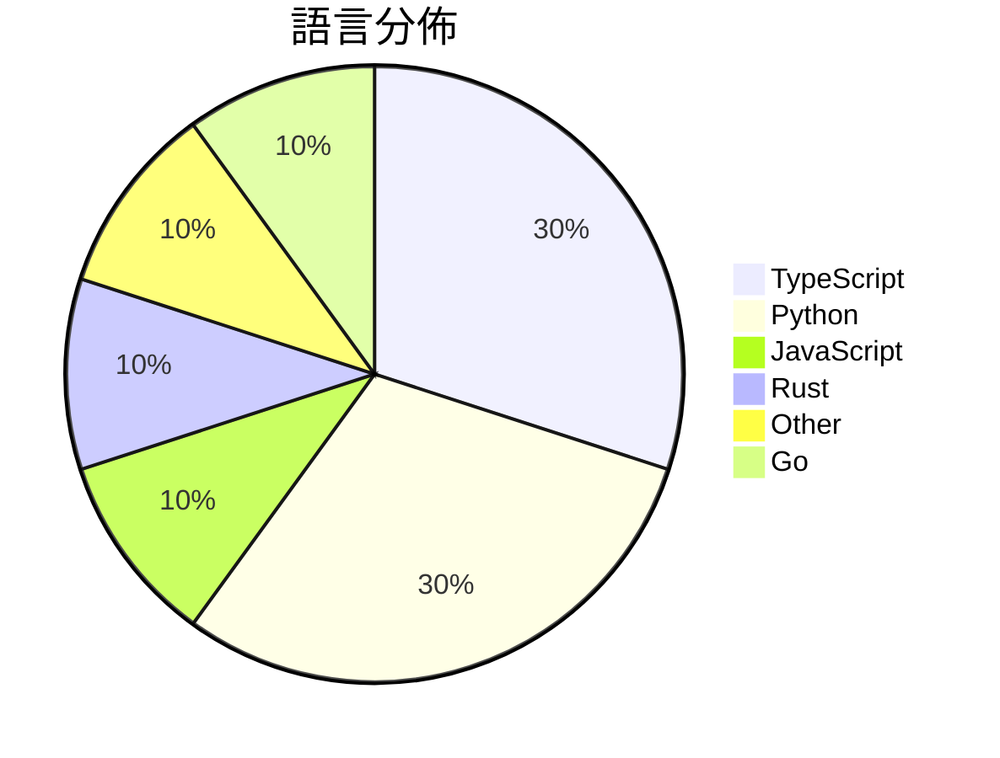

# GitHub Trending - 2026-06-04

> [!summary] 本日摘要
> 收錄 **10** 個新專案，合計 **54.6k** stars
> 語言分佈：TypeScript (3) · Python (3) · JavaScript (1) · Rust (1) · Other (1) · Go (1)

> [!tip] 本週焦點
> **[[pewdiepie-archdaemon--odysseus|pewdiepie-archdaemon/odysseus]]** — 3 天內累積 44.0k stars（14.7k stars/天）
> 提供自我託管的 AI 工作區，讓使用者擁有本地數據的隱私與控制權。



---

## 收錄列表

| # | 專案 | 分類 | Stars | 速度 | 安裝 | 語言 | 用途 |
| :--: | --- | --- | ---: | ---: | --- | --- | --- |
| 1 | [[pewdiepie-archdaemon--odysseus\|pewdiepie-archdaemon/odysseus]] | AI/ML | 44.0k | 14.7k/天 | `medium` | JavaScript | 提供自我託管的 AI 工作區，讓使用者擁有本地數據的隱私與控制權。 |
| 2 | [[Gloridust--WechatOnCloud\|Gloridust/WechatOnCloud]] | 其他 | 1.9k | 388/天 | `medium` | TypeScript | 在自己的伺服器上運行服務端微信，實現多端共享與消息同步。 |
| 3 | [[b-nnett--goose\|b-nnett/goose]] | 開發工具 | 1.5k | 1.5k/天 | `medium` | Rust | 提供 WHOOP 5.0 的本地數據和健康指標追蹤工具。 |
| 4 | [[asz798838958--aBaiAutoplus\|asz798838958/aBaiAutoplus]] | 開發工具 | 1.4k | 466/天 | `medium` | Python | 自動化管理多平台 AI 帳號，並透過協議化付款一鍵開通 ChatGPT Plus |
| 5 | [[Sophomoresty--gemini-web2api\|Sophomoresty/gemini-web2api]] | 開發工具 | 1.4k | 225/天 | `easy` | Python | 將 Google Gemini 的網頁介面轉換為 OpenAI 兼容的 API， |
| 6 | [[zgwl--chinese-buy-us-stock-guide\|zgwl/chinese-buy-us-stock-guide]] | 其他 | 1.1k | 267/天 | `easy` | N/A | 提供中國投資者全面的美股投資指南，涵蓋開戶、稅務和合規等重要步驟。 |
| 7 | [[MatinSenPai--SenPaiScanner\|MatinSenPai/SenPaiScanner]] | 開發工具 | 1.0k | 172/天 | `easy` | Go | 一個輕量級的 Cloudflare IP 掃描器，幫助用戶找到可用的 IP。 |
| 8 | [[cpaczek--skylight\|cpaczek/skylight]] | 其他 | 795 | 795/天 | `medium` | TypeScript | 實時將飛機航跡投影到天花板，並顯示真實天空層。 |
| 9 | [[Michaelliv--pi-dynamic-workflows\|Michaelliv/pi-dynamic-workflows]] | 開發工具 | 772 | 129/天 | `easy` | TypeScript | 提供 Claude-Code 風格的動態工作流程，讓多個子代理同時執行任務。 |
| 10 | [[ClaudioDrews--memory-os\|ClaudioDrews/memory-os]] | AI/ML | 756 | 252/天 | `medium` | Python | 為 Hermes Agent 提供持久記憶的操作系統，解決記憶丟失問題。 |

---

## 重點摘要

### 1. [[pewdiepie-archdaemon--odysseus|pewdiepie-archdaemon/odysseus]] `AI/ML`

> 提供自我託管的 AI 工作區，讓使用者擁有本地數據的隱私與控制權。

**44.0k** stars · **14.7k** stars/天 · JavaScript · `medium`

_建立 3 天就累積 43988 stars（14663/天），forks 5098（11.6%），顯示出極高的用戶參與度。這個專案的主要貢獻者包括 pewdiepie-archdaemon 和其他幾位活躍開發者，他們在開源社群中有著良好的聲譽。Odysseus 解決了許多使用者在使用商業 AI 服務時面臨的隱私問題，讓使用者能夠在本地環境中運行 AI 模型，這在當前的數據隱私環境中尤為重要。社群中的熱門問題和提案也顯示出使用者對於架構和功能的強烈關注，這進一步推動了專案的發展。_

---

### 2. [[Gloridust--WechatOnCloud|Gloridust/WechatOnCloud]] `其他`

> 在自己的伺服器上運行服務端微信，實現多端共享與消息同步。

**1.9k** stars · **388** stars/天 · TypeScript · `medium`

_建立 5 天內累積 1941 stars（388/天），forks 536（27.6%），顯示出強勁的社群支持。作者 Gloridust 及其團隊在開源社群中活躍，解決了用戶在多設備上使用微信的痛點，提供了一個無需修改客戶端的解決方案。此專案的出現正好迎合了對於遠程協作和多端使用的需求，並且在社交媒體上引起了討論，進一步推動了其曝光率。高達 27.6% 的 forks/stars 比率顯示出許多人對此專案的興趣和實際修改的意願，反映出其在實際應用中的潛力。_

---

### 3. [[b-nnett--goose|b-nnett/goose]] `開發工具`

> 提供 WHOOP 5.0 的本地數據和健康指標追蹤工具。

**1.5k** stars · **1.5k** stars/天 · Rust · `medium`

_建立 1 天就累積 1470 stars（1470/天），forks 417（28.4%），這顯示出強烈的社群興趣。作者 b-nnett 是一位活躍的開發者，專注於健康數據應用的開發。這個專案填補了 WHOOP 5.0 數據追蹤的空白，之前的工具無法提供這樣的本地數據整合。雖然目前仍在原型階段，但其獨特的設計和針對性功能吸引了許多開發者的注意。社群的活躍度和對未來功能的期待也是其快速增長的原因之一。_

---

### 4. [[asz798838958--aBaiAutoplus|asz798838958/aBaiAutoplus]] `開發工具`

> 自動化管理多平台 AI 帳號，並透過協議化付款一鍵開通 ChatGPT Plus。

**1.4k** stars · **466** stars/天 · Python · `medium`

_建立 3 天就累積 1398 stars（466/天），forks 655（46.9%），顯示出強烈的社群興趣。作者 asz798838958 之前有開發類似的開源項目，這次的擴展針對了多平台註冊和付款的需求，解決了許多用戶在註冊過程中的繁瑣步驟。近期的社群討論和需求也促進了這個專案的快速增長。技術上，這個工具的設計充分利用了 FastAPI 和 SQLite 的高效性，使得註冊和管理過程流暢且快速。高達 46.9% 的 forks/stars 比率顯示出許多人對這個專案的實際修改和使用，反映出其在開發者社群中的實際應用潛力。_

---

### 5. [[Sophomoresty--gemini-web2api|Sophomoresty/gemini-web2api]] `開發工具`

> 將 Google Gemini 的網頁介面轉換為 OpenAI 兼容的 API，無需認證，跨平台，單檔案運行。

**1.4k** stars · **225** stars/天 · Python · `easy`

_建立 6 天內累積 1351 stars（225/天），forks 347（25.7%），顯示出強烈的社群興趣。作者 Sophomoresty 和其他貢獻者在開源社群中有一定的影響力，之前的專案也獲得過好評。這個專案解決了使用 Google Gemini 時的認證繁瑣問題，讓開發者能夠輕鬆使用其 API，這在現有的開發工具中並不常見。社群對於無需認證的特性反應熱烈，這使得該專案在短時間內獲得了大量的關注。高達 25.7% 的 forks/stars 比率顯示出許多開發者正在實際修改和使用這個工具，而不是僅僅觀望。_

---

### 6. [[zgwl--chinese-buy-us-stock-guide|zgwl/chinese-buy-us-stock-guide]] `其他`

> 提供中國投資者全面的美股投資指南，涵蓋開戶、稅務和合規等重要步驟。

**1.1k** stars · **267** stars/天 · N/A · `easy`

_建立 4 天就累積 1068 stars（267/天），forks 168（15.7%），顯示出強烈的需求。作者 xingchen 專注於中國投資者的需求，填補了市場上對美股投資資訊的空白。這個專案的出現正好解決了許多中國投資者在進入美股市場時面臨的合規和稅務問題，提供了清晰的指導。社群的反應熱烈，顯示出這個主題的關注度。這些因素共同促成了這個專案的快速成長。_

---

### 7. [[MatinSenPai--SenPaiScanner|MatinSenPai/SenPaiScanner]] `開發工具`

> 一個輕量級的 Cloudflare IP 掃描器，幫助用戶找到可用的 IP。

**1.0k** stars · **172** stars/天 · Go · `easy`

_建立 6 天內累積 1032 stars（172/天），forks 64（6.2%），顯示出強勁的增長潛力。作者 MatinSenPai 過去在網路工具開發上有豐富經驗，這個工具解決了在不穩定網路環境中尋找可用 Cloudflare IP 的痛點，過去使用者通常需要依賴繁瑣的手動配置或其他工具的低效能。社群的反饋也促進了這個專案的快速迭代，並且有持續的更新和功能增強。_

---

### 8. [[cpaczek--skylight|cpaczek/skylight]] `其他`

> 實時將飛機航跡投影到天花板，並顯示真實天空層。

**795** stars · **795** stars/天 · TypeScript · `medium`

_建立 1 天就累積 795 stars（795/天），forks 43（5.4%），這顯示出強烈的興趣和潛在的使用者基礎。作者 cpaczek 和 wes-chen 在開源社群中有一定的影響力，並且這個專案解決了以往無法輕易實現的實時飛機追蹤問題。之前的解決方案通常需要複雜的設置或昂貴的硬體，而 Skylight 提供了一個相對簡單且成本效益高的選擇。這個專案的推出也可能受到社交媒體的推廣影響，吸引了許多航空愛好者的注意。技術上，隨著 RTL-SDR 價格的降低和 Raspberry Pi 的普及，這個工具的可行性大幅提升。forks/stars 比率約 5.4% 表示有相當一部分使用者對此專案進行了實際的修改和使用。_

---

### 9. [[Michaelliv--pi-dynamic-workflows|Michaelliv/pi-dynamic-workflows]] `開發工具`

> 提供 Claude-Code 風格的動態工作流程，讓多個子代理同時執行任務。

**772** stars · **129** stars/天 · TypeScript · `easy`

_建立 6 天就累積 772 stars（129/天），forks 39（5.1%），顯示出穩定的增長潛力。作者 Michaelliv 及其團隊過去在開源社區活躍，這個專案解決了傳統工作流程工具在處理多任務時的局限性，特別是在需要並行處理和動態調整的情境下。近期的社群討論和需求反饋也促進了這個工具的快速發展。技術上，這個工具的出現正好搭上了 Pi 生態系統的擴展，讓開發者能夠更靈活地使用 JavaScript 進行工作流程的編排。forks/stars 比率適中，顯示出有一定的實際使用者在進行修改和擴展。_

---

### 10. [[ClaudioDrews--memory-os|ClaudioDrews/memory-os]] `AI/ML`

> 為 Hermes Agent 提供持久記憶的操作系統，解決記憶丟失問題。

**756** stars · **252** stars/天 · Python · `medium`

_建立 3 天內累積 756 stars（252/天），forks 74（9.8%），這顯示出強烈的社群興趣。作者 ClaudioDrews 是一位專注於 AI 代理的開發者，過去的經驗讓他認識到現有記憶解決方案的不足，尤其是雲端依賴和記憶丟失問題。這個專案的推出正好填補了這一空白，提供了本地運行的記憶解決方案，並且不需要訂閱費用。社群的反饋也顯示出對這種解決方案的需求，特別是在對數據隱私的重視上。_

---

## 今日到期複習

> [!tip] 根據間隔複習排程，今天該回顧的專案

```dataview
TABLE
  stars_per_day AS "Stars/天",
  category AS "分類",
  engagement AS "參與度"
FROM "Repos"
WHERE next_review AND date(next_review) <= date("2026-06-04") AND status != "archived"
SORT priority DESC
```

## 待處理

```dataviewjs
const pending = dv.pages('"Repos"').where(p => p.status === "to-review").length;
const unrated = dv.pages('"Repos"').where(p => p.status !== "archived" && p.status !== "to-review" && (p.my_rating || 0) === 0).length;
const noVerdict = dv.pages('"Repos"').where(p => p.status !== "archived" && (p.my_rating || 0) > 0 && (!p.verdict || p.verdict === "")).length;
const items = [];
if (pending > 0) items.push(`**${pending}** 個待分流`);
if (unrated > 0) items.push(`**${unrated}** 個已讀但未評分`);
if (noVerdict > 0) items.push(`**${noVerdict}** 個已評分但無結論`);
if (items.length > 0) dv.paragraph(items.join(" / "));
else dv.paragraph("所有專案都已處理完畢！");
```
