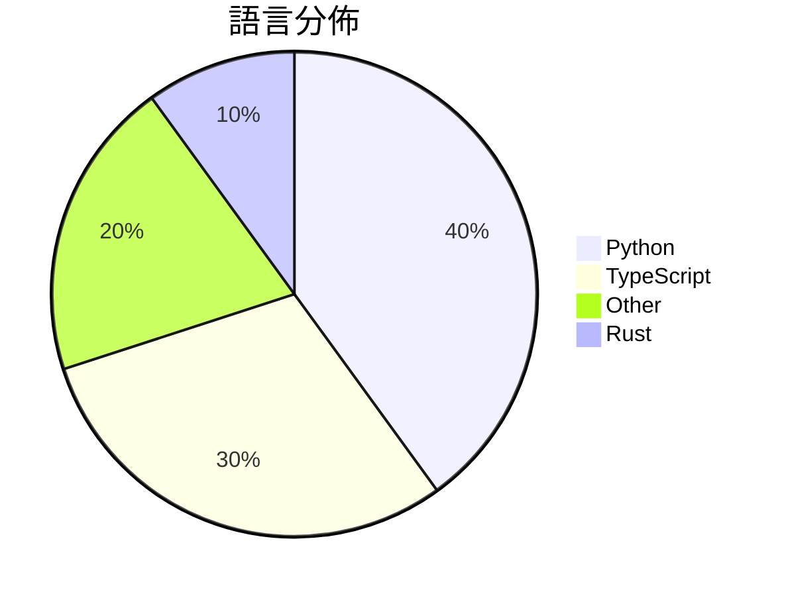

# GitHub Trending - 2026-06-05

> [!summary] 本日摘要
> 收錄 **10** 個新專案，合計 **63.2k** stars
> 語言分佈：Python (4) · TypeScript (3) · Other (2) · Rust (1)

> [!tip] 本週焦點
> **[[pewdiepie-archdaemon--odysseus|pewdiepie-archdaemon/odysseus]]** — 4 天內累積 51.4k stars（12.8k stars/天）
> 提供自我托管的 AI 工作區，讓使用者在本地運行 AI 模型，保障隱私與數據安全。



---

## 收錄列表

| # | 專案 | 分類 | Stars | 速度 | 安裝 | 語言 | 用途 |
| :--: | --- | --- | ---: | ---: | --- | --- | --- |
| 1 | [[pewdiepie-archdaemon--odysseus\|pewdiepie-archdaemon/odysseus]] | 開發工具 | 51.4k | 12.8k/天 | `medium` | Python | 提供自我托管的 AI 工作區，讓使用者在本地運行 AI 模型，保障隱私與數據安全 |
| 2 | [[zgwl--chinese-buy-us-stock-guide\|zgwl/chinese-buy-us-stock-guide]] | 其他 | 2.8k | 552/天 | `easy` | N/A | 提供中國投資者全面的美股投資指南，涵蓋開戶、稅務、合規等重要步驟。 |
| 3 | [[Gloridust--WechatOnCloud\|Gloridust/WechatOnCloud]] | 其他 | 2.1k | 342/天 | `medium` | TypeScript | 在自己的 NAS 或伺服器上運行服務端微信，實現多端共享同一微信會話。 |
| 4 | [[b-nnett--goose\|b-nnett/goose]] | 開發工具 | 1.9k | 935/天 | `medium` | Rust | 提供 WHOOP 5.0 數據的本地伴侶應用程式，尚未準備好用於個人健康數據追蹤 |
| 5 | [[asz798838958--aBaiAutoplus\|asz798838958/aBaiAutoplus]] | 開發工具 | 1.5k | 371/天 | `medium` | Python | 提供多平台 AI 账号自动注册与管理，支持协议化付款一键开通 ChatGPT P |
| 6 | [[cpaczek--skylight\|cpaczek/skylight]] | 其他 | 1.2k | 611/天 | `medium` | TypeScript | 將飛機即時投影到天花板上，從 RTL-SDR 接收數據，並顯示真實的天空層。 |
| 7 | [[ClaudioDrews--memory-os\|ClaudioDrews/memory-os]] | 開發工具 | 828 | 207/天 | `medium` | Python | 讓 Hermes Agent 擁有持久記憶，避免每次對話都重頭開始。 |
| 8 | [[qiuqiubuchongle-cloud--chokepoint-atlas\|qiuqiubuchongle-cloud/chokepoint-atlas]] | 開發工具 | 559 | 186/天 | `medium` | Python | 幫助研究 AI 產業鏈中的瓶頸，提供結構化的美股研究工具。 |
| 9 | [[jdevalk--specification.website\|jdevalk/specification.website]] | 開發工具 | 524 | 87/天 | `medium` | TypeScript | 提供一個網站規範，涵蓋 HTML、可及性、安全性、SEO 和代理準備等技術特性。 |
| 10 | [[liyue-aigc--female-portrait-director\|liyue-aigc/female-portrait-director]] | AI/ML | 510 | 102/天 | `easy` | N/A | 提供一個模組化的系統來生成詳細的女性肖像提示，專注於視覺導向和參數鎖定。 |

---

## 重點摘要

### 1. [[pewdiepie-archdaemon--odysseus|pewdiepie-archdaemon/odysseus]] `開發工具`

> 提供自我托管的 AI 工作區，讓使用者在本地運行 AI 模型，保障隱私與數據安全。

**51.4k** stars · **12.8k** stars/天 · Python · `medium`

_建立 4 天內累積 51366 stars（12842/天），forks 5984（11.6%），顯示出強大的增長潛力。主要貢獻者包括 pewdiepie-archdaemon 和 afonsopc，這些成員在開源社群中有著良好的聲譽。Odysseus 解決了許多用戶對於數據隱私和自我控制的需求，這在當前的 AI 生態中是個重要的痛點。近期的推文和社群討論也促進了其曝光率。技術上，隨著 Docker 和本地運行環境的普及，這個工具的可行性大幅提升。高達 11.6% 的 forks/stars 比率顯示出許多開發者對其進行實際修改和使用，這是相對健康的社群參與指標。_

---

### 2. [[zgwl--chinese-buy-us-stock-guide|zgwl/chinese-buy-us-stock-guide]] `其他`

> 提供中國投資者全面的美股投資指南，涵蓋開戶、稅務、合規等重要步驟。

**2.8k** stars · **552** stars/天 · N/A · `easy`

_建立 5 天內累積 2759 stars（552/天），forks 426（15.4%），顯示出強烈的使用需求。作者 Xingchen 針對中國投資者的需求，提供了之前缺乏的系統性美股投資指南，填補了市場空白。近期的政策變化和美股市場的熱度也促使了這份指南的快速傳播。社群對於美股投資的興趣日益增加，這份指南正好迎合了這一需求，並且有助於降低投資者的進入門檻。_

---

### 3. [[Gloridust--WechatOnCloud|Gloridust/WechatOnCloud]] `其他`

> 在自己的 NAS 或伺服器上運行服務端微信，實現多端共享同一微信會話。

**2.1k** stars · **342** stars/天 · TypeScript · `medium`

_建立 6 天就累積 2054 stars（342/天），forks 552（26.9%），顯示出強烈的社群興趣。作者 Gloridust 是一位活躍的開發者，過去有多個開源專案，這個專案解決了在多端使用微信的需求，特別是在企業環境中。近期的安全更新和功能增強吸引了更多用戶的注意，並且在社群中引發了討論。技術上，Docker 的流行使得這種服務端解決方案變得可行，並且用戶對於安全性和靈活性的需求日益增加。forks/stars 比率高達 26.9%，顯示出許多人在實際修改和使用這個專案。_

---

### 4. [[b-nnett--goose|b-nnett/goose]] `開發工具`

> 提供 WHOOP 5.0 數據的本地伴侶應用程式，尚未準備好用於個人健康數據追蹤。

**1.9k** stars · **935** stars/天 · Rust · `medium`

_建立 2 天內累積 1869 stars（935/天），forks 466（24.9%），顯示出強烈的社群興趣。作者 b-nnett 是一位專注於健康科技的開發者，這個專案解決了目前 WHOOP 5.0 數據訪問的需求，之前的方案多依賴於雲端服務，無法提供即時數據。近期的推廣活動可能吸引了開發者的注意，尤其是在健康數據本地處理的趨勢下。高達 24.9% 的 forks/stars 比率顯示出許多開發者對這個專案進行實際修改和使用的興趣。_

---

### 5. [[asz798838958--aBaiAutoplus|asz798838958/aBaiAutoplus]] `開發工具`

> 提供多平台 AI 账号自动注册与管理，支持协议化付款一键开通 ChatGPT Plus。

**1.5k** stars · **371** stars/天 · Python · `medium`

_建立 4 天內累積 1484 stars（371/天），forks 685（46.2%），顯示出極高的使用興趣。作者 asz798838958 和 ayearofficial 是活躍的開源貢獻者，之前的項目也涉及自動化和支付領域。這個工具解決了多平台 AI 账号注册的繁瑣流程，特別是對於需要快速開通 ChatGPT Plus 的用戶。近期的社群討論和需求推動了這個工具的興起，特別是在 AI 服務需求增加的背景下。高 forks/stars 比率（46.2%）表明許多用戶正在實際修改和使用這個工具，顯示出其實用性和靈活性。_

---

### 6. [[cpaczek--skylight|cpaczek/skylight]] `其他`

> 將飛機即時投影到天花板上，從 RTL-SDR 接收數據，並顯示真實的天空層。

**1.2k** stars · **611** stars/天 · TypeScript · `medium`

_建立 2 天就累積 1222 stars（611/天），forks 82（6.7%），顯示出強勁的增長潛力。作者 cpaczek 以開源專案見長，過去的貢獻包括多個與航空相關的工具。這個專案解決了傳統飛行追蹤工具缺乏視覺化和互動性的問題，讓使用者能夠更直觀地了解飛機動態。近期的推廣活動和社群的熱烈反應也促進了其關注度。技術上，RTL-SDR 的普及使得這種即時飛行追蹤成為可能，並且專案的設計充分考慮了使用者的互動需求。_

---

### 7. [[ClaudioDrews--memory-os|ClaudioDrews/memory-os]] `開發工具`

> 讓 Hermes Agent 擁有持久記憶，避免每次對話都重頭開始。

**828** stars · **207** stars/天 · Python · `medium`

_建立 4 天內累積 828 stars（207/天），forks 82（9.9%），顯示出強烈的社群興趣。這個專案的作者 ClaudioDrews 之前有開發過多個相關工具，這次的 Memory OS 解決了現有記憶解決方案的缺陷，特別是針對 Hermes Agent 的需求。社群對於記憶的需求日益增加，特別是在多次會話中保持上下文的能力，這使得 Memory OS 的出現恰逢其時。隨著用戶對於本地化解決方案的需求上升，這個工具的市場潛力也隨之增長。forks/stars 比率約 9.9%，顯示出不少用戶在實際修改使用，反映出這個專案的實用性。_

---

### 8. [[qiuqiubuchongle-cloud--chokepoint-atlas|qiuqiubuchongle-cloud/chokepoint-atlas]] `開發工具`

> 幫助研究 AI 產業鏈中的瓶頸，提供結構化的美股研究工具。

**559** stars · **186** stars/天 · Python · `medium`

_建立 3 天內累積 559 stars（186/天），forks 118（21.1%），顯示出良好的社群參與度。作者 qiuqiubuchongle-cloud 似乎專注於 AI 相關的研究工具，這個專案填補了市場上對於供應鏈瓶頸分析的需求。此工具的出現，正好符合當前對於 AI 產業鏈深入理解的迫切需求。高達 21.1% 的 forks/stars 比率顯示出許多開發者在實際修改和使用這個工具，這是其受歡迎的原因之一。_

---

### 9. [[jdevalk--specification.website|jdevalk/specification.website]] `開發工具`

> 提供一個網站規範，涵蓋 HTML、可及性、安全性、SEO 和代理準備等技術特性。

**524** stars · **87** stars/天 · TypeScript · `medium`

_建立 6 天就累積 524 stars（87/天），forks 33（6.3%），這顯示出一定的關注度。專案的主要貢獻者包括多位開發者，這表明有一定的社群支持。它解決了網站開發中缺乏統一規範的痛點，特別是在可及性和安全性方面，這些是許多開發者在實作時常常忽略的部分。技術上，使用了現代的開發工具和框架，這使得專案更具吸引力。這個專案的爆發可能受到開發者對於網站標準化需求的驅動，尤其是在多樣化的開發環境中。_

---

### 10. [[liyue-aigc--female-portrait-director|liyue-aigc/female-portrait-director]] `AI/ML`

> 提供一個模組化的系統來生成詳細的女性肖像提示，專注於視覺導向和參數鎖定。

**510** stars · **102** stars/天 · N/A · `easy`

_建立 5 天內累積 510 stars（102/天），forks 74（14.5%），顯示出強烈的社群興趣。作者 Li Yue 在 AI 生成領域有一定的經驗，這個專案解決了生成女性肖像時的參數鎖定和風格一致性問題，這在其他通用工具中往往難以實現。近期的推廣活動和社群討論也可能促進了其曝光率。此工具的設計考慮到了用戶需求，並提供了多樣化的風格選擇，這使得它在市場上具有競爭力。forks/stars 比率為 14.5%，顯示出許多用戶對於進一步修改和使用的興趣。_

---

## 今日到期複習

> [!tip] 根據間隔複習排程，今天該回顧的專案

```dataview
TABLE
  stars_per_day AS "Stars/天",
  category AS "分類",
  engagement AS "參與度"
FROM "Repos"
WHERE next_review AND date(next_review) <= date("2026-06-05") AND status != "archived"
SORT priority DESC
```

## 待處理

```dataviewjs
const pending = dv.pages('"Repos"').where(p => p.status === "to-review").length;
const unrated = dv.pages('"Repos"').where(p => p.status !== "archived" && p.status !== "to-review" && (p.my_rating || 0) === 0).length;
const noVerdict = dv.pages('"Repos"').where(p => p.status !== "archived" && (p.my_rating || 0) > 0 && (!p.verdict || p.verdict === "")).length;
const items = [];
if (pending > 0) items.push(`**${pending}** 個待分流`);
if (unrated > 0) items.push(`**${unrated}** 個已讀但未評分`);
if (noVerdict > 0) items.push(`**${noVerdict}** 個已評分但無結論`);
if (items.length > 0) dv.paragraph(items.join(" / "));
else dv.paragraph("所有專案都已處理完畢！");
```
