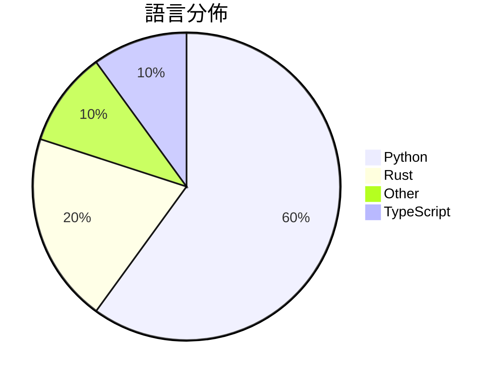

# GitHub Trending - 2026-06-06

> [!summary] 本日摘要
> 收錄 **10** 個新專案，合計 **67.6k** stars
> 語言分佈：Python (6) · Rust (2) · Other (1) · TypeScript (1)

> [!tip] 本週焦點
> **[[pewdiepie-archdaemon--odysseus|pewdiepie-archdaemon/odysseus]]** — 5 天內累積 55.8k stars（11.2k stars/天）
> 提供自我託管的 AI 工作空間，讓用戶能在本地運行 AI 模型，保障隱私與數據安全。



---

## 收錄列表

| # | 專案 | 分類 | Stars | 速度 | 安裝 | 語言 | 用途 |
| :--: | --- | --- | ---: | ---: | --- | --- | --- |
| 1 | [[pewdiepie-archdaemon--odysseus\|pewdiepie-archdaemon/odysseus]] | 開發工具 | 55.8k | 11.2k/天 | `medium` | Python | 提供自我託管的 AI 工作空間，讓用戶能在本地運行 AI 模型，保障隱私與數據安 |
| 2 | [[zgwl--chinese-buy-us-stock-guide\|zgwl/chinese-buy-us-stock-guide]] | 其他 | 3.2k | 539/天 | `easy` | N/A | 提供中國投資者的美股投資指南，涵蓋開戶、稅務、合規等全過程。 |
| 3 | [[b-nnett--goose\|b-nnett/goose]] | 開發工具 | 2.1k | 707/天 | `medium` | Rust | 提供 WHOOP 5.0 數據的本地應用程式，幫助用戶追蹤健康指標。 |
| 4 | [[cpaczek--skylight\|cpaczek/skylight]] | 其他 | 1.7k | 560/天 | `medium` | TypeScript | 實時投影飛機在你頭頂飛過的影像，結合天文層顯示太陽、月亮和衛星。 |
| 5 | [[asz798838958--aBaiAutoplus\|asz798838958/aBaiAutoplus]] | 開發工具 | 1.5k | 307/天 | `medium` | Python | 多平台 AI 账号自动注册与管理，支持协议化付款一键开通 ChatGPT Plu |
| 6 | [[ClaudioDrews--memory-os\|ClaudioDrews/memory-os]] | AI/ML | 882 | 176/天 | `easy` | Python | 讓 Hermes Agent 擁有持久記憶，避免每次會話都重頭開始。 |
| 7 | [[V0id-v2--Void-Tools-v2.0\|V0id-v2/Void-Tools-v2.0]] | 開發工具 | 656 | 109/天 | `easy` | Python | 一個多功能的 Python 終端工具，專注於 OSINT、Discord 和網路 |
| 8 | [[qiuqiubuchongle-cloud--chokepoint-atlas\|qiuqiubuchongle-cloud/chokepoint-atlas]] | 開發工具 | 582 | 146/天 | `easy` | Python | 幫助研究 AI 產業鏈中的供應鏈瓶頸，提供結構化的研究資料。 |
| 9 | [[jd-opensource--JoyAI-Echo\|jd-opensource/JoyAI-Echo]] | AI/ML | 572 | 191/天 | `medium` | Python | 實現長時間音視訊生成的框架，讓用戶能夠生成連貫的多鏡頭故事。 |
| 10 | [[anomalyco--rift\|anomalyco/rift]] | 開發工具 | 532 | 106/天 | `easy` | Rust | 提供一個更好的替代方案來管理 Git 工作區，透過高效的副本寫入技術來節省空間和 |

---

## 重點摘要

### 1. [[pewdiepie-archdaemon--odysseus|pewdiepie-archdaemon/odysseus]] `開發工具`

> 提供自我託管的 AI 工作空間，讓用戶能在本地運行 AI 模型，保障隱私與數據安全。

**55.8k** stars · **11.2k** stars/天 · Python · `medium`

_建立僅 5 天就累積 55778 stars（11156/天），forks 6621（11.9%），顯示出強大的增長潛力。這個專案的作者 pewdiepie-archdaemon 和其他貢獻者在開源社群中相當活躍，之前有多個成功的專案。Odysseus 解決了許多開發者在使用雲端 AI 服務時的隱私顧慮，提供了一個本地化的替代方案。近期的推廣活動和社群討論也吸引了大量關注，進一步推動了其流行。高達 11.9% 的 forks/stars 比率顯示出許多人在實際修改與使用這個工具，這是其受歡迎的指標之一。_

---

### 2. [[zgwl--chinese-buy-us-stock-guide|zgwl/chinese-buy-us-stock-guide]] `其他`

> 提供中國投資者的美股投資指南，涵蓋開戶、稅務、合規等全過程。

**3.2k** stars · **539** stars/天 · N/A · `easy`

_建立 6 天就累積 3234 stars（539/天），forks 498（15.4%），這顯示出強烈的社群需求。作者xingchen在投資領域有豐富經驗，這份指南填補了中國投資者對美股市場資訊不足的痛點，特別是在開戶和稅務合規方面。近期的社交媒體討論和投資論壇的熱烈反響也促進了這個專案的曝光。隨著中國投資者對海外市場的興趣增加，這份指南的實用性和針對性使其迅速受到關注。forks/stars 比率高達 15.4%，顯示出許多使用者在積極修改和使用這份指南。_

---

### 3. [[b-nnett--goose|b-nnett/goose]] `開發工具`

> 提供 WHOOP 5.0 數據的本地應用程式，幫助用戶追蹤健康指標。

**2.1k** stars · **707** stars/天 · Rust · `medium`

_建立 3 天內累積 2120 stars（707/天），forks 494（23.3%），顯示出強烈的開發者興趣。作者 b-nnett 是一位專注於健康數據的開發者，這個專案解決了目前 WHOOP 5.0 數據追蹤的空白，特別是針對開發者的需求。由於目前市場上缺乏針對 WHOOP 5.0 的本地應用，這使得 Goose 的推出引起了關注。技術上，Rust 的使用使得數據處理效率高，符合當前對性能的需求。forks/stars 比率為 23.3%，顯示出許多開發者有實際修改和使用的意圖。_

---

### 4. [[cpaczek--skylight|cpaczek/skylight]] `其他`

> 實時投影飛機在你頭頂飛過的影像，結合天文層顯示太陽、月亮和衛星。

**1.7k** stars · **560** stars/天 · TypeScript · `medium`

_建立 3 天內累積 1680 stars（560/天），forks 136（8.1%），顯示出強烈的用戶興趣。這個專案的作者 cpaczek 在開源社群中有一定的知名度，過去也參與過類似的專案。Skylight 解決了傳統飛行追蹤工具缺乏沉浸式體驗的問題，讓用戶能夠在家中享受實時飛行資訊。近期的社交媒體推廣和即將推出的眾籌計畫也吸引了許多潛在用戶的注意。技術上，隨著 RTL-SDR 設備的普及和價格下降，這個專案的可行性顯著提高。forks/stars 比率為 8.1%，顯示出許多人對這個專案有實際的修改和使用需求。_

---

### 5. [[asz798838958--aBaiAutoplus|asz798838958/aBaiAutoplus]] `開發工具`

> 多平台 AI 账号自动注册与管理，支持协议化付款一键开通 ChatGPT Plus。

**1.5k** stars · **307** stars/天 · Python · `medium`

_建立 5 天內累積 1533 stars（307/天），forks 695（45.3%），顯示出強勁的社群反響。作者 asz798838958 和 P0me1oo 在開源領域有一定的影響力，這個專案解決了多平台 AI 账号管理的痛點，特別是針對印尼市場的 GoPay 支付，這在之前的工具中並不常見。近期的社交媒體討論和開源社群的支持也推動了其快速增長。技術上，隨著 FastAPI 和 React 的流行，這個工具的實現變得更加可行，且能夠快速迭代和擴展。_

---

### 6. [[ClaudioDrews--memory-os|ClaudioDrews/memory-os]] `AI/ML`

> 讓 Hermes Agent 擁有持久記憶，避免每次會話都重頭開始。

**882** stars · **176** stars/天 · Python · `easy`

_建立 5 天內累積 882 stars（176/天），forks 87（9.9%），顯示出強勁的增長潛力。作者 ClaudioDrews 之前在記憶解決方案方面有深入研究，這次專案解決了現有記憶系統的雲端依賴和隱私問題，提供了本地化的解決方案。這個專案的出現正好滿足了對私密記憶基礎設施的需求，並且在開源社群中引起了廣泛關注。社群的活躍度也反映在開發者對於功能需求的反饋上，這些都促進了專案的快速發展。_

---

### 7. [[V0id-v2--Void-Tools-v2.0|V0id-v2/Void-Tools-v2.0]] `開發工具`

> 一個多功能的 Python 終端工具，專注於 OSINT、Discord 和網路實用工具。

**656** stars · **109** stars/天 · Python · `easy`

_建立 6 天內累積 656 stars（109/天），forks 3（0.5%），顯示出一定的關注度。作者 V0id-v2 似乎專注於開發 Discord 相關工具，這個專案解決了用戶在 Discord 伺服器管理和 OSINT 方面的需求，特別是在教育和授權測試的背景下。社群對於這個工具的需求可能是因為現有的 Discord 工具缺乏整合性和用戶友好性。儘管沒有明顯的觸發事件，但這個工具的多功能性和即時更新特性吸引了不少用戶。forks/stars 比率較低，顯示出大多數人對於這個工具的使用還在觀望階段。_

---

### 8. [[qiuqiubuchongle-cloud--chokepoint-atlas|qiuqiubuchongle-cloud/chokepoint-atlas]] `開發工具`

> 幫助研究 AI 產業鏈中的供應鏈瓶頸，提供結構化的研究資料。

**582** stars · **146** stars/天 · Python · `easy`

_建立 4 天內累積 582 stars（146/天），forks 125（21.5%），顯示出相對較高的使用者參與度。作者 qiuqiubuchongle-cloud 似乎專注於 AI 相關的研究，這個專案解決了在 AI 產業鏈中找出供應鏈瓶頸的需求，這在目前的市場環境中是相對缺乏的。這個工具的出現，正好填補了投資者在研究過程中對於結構化資料的需求。社群的反應和參與度可能會隨著功能的增強而增長，尤其是當更多人意識到這個工具的潛在價值時。_

---

### 9. [[jd-opensource--JoyAI-Echo|jd-opensource/JoyAI-Echo]] `AI/ML`

> 實現長時間音視訊生成的框架，讓用戶能夠生成連貫的多鏡頭故事。

**572** stars · **191** stars/天 · Python · `medium`

_建立 3 天就累積 572 stars（191/天），forks 37（6.5%），這是相對穩定的增長。作者團隊由多位貢獻者組成，專注於音視訊生成的技術創新，解決了長時間生成中存在的錯誤累積和時間一致性問題。此專案的推出正好填補了市場上對於高效長影片生成的需求，特別是在互動性和即時編輯方面。這些因素共同推動了其快速的關注度上升。_

---

### 10. [[anomalyco--rift|anomalyco/rift]] `開發工具`

> 提供一個更好的替代方案來管理 Git 工作區，透過高效的副本寫入技術來節省空間和時間。

**532** stars · **106** stars/天 · Rust · `easy`

_建立 5 天內累積 532 stars（106/天），forks 9（1.7%），顯示出一定的社群興趣。作者團隊由多位活躍的開發者組成，過去有多個開源專案經驗。Rift 解決了在使用 Git 工作區時的空間浪費和操作效率低下的問題，這在傳統的 Git 工作區管理中是個常見痛點。雖然目前還處於實驗階段，但其創新的副本寫入技術和快速的 CLI 操作吸引了開發者的注意。社群的活躍度和開發者的背景也為專案增添了信任感。_

---

## 今日到期複習

> [!tip] 根據間隔複習排程，今天該回顧的專案

```dataview
TABLE
  stars_per_day AS "Stars/天",
  category AS "分類",
  engagement AS "參與度"
FROM "Repos"
WHERE next_review AND date(next_review) <= date("2026-06-06") AND status != "archived"
SORT priority DESC
```

## 待處理

```dataviewjs
const pending = dv.pages('"Repos"').where(p => p.status === "to-review").length;
const unrated = dv.pages('"Repos"').where(p => p.status !== "archived" && p.status !== "to-review" && (p.my_rating || 0) === 0).length;
const noVerdict = dv.pages('"Repos"').where(p => p.status !== "archived" && (p.my_rating || 0) > 0 && (!p.verdict || p.verdict === "")).length;
const items = [];
if (pending > 0) items.push(`**${pending}** 個待分流`);
if (unrated > 0) items.push(`**${unrated}** 個已讀但未評分`);
if (noVerdict > 0) items.push(`**${noVerdict}** 個已評分但無結論`);
if (items.length > 0) dv.paragraph(items.join(" / "));
else dv.paragraph("所有專案都已處理完畢！");
```
